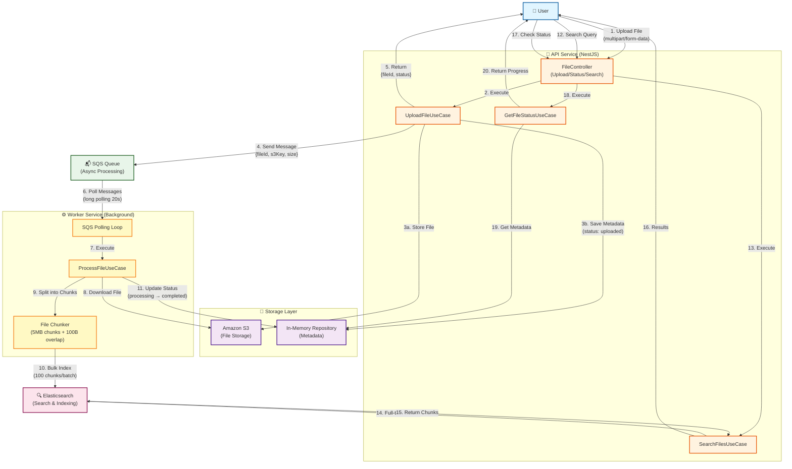
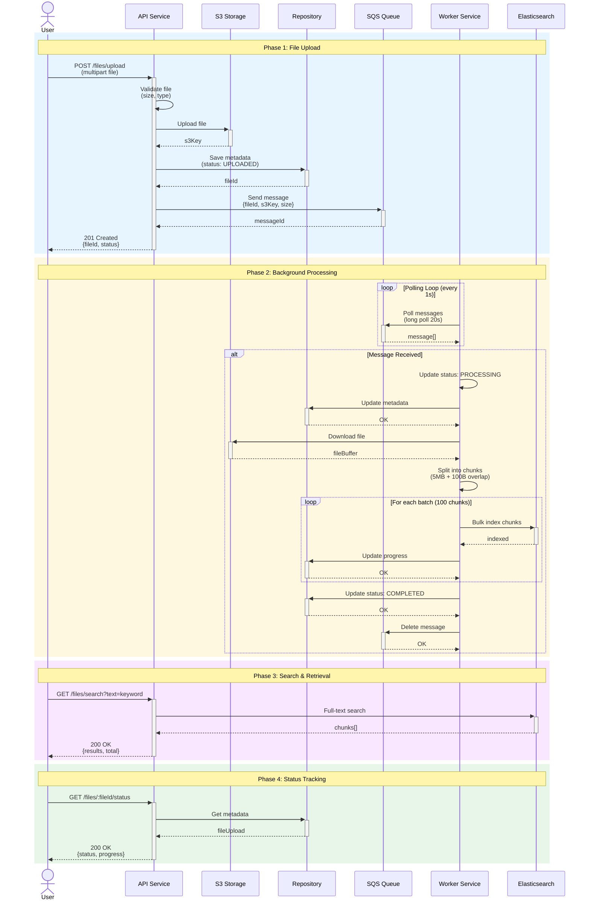
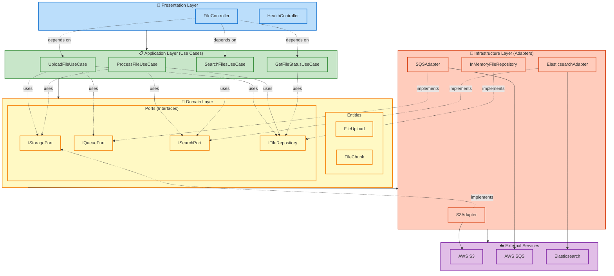
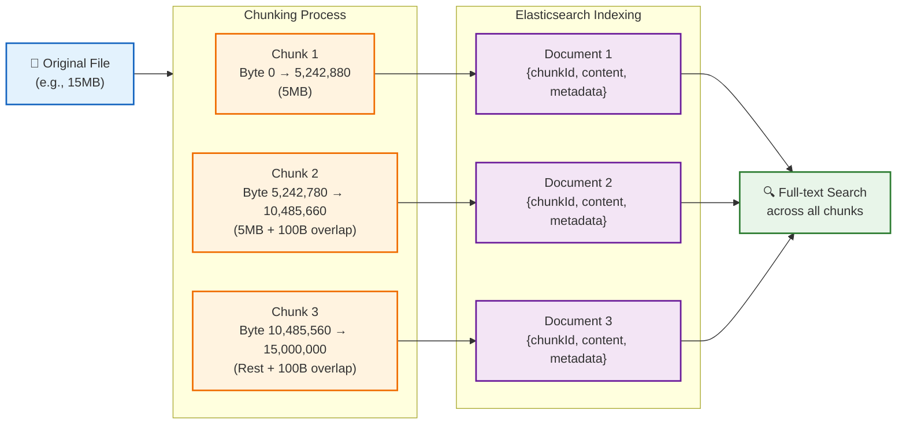
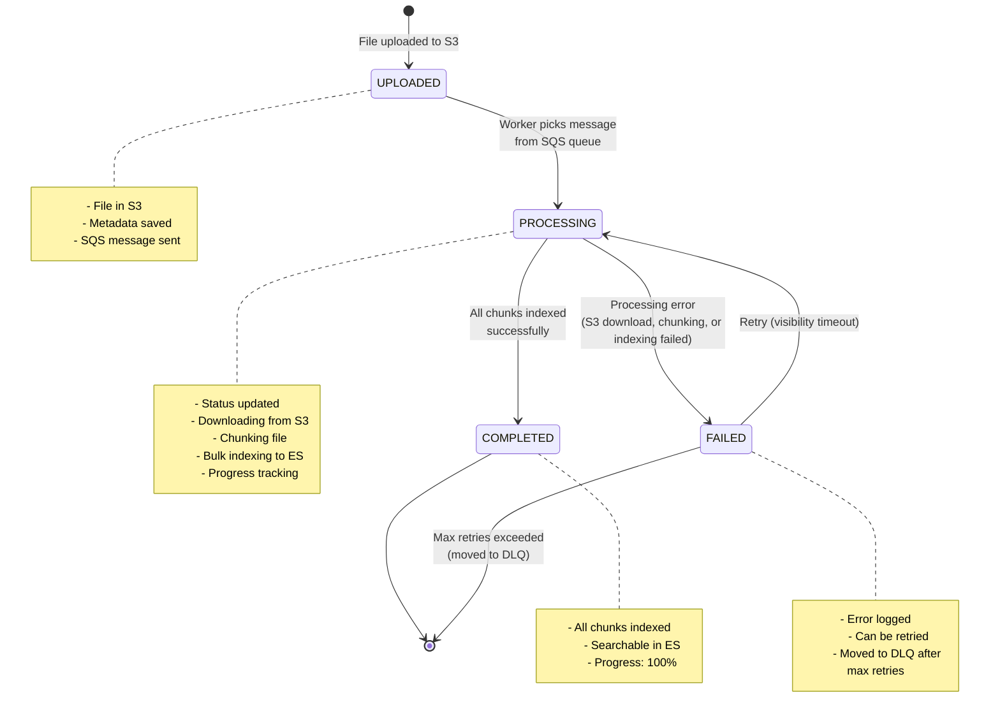
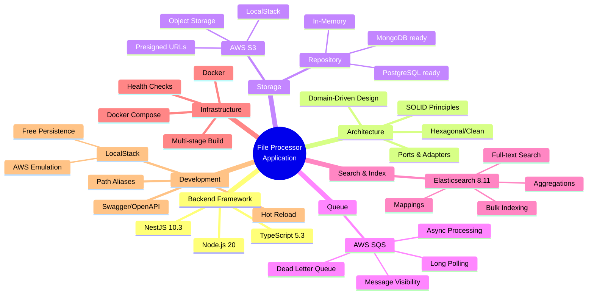

# File Processor Application - Architecture Flow

## System Architecture Diagram

## Detailed Processing Flow

## Hexagonal Architecture Layers

## Data Flow - File Chunking Strategy

## State Machine - File Processing States

## Technology Stack

## Key Features

1. **📤 Large File Handling**: Support up to 500MB files
2. **✂️ Smart Chunking**: 5MB chunks with 100 byte overlap to preserve context
3. **⚡ Async Processing**: Non-blocking upload, background processing via SQS
4. **🔍 Full-text Search**: Powered by Elasticsearch with relevance scoring
5. **📊 Progress Tracking**: Real-time status updates and processing progress
6. **🏗️ Hexagonal Architecture**: Clean separation of concerns, easy to test and maintain
7. **🐳 Docker Ready**: Complete containerization with docker-compose
8. **🧪 LocalStack Integration**: Local development without AWS costs
9. **📈 Scalable Workers**: Multiple worker instances for parallel processing
10. **🔒 Type Safety**: Full TypeScript with strict mode enabled
