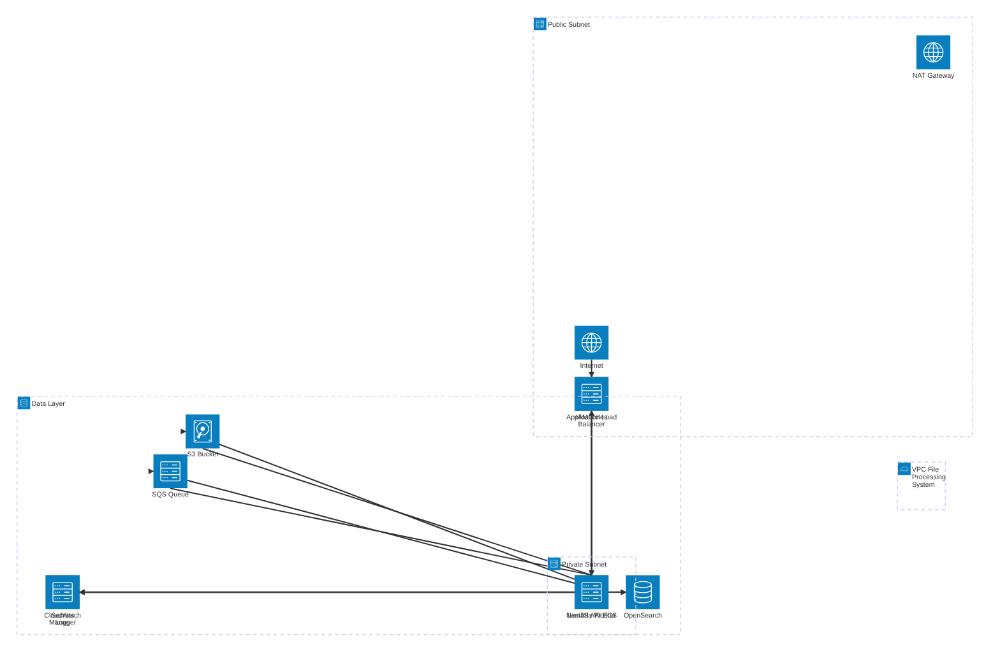
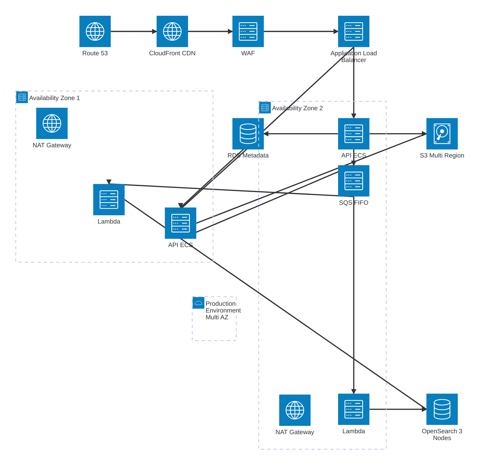
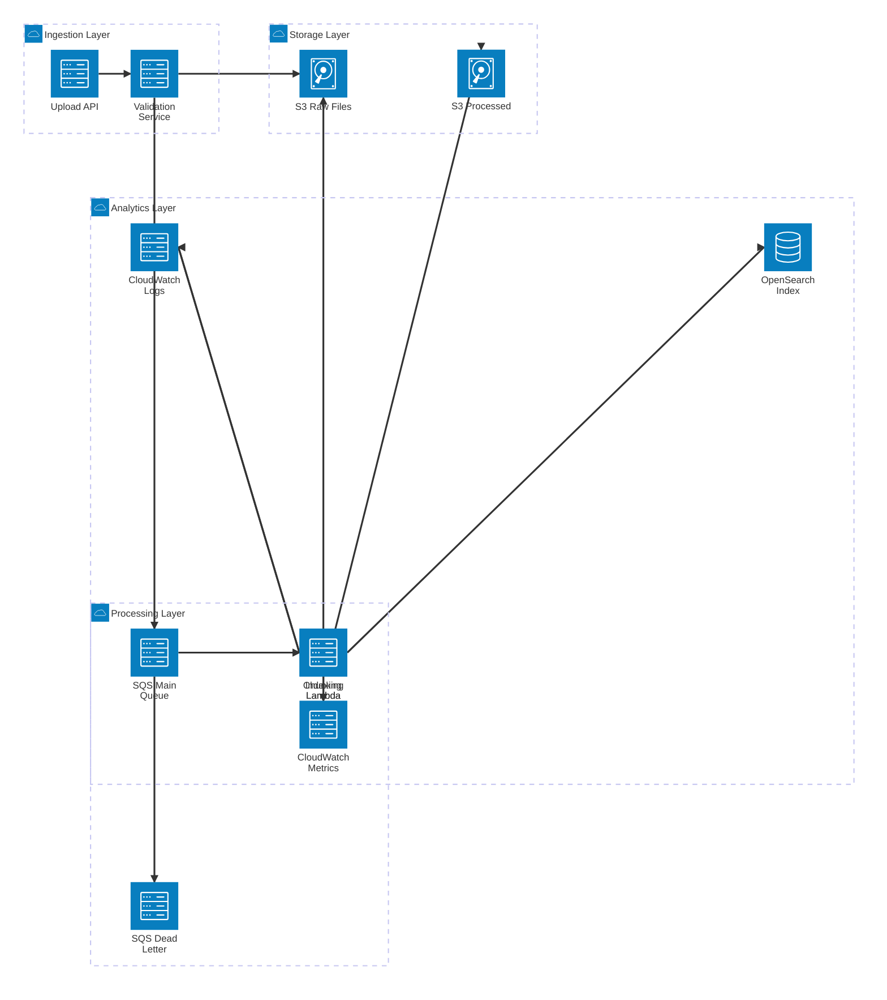
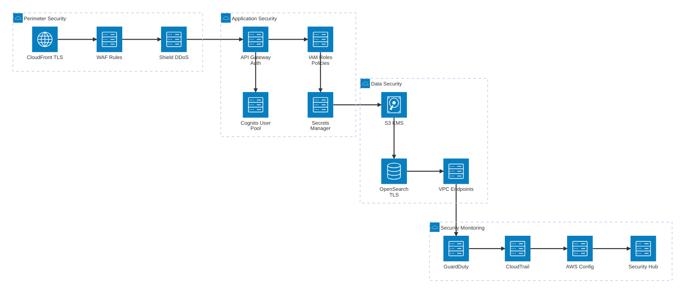
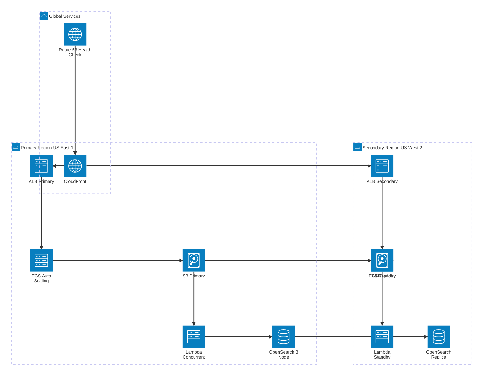
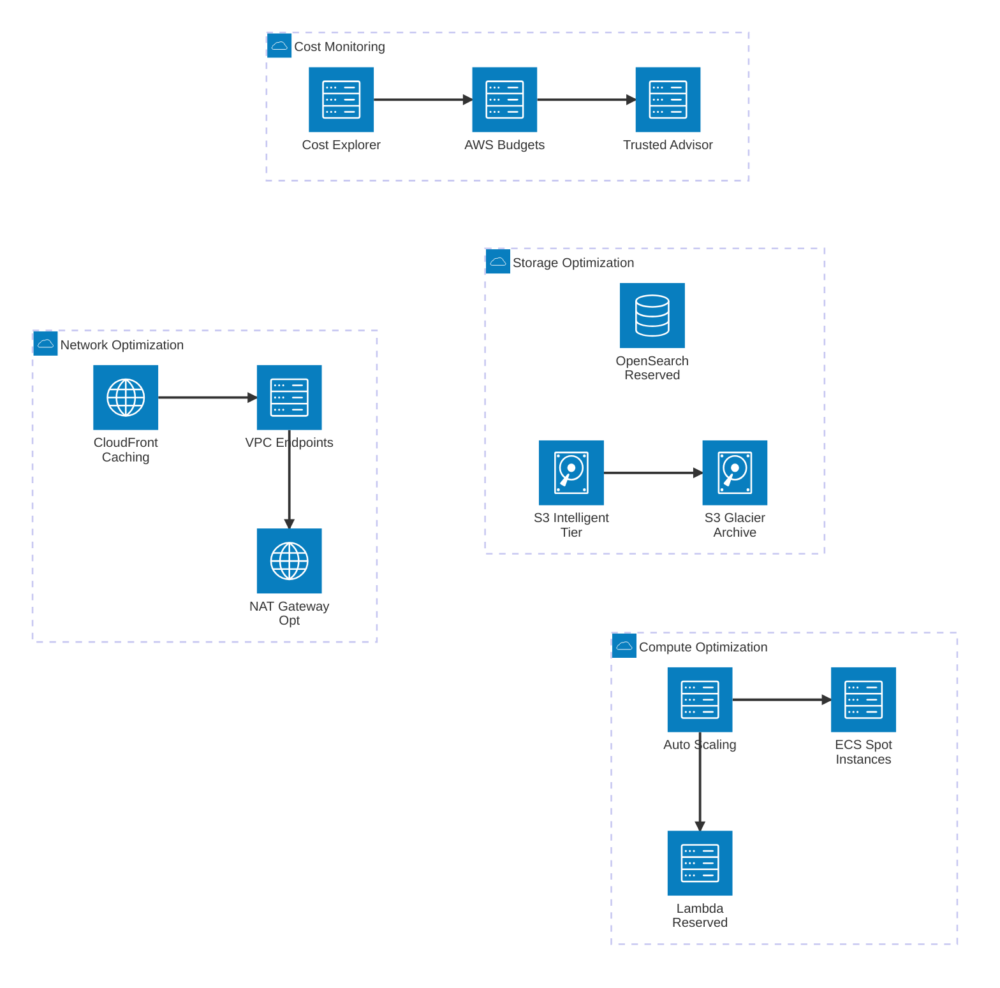

# AWS Cloud Architecture Planning

This document provides Mermaid diagrams for planning and visualizing the AWS cloud resources used in the File Processing System.

---

## Table of Contents

1. [Complete System Architecture](#complete-system-architecture)
2. [AWS Services Overview](#aws-services-overview)
3. [Production Architecture](#production-architecture)
4. [Data Flow Architecture](#data-flow-architecture)
5. [Security Architecture](#security-architecture)
6. [High Availability Architecture](#high-availability-architecture)
7. [Cost Optimization View](#cost-optimization-view)
8. [Resource Planning](#resource-planning)

---

## Complete System Architecture

This diagram shows the complete AWS cloud architecture with all services and their relationships.



---

## AWS Services Overview

A simplified view showing core AWS services and their relationships.

```mermaid
architecture-beta
    group upload_flow(cloud)[Upload Flow]
    group processing_flow(cloud)[Processing Flow]
    group search_flow(cloud)[Search Flow]
    
    service client(internet)[Client]
    service api_gateway(internet)[API Gateway ALB] in upload_flow
    service ecs_api(server)[ECS API] in upload_flow
    
    service s3_storage(disk)[S3] in processing_flow
    service sqs_queue(server)[SQS] in processing_flow
    service lambda_processor(server)[Lambda] in processing_flow
    
    service opensearch(database)[OpenSearch] in search_flow
    service cloudwatch(server)[CloudWatch]
    
    client:R --> L:api_gateway
    api_gateway:R --> L:ecs_api
    ecs_api:R --> L:s3_storage
    ecs_api:B --> T:sqs_queue
    s3_storage:B --> T:lambda_processor
    sqs_queue:R --> L:lambda_processor
    lambda_processor:R --> L:opensearch
    ecs_api:T --> B:opensearch
    ecs_api:B --> T:cloudwatch
    lambda_processor:B --> T:cloudwatch
```



---

## Production Architecture

Production-ready architecture with redundancy, auto-scaling, and multi-AZ deployment.



---

## Data Flow Architecture

Detailed data flow from upload to search with event-driven processing.



---

## Security Architecture

Security layers and components for production deployment.



---

## High Availability Architecture

High availability setup with disaster recovery capabilities.



---

## Cost Optimization View

Architecture view focused on cost optimization strategies.



---

## Resource Planning

### Compute Resources

| Service | Type | vCPU | Memory | Use Case |
|---------|------|------|--------|----------|
| **ECS API** | Fargate | 2-4 | 4-8 GB | API server (auto-scale 2-10 tasks) |
| **Lambda Worker** | Serverless | 1-2 | 1-3 GB | File processing (1000 concurrent) |
| **OpenSearch** | t3.medium | 2 | 4 GB | Search index (3 nodes for HA) |

### Storage Resources

| Service | Type | Size | Lifecycle |
|---------|------|------|-----------|
| **S3 Raw Files** | Standard | ~100 GB/month | 90 days → Glacier |
| **S3 Processed** | Standard | ~50 GB/month | 180 days → Deep Archive |
| **OpenSearch Index** | EBS gp3 | 100 GB/node | Daily snapshots |
| **CloudWatch Logs** | Log Groups | ~10 GB/month | 30 days retention |

### Network Resources

| Service | Bandwidth | Cost/Month | Purpose |
|---------|-----------|------------|---------|
| **CloudFront** | 1 TB | ~$80 | CDN + SSL termination |
| **NAT Gateway** | 500 GB | ~$60 | Private subnet internet |
| **VPC Endpoints** | - | ~$20 | S3/SQS private access |
| **ALB** | 100 GB | ~$25 | Load balancing |

### Estimated Monthly Costs

#### Development Environment
- **Compute**: $50 (ECS Fargate + Lambda)
- **Storage**: $30 (S3 + OpenSearch)
- **Network**: $20 (NAT + ALB)
- **Monitoring**: $10 (CloudWatch)
- **Total**: ~$110/month

#### Production Environment (Single Region)
- **Compute**: $300 (ECS + Lambda + OpenSearch reserved)
- **Storage**: $150 (S3 + EBS + Glacier)
- **Network**: $180 (CloudFront + NAT + ALB)
- **Security**: $50 (WAF + Shield Standard)
- **Monitoring**: $40 (CloudWatch + X-Ray)
- **Total**: ~$720/month

#### Production Environment (Multi-Region HA)
- **Compute**: $600 (2 regions)
- **Storage**: $300 (S3 replication + 2x OpenSearch)
- **Network**: $350 (CloudFront + 2x NAT + 2x ALB)
- **Security**: $100 (WAF + Shield Advanced)
- **Monitoring**: $80 (Enhanced monitoring)
- **Backup/DR**: $50 (Cross-region backups)
- **Total**: ~$1,480/month

---

## Resource Tagging Strategy

```yaml
# Tag all resources for cost tracking and management
Tags:
  Environment: dev | staging | production
  Project: file-processing-system
  CostCenter: engineering
  Owner: platform-team
  Application: file-processor
  Component: api | lambda | storage | search
  BackupPolicy: daily | weekly | none
  DataClassification: public | internal | confidential
  Compliance: hipaa | gdpr | none
```

---

## Scaling Considerations

### Auto-Scaling Policies

#### ECS API Auto-Scaling
```yaml
Metric: CPU Utilization
Target: 70%
Min Tasks: 2
Max Tasks: 10
Scale-up: +2 tasks when CPU > 70% for 2 minutes
Scale-down: -1 task when CPU < 40% for 5 minutes
```

#### Lambda Concurrency
```yaml
Reserved Concurrency: 1000
Provisioned Concurrency: 100 (for low latency)
Memory: 1024 MB (optimized for 5MB chunks)
Timeout: 5 minutes
Max Retries: 2
```

#### OpenSearch Scaling
```yaml
Instance Type: t3.medium.search → r6g.large.search (production)
Data Nodes: 3 (1 per AZ)
Master Nodes: 3 (dedicated)
Storage: 100 GB → 500 GB (with auto-scaling)
IOPS: 3000 (gp3)
```

---

## Migration Path

### Phase 1: LocalStack → AWS Dev (Week 1-2)
1. ✅ Create AWS account and enable billing alerts
2. ✅ Deploy VPC, subnets, security groups
3. ✅ Deploy S3 bucket with versioning
4. ✅ Deploy SQS queue with DLQ
5. ✅ Deploy Lambda function
6. ✅ Deploy OpenSearch domain (dev.t3.small)
7. ✅ Update application configs

### Phase 2: Dev → Staging (Week 3-4)
1. ✅ Deploy ECS cluster with Fargate
2. ✅ Deploy Application Load Balancer
3. ✅ Setup CloudWatch Logs and Metrics
4. ✅ Configure IAM roles and policies
5. ✅ Setup Secrets Manager
6. ✅ Enable S3 lifecycle policies
7. ✅ Test complete workflow

### Phase 3: Staging → Production (Week 5-8)
1. ✅ Enable multi-AZ deployment
2. ✅ Setup Route 53 with health checks
3. ✅ Deploy CloudFront distribution
4. ✅ Configure WAF rules
5. ✅ Enable GuardDuty and CloudTrail
6. ✅ Setup cross-region replication
7. ✅ Configure backup and disaster recovery
8. ✅ Load testing and performance tuning

---

## Monitoring and Alerting

### Key Metrics to Monitor

```yaml
API Metrics:
  - Request latency (p50, p99)
  - Error rate (5xx errors)
  - Request count
  - Active connections

Lambda Metrics:
  - Invocation count
  - Duration (average, max)
  - Error count and rate
  - Concurrent executions
  - Throttles

S3 Metrics:
  - Bucket size
  - Number of objects
  - Request count (GET, PUT)
  - 4xx/5xx errors

OpenSearch Metrics:
  - Cluster health (green/yellow/red)
  - CPU utilization
  - JVM memory pressure
  - Search latency
  - Indexing rate

Cost Metrics:
  - Daily spend by service
  - Month-to-date vs budget
  - Forecast vs actual
```

### Alerting Thresholds

```yaml
Critical Alerts (PagerDuty):
  - API error rate > 5%
  - Lambda error rate > 10%
  - OpenSearch cluster RED
  - S3 4xx errors > 100/min
  - Daily cost > $50 (dev) or $1000 (prod)

Warning Alerts (Email):
  - API latency p99 > 2s
  - Lambda duration > 4 minutes
  - OpenSearch CPU > 80%
  - S3 bucket size > 90% quota
  - NAT Gateway data transfer > 1TB/day
```

---

## Security Best Practices

### Network Security
- ✅ Deploy API in private subnets
- ✅ Use NAT Gateway for outbound traffic
- ✅ Enable VPC Flow Logs
- ✅ Use Security Groups (least privilege)
- ✅ Use NACLs for subnet-level protection

### Data Security
- ✅ Enable S3 encryption at rest (SSE-S3 or SSE-KMS)
- ✅ Enable S3 versioning and MFA delete
- ✅ Use OpenSearch encryption at rest and in transit
- ✅ Store secrets in Secrets Manager (not environment variables)
- ✅ Use IAM roles (not access keys)

### Application Security
- ✅ Enable WAF with OWASP Top 10 rules
- ✅ Use Cognito or API Gateway authorizers
- ✅ Implement rate limiting
- ✅ Enable CloudTrail for audit logs
- ✅ Regular security scanning (Inspector, GuardDuty)

---

## Next Steps

1. **Review Architecture**: Discuss with team and stakeholders
2. **Cost Estimation**: Use AWS Pricing Calculator for accurate quotes
3. **Proof of Concept**: Deploy dev environment in AWS
4. **Load Testing**: Simulate production traffic
5. **Documentation**: Update runbooks and disaster recovery procedures
6. **Training**: Ensure team is familiar with AWS services
7. **Migration**: Follow phased migration plan
8. **Optimization**: Continuously monitor and optimize costs

---

**Document Version**: 1.0  
**Last Updated**: January 25, 2026  
**Maintained By**: Platform Engineering Team  

---

*For implementation details, see [WORKFLOW.md](./WORKFLOW.md) and [ARCHITECTURE.md](./ARCHITECTURE.md)*
