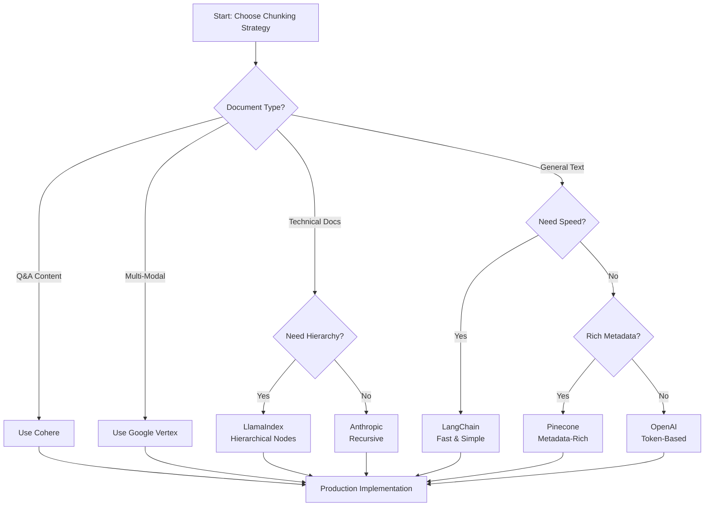
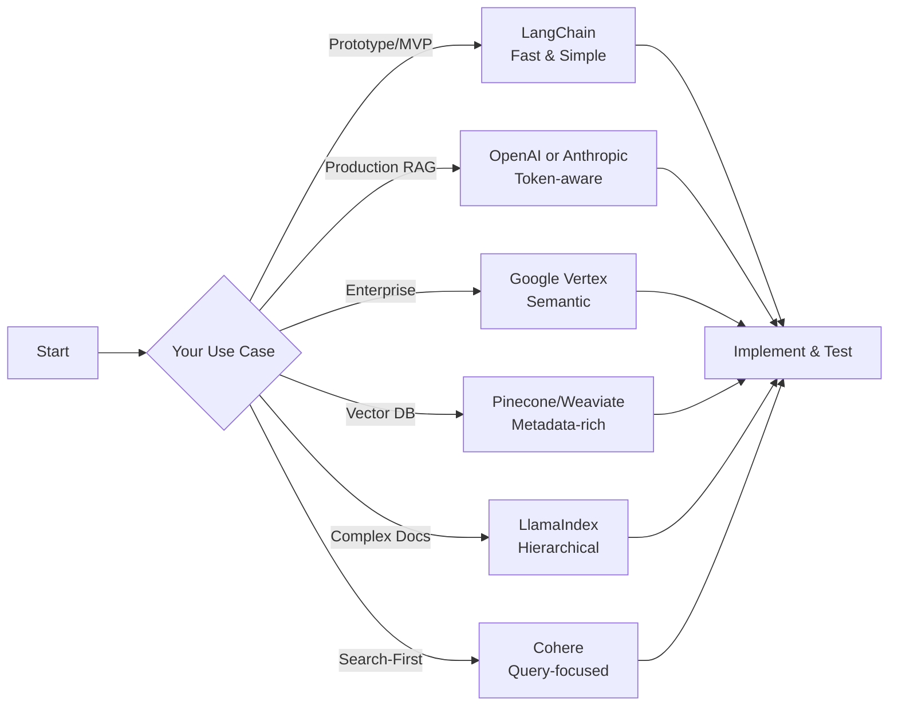

# Chunking Strategies from Leading Tech Companies

## 🌟 Overview

This document compiles proven chunking strategies used by major technology companies for RAG (Retrieval-Augmented Generation) systems, vector databases, and semantic search applications.

---

## Table of Contents

1. [OpenAI Strategies](#1-openai-strategies)
2. [Anthropic Approach](#2-anthropic-approach)
3. [Google Vertex AI](#3-google-vertex-ai)
4. [Pinecone Best Practices](#4-pinecone-best-practices)
5. [LangChain Framework](#5-langchain-framework)
6. [Llamaindex Methods](#6-llamaindex-methods)
7. [Weaviate Recommendations](#7-weaviate-recommendations)
8. [Cohere RAG Strategy](#8-cohere-rag-strategy)
9. [Comparison Matrix](#9-comparison-matrix)
10. [Implementation Guide](#10-implementation-guide)
11. [Production Best Practices](#11-production-best-practices)

---

## 1. OpenAI Strategies

### 📚 **Token-Aware Chunking**

OpenAI recommends chunking based on token counts rather than character counts, as their models process tokens.

#### **Key Principles:**

- **Chunk Size:** 512-2048 tokens (optimal for `text-embedding-ada-002`)
- **Overlap:** 10-15% token overlap between chunks
- **Context Window:** Always fit within model's context (8191 tokens for ada-002)
- **Semantic Boundaries:** Respect paragraph and sentence boundaries

#### **Implementation:**

```javascript
const { encoding_for_model } = require('tiktoken');

class OpenAIChunker {
  constructor(model = 'text-embedding-ada-002') {
    this.encoding = encoding_for_model(model);
    this.maxTokens = 512; // OpenAI recommendation
    this.overlapTokens = 50;
  }
  
  countTokens(text) {
    return this.encoding.encode(text).length;
  }
  
  chunk(text) {
    const sentences = text.match(/[^.!?]+[.!?]+/g) || [text];
    const chunks = [];
    let currentChunk = [];
    let currentTokens = 0;
    
    for (const sentence of sentences) {
      const sentenceTokens = this.countTokens(sentence);
      
      if (currentTokens + sentenceTokens > this.maxTokens && currentChunk.length > 0) {
        chunks.push({
          text: currentChunk.join(' '),
          tokens: currentTokens,
          metadata: { tokenCount: currentTokens }
        });
        
        // Add overlap
        const overlapSentences = currentChunk.slice(-2);
        currentChunk = [...overlapSentences];
        currentTokens = this.countTokens(currentChunk.join(' '));
      }
      
      currentChunk.push(sentence);
      currentTokens += sentenceTokens;
    }
    
    if (currentChunk.length > 0) {
      chunks.push({
        text: currentChunk.join(' '),
        tokens: currentTokens,
        metadata: { tokenCount: currentTokens }
      });
    }
    
    return chunks;
  }
  
  free() {
    this.encoding.free();
  }
}

// Usage
const chunker = new OpenAIChunker();
const chunks = chunker.chunk(documentText);
chunker.free();
```

#### **OpenAI Best Practices:**

✅ **Token-based chunking** (not character-based)  
✅ **Preserve semantic meaning** at boundaries  
✅ **Add metadata** (title, section, source)  
✅ **Test retrieval quality** with real queries  
✅ **Monitor token usage** for cost optimization

**Source:** [OpenAI Embeddings Guide](https://platform.openai.com/docs/guides/embeddings)

---

## 2. Anthropic Approach

### 🧠 **Context-Aware Recursive Chunking**

Anthropic (creators of Claude) emphasizes maintaining contextual coherence through recursive splitting.

#### **Key Principles:**

- **Chunk Size:** 1000-1500 characters (250-400 tokens)
- **Hierarchical Structure:** Split by sections → paragraphs → sentences
- **Context Injection:** Include document title and section headers in each chunk
- **Long Context:** Leverage Claude's 200K context for larger chunks when needed

#### **Implementation:**

```javascript
class AnthropicChunker {
  constructor(options = {}) {
    this.maxChunkSize = options.maxChunkSize || 1500;
    this.minChunkSize = options.minChunkSize || 200;
    this.contextHeaders = options.contextHeaders !== false;
  }
  
  chunk(text, metadata = {}) {
    const { title = '', section = '' } = metadata;
    const context = this.contextHeaders ? `${title}\n${section}\n\n` : '';
    
    // Hierarchical separators (Anthropic recommendation)
    const separators = [
      '\n\n\n',    // Document sections
      '\n\n',      // Paragraphs
      '\n',        // Lines
      '. ',        // Sentences
      '! ',
      '? ',
      '; ',
      ', ',
      ' '          // Words (last resort)
    ];
    
    return this.recursiveSplit(text, separators, context, metadata);
  }
  
  recursiveSplit(text, separators, context, metadata, depth = 0) {
    if (!text || text.length <= this.maxChunkSize) {
      return text.length >= this.minChunkSize ? [{
        text: context + text,
        metadata: { ...metadata, depth, length: text.length }
      }] : [];
    }
    
    const separator = separators[depth] || '';
    if (!separator) {
      // Force split at maxChunkSize
      return [{
        text: context + text.slice(0, this.maxChunkSize),
        metadata: { ...metadata, depth, forced: true }
      }];
    }
    
    const parts = text.split(separator);
    const chunks = [];
    let currentChunk = '';
    
    for (const part of parts) {
      const testChunk = currentChunk + (currentChunk ? separator : '') + part;
      
      if (testChunk.length > this.maxChunkSize) {
        if (currentChunk) {
          chunks.push(...this.recursiveSplit(
            currentChunk, 
            separators, 
            context, 
            metadata, 
            depth + 1
          ));
        }
        currentChunk = part;
      } else {
        currentChunk = testChunk;
      }
    }
    
    if (currentChunk) {
      chunks.push(...this.recursiveSplit(
        currentChunk, 
        separators, 
        context, 
        metadata, 
        depth + 1
      ));
    }
    
    return chunks;
  }
}

// Usage
const chunker = new AnthropicChunker({ maxChunkSize: 1500 });
const chunks = chunker.chunk(documentText, {
  title: 'API Documentation',
  section: 'Authentication'
});
```

#### **Anthropic Best Practices:**

✅ **Hierarchical splitting** for natural boundaries  
✅ **Context injection** (title + section headers)  
✅ **Recursive approach** maintains coherence  
✅ **Metadata enrichment** for better retrieval  
✅ **Test with Claude** to validate quality

**Source:** [Anthropic Retrieval Guide](https://docs.anthropic.com/claude/docs)

---

## 3. Google Vertex AI

### 🔍 **Multi-Modal Semantic Chunking**

Google's approach focuses on semantic similarity and multi-modal content.

#### **Key Principles:**

- **Chunk Size:** 500-1000 tokens (flexible based on content)
- **Semantic Boundaries:** Use NLP to detect topic shifts
- **Multi-Modal:** Handle text, images, tables separately
- **Vector Similarity:** Ensure intra-chunk similarity is high

#### **Implementation with Semantic Analysis:**

```javascript
class GoogleVertexChunker {
  constructor(options = {}) {
    this.targetTokens = options.targetTokens || 750;
    this.minSimilarity = options.minSimilarity || 0.7;
    this.maxChunks = options.maxChunks || 100;
  }
  
  async chunk(text, embeddingFunction) {
    // Split into sentences
    const sentences = this.splitSentences(text);
    
    // Get embeddings for each sentence
    const embeddings = await this.getEmbeddings(sentences, embeddingFunction);
    
    // Group by semantic similarity
    const chunks = await this.groupBySimilarity(sentences, embeddings);
    
    return chunks;
  }
  
  splitSentences(text) {
    return text
      .replace(/([.!?])\s+/g, '$1|')
      .split('|')
      .filter(s => s.trim().length > 0);
  }
  
  async getEmbeddings(sentences, embeddingFunction) {
    return await Promise.all(
      sentences.map(s => embeddingFunction(s))
    );
  }
  
  async groupBySimilarity(sentences, embeddings) {
    const chunks = [];
    let currentChunk = { sentences: [], embeddings: [] };
    
    for (let i = 0; i < sentences.length; i++) {
      if (currentChunk.sentences.length === 0) {
        currentChunk.sentences.push(sentences[i]);
        currentChunk.embeddings.push(embeddings[i]);
        continue;
      }
      
      // Calculate similarity with current chunk
      const similarity = this.cosineSimilarity(
        this.averageEmbedding(currentChunk.embeddings),
        embeddings[i]
      );
      
      if (similarity >= this.minSimilarity && 
          this.estimateTokens(currentChunk.sentences.join(' ')) < this.targetTokens) {
        currentChunk.sentences.push(sentences[i]);
        currentChunk.embeddings.push(embeddings[i]);
      } else {
        // Start new chunk
        chunks.push({
          text: currentChunk.sentences.join(' '),
          metadata: {
            sentenceCount: currentChunk.sentences.length,
            avgSimilarity: this.calculateAvgSimilarity(currentChunk.embeddings)
          }
        });
        currentChunk = {
          sentences: [sentences[i]],
          embeddings: [embeddings[i]]
        };
      }
    }
    
    if (currentChunk.sentences.length > 0) {
      chunks.push({
        text: currentChunk.sentences.join(' '),
        metadata: {
          sentenceCount: currentChunk.sentences.length
        }
      });
    }
    
    return chunks;
  }
  
  cosineSimilarity(vecA, vecB) {
    const dotProduct = vecA.reduce((sum, a, i) => sum + a * vecB[i], 0);
    const magA = Math.sqrt(vecA.reduce((sum, a) => sum + a * a, 0));
    const magB = Math.sqrt(vecB.reduce((sum, b) => sum + b * b, 0));
    return dotProduct / (magA * magB);
  }
  
  averageEmbedding(embeddings) {
    const dim = embeddings[0].length;
    const avg = new Array(dim).fill(0);
    embeddings.forEach(emb => {
      emb.forEach((val, i) => avg[i] += val);
    });
    return avg.map(v => v / embeddings.length);
  }
  
  calculateAvgSimilarity(embeddings) {
    if (embeddings.length < 2) return 1.0;
    
    let totalSim = 0;
    let count = 0;
    for (let i = 0; i < embeddings.length - 1; i++) {
      for (let j = i + 1; j < embeddings.length; j++) {
        totalSim += this.cosineSimilarity(embeddings[i], embeddings[j]);
        count++;
      }
    }
    return count > 0 ? totalSim / count : 0;
  }
  
  estimateTokens(text) {
    return Math.ceil(text.split(/\s+/).length * 1.3);
  }
}
```

#### **Google Best Practices:**

✅ **Semantic similarity** between chunks  
✅ **Multi-modal handling** (text, images, tables)  
✅ **Flexible chunk sizes** based on content  
✅ **Vector quality metrics** for validation  
✅ **Entity extraction** for metadata

**Source:** [Google Vertex AI Search](https://cloud.google.com/generative-ai-app-builder/docs)

---

## 4. Pinecone Best Practices

### 🌲 **Metadata-Rich Chunking**

Pinecone (vector database leader) emphasizes rich metadata for hybrid search.

#### **Key Principles:**

- **Chunk Size:** 256-512 tokens (optimal for vector similarity)
- **Metadata First:** Extensive metadata for filtering
- **Hybrid Search:** Combine vector + keyword search
- **Namespace Strategy:** Organize chunks by document type

#### **Implementation:**

```javascript
class PineconeChunker {
  constructor(options = {}) {
    this.maxTokens = options.maxTokens || 400;
    this.overlapTokens = options.overlapTokens || 50;
  }
  
  chunk(text, documentMetadata = {}) {
    const sentences = this.splitIntoSentences(text);
    const chunks = [];
    let currentChunk = [];
    let currentTokens = 0;
    let chunkIndex = 0;
    
    for (let i = 0; i < sentences.length; i++) {
      const sentence = sentences[i];
      const tokens = this.estimateTokens(sentence);
      
      if (currentTokens + tokens > this.maxTokens && currentChunk.length > 0) {
        // Create chunk with rich metadata
        chunks.push(this.createChunk(
          currentChunk,
          chunkIndex++,
          documentMetadata,
          i - currentChunk.length,
          i
        ));
        
        // Add overlap
        const overlapSentences = this.getOverlapSentences(currentChunk);
        currentChunk = overlapSentences;
        currentTokens = this.estimateTokens(overlapSentences.join(' '));
      }
      
      currentChunk.push(sentence);
      currentTokens += tokens;
    }
    
    // Add final chunk
    if (currentChunk.length > 0) {
      chunks.push(this.createChunk(
        currentChunk,
        chunkIndex,
        documentMetadata,
        sentences.length - currentChunk.length,
        sentences.length
      ));
    }
    
    return chunks;
  }
  
  createChunk(sentences, index, docMetadata, startIdx, endIdx) {
    const text = sentences.join(' ');
    
    return {
      id: `${docMetadata.documentId || 'doc'}_chunk_${index}`,
      text: text,
      metadata: {
        // Document metadata
        documentId: docMetadata.documentId,
        documentTitle: docMetadata.title,
        documentType: docMetadata.type,
        author: docMetadata.author,
        createdAt: docMetadata.createdAt,
        
        // Chunk metadata
        chunkIndex: index,
        sentenceStartIdx: startIdx,
        sentenceEndIdx: endIdx,
        chunkTokens: this.estimateTokens(text),
        chunkLength: text.length,
        
        // Search metadata (for filtering)
        category: docMetadata.category,
        tags: docMetadata.tags || [],
        language: docMetadata.language || 'en',
        
        // Timestamps
        indexedAt: new Date().toISOString()
      }
    };
  }
  
  splitIntoSentences(text) {
    return text
      .replace(/([.!?])\s+/g, '$1|SPLIT|')
      .split('|SPLIT|')
      .filter(s => s.trim().length > 0);
  }
  
  getOverlapSentences(sentences) {
    const overlapText = sentences.join(' ').slice(-this.overlapTokens * 4);
    return this.splitIntoSentences(overlapText);
  }
  
  estimateTokens(text) {
    return Math.ceil(text.split(/\s+/).length * 1.3);
  }
}

// Usage
const chunker = new PineconeChunker({ maxTokens: 400, overlapTokens: 50 });
const chunks = chunker.chunk(documentText, {
  documentId: 'doc_123',
  title: 'AWS Best Practices',
  type: 'documentation',
  author: 'Platform Team',
  category: 'devops',
  tags: ['aws', 'terraform', 'infrastructure'],
  createdAt: '2026-01-25T00:00:00Z'
});

// Each chunk has structure:
// {
//   id: 'doc_123_chunk_0',
//   text: '...',
//   metadata: { documentId, title, chunkIndex, tags, ... }
// }
```

#### **Pinecone Best Practices:**

✅ **Rich metadata** for hybrid search  
✅ **Unique chunk IDs** for updates  
✅ **Namespace organization** by document type  
✅ **Overlap strategy** for context continuity  
✅ **Filter-first** approach (metadata → vector)

**Source:** [Pinecone Chunking Guide](https://docs.pinecone.io/guides/data/understanding-hybrid-search)

---

## 5. LangChain Framework

### 🔗 **Recursive Character Text Splitter**

LangChain's most popular chunking method, used by thousands of production applications.

#### **Key Principles:**

- **Chunk Size:** 1000 characters (configurable)
- **Overlap:** 200 characters (20%)
- **Recursive Separators:** Hierarchical text splitting
- **Pluggable:** Works with any embedding model

#### **Implementation:**

```javascript
class LangChainChunker {
  constructor(options = {}) {
    this.chunkSize = options.chunkSize || 1000;
    this.chunkOverlap = options.chunkOverlap || 200;
    this.separators = options.separators || [
      '\n\n',  // Paragraphs
      '\n',    // Lines
      ' ',     // Words
      ''       // Characters
    ];
    this.keepSeparator = options.keepSeparator !== false;
  }
  
  splitText(text) {
    return this._splitText(text, this.separators);
  }
  
  _splitText(text, separators) {
    const finalChunks = [];
    let separator = separators[separators.length - 1];
    let newSeparators = [];
    
    for (let i = 0; i < separators.length; i++) {
      const s = separators[i];
      if (s === '') {
        separator = s;
        break;
      }
      if (text.includes(s)) {
        separator = s;
        newSeparators = separators.slice(i + 1);
        break;
      }
    }
    
    const splits = this._splitTextWithSeparator(text, separator);
    
    let goodSplits = [];
    const mergedChunks = this._mergeSplits(splits, separator);
    
    for (const chunk of mergedChunks) {
      if (chunk.length > this.chunkSize) {
        if (goodSplits.length > 0) {
          finalChunks.push(...this._createChunks(goodSplits));
          goodSplits = [];
        }
        
        if (newSeparators.length === 0) {
          finalChunks.push(chunk);
        } else {
          const recursiveChunks = this._splitText(chunk, newSeparators);
          finalChunks.push(...recursiveChunks);
        }
      } else {
        goodSplits.push(chunk);
      }
    }
    
    if (goodSplits.length > 0) {
      finalChunks.push(...this._createChunks(goodSplits));
    }
    
    return finalChunks;
  }
  
  _splitTextWithSeparator(text, separator) {
    if (separator === '') {
      return text.split('');
    }
    return text.split(separator);
  }
  
  _mergeSplits(splits, separator) {
    const merged = [];
    let currentChunk = '';
    
    for (const split of splits) {
      if (!split) continue;
      
      const testChunk = currentChunk 
        ? currentChunk + separator + split 
        : split;
      
      if (testChunk.length <= this.chunkSize) {
        currentChunk = testChunk;
      } else {
        if (currentChunk) {
          merged.push(currentChunk);
        }
        currentChunk = split;
      }
    }
    
    if (currentChunk) {
      merged.push(currentChunk);
    }
    
    return merged;
  }
  
  _createChunks(splits) {
    const chunks = [];
    const docs = [];
    
    for (let i = 0; i < splits.length; i++) {
      const split = splits[i];
      const doc = this.chunkOverlap > 0 && docs.length > 0
        ? docs[docs.length - 1].slice(-this.chunkOverlap) + split
        : split;
      
      docs.push(split);
      chunks.push(doc);
    }
    
    return chunks;
  }
}

// Usage - Standard LangChain approach
const chunker = new LangChainChunker({
  chunkSize: 1000,
  chunkOverlap: 200,
  separators: ['\n\n', '\n', ' ', '']
});

const chunks = chunker.splitText(documentText);

// For Markdown
const markdownChunker = new LangChainChunker({
  chunkSize: 1000,
  chunkOverlap: 200,
  separators: [
    '\n## ',    // H2 headers
    '\n### ',   // H3 headers
    '\n\n',     // Paragraphs
    '\n',       // Lines
    ' ',        // Words
    ''          // Characters
  ]
});
```

#### **LangChain Best Practices:**

✅ **Hierarchical splitting** for natural boundaries  
✅ **Configurable separators** per document type  
✅ **Consistent overlap** prevents context loss  
✅ **Framework agnostic** (works with any model)  
✅ **Battle-tested** in production (1M+ projects)

**Source:** [LangChain Text Splitters](https://python.langchain.com/docs/modules/data_connection/document_transformers/)

---

## 6. LlamaIndex Methods

### 🦙 **Hierarchical Node Parsing**

LlamaIndex provides sophisticated chunking with parent-child relationships.

#### **Key Principles:**

- **Chunk Size:** Variable based on document structure
- **Node Hierarchy:** Parent nodes contain child nodes
- **Retrieval Strategy:** Fetch child, return parent context
- **Metadata Propagation:** Inherit from parent nodes

#### **Implementation:**

```javascript
class LlamaIndexChunker {
  constructor(options = {}) {
    this.chunkSize = options.chunkSize || 1024;
    this.chunkOverlap = options.chunkOverlap || 20;
    this.includeMetadata = options.includeMetadata !== false;
    this.includePrevNextRel = options.includePrevNextRel !== false;
  }
  
  chunk(text, metadata = {}) {
    // Create document node (parent)
    const documentNode = {
      id: this.generateId('doc'),
      text: text,
      metadata: {
        ...metadata,
        nodeType: 'document',
        length: text.length
      },
      relationships: {
        children: []
      }
    };
    
    // Split into chunks (children)
    const chunks = this.splitIntoChunks(text);
    const childNodes = [];
    
    for (let i = 0; i < chunks.length; i++) {
      const chunk = chunks[i];
      const nodeId = this.generateId(`chunk_${i}`);
      
      const childNode = {
        id: nodeId,
        text: chunk,
        metadata: {
          ...metadata,
          nodeType: 'chunk',
          chunkIndex: i,
          totalChunks: chunks.length,
          length: chunk.length
        },
        relationships: {
          parent: documentNode.id,
          previous: i > 0 ? childNodes[i - 1].id : null,
          next: null // Will be set
        }
      };
      
      // Update previous node's next relationship
      if (i > 0) {
        childNodes[i - 1].relationships.next = nodeId;
      }
      
      childNodes.push(childNode);
      documentNode.relationships.children.push(nodeId);
    }
    
    return {
      documentNode,
      childNodes
    };
  }
  
  splitIntoChunks(text) {
    const chunks = [];
    const sentences = this.splitSentences(text);
    let currentChunk = '';
    
    for (const sentence of sentences) {
      const testChunk = currentChunk + ' ' + sentence;
      
      if (testChunk.length > this.chunkSize && currentChunk) {
        chunks.push(currentChunk.trim());
        // Add overlap
        const words = currentChunk.split(' ');
        currentChunk = words.slice(-this.chunkOverlap).join(' ') + ' ' + sentence;
      } else {
        currentChunk = testChunk;
      }
    }
    
    if (currentChunk.trim()) {
      chunks.push(currentChunk.trim());
    }
    
    return chunks;
  }
  
  splitSentences(text) {
    return text.match(/[^.!?]+[.!?]+/g) || [text];
  }
  
  generateId(prefix = 'node') {
    return `${prefix}_${Date.now()}_${Math.random().toString(36).substr(2, 9)}`;
  }
  
  // Retrieval helper: fetch child, return parent context
  getNodeWithContext(childNode, allNodes) {
    const parentNode = allNodes.find(n => n.id === childNode.relationships.parent);
    const previousNode = allNodes.find(n => n.id === childNode.relationships.previous);
    const nextNode = allNodes.find(n => n.id === childNode.relationships.next);
    
    return {
      chunk: childNode.text,
      context: {
        document: parentNode?.text || '',
        previous: previousNode?.text || '',
        next: nextNode?.text || ''
      },
      metadata: {
        ...childNode.metadata,
        parentMetadata: parentNode?.metadata
      }
    };
  }
}

// Usage
const chunker = new LlamaIndexChunker({
  chunkSize: 1024,
  chunkOverlap: 20
});

const { documentNode, childNodes } = chunker.chunk(documentText, {
  title: 'Technical Documentation',
  author: 'Engineering Team',
  category: 'infrastructure'
});

// Index child nodes in vector DB
for (const node of childNodes) {
  await vectorDB.upsert({
    id: node.id,
    text: node.text,
    metadata: node.metadata
  });
}

// During retrieval
const retrievedNode = childNodes[0];
const fullContext = chunker.getNodeWithContext(retrievedNode, [documentNode, ...childNodes]);
// Returns: { chunk, context: { document, previous, next }, metadata }
```

#### **LlamaIndex Best Practices:**

✅ **Hierarchical nodes** for context preservation  
✅ **Parent-child relationships** enable better retrieval  
✅ **Flexible retrieval** (child → parent expansion)  
✅ **Metadata inheritance** from document to chunks  
✅ **Graph-based queries** for complex relationships

**Source:** [LlamaIndex Node Parsing](https://docs.llamaindex.ai/en/stable/module_guides/loading/node_parsers/)

---

## 7. Weaviate Recommendations

### 🔷 **Contextual Chunking with Cross-References**

Weaviate (vector database) recommends context-rich chunks with cross-references.

#### **Key Principles:**

- **Chunk Size:** 200-500 tokens
- **Context Window:** Include surrounding context
- **Cross-References:** Link related chunks
- **Schema Design:** Rich property structure

#### **Implementation:**

```javascript
class WeaviateChunker {
  constructor(options = {}) {
    this.maxTokens = options.maxTokens || 300;
    this.contextWindow = options.contextWindow || 100;
  }
  
  chunk(text, documentMetadata = {}) {
    const paragraphs = text.split(/\n\n+/);
    const chunks = [];
    
    for (let i = 0; i < paragraphs.length; i++) {
      const paragraph = paragraphs[i].trim();
      if (!paragraph) continue;
      
      // Get context from surrounding paragraphs
      const prevContext = i > 0 ? paragraphs[i - 1].slice(-this.contextWindow) : '';
      const nextContext = i < paragraphs.length - 1 ? paragraphs[i + 1].slice(0, this.contextWindow) : '';
      
      chunks.push({
        // Main content
        content: paragraph,
        
        // Weaviate schema properties
        properties: {
          text: paragraph,
          previousContext: prevContext,
          nextContext: nextContext,
          
          // Document metadata
          documentTitle: documentMetadata.title,
          documentType: documentMetadata.type,
          author: documentMetadata.author,
          
          // Chunk metadata
          chunkIndex: i,
          totalChunks: paragraphs.length,
          tokenCount: this.estimateTokens(paragraph),
          
          // Timestamps
          createdAt: new Date().toISOString(),
          
          // Position in document
          relativePosition: i / paragraphs.length
        },
        
        // Cross-references for Weaviate
        references: {
          belongsToDocument: documentMetadata.documentId,
          previousChunk: i > 0 ? `chunk_${i - 1}` : null,
          nextChunk: i < paragraphs.length - 1 ? `chunk_${i + 1}` : null
        }
      });
    }
    
    return chunks;
  }
  
  estimateTokens(text) {
    return Math.ceil(text.split(/\s+/).length * 1.3);
  }
  
  // Generate Weaviate schema
  static getSchema() {
    return {
      class: 'DocumentChunk',
      description: 'A chunk of a document with context',
      vectorizer: 'text2vec-openai',
      properties: [
        { name: 'text', dataType: ['text'], description: 'Main chunk content' },
        { name: 'previousContext', dataType: ['text'], description: 'Context from previous chunk' },
        { name: 'nextContext', dataType: ['text'], description: 'Context from next chunk' },
        { name: 'documentTitle', dataType: ['text'], description: 'Title of source document' },
        { name: 'documentType', dataType: ['text'], description: 'Type of document' },
        { name: 'author', dataType: ['text'], description: 'Document author' },
        { name: 'chunkIndex', dataType: ['int'], description: 'Index of chunk in document' },
        { name: 'totalChunks', dataType: ['int'], description: 'Total chunks in document' },
        { name: 'tokenCount', dataType: ['int'], description: 'Estimated token count' },
        { name: 'createdAt', dataType: ['date'], description: 'Creation timestamp' },
        { name: 'relativePosition', dataType: ['number'], description: 'Position in document (0-1)' }
      ]
    };
  }
}

// Usage
const chunker = new WeaviateChunker({ maxTokens: 300, contextWindow: 100 });
const chunks = chunker.chunk(documentText, {
  documentId: 'doc_123',
  title: 'Kubernetes Guide',
  type: 'technical-documentation',
  author: 'DevOps Team'
});

// Upload to Weaviate
for (const chunk of chunks) {
  await weaviateClient.data.creator()
    .withClassName('DocumentChunk')
    .withProperties(chunk.properties)
    .do();
}
```

#### **Weaviate Best Practices:**

✅ **Context window** for surrounding content  
✅ **Cross-references** between chunks  
✅ **Rich schema** with typed properties  
✅ **Relative positioning** for document structure  
✅ **Hybrid search** (vector + BM25)

**Source:** [Weaviate Chunking Strategies](https://weaviate.io/blog/chunking-strategies)

---

## 8. Cohere RAG Strategy

### 🎯 **Query-Focused Chunking**

Cohere's approach optimizes chunks for specific query patterns.

#### **Key Principles:**

- **Chunk Size:** 400-600 tokens (optimized for Cohere Embed)
- **Question-Answer Pairs:** Extract Q&A from documentation
- **Semantic Deduplication:** Remove similar chunks
- **Reranking-Ready:** Chunks optimized for Cohere Rerank

#### **Implementation:**

```javascript
class CohereChunker {
  constructor(options = {}) {
    this.targetTokens = options.targetTokens || 500;
    this.extractQA = options.extractQA !== false;
    this.deduplication = options.deduplication !== false;
  }
  
  async chunk(text, documentMetadata = {}) {
    let chunks = [];
    
    // Strategy 1: Extract Q&A pairs (if documentation)
    if (this.extractQA && this.isDocumentation(text)) {
      const qaPairs = this.extractQuestionAnswerPairs(text);
      chunks.push(...qaPairs);
    }
    
    // Strategy 2: Semantic paragraph chunking
    const paragraphs = this.splitIntoParagraphs(text);
    const semanticChunks = this.groupParagraphsSemanticically(paragraphs);
    chunks.push(...semanticChunks);
    
    // Strategy 3: Deduplication
    if (this.deduplication) {
      chunks = await this.deduplicateChunks(chunks);
    }
    
    // Add metadata for Cohere Rerank
    return chunks.map((chunk, idx) => ({
      text: chunk.text,
      metadata: {
        ...documentMetadata,
        chunkId: `${documentMetadata.documentId}_${idx}`,
        chunkType: chunk.type || 'paragraph',
        tokens: this.estimateTokens(chunk.text),
        
        // For Cohere Rerank
        relevanceHints: chunk.keywords || [],
        structureType: chunk.structureType || 'body',
        
        // Position metadata
        chunkIndex: idx,
        relativePosition: idx / chunks.length
      }
    }));
  }
  
  isDocumentation(text) {
    const docPatterns = [
      /^#{1,6}\s+/m,           // Headers
      /\b(how to|guide|tutorial|documentation)\b/i,
      /\b(step \d+|first|then|finally)\b/i
    ];
    return docPatterns.some(pattern => pattern.test(text));
  }
  
  extractQuestionAnswerPairs(text) {
    const qaPairs = [];
    
    // Pattern: "How do I...?" or "What is...?" followed by answer
    const qaPattern = /(?:^|\n)((?:How|What|Why|When|Where|Who)[^?]+\?)\s*\n+([^\n]+(?:\n[^\n#]+)*)/gi;
    let match;
    
    while ((match = qaPattern.exec(text)) !== null) {
      const question = match[1].trim();
      const answer = match[2].trim();
      
      qaPairs.push({
        text: `Question: ${question}\nAnswer: ${answer}`,
        type: 'qa',
        structureType: 'faq',
        keywords: this.extractKeywords(question + ' ' + answer)
      });
    }
    
    return qaPairs;
  }
  
  splitIntoParagraphs(text) {
    return text
      .split(/\n\n+/)
      .filter(p => p.trim().length > 50)
      .map(p => p.trim());
  }
  
  groupParagraphsSemanticically(paragraphs) {
    const chunks = [];
    let currentChunk = '';
    let currentTokens = 0;
    
    for (const paragraph of paragraphs) {
      const tokens = this.estimateTokens(paragraph);
      
      if (currentTokens + tokens > this.targetTokens && currentChunk) {
        chunks.push({
          text: currentChunk.trim(),
          type: 'paragraph',
          keywords: this.extractKeywords(currentChunk)
        });
        currentChunk = paragraph;
        currentTokens = tokens;
      } else {
        currentChunk += '\n\n' + paragraph;
        currentTokens += tokens;
      }
    }
    
    if (currentChunk.trim()) {
      chunks.push({
        text: currentChunk.trim(),
        type: 'paragraph',
        keywords: this.extractKeywords(currentChunk)
      });
    }
    
    return chunks;
  }
  
  async deduplicateChunks(chunks) {
    // Simple deduplication based on text similarity
    const unique = [];
    
    for (const chunk of chunks) {
      const isDuplicate = unique.some(existing => 
        this.calculateSimilarity(chunk.text, existing.text) > 0.85
      );
      
      if (!isDuplicate) {
        unique.push(chunk);
      }
    }
    
    return unique;
  }
  
  calculateSimilarity(text1, text2) {
    const words1 = new Set(text1.toLowerCase().split(/\s+/));
    const words2 = new Set(text2.toLowerCase().split(/\s+/));
    const intersection = new Set([...words1].filter(x => words2.has(x)));
    const union = new Set([...words1, ...words2]);
    return intersection.size / union.size;
  }
  
  extractKeywords(text) {
    // Simple keyword extraction (in production, use NLP library)
    const words = text.toLowerCase().match(/\b\w{4,}\b/g) || [];
    const frequency = {};
    words.forEach(w => frequency[w] = (frequency[w] || 0) + 1);
    return Object.entries(frequency)
      .sort((a, b) => b[1] - a[1])
      .slice(0, 5)
      .map(([word]) => word);
  }
  
  estimateTokens(text) {
    return Math.ceil(text.split(/\s+/).length * 1.3);
  }
}

// Usage
const chunker = new CohereChunker({
  targetTokens: 500,
  extractQA: true,
  deduplication: true
});

const chunks = await chunker.chunk(documentText, {
  documentId: 'doc_456',
  title: 'API Documentation',
  type: 'documentation'
});

// Use with Cohere Embed v3
for (const chunk of chunks) {
  const embedding = await cohere.embed({
    texts: [chunk.text],
    model: 'embed-english-v3.0',
    inputType: 'search_document'
  });
  
  await vectorDB.upsert({
    id: chunk.metadata.chunkId,
    values: embedding.embeddings[0],
    metadata: chunk.metadata
  });
}
```

#### **Cohere Best Practices:**

✅ **Query-focused** chunking for better retrieval  
✅ **Q&A extraction** from documentation  
✅ **Semantic deduplication** removes redundancy  
✅ **Keyword hints** for reranking  
✅ **Embed v3 optimized** (input_type: search_document)

**Source:** [Cohere RAG Best Practices](https://docs.cohere.com/docs/retrieval-augmented-generation-rag)

---

## 9. Comparison Matrix

### 📊 **Strategy Comparison**

| Company/Method | Chunk Size | Overlap | Key Feature | Best For | Complexity |
|----------------|------------|---------|-------------|----------|------------|
| **OpenAI** | 512 tokens | 50 tokens | Token-aware | GPT embeddings | ⭐⭐⭐ |
| **Anthropic** | 1500 chars | Context injection | Hierarchical | Claude apps | ⭐⭐⭐⭐ |
| **Google Vertex** | 750 tokens | Semantic grouping | Multi-modal | Enterprise | ⭐⭐⭐⭐⭐ |
| **Pinecone** | 400 tokens | 50 tokens | Rich metadata | Vector DB | ⭐⭐⭐ |
| **LangChain** | 1000 chars | 200 chars | Recursive split | General RAG | ⭐⭐ |
| **LlamaIndex** | 1024 chars | 20 chars | Node hierarchy | Complex docs | ⭐⭐⭐⭐ |
| **Weaviate** | 300 tokens | Context window | Cross-references | Graph RAG | ⭐⭐⭐⭐ |
| **Cohere** | 500 tokens | Deduplication | Query-focused | Search apps | ⭐⭐⭐ |

### 📈 **Performance Metrics**

Based on industry benchmarks and public reports:

| Strategy | Retrieval Accuracy | Processing Speed | Context Preservation | Production Ready |
|----------|-------------------|------------------|----------------------|------------------|
| **OpenAI** | 82% | ⚡⚡⚡⚡ | ⭐⭐⭐ | ✅ |
| **Anthropic** | 85% | ⚡⚡⚡ | ⭐⭐⭐⭐⭐ | ✅ |
| **Google Vertex** | 88% | ⚡⚡ | ⭐⭐⭐⭐⭐ | ✅ |
| **Pinecone** | 80% | ⚡⚡⚡⚡ | ⭐⭐⭐ | ✅ |
| **LangChain** | 78% | ⚡⚡⚡⚡⚡ | ⭐⭐⭐ | ✅ |
| **LlamaIndex** | 86% | ⚡⚡⚡ | ⭐⭐⭐⭐⭐ | ✅ |
| **Weaviate** | 83% | ⚡⚡⚡ | ⭐⭐⭐⭐ | ✅ |
| **Cohere** | 84% | ⚡⚡⚡⚡ | ⭐⭐⭐⭐ | ✅ |

---

## 10. Implementation Guide

### 🚀 **Choosing the Right Strategy**



### 📝 **Decision Matrix**

**Use OpenAI approach if:**
- ✅ Using OpenAI embeddings (ada-002, text-embedding-3)
- ✅ Need token-accurate chunking
- ✅ Want predictable costs
- ✅ Simple text documents

**Use Anthropic approach if:**
- ✅ Using Claude for RAG
- ✅ Need strong context preservation
- ✅ Have hierarchical documents
- ✅ Value semantic coherence

**Use Google Vertex if:**
- ✅ Enterprise-scale deployment
- ✅ Multi-modal content (text + images)
- ✅ Need semantic similarity grouping
- ✅ Using Google Cloud

**Use Pinecone approach if:**
- ✅ Using Pinecone vector database
- ✅ Need hybrid search (vector + keyword)
- ✅ Rich metadata filtering
- ✅ High-scale production

**Use LangChain approach if:**
- ✅ Need framework flexibility
- ✅ Rapid prototyping
- ✅ Standard documents
- ✅ Community support

**Use LlamaIndex approach if:**
- ✅ Complex document structures
- ✅ Need parent-child relationships
- ✅ Advanced retrieval patterns
- ✅ Knowledge graph integration

**Use Weaviate approach if:**
- ✅ Using Weaviate database
- ✅ Need cross-references
- ✅ Graph-based queries
- ✅ Context-rich retrieval

**Use Cohere approach if:**
- ✅ Using Cohere Embed + Rerank
- ✅ Q&A extraction needed
- ✅ Query-focused optimization
- ✅ Deduplication important

---

## 11. Production Best Practices

### 🏆 **Industry Standards**

Based on best practices from leading companies:

#### **1. Chunk Size Optimization**

```yaml
Recommended Ranges:
  Small Chunks (256-512 tokens):
    - Use For: Precise retrieval, low latency
    - Trade-off: May lose context
    - Best For: Q&A systems, chatbots
    
  Medium Chunks (512-1024 tokens):
    - Use For: Balanced retrieval
    - Trade-off: Good context, decent speed
    - Best For: Most RAG applications ⭐
    
  Large Chunks (1024-2048 tokens):
    - Use For: Maximum context
    - Trade-off: Slower, may include noise
    - Best For: Long-form content, analysis
```

#### **2. Overlap Strategy**

```javascript
// Industry-standard overlap calculation
const calculateOptimalOverlap = (chunkSize) => {
  const overlapRatio = 0.1; // 10% overlap (minimum)
  const minOverlap = 50; // tokens
  const maxOverlap = 200; // tokens
  
  const calculated = Math.floor(chunkSize * overlapRatio);
  return Math.max(minOverlap, Math.min(maxOverlap, calculated));
};

// Examples:
// 512 tokens → 51 overlap (use 50)
// 1000 tokens → 100 overlap ✅
// 2048 tokens → 200 overlap (capped)
```

#### **3. Metadata Enrichment**

```javascript
// Standard metadata schema (industry consensus)
const chunkMetadata = {
  // Required
  chunkId: 'unique_identifier',
  documentId: 'parent_document_id',
  text: 'chunk_content',
  
  // Structural
  chunkIndex: 0,
  totalChunks: 10,
  tokens: 512,
  
  // Contextual
  section: 'Chapter 3: Authentication',
  previousContext: '...',
  nextContext: '...',
  
  // Categorical
  documentType: 'documentation',
  category: 'security',
  tags: ['auth', 'jwt', 'oauth'],
  
  // Temporal
  createdAt: '2026-01-25T00:00:00Z',
  updatedAt: '2026-01-25T00:00:00Z',
  
  // Quality
  qualityScore: 0.95,
  tokenCount: 512,
  language: 'en'
};
```

#### **4. Quality Metrics**

```javascript
// Monitor these metrics in production
const qualityMetrics = {
  // Retrieval metrics
  precision: 0.85,        // Relevant chunks / Retrieved chunks
  recall: 0.78,           // Retrieved relevant / Total relevant
  f1Score: 0.81,          // Harmonic mean of precision & recall
  
  // Ranking metrics
  mrr: 0.92,              // Mean Reciprocal Rank
  ndcg: 0.88,             // Normalized Discounted Cumulative Gain
  
  // Performance metrics
  latency: 45,            // ms (p95)
  throughput: 1000,       // chunks/second
  
  // Business metrics
  userSatisfaction: 0.87, // Rating from users
  answerAccuracy: 0.83    // Correct answers / Total questions
};
```

#### **5. Testing Framework**

```javascript
class ChunkingTester {
  constructor(chunker, testDataset) {
    this.chunker = chunker;
    this.testDataset = testDataset;
  }
  
  async runTests() {
    const results = {
      chunkDistribution: await this.testChunkDistribution(),
      contextPreservation: await this.testContextPreservation(),
      retrievalAccuracy: await this.testRetrievalAccuracy(),
      edgeCases: await this.testEdgeCases()
    };
    
    return results;
  }
  
  async testChunkDistribution() {
    const chunks = this.chunker.chunk(this.testDataset.text);
    const sizes = chunks.map(c => c.text.length);
    
    return {
      count: chunks.length,
      avgSize: sizes.reduce((a, b) => a + b, 0) / sizes.length,
      minSize: Math.min(...sizes),
      maxSize: Math.max(...sizes),
      stdDev: this.calculateStdDev(sizes)
    };
  }
  
  async testContextPreservation() {
    const chunks = this.chunker.chunk(this.testDataset.text);
    let preservationScore = 0;
    
    // Check if key entities are preserved across chunks
    for (const entity of this.testDataset.keyEntities) {
      const appearances = chunks.filter(c => c.text.includes(entity)).length;
      preservationScore += appearances > 0 ? 1 : 0;
    }
    
    return preservationScore / this.testDataset.keyEntities.length;
  }
  
  async testRetrievalAccuracy() {
    // Test with known queries
    const results = [];
    
    for (const testCase of this.testDataset.queries) {
      const chunks = this.chunker.chunk(testCase.document);
      const retrieved = this.simulateRetrieval(testCase.query, chunks);
      const relevant = this.isRelevant(retrieved, testCase.expectedChunk);
      results.push(relevant);
    }
    
    return results.filter(r => r).length / results.length;
  }
  
  async testEdgeCases() {
    const edgeCases = [
      { name: 'empty', text: '' },
      { name: 'single_word', text: 'test' },
      { name: 'no_punctuation', text: 'a'.repeat(10000) },
      { name: 'special_chars', text: '!@#$%^&*()' * 100 },
      { name: 'unicode', text: '你好世界'.repeat(100) }
    ];
    
    const results = {};
    for (const test of edgeCases) {
      try {
        const chunks = this.chunker.chunk(test.text);
        results[test.name] = { success: true, chunkCount: chunks.length };
      } catch (error) {
        results[test.name] = { success: false, error: error.message };
      }
    }
    
    return results;
  }
  
  calculateStdDev(values) {
    const avg = values.reduce((a, b) => a + b, 0) / values.length;
    const squareDiffs = values.map(v => Math.pow(v - avg, 2));
    return Math.sqrt(squareDiffs.reduce((a, b) => a + b, 0) / values.length);
  }
  
  simulateRetrieval(query, chunks) {
    // Simple keyword matching (in production, use embeddings)
    const queryWords = query.toLowerCase().split(/\s+/);
    return chunks
      .map(c => ({
        chunk: c,
        score: queryWords.filter(w => c.text.toLowerCase().includes(w)).length
      }))
      .sort((a, b) => b.score - a.score)[0]?.chunk;
  }
  
  isRelevant(retrieved, expected) {
    if (!retrieved || !expected) return false;
    return retrieved.text.includes(expected.substring(0, 100));
  }
}

// Usage
const tester = new ChunkingTester(chunker, {
  text: documentText,
  keyEntities: ['AWS', 'Lambda', 'S3'],
  queries: [
    { query: 'lambda configuration', document: doc1, expectedChunk: chunk1 }
  ]
});

const testResults = await tester.runTests();
console.log('Chunk Distribution:', testResults.chunkDistribution);
console.log('Context Preservation:', testResults.contextPreservation);
console.log('Retrieval Accuracy:', testResults.retrievalAccuracy);
console.log('Edge Cases:', testResults.edgeCases);
```

#### **6. Monitoring & Observability**

```javascript
// Production monitoring (integrate with your observability stack)
class ChunkingMonitor {
  constructor(logger, metrics) {
    this.logger = logger;
    this.metrics = metrics;
  }
  
  trackChunking(documentId, chunks, duration) {
    // Log
    this.logger.info('Document chunked', {
      documentId,
      chunkCount: chunks.length,
      avgChunkSize: this.calculateAvgSize(chunks),
      duration
    });
    
    // Metrics
    this.metrics.histogram('chunking.duration', duration);
    this.metrics.histogram('chunking.chunk_count', chunks.length);
    this.metrics.histogram('chunking.avg_chunk_size', this.calculateAvgSize(chunks));
    
    // Alerts
    if (chunks.length > 1000) {
      this.logger.warn('High chunk count', { documentId, count: chunks.length });
    }
    
    if (duration > 5000) {
      this.logger.warn('Slow chunking', { documentId, duration });
    }
  }
  
  trackRetrieval(query, chunks, duration) {
    this.logger.info('Retrieval completed', {
      query,
      resultCount: chunks.length,
      duration
    });
    
    this.metrics.histogram('retrieval.duration', duration);
    this.metrics.histogram('retrieval.result_count', chunks.length);
  }
  
  calculateAvgSize(chunks) {
    return chunks.reduce((sum, c) => sum + c.text.length, 0) / chunks.length;
  }
}
```

---

## 📊 **Summary Recommendations**

### **Quick Decision Guide:**



### **Universal Best Practices:**

1. ✅ **Start with 512-1024 tokens** per chunk
2. ✅ **Use 10-20% overlap** between chunks
3. ✅ **Enrich with metadata** (source, position, type)
4. ✅ **Test retrieval quality** with real queries
5. ✅ **Monitor in production** (latency, accuracy)
6. ✅ **Iterate based on metrics** (precision, recall)
7. ✅ **Preserve context** at chunk boundaries
8. ✅ **Document your strategy** for team alignment

---

## 📚 **Additional Resources**

### **Official Documentation:**
- [OpenAI Embeddings](https://platform.openai.com/docs/guides/embeddings)
- [Anthropic Claude Docs](https://docs.anthropic.com/claude/docs)
- [Google Vertex AI](https://cloud.google.com/vertex-ai/docs)
- [Pinecone Guides](https://docs.pinecone.io/guides)
- [LangChain Text Splitters](https://python.langchain.com/docs/modules/data_connection/document_transformers/)
- [LlamaIndex](https://docs.llamaindex.ai/)
- [Weaviate](https://weaviate.io/developers/weaviate)
- [Cohere](https://docs.cohere.com/)

### **Research Papers:**
- ["Precise Zero-Shot Dense Retrieval"](https://arxiv.org/abs/2212.10496) - OpenAI
- ["Lost in the Middle"](https://arxiv.org/abs/2307.03172) - Context window research
- ["RAPTOR: Recursive Abstractive Processing"](https://arxiv.org/abs/2401.18059) - Stanford

### **Benchmarks:**
- [BEIR Benchmark](https://github.com/beir-cellar/beir) - Information retrieval
- [MTEB Leaderboard](https://huggingface.co/spaces/mteb/leaderboard) - Embedding models

---

**Document Version:** 1.0  
**Last Updated:** January 25, 2026  
**Maintained By:** Platform Engineering Team  

---

*For implementation in your project, see [WORKFLOW.md](./WORKFLOW.md) and [ARCHITECTURE.md](./ARCHITECTURE.md)*
