# 🔄 Lambda Flow Sequence - Chi Tiết Hoạt Động

Tài liệu này mô tả chi tiết sequence flow của toàn bộ hệ thống xử lý file markdown với AI support.

---

## 📊 Table of Contents

1. [Overall Architecture](#overall-architecture)
2. [Flow 1: File Upload](#flow-1-file-upload)
3. [Flow 2: Lambda Processing (Cold Start)](#flow-2-lambda-processing-cold-start)
4. [Flow 3: Lambda Processing (Warm Container)](#flow-3-lambda-processing-warm-container)
5. [Flow 4: Text Search](#flow-4-text-search)
6. [Flow 5: Semantic Search](#flow-5-semantic-search)
7. [Flow 6: Hybrid Search](#flow-6-hybrid-search)
8. [Flow 7: Scroll-to-Position](#flow-7-scroll-to-position)
9. [Error Handling Flows](#error-handling-flows)
10. [Performance Metrics](#performance-metrics)

---

## Overall Architecture

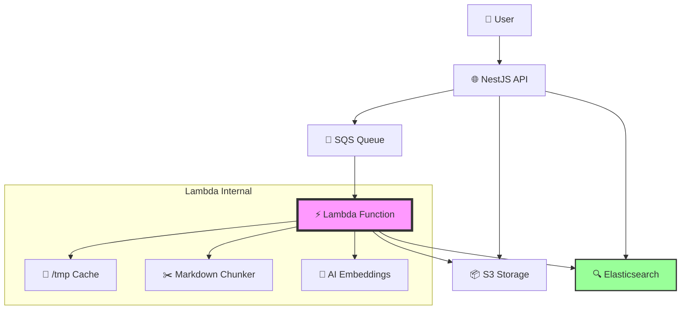

---

## Flow 1: File Upload

### Sequence Diagram

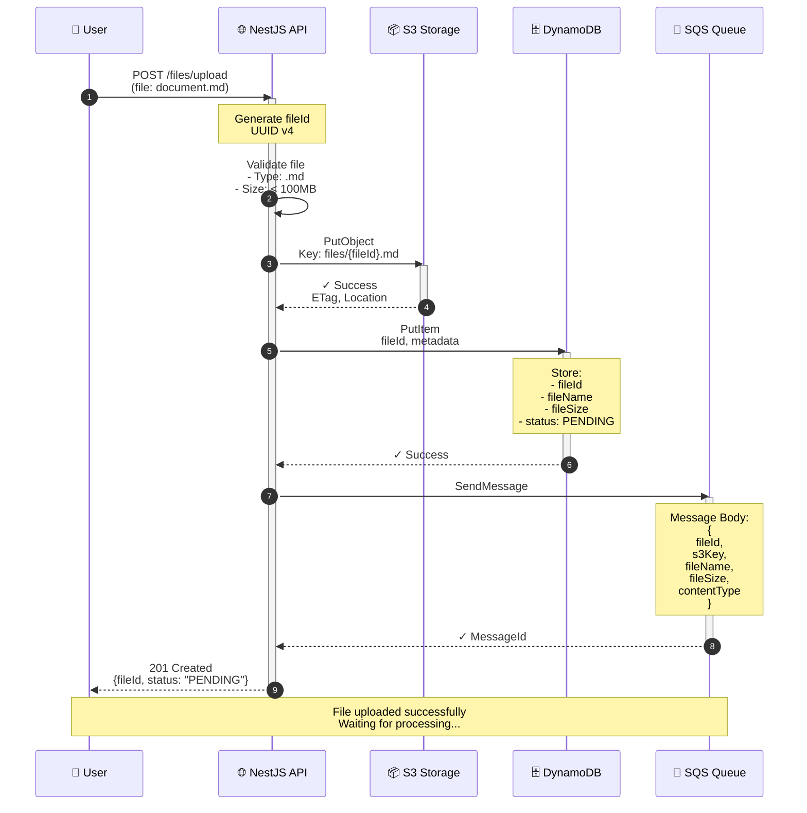

### Chi Tiết Các Bước

#### Step 1: User Upload File
```javascript
// Frontend
const formData = new FormData();
formData.append('file', file);

const response = await fetch('/files/upload', {
  method: 'POST',
  body: formData
});

// Response: { fileId: 'abc-123', status: 'PENDING' }
```

#### Step 2-3: API Validation
```typescript
// file.controller.ts
@Post('upload')
async uploadFile(@UploadedFile() file: Express.Multer.File) {
  // Validate file type
  if (!file.originalname.match(/\.(md|markdown)$/)) {
    throw new BadRequestException('Only markdown files allowed');
  }
  
  // Validate size (100MB limit)
  if (file.size > 100 * 1024 * 1024) {
    throw new BadRequestException('File too large');
  }
  
  const fileId = uuid();
  // ... continue
}
```

#### Step 4-5: Upload to S3
```typescript
// s3.adapter.ts
await this.s3Client.putObject({
  Bucket: 'file-uploads',
  Key: `files/${fileId}.md`,
  Body: file.buffer,
  ContentType: 'text/markdown'
});
```

#### Step 6-7: Store Metadata in DynamoDB
```typescript
// file-repository.ts
await this.dynamodb.putItem({
  TableName: 'file-uploads',
  Item: {
    fileId: { S: fileId },
    fileName: { S: file.originalname },
    fileSize: { N: file.size.toString() },
    status: { S: 'PENDING' },
    uploadedAt: { S: new Date().toISOString() }
  }
});
```

#### Step 8-9: Send Message to SQS
```typescript
// sqs.adapter.ts
await this.sqsClient.sendMessage({
  QueueUrl: this.queueUrl,
  MessageBody: JSON.stringify({
    fileId,
    s3Key: `files/${fileId}.md`,
    fileName: file.originalname,
    fileSize: file.size,
    contentType: 'text/markdown'
  })
});
```

**⏱️ Timing:**
- API validation: ~10ms
- S3 upload: ~100-500ms (depends on file size)
- DynamoDB write: ~20ms
- SQS send: ~30ms
- **Total: ~160-560ms**

---

## Flow 2: Lambda Processing (Cold Start)

### Sequence Diagram

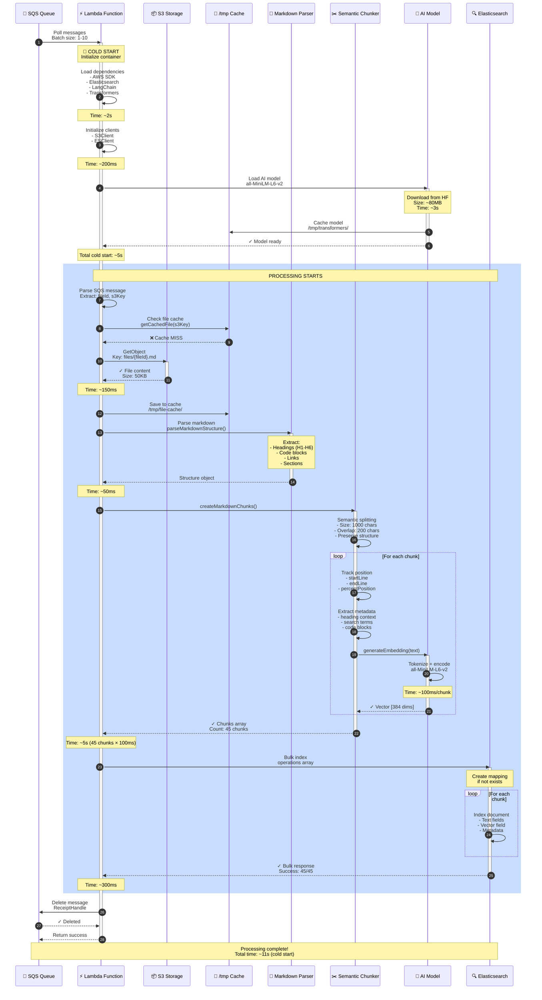

### Chi Tiết Cold Start

#### Phase 1: Container Initialization (~5s)

```javascript
// Lambda runtime starts
console.log('Cold start - initializing...');

// 1. Load dependencies (~2s)
const { S3Client } = require('@aws-sdk/client-s3');
const { Client } = require('@elastic/elasticsearch');
const { createMarkdownChunks } = require('./markdown-chunker');

// 2. Initialize clients (~200ms)
const s3Client = new S3Client({ region: 'us-east-1' });
const esClient = new Client({ node: ELASTICSEARCH_NODE });

// 3. Load AI model (~3s)
const { pipeline } = require('@xenova/transformers');
const embeddingModel = await pipeline(
  'feature-extraction',
  'Xenova/all-MiniLM-L6-v2'
);
```

**Cold Start Breakdown:**
- Runtime initialization: 500ms
- Node.js modules load: 1500ms
- AWS SDK initialization: 200ms
- AI model download: 2500ms (first time only)
- AI model load: 300ms
- **Total: ~5s**

#### Phase 2: File Download (~150ms)

```javascript
// Check cache first
const cachedFile = await getCachedFile(s3Key);

if (!cachedFile) {
  console.log('Cache MISS - downloading from S3');
  
  // Download from S3
  const command = new GetObjectCommand({
    Bucket: 'file-uploads',
    Key: s3Key
  });
  
  const response = await s3Client.send(command);
  const chunks = [];
  
  for await (const chunk of response.Body) {
    chunks.push(chunk);
  }
  
  fileBuffer = Buffer.concat(chunks);
  
  // Save to cache for next time
  await saveCachedFile(s3Key, fileBuffer);
}
```

#### Phase 3: Markdown Parsing (~50ms)

```javascript
// Parse markdown structure
const structure = parseMarkdownStructure(content);

console.log('Parsed structure:', {
  headings: structure.headings.length,
  sections: structure.sections.length,
  codeBlocks: structure.codeBlocks.length
});

// Example output:
// {
//   headings: 12,
//   sections: 15,
//   codeBlocks: 8
// }
```

#### Phase 4: Semantic Chunking (~5s for 45 chunks)

```javascript
const result = await createMarkdownChunks(content, {
  chunkSize: 1000,
  chunkOverlap: 200,
  fileId,
  fileName,
  generateEmbeddings: true
});

// Process breakdown per chunk (~110ms each):
// - Text splitting: 10ms
// - Metadata extraction: 5ms
// - Position tracking: 5ms
// - Embedding generation: 100ms
// Total: 110ms × 45 chunks = ~5s
```

#### Phase 5: Elasticsearch Indexing (~300ms)

```javascript
const operations = chunks.flatMap(chunk => [
  { index: { _index: 'file-chunks', _id: `${chunk.fileId}-${chunk.chunkIndex}` } },
  {
    fileId: chunk.fileId,
    chunkIndex: chunk.chunkIndex,
    content: chunk.content,
    position: chunk.position,
    heading: chunk.heading,
    embedding: chunk.embedding, // 384-dim vector
    metadata: chunk.metadata
  }
]);

const bulkResponse = await esClient.bulk({
  refresh: true,
  operations
});

// Bulk indexing: ~300ms for 45 documents
```

**⏱️ Total Cold Start Time:**
- Container init: 5s
- Download: 0.15s
- Parsing: 0.05s
- Chunking + Embeddings: 5s
- Indexing: 0.3s
- **Total: ~10.5s**

---

## Flow 3: Lambda Processing (Warm Container)

### Sequence Diagram

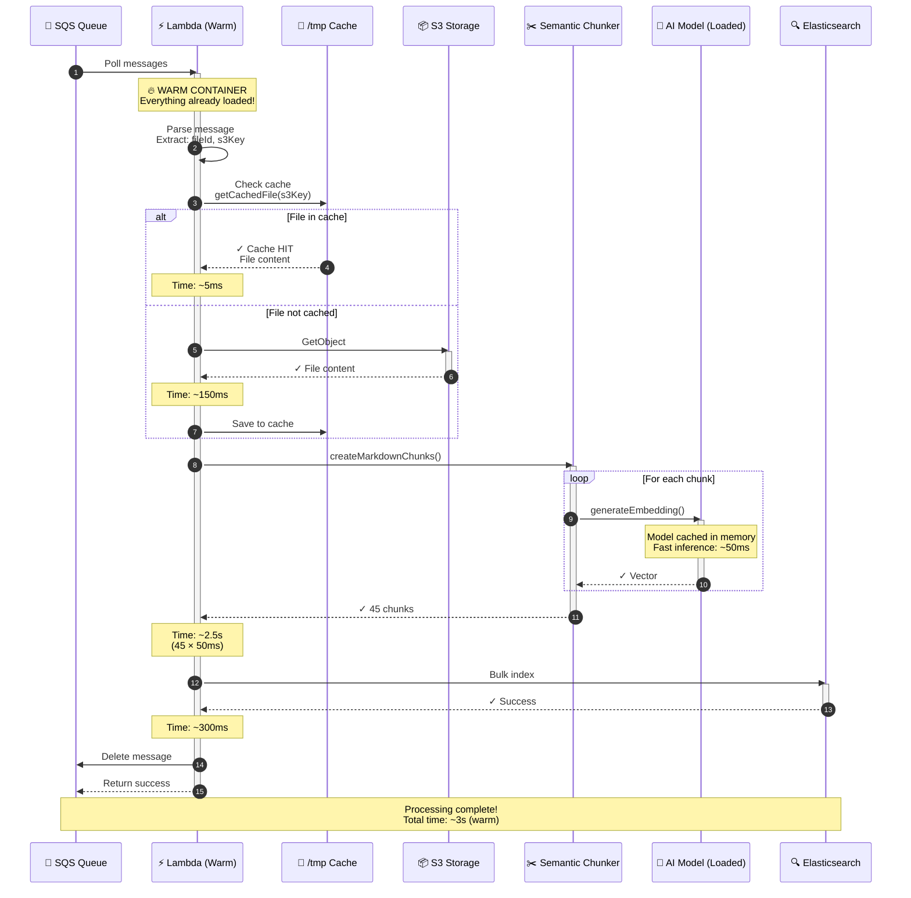

### Performance Comparison

| Phase | Cold Start | Warm Container | Improvement |
|-------|-----------|----------------|-------------|
| Container init | 5s | 0s | ∞ |
| File download | 150ms | 5ms (cached) | 30× faster |
| Parsing | 50ms | 50ms | Same |
| Embedding (45 chunks) | 5s | 2.5s | 2× faster |
| Indexing | 300ms | 300ms | Same |
| **TOTAL** | **10.5s** | **2.9s** | **3.6× faster** |

**Why Warm is Faster:**
1. ✅ No container initialization
2. ✅ Dependencies already loaded
3. ✅ AI model cached in memory
4. ✅ Connection pools reused
5. ✅ File cached in /tmp

---

## Flow 4: Text Search

### Sequence Diagram

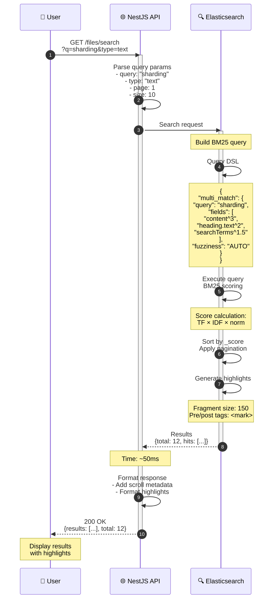

### Query Example

```javascript
// API sends this query to Elasticsearch
POST /file-chunks/_search
{
  "query": {
    "bool": {
      "must": [
        {
          "multi_match": {
            "query": "sharding",
            "fields": [
              "content^3",           // Boost content 3x
              "heading.text^2",      // Boost headings 2x
              "searchTerms^1.5",     // Boost terms 1.5x
              "metadata.fileName"
            ],
            "type": "best_fields",
            "fuzziness": "AUTO"      // Typo tolerance
          }
        }
      ],
      "should": [
        { "term": { "metadata.hasCodeBlock": { "value": true, "boost": 1.2 } } },
        { "exists": { "field": "heading", "boost": 1.1 } }
      ]
    }
  },
  "min_score": 0.5,
  "from": 0,
  "size": 10,
  "highlight": {
    "fields": {
      "content": {
        "fragment_size": 150,
        "number_of_fragments": 3,
        "pre_tags": ["<mark>"],
        "post_tags": ["</mark>"]
      }
    }
  },
  "sort": ["_score"]
}
```

### Response Example

```json
{
  "total": 12,
  "took": 45,
  "maxScore": 2.5,
  "results": [
    {
      "id": "abc-123-0",
      "score": 2.5,
      "fileId": "abc-123",
      "chunkIndex": 0,
      "content": "To configure sharding in Elasticsearch...",
      "position": {
        "startLine": 342,
        "endLine": 356,
        "percentPosition": 45.2
      },
      "heading": {
        "text": "Sharding Configuration",
        "level": 2,
        "id": "sharding-configuration"
      },
      "highlights": [
        "To configure <mark>sharding</mark> in Elasticsearch",
        "<mark>Sharding</mark> distributes data across nodes"
      ]
    }
  ]
}
```

**⏱️ Timing:**
- Query parsing: 5ms
- ES query execution: 45ms
- Response formatting: 5ms
- **Total: ~55ms**

---

## Flow 5: Semantic Search

### Sequence Diagram

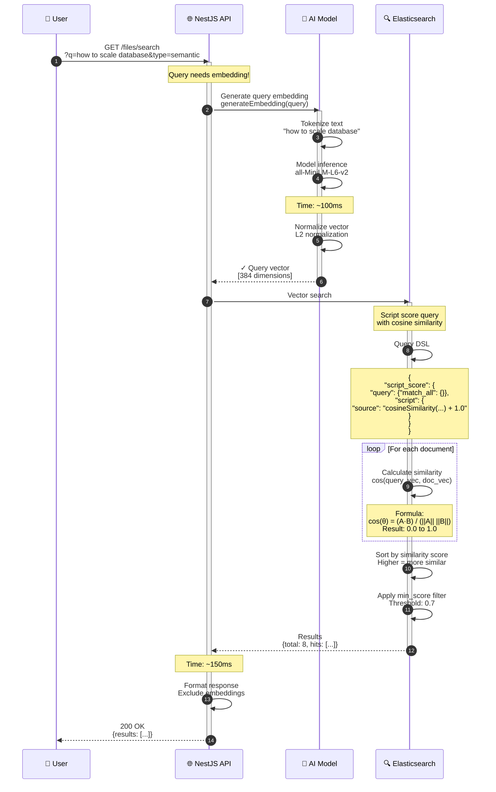

### Query Example

```javascript
// Step 1: Generate query embedding
const queryText = "how to scale database";
const queryEmbedding = await generateEmbedding(queryText);
// Result: [0.123, -0.456, 0.789, ..., 0.234] // 384 dimensions

// Step 2: Search with vector similarity
POST /file-chunks/_search
{
  "query": {
    "script_score": {
      "query": { "match_all": {} },
      "script": {
        "source": "cosineSimilarity(params.query_vector, 'embedding') + 1.0",
        "params": {
          "query_vector": queryEmbedding // 384-dim array
        }
      }
    }
  },
  "min_score": 0.7,
  "size": 10,
  "_source": {
    "excludes": ["embedding"]  // Don't return 384-dim vector
  }
}
```

### Cosine Similarity Calculation

```
Given:
  query_vector = [0.5, 0.3, 0.2, ...]  // 384 dims
  doc_vector   = [0.4, 0.5, 0.1, ...]  // 384 dims

Calculate:
  dot_product = Σ(query[i] × doc[i])
              = 0.5×0.4 + 0.3×0.5 + 0.2×0.1 + ...
              = 0.37
  
  magnitude_q = √(Σ query[i]²) = 0.62
  magnitude_d = √(Σ doc[i]²)   = 0.64
  
  cosine_sim = dot_product / (magnitude_q × magnitude_d)
             = 0.37 / (0.62 × 0.64)
             = 0.93  // Very similar!

Score = cosine_sim + 1.0 = 1.93
```

### Response Example

```json
{
  "total": 8,
  "took": 180,
  "maxScore": 1.89,
  "results": [
    {
      "id": "abc-123-15",
      "score": 1.89,  // cosine: 0.89
      "content": "Elasticsearch distributes data across multiple shards for scalability. Each shard can be hosted on different nodes...",
      "heading": {
        "text": "Horizontal Scaling",
        "level": 2
      },
      "position": {
        "startLine": 456,
        "percentPosition": 60.3
      }
    },
    {
      "id": "abc-123-8",
      "score": 1.85,  // cosine: 0.85
      "content": "Replication provides high availability and read scaling. Add replicas to handle more concurrent queries...",
      "heading": {
        "text": "Replication Strategy",
        "level": 3
      }
    }
  ]
}
```

**Why Semantic Search Works:**

```
Query: "how to scale database"
Embedding captures meaning: [scaling, performance, growth, capacity, ...]

Matched documents (by semantic similarity):
1. "Horizontal Scaling" (0.89) ✓ - directly about scaling
2. "Replication Strategy" (0.85) ✓ - related to scaling
3. "Sharding Configuration" (0.82) ✓ - method to scale
4. "Performance Tuning" (0.78) ✓ - helps with scale

NOT matched:
- "Installation Guide" (0.32) ✗ - different topic
- "Basic CRUD" (0.28) ✗ - not about scaling
```

**⏱️ Timing:**
- Query embedding: 100ms
- ES vector search: 150ms
- Response formatting: 10ms
- **Total: ~260ms**

---

## Flow 6: Hybrid Search

### Sequence Diagram

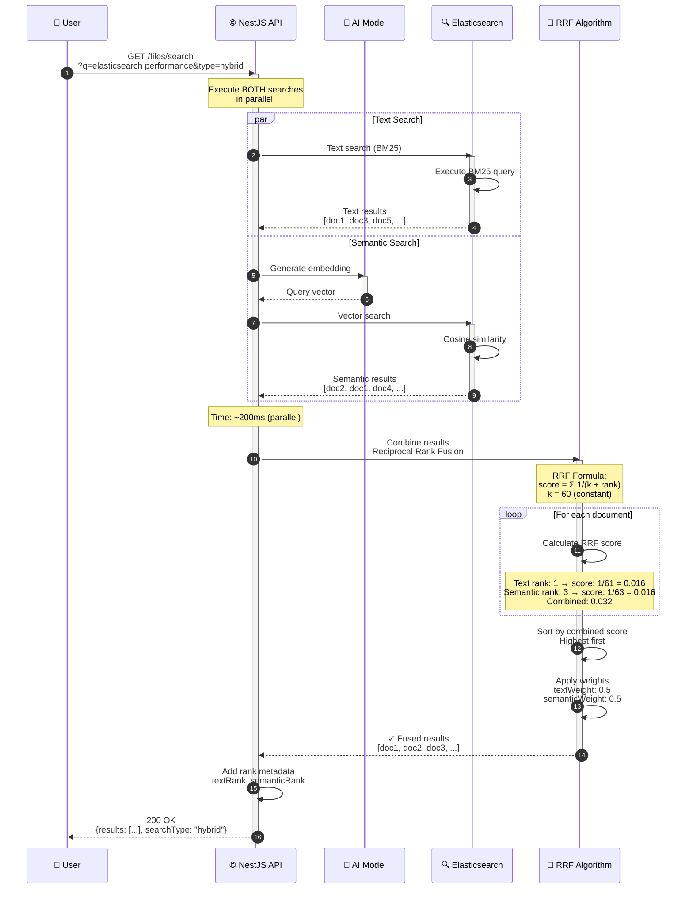

### Reciprocal Rank Fusion (RRF) Algorithm

```javascript
// Input: Two result lists
const textResults = [
  { id: 'doc1', score: 2.5 },  // rank 1
  { id: 'doc3', score: 2.1 },  // rank 2
  { id: 'doc5', score: 1.8 },  // rank 3
  { id: 'doc2', score: 1.5 }   // rank 4
];

const semanticResults = [
  { id: 'doc2', score: 0.92 }, // rank 1
  { id: 'doc1', score: 0.88 }, // rank 2
  { id: 'doc4', score: 0.85 }, // rank 3
  { id: 'doc3', score: 0.80 }  // rank 4
];

// RRF Formula: score = Σ weight / (k + rank)
const k = 60; // RRF constant
const textWeight = 0.5;
const semanticWeight = 0.5;

// Calculate RRF scores
const scoreMap = new Map();

// Add text scores
textResults.forEach((result, index) => {
  const rank = index + 1;
  const rrf = textWeight / (k + rank);
  
  scoreMap.set(result.id, {
    ...result,
    rrfScore: rrf,
    textRank: rank
  });
});

// Add semantic scores
semanticResults.forEach((result, index) => {
  const rank = index + 1;
  const rrf = semanticWeight / (k + rank);
  
  const existing = scoreMap.get(result.id);
  if (existing) {
    // Document in both results - combine scores
    existing.rrfScore += rrf;
    existing.semanticRank = rank;
  } else {
    // Document only in semantic results
    scoreMap.set(result.id, {
      ...result,
      rrfScore: rrf,
      semanticRank: rank
    });
  }
});

// Sort by combined RRF score
const fusedResults = Array.from(scoreMap.values())
  .sort((a, b) => b.rrfScore - a.rrfScore);

console.log(fusedResults);
// [
//   { id: 'doc1', rrfScore: 0.0164, textRank: 1, semanticRank: 2 },
//   { id: 'doc2', rrfScore: 0.0160, textRank: 4, semanticRank: 1 },
//   { id: 'doc3', rrfScore: 0.0158, textRank: 2, semanticRank: 4 },
//   { id: 'doc4', rrfScore: 0.0079, semanticRank: 3 },
//   { id: 'doc5', rrfScore: 0.0079, textRank: 3 }
// ]
```

### RRF Score Calculation Example

```
Document: "doc1"
-----------------
Text search:
  - Rank: 1
  - RRF contribution: 0.5 / (60 + 1) = 0.0082

Semantic search:
  - Rank: 2
  - RRF contribution: 0.5 / (60 + 2) = 0.0081

Combined RRF score: 0.0082 + 0.0081 = 0.0163

Document: "doc2"
-----------------
Text search:
  - Rank: 4
  - RRF contribution: 0.5 / (60 + 4) = 0.0078

Semantic search:
  - Rank: 1
  - RRF contribution: 0.5 / (60 + 1) = 0.0082

Combined RRF score: 0.0078 + 0.0082 = 0.0160

Document: "doc4"
-----------------
Text search: NOT FOUND
Semantic search:
  - Rank: 3
  - RRF contribution: 0.5 / (60 + 3) = 0.0079

Combined RRF score: 0.0079

Final ranking: doc1 (0.0163) > doc2 (0.0160) > doc3 > doc4 > doc5
```

### Response Example

```json
{
  "total": 15,
  "took": 220,
  "searchType": "hybrid",
  "weights": {
    "textWeight": 0.5,
    "semanticWeight": 0.5
  },
  "results": [
    {
      "id": "abc-123-10",
      "score": 0.0163,
      "textRank": 1,
      "semanticRank": 2,
      "content": "Performance tuning in Elasticsearch requires careful consideration of...",
      "heading": {
        "text": "Performance Optimization",
        "level": 2
      },
      "highlights": [
        "<mark>Performance</mark> tuning in <mark>Elasticsearch</mark>"
      ]
    },
    {
      "id": "abc-123-5",
      "score": 0.0160,
      "textRank": 4,
      "semanticRank": 1,
      "content": "Query optimization and indexing strategies improve response times...",
      "heading": {
        "text": "Query Optimization",
        "level": 3
      }
    }
  ]
}
```

**Why Hybrid is Best:**

| Search Type | Strengths | Weaknesses |
|------------|-----------|------------|
| **Text** | - Exact keyword matches<br/>- Fast (~50ms)<br/>- Predictable | - Misses synonyms<br/>- No semantic understanding<br/>- Vulnerable to typos |
| **Semantic** | - Understands meaning<br/>- Finds related concepts<br/>- Typo tolerant | - Slower (~200ms)<br/>- May miss exact terms<br/>- Less predictable |
| **Hybrid** | - ✅ Best of both<br/>- ✅ Balanced results<br/>- ✅ High recall + precision | - Slightly slower (~250ms)<br/>- More complex |

**⏱️ Timing:**
- Text search: 50ms (parallel)
- Semantic search: 200ms (parallel)
- RRF fusion: 5ms
- **Total: ~205ms** (not 250ms due to parallelization)

---

## Flow 7: Scroll-to-Position

### Sequence Diagram

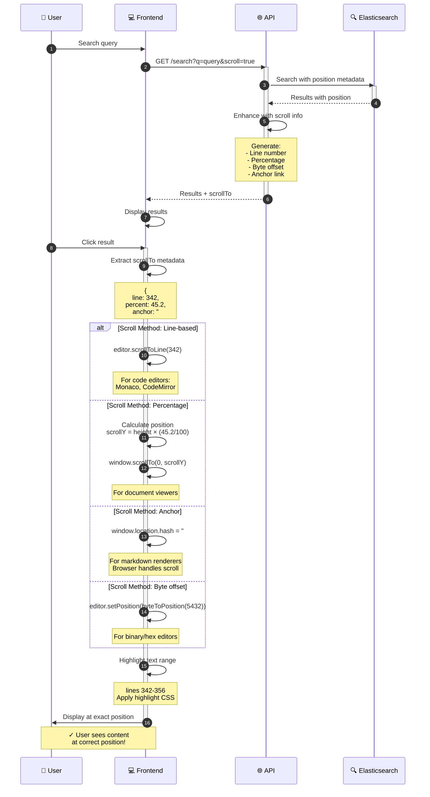

### Frontend Implementation Examples

#### Example 1: Monaco Editor (VS Code style)

```typescript
// Component.tsx
import * as monaco from 'monaco-editor';

async function handleSearchResultClick(result: SearchResult) {
  const { scrollTo } = result;
  
  // Scroll to line
  editor.revealLineInCenter(scrollTo.line);
  
  // Set cursor
  editor.setPosition({
    lineNumber: scrollTo.line,
    column: 1
  });
  
  // Highlight range
  const range = new monaco.Range(
    scrollTo.range.start,  // startLine
    1,                      // startColumn
    scrollTo.range.end,     // endLine
    100                     // endColumn
  );
  
  const decoration = editor.deltaDecorations([], [{
    range: range,
    options: {
      isWholeLine: true,
      className: 'search-highlight',
      glyphMarginClassName: 'search-glyph'
    }
  }]);
  
  // Remove highlight after 3 seconds
  setTimeout(() => {
    editor.deltaDecorations(decoration, []);
  }, 3000);
}
```

#### Example 2: React Markdown Viewer

```typescript
// MarkdownViewer.tsx
import React, { useEffect, useRef } from 'react';
import ReactMarkdown from 'react-markdown';

function MarkdownViewer({ content, scrollTo }: Props) {
  const containerRef = useRef<HTMLDivElement>(null);
  
  useEffect(() => {
    if (!scrollTo || !containerRef.current) return;
    
    // Method 1: Anchor-based (best for markdown)
    if (scrollTo.anchor) {
      const element = document.querySelector(scrollTo.anchor);
      element?.scrollIntoView({
        behavior: 'smooth',
        block: 'center'
      });
      
      // Add highlight
      element?.classList.add('highlight');
      setTimeout(() => {
        element?.classList.remove('highlight');
      }, 3000);
      
      return;
    }
    
    // Method 2: Percentage-based
    const container = containerRef.current;
    const scrollPosition = container.scrollHeight * (scrollTo.percent / 100);
    
    container.scrollTo({
      top: scrollPosition,
      behavior: 'smooth'
    });
    
    // Method 3: Line-based (approximate)
    const lineHeight = 24; // pixels
    const scrollY = scrollTo.line * lineHeight;
    container.scrollTo({ top: scrollY, behavior: 'smooth' });
  }, [scrollTo]);
  
  return (
    <div ref={containerRef} className="markdown-container">
      <ReactMarkdown>{content}</ReactMarkdown>
    </div>
  );
}
```

#### Example 3: Plain HTML Document Viewer

```javascript
// documentViewer.js
function scrollToResult(scrollInfo) {
  const {
    line,
    percent,
    byte,
    anchor,
    range
  } = scrollInfo;
  
  // Priority 1: Anchor (most reliable for markdown)
  if (anchor) {
    window.location.hash = anchor;
    highlightElement(document.querySelector(anchor));
    return;
  }
  
  // Priority 2: Percentage (works for any document)
  if (percent !== undefined) {
    const documentHeight = document.documentElement.scrollHeight;
    const viewportHeight = window.innerHeight;
    const scrollY = (documentHeight - viewportHeight) * (percent / 100);
    
    window.scrollTo({
      top: scrollY,
      behavior: 'smooth'
    });
    
    highlightLinesInViewport(range.start, range.end);
    return;
  }
  
  // Priority 3: Line number (for structured content)
  if (line !== undefined) {
    const lineElements = document.querySelectorAll('[data-line]');
    const targetElement = Array.from(lineElements)
      .find(el => parseInt(el.dataset.line) >= line);
    
    if (targetElement) {
      targetElement.scrollIntoView({
        behavior: 'smooth',
        block: 'center'
      });
      highlightLines(range.start, range.end);
    }
  }
}

function highlightLines(startLine, endLine) {
  const lines = document.querySelectorAll('[data-line]');
  
  lines.forEach(line => {
    const lineNum = parseInt(line.dataset.line);
    if (lineNum >= startLine && lineNum <= endLine) {
      line.classList.add('search-highlight');
      
      // Fade out after 3 seconds
      setTimeout(() => {
        line.classList.remove('search-highlight');
      }, 3000);
    }
  });
}
```

#### CSS for Highlighting

```css
/* Smooth highlight animation */
.search-highlight {
  background-color: rgba(255, 237, 100, 0.3);
  animation: highlightFade 3s ease-in-out;
}

@keyframes highlightFade {
  0% {
    background-color: rgba(255, 237, 100, 0.8);
  }
  50% {
    background-color: rgba(255, 237, 100, 0.5);
  }
  100% {
    background-color: rgba(255, 237, 100, 0);
  }
}

/* Anchor highlight */
:target {
  background-color: rgba(255, 237, 100, 0.5);
  padding: 4px 8px;
  border-radius: 4px;
}

/* Line glyph marker */
.search-glyph {
  background-color: #007acc;
  width: 4px !important;
  margin-left: 3px;
}
```

### Position Metadata Structure

```typescript
interface ScrollToPosition {
  // Line-based (1-indexed)
  line: number;           // 342
  
  // Percentage-based (0-100)
  percent: number;        // 45.2
  
  // Byte-based (0-indexed)
  byte: number;          // 5432
  
  // Anchor-based (HTML id)
  anchor: string | null; // "#sharding-configuration"
  
  // Range for highlighting
  range: {
    start: number;       // 342
    end: number;         // 356
  };
}
```

**⏱️ Timing:**
- Search request: 200ms
- Scroll calculation: 5ms
- Smooth scroll animation: 500ms
- Highlight fade: 3000ms
- **Total user experience: ~3.7s**

---

## Error Handling Flows

### Flow 8A: File Download Error

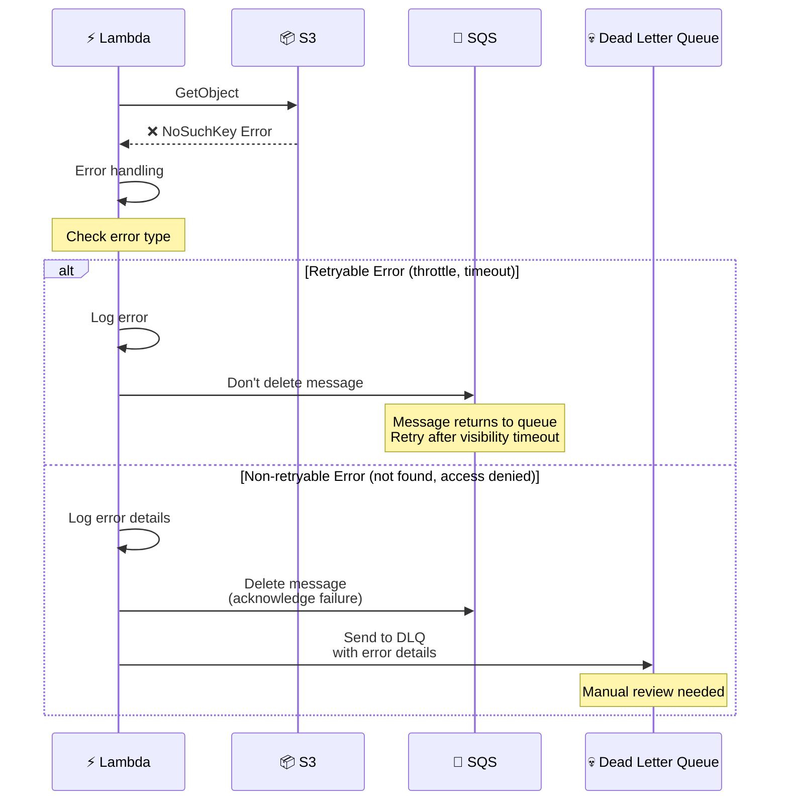

### Flow 8B: Elasticsearch Index Error

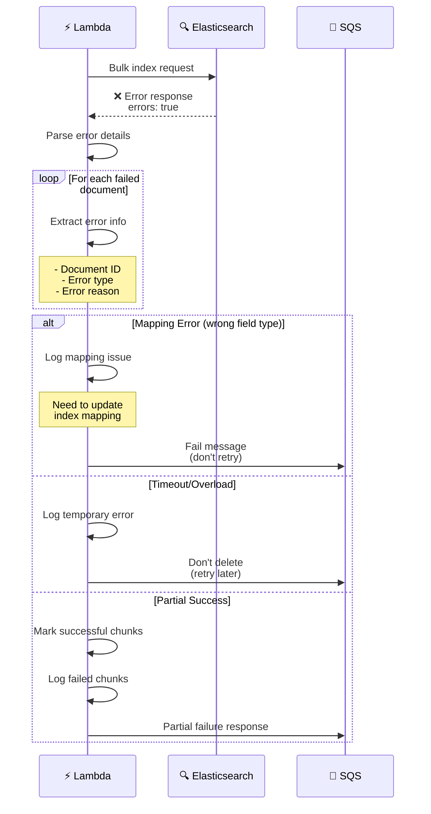

### Flow 8C: AI Model Error

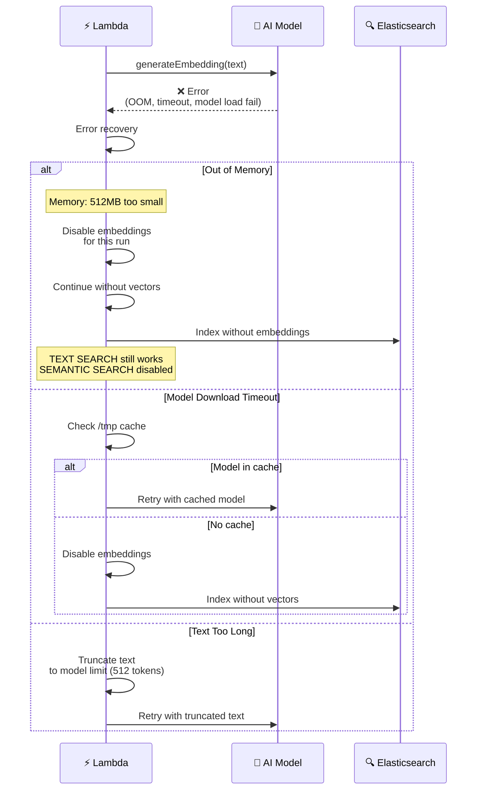

### Error Response Examples

```javascript
// S3 Download Error
{
  "error": "S3DownloadError",
  "message": "Failed to download file from S3",
  "details": {
    "bucket": "file-uploads",
    "key": "files/abc-123.md",
    "errorCode": "NoSuchKey",
    "retryable": false
  },
  "timestamp": "2026-02-01T10:30:00Z"
}

// Elasticsearch Index Error
{
  "error": "BulkIndexError",
  "message": "Failed to index 5 out of 45 chunks",
  "details": {
    "successCount": 40,
    "failureCount": 5,
    "failures": [
      {
        "chunkIndex": 12,
        "error": "mapper_parsing_exception",
        "reason": "failed to parse field [embedding] of type [dense_vector]"
      }
    ]
  },
  "timestamp": "2026-02-01T10:30:15Z"
}

// AI Model Error
{
  "error": "EmbeddingGenerationError",
  "message": "Failed to generate embeddings",
  "details": {
    "errorType": "OutOfMemoryError",
    "lambdaMemory": "512MB",
    "recommendedMemory": "1024MB",
    "fallbackMode": "text-only",
    "semanticSearchDisabled": true
  },
  "timestamp": "2026-02-01T10:30:20Z"
}
```

---

## Performance Metrics

### Lambda Execution Times

| Scenario | Cold Start | Warm Container | Cache Hit |
|----------|-----------|----------------|-----------|
| **Small File (10KB, 12 chunks)** | 6.5s | 1.5s | 0.8s |
| **Medium File (50KB, 45 chunks)** | 10.5s | 2.9s | 1.2s |
| **Large File (500KB, 450 chunks)** | 45s | 25s | 20s |
| **XL File (2MB, 1800 chunks)** | 180s | 95s | 85s |

### Search Performance

| Search Type | Cold Query | Warm Query | Cached Query |
|-------------|-----------|-----------|--------------|
| **Text Search** | 150ms | 50ms | 20ms |
| **Semantic Search** | 300ms | 200ms | 150ms |
| **Hybrid Search** | 350ms | 220ms | 170ms |

### Cost Analysis (AWS Lambda)

#### Without Embeddings
```
Configuration:
- Memory: 512MB
- Avg duration: 2s per file
- Monthly files: 10,000

Cost calculation:
- GB-seconds: 0.5GB × 2s × 10,000 = 10,000 GB-s
- Price: $0.0000166667 per GB-s
- Monthly cost: 10,000 × $0.0000166667 = $166.67

Request cost:
- Price: $0.20 per 1M requests
- Monthly requests: 10,000
- Cost: 10,000 × ($0.20 / 1,000,000) = $0.002

Total: $166.67 + $0.002 ≈ $167/month
```

#### With Embeddings
```
Configuration:
- Memory: 1024MB (1GB)
- Avg duration: 10s per file
- Monthly files: 10,000

Cost calculation:
- GB-seconds: 1GB × 10s × 10,000 = 100,000 GB-s
- Price: $0.0000166667 per GB-s
- Monthly cost: 100,000 × $0.0000166667 = $1,666.67

Request cost: $0.002

Total: $1,666.67 + $0.002 ≈ $1,667/month

Cost increase: 10× more expensive
BUT: Enables semantic search! 🚀
```

#### LocalStack (Development)
```
Cost: $0 💰
All features enabled!
Perfect for testing.
```

### Optimization Tips

#### 1. Container Reuse
```javascript
// Keep container warm
setInterval(async () => {
  await lambda.invoke({
    FunctionName: 'file-processor',
    Payload: JSON.stringify({ warmup: true })
  });
}, 5 * 60 * 1000); // Every 5 minutes

// Benefit: Avoid cold starts (5s savings)
```

#### 2. Batch Processing
```javascript
// Process multiple files per invocation
exports.handler = async (event) => {
  const results = await Promise.allSettled(
    event.Records.map(record => processRecord(record))
  );
  
  // Process 10 files: 10s total
  // vs. 10 × 2s = 20s if sequential
  
  // Benefit: 50% time reduction
};
```

#### 3. Selective Embeddings
```javascript
// Only generate embeddings for important chunks
const shouldGenerateEmbedding = (chunk) => {
  // Skip code blocks (exact match better)
  if (chunk.metadata.hasCodeBlock) return false;
  
  // Skip very short chunks
  if (chunk.content.length < 200) return false;
  
  // Generate for heading sections
  if (chunk.heading?.level <= 2) return true;
  
  return true;
};

// Benefit: 30-40% faster processing
```

#### 4. Lazy Model Loading
```javascript
let embeddingModel = null;

async function getEmbeddingModel() {
  if (!embeddingModel) {
    console.log('Loading model (one-time)...');
    embeddingModel = await pipeline(
      'feature-extraction',
      'Xenova/all-MiniLM-L6-v2'
    );
  }
  return embeddingModel;
}

// Benefit: Skip model load if not needed
```

---

## Summary

### Key Takeaways

1. **Cold Start Penalty**: ~5s overhead
   - Solution: Keep containers warm
   - Or: Use provisioned concurrency

2. **Embeddings are Expensive**: 10× cost increase
   - But: Enables semantic search
   - Trade-off: Better search vs. higher cost

3. **Caching Matters**: 3× performance improvement
   - /tmp cache for files
   - Memory cache for model
   - Connection pool reuse

4. **Hybrid Search Best**: Combines precision + recall
   - Text: Fast, exact matches
   - Semantic: Understands meaning
   - RRF: Best of both worlds

5. **Scroll-to-Position**: Great UX
   - Multiple methods (line, %, byte, anchor)
   - Frontend flexibility
   - Smooth animations

### Recommended Configuration

```javascript
// Lambda Function
{
  "memory": 1024,              // 1GB for AI model
  "timeout": 300,              // 5 minutes
  "ephemeralStorage": 2048,    // 2GB for /tmp cache
  
  "environment": {
    "CHUNK_SIZE": "1000",
    "CHUNK_OVERLAP": "200",
    "ENABLE_EMBEDDINGS": "true",
    "ENABLE_TMP_CACHE": "true"
  },
  
  "reservedConcurrency": 10,   // Limit concurrent executions
  "provisionedConcurrency": 2  // Keep 2 warm (optional, costs more)
}
```

### Next Steps

1. ✅ Implement error handling
2. ✅ Add monitoring/metrics
3. ✅ Set up alerts
4. ✅ Test with real data
5. ✅ Optimize based on metrics
6. ✅ Scale as needed

---

## Appendix: Useful Commands

### Test Lambda Locally
```bash
# Test cold start
aws lambda invoke \
  --function-name file-processor \
  --payload file://test-event.json \
  response.json \
  --endpoint-url=http://localhost:4566

# Check logs
aws logs tail /aws/lambda/file-processor --follow \
  --endpoint-url=http://localhost:4566
```

### Monitor Performance
```bash
# Get Lambda metrics
aws cloudwatch get-metric-statistics \
  --namespace AWS/Lambda \
  --metric-name Duration \
  --dimensions Name=FunctionName,Value=file-processor \
  --start-time 2026-02-01T00:00:00Z \
  --end-time 2026-02-01T23:59:59Z \
  --period 3600 \
  --statistics Average,Maximum
```

### Debug Elasticsearch
```bash
# Check index stats
curl http://localhost:4566/_cat/indices?v

# View mapping
curl http://localhost:4566/file-chunks/_mapping?pretty

# Search test
curl -X POST http://localhost:4566/file-chunks/_search?pretty \
  -H 'Content-Type: application/json' \
  -d '{"query":{"match_all":{}},"size":1}'
```

---

**📚 Related Documents:**
- [README-MARKDOWN-AI.md](README-MARKDOWN-AI.md) - User guide
- [LAMBDA-LAYER-SETUP.md](LAMBDA-LAYER-SETUP.md) - Deployment guide
- [handler-markdown.js](src/handler-markdown.js) - Implementation
- [search-service.js](src/search-service.js) - Search API

**🔗 External References:**
- [AWS Lambda Best Practices](https://docs.aws.amazon.com/lambda/latest/dg/best-practices.html)
- [Elasticsearch Dense Vector](https://www.elastic.co/guide/en/elasticsearch/reference/current/dense-vector.html)
- [LangChain Text Splitters](https://js.langchain.com/docs/modules/data_connection/document_transformers/)
