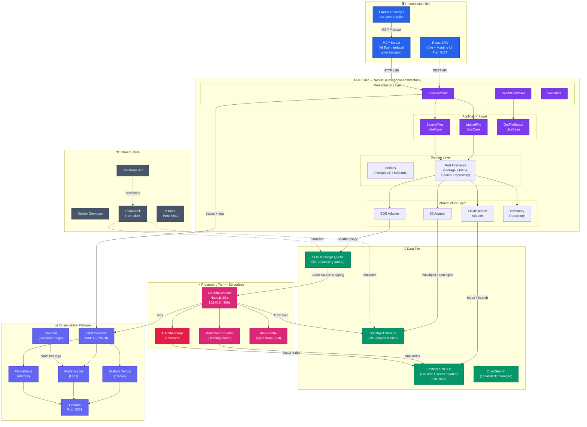

# Solution Architecture Overview

## Enterprise Solution Architecture — Chunk Files Platform

Tổng quan kiến trúc toàn bộ hệ thống ở mức cao nhất, thể hiện các domain chính, luồng dữ liệu chính và các technology stack.

## Technology Stack Matrix

| Tier | Technology | Purpose | Port |
|------|-----------|---------|------|
| **Frontend** | React + Vite + Mantine UI | SPA Web Client | 5173 |
| **AI Interface** | MCP Server (TypeScript) | Claude/Copilot integration | stdio |
| **API** | NestJS (TypeScript) | REST API + Business Logic | 3000 |
| **Processing** | AWS Lambda (Node.js 20.x) | Async file processing | - |
| **Storage** | S3 (LocalStack) | Object storage | 4566 |
| **Queue** | SQS (LocalStack) | Message queue | 4566 |
| **Search** | Elasticsearch 8.11 | Full-text + vector search | 9200 |
| **Dashboard** | Kibana 8.11 | Elasticsearch UI | 5601 |
| **Traces** | Grafana Tempo | Distributed tracing | 3200 |
| **Logs** | Grafana Loki | Log aggregation | 3100 |
| **Metrics** | Prometheus | Metrics collection | 9090 |
| **Visualization** | Grafana | Observability dashboards | 3001 |
| **Log Collector** | Promtail | Docker log forwarding | - |
| **Telemetry** | OTel Collector | Central telemetry pipeline | 4317/4318 |
| **IaC** | Terraform | Infrastructure provisioning | - |
| **Emulator** | LocalStack | AWS services emulation | 4566 |
| **Orchestration** | Docker Compose | Container orchestration | - |
| **Monorepo** | pnpm + Turborepo | Build system | - |
