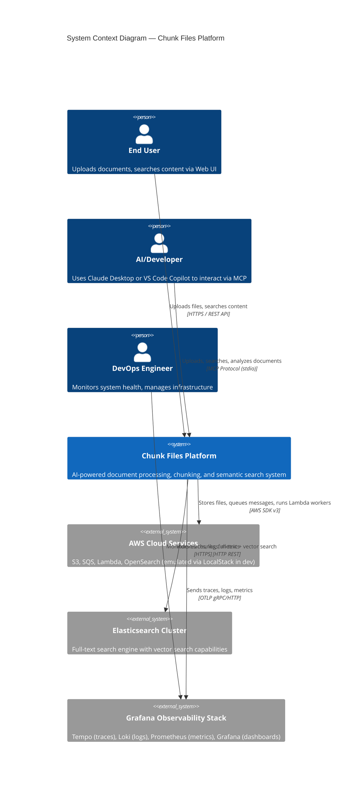
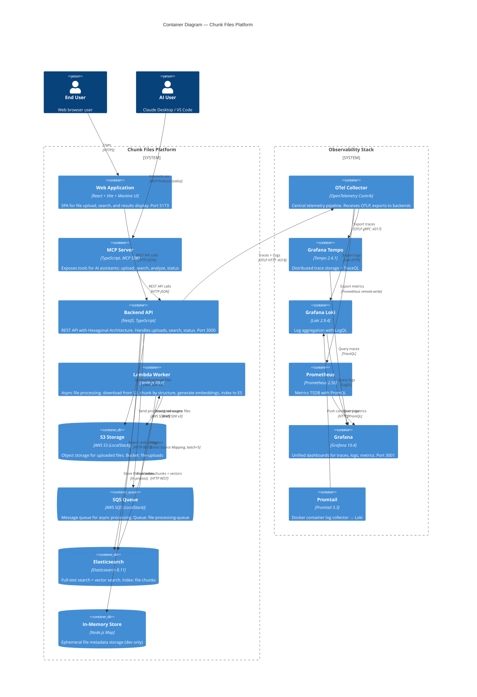

# C4 Model — System Context & Container Diagrams

## Level 1: System Context Diagram

Mô tả hệ thống Chunk Files Platform trong bối cảnh các actors và external systems tương tác.

---

## Level 2: Container Diagram

Chi tiết bên trong Chunk Files Platform — các container (ứng dụng/dịch vụ) và quan hệ giữa chúng.

---

## Level 3: Component Diagram — NestJS API

Chi tiết bên trong Backend API container theo Hexagonal Architecture.

```mermaid
C4Component
    title Component Diagram — NestJS Backend API

    Container_Boundary(api, "NestJS Backend API") {
        Component(fileCtrl, "FileController", "NestJS Controller", "POST /files/upload, GET /files/search, GET /files/:id/status")
        Component(healthCtrl, "HealthController", "NestJS Controller", "GET /health — system health check")
        Component(validators, "Validators", "NestJS Pipes", "CustomFileTypeValidator, ParseFilePipe")
        Component(metrics, "MetricsInterceptor", "NestJS Interceptor", "Request duration, status code tracking")
        
        Component(uploadUC, "UploadFileUseCase", "Application Service", "Orchestrates: validate → S3 upload → save metadata → SQS publish")
        Component(searchUC, "SearchFilesUseCase", "Application Service", "Orchestrates: parse query → ES search → format results")
        Component(statusUC, "GetFileStatusUseCase", "Application Service", "Retrieves file processing status from repository")
        
        Component(fileEntity, "FileUpload Entity", "Domain Model", "fileId, fileName, fileSize, mimeType, status, timestamps")
        Component(chunkEntity, "FileChunk Entity", "Domain Model", "chunkId, fileId, content, chunkIndex, metadata, embedding")
        Component(storagePrt, "IStoragePort", "Port Interface", "uploadFile(), getFile(), deleteFile()")
        Component(queuePrt, "IQueuePort", "Port Interface", "sendMessage(), receiveMessages()")
        Component(searchPrt, "ISearchPort", "Port Interface", "indexChunk(), search(), createIndex()")
        Component(repoPrt, "IFileRepository", "Port Interface", "save(), findById(), findAll()")
        
        Component(s3Adp, "S3Adapter", "Infrastructure", "AWS SDK v3 S3Client — PutObject, GetObject")
        Component(sqsAdp, "SQSAdapter", "Infrastructure", "AWS SDK v3 SQSClient — SendMessage")
        Component(esAdp, "ElasticsearchAdapter", "Infrastructure", "Elasticsearch Client 8.11 — bulk index, multi_match, knn")
        Component(repoAdp, "InMemoryFileRepository", "Infrastructure", "Map<string, FileUpload> — development store")
        Component(winston, "WinstonLogger", "Infrastructure", "Structured logging with OTel transport → Loki")
        Component(tracing, "OTel Tracing", "Infrastructure", "Auto-instrumentation: HTTP, NestJS, AWS SDK")
    }

    Rel(fileCtrl, validators, "Validates input")
    Rel(fileCtrl, uploadUC, "Delegates upload")
    Rel(fileCtrl, searchUC, "Delegates search")
    Rel(healthCtrl, statusUC, "Delegates status")
    Rel(metrics, fileCtrl, "Wraps with metrics")
    
    Rel(uploadUC, storagePrt, "Uses")
    Rel(uploadUC, queuePrt, "Uses")
    Rel(uploadUC, repoPrt, "Uses")
    Rel(searchUC, searchPrt, "Uses")
    Rel(statusUC, repoPrt, "Uses")
    
    Rel(storagePrt, s3Adp, "Implemented by")
    Rel(queuePrt, sqsAdp, "Implemented by")
    Rel(searchPrt, esAdp, "Implemented by")
    Rel(repoPrt, repoAdp, "Implemented by")

    UpdateLayoutConfig($c4ShapeInRow="4", $c4BoundaryInRow="1")
```

