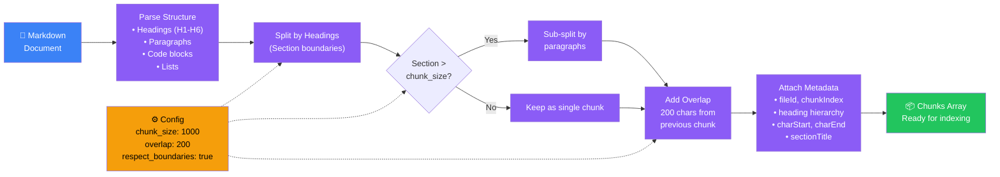
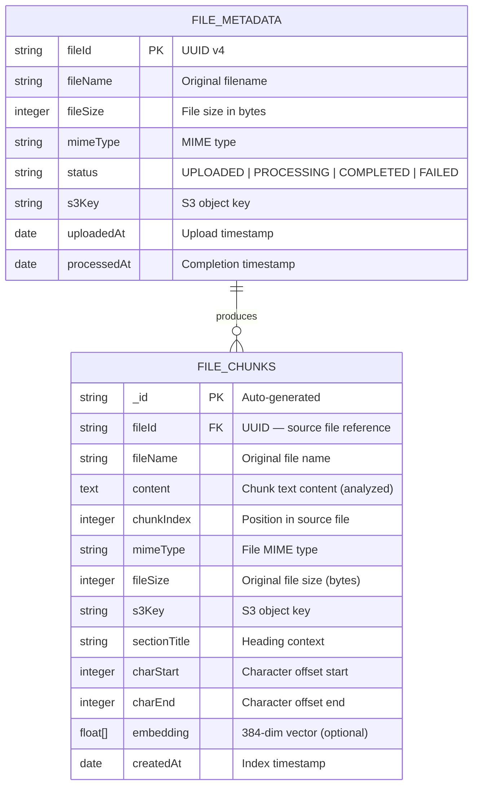

# Data Flow & Processing Pipeline

## End-to-End Data Flow

Toàn bộ luồng dữ liệu từ khi user upload file đến khi có thể search — bao gồm cả happy path và error handling.

```mermaid
flowchart TB
    classDef user fill:#2563eb,color:#fff,stroke:#1e40af
    classDef api fill:#7c3aed,color:#fff,stroke:#5b21b6
    classDef aws fill:#f59e0b,color:#000,stroke:#d97706
    classDef lambda fill:#db2777,color:#fff,stroke:#9d174d
    classDef search fill:#059669,color:#fff,stroke:#047857
    classDef error fill:#dc2626,color:#fff,stroke:#b91c1c
    classDef decision fill:#6366f1,color:#fff,stroke:#4f46e5

    START([👤 User]) -->|"multipart/form-data"| UPLOAD["POST /files/upload"]
    
    UPLOAD --> VALIDATE{"Validate File<br/>• Type check<br/>• Size ≤ 500MB"}
    VALIDATE -->|"❌ Invalid"| REJECT["400 Bad Request"]:::error
    VALIDATE -->|"✅ Valid"| GEN_ID["Generate UUID v4<br/>fileId"]
    
    GEN_ID --> S3_UP["S3: PutObject<br/>Key: uploads/{fileId}/{fileName}"]
    S3_UP --> SAVE_META["InMemoryRepo: save()<br/>status: UPLOADED"]
    SAVE_META --> SQS_SEND["SQS: SendMessage<br/>{fileId, s3Key, fileName,<br/>fileSize, mimeType}"]
    SQS_SEND --> RESPONSE["201 Created<br/>{fileId, status: UPLOADED}"]
    
    RESPONSE -->|"Client polls status"| STATUS_CHECK["GET /files/:id/status"]
    
    SQS_SEND -.->|"Event Source Mapping<br/>batch size: 5"| LAMBDA_INVOKE["⚡ Lambda Invoked"]
    
    subgraph LAMBDA_PROCESS["Lambda Processing Pipeline"]
        direction TB
        LAMBDA_INVOKE --> CHECK_CACHE{"Check /tmp<br/>Cache?"}
        CHECK_CACHE -->|"Cache HIT"| USE_CACHE["Use cached file"]
        CHECK_CACHE -->|"Cache MISS"| S3_DOWN["S3: GetObject<br/>Download file"]
        S3_DOWN --> WRITE_CACHE["Write to /tmp cache"]
        WRITE_CACHE --> USE_CACHE
        
        USE_CACHE --> DETECT_TYPE{"Detect File Type"}
        DETECT_TYPE -->|"Markdown (.md)"| MD_CHUNK["Heading-Aware Chunker<br/>• Split by # headings<br/>• Respect paragraphs<br/>• chunk_size: 1000 chars<br/>• overlap: 200 chars"]
        DETECT_TYPE -->|"Binary / Other"| BYTE_CHUNK["Byte Chunker<br/>• Fixed 5MB chunks<br/>• Base64 encode"]
        
        MD_CHUNK --> EMBED_CHECK{"AI Embeddings<br/>Enabled?"}
        BYTE_CHUNK --> EMBED_CHECK
        
        EMBED_CHECK -->|"Yes"| GEN_EMBED["Generate Embeddings<br/>(vector: 384 dims)"]
        EMBED_CHECK -->|"No"| PREP_BULK["Prepare Bulk Payload"]
        GEN_EMBED --> PREP_BULK
        
        PREP_BULK --> ES_BULK["Elasticsearch: Bulk Index<br/>Index: file-chunks<br/>• content<br/>• metadata<br/>• embedding (optional)"]
    end
    
    ES_BULK --> INDEX_OK{"Index<br/>Success?"}
    INDEX_OK -->|"✅"| DONE["✅ Processing Complete<br/>SQS: Delete Message"]
    INDEX_OK -->|"❌"| RETRY{"Retry<br/>Count < 3?"}
    RETRY -->|"Yes"| ES_BULK
    RETRY -->|"No"| DLQ["Move to DLQ<br/>(Dead Letter Queue)"]:::error

    %% Search Flow
    subgraph SEARCH_FLOW["Search Pipeline"]
        direction TB
        SEARCH_START([👤 User]) -->|"GET /files/search?text=query"| PARSE_QUERY["Parse Search Query"]
        PARSE_QUERY --> SEARCH_TYPE{"Search Type"}
        SEARCH_TYPE -->|"text only"| FTS["Full-Text Search<br/>multi_match: content, fileName"]
        SEARCH_TYPE -->|"semantic"| VECTOR["Vector Search (kNN)<br/>cosine similarity"]
        SEARCH_TYPE -->|"hybrid"| HYBRID["Hybrid Search<br/>RRF: text + vector"]
        FTS --> ES_QUERY["Elasticsearch Query"]
        VECTOR --> ES_QUERY
        HYBRID --> ES_QUERY
        ES_QUERY --> FORMAT["Format Results<br/>• highlights<br/>• pagination<br/>• scores"]
        FORMAT --> SEARCH_RESP["200 OK<br/>{results, total, page}"]
    end

    class START,SEARCH_START user
    class UPLOAD,GEN_ID,SAVE_META,RESPONSE,STATUS_CHECK api
    class S3_UP,SQS_SEND,S3_DOWN aws
    class LAMBDA_INVOKE,CHECK_CACHE,USE_CACHE,WRITE_CACHE,MD_CHUNK,BYTE_CHUNK,GEN_EMBED,PREP_BULK lambda
    class ES_BULK,FTS,VECTOR,HYBRID,ES_QUERY search
    class VALIDATE,DETECT_TYPE,EMBED_CHECK,INDEX_OK,RETRY,SEARCH_TYPE decision
```

---

## Markdown Chunking Strategy Detail

---

## Elasticsearch Index Schema

