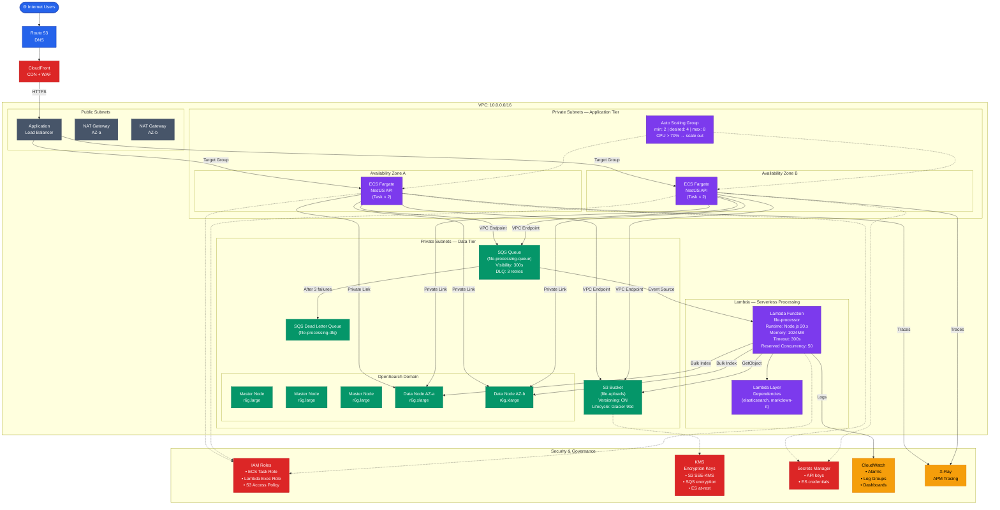
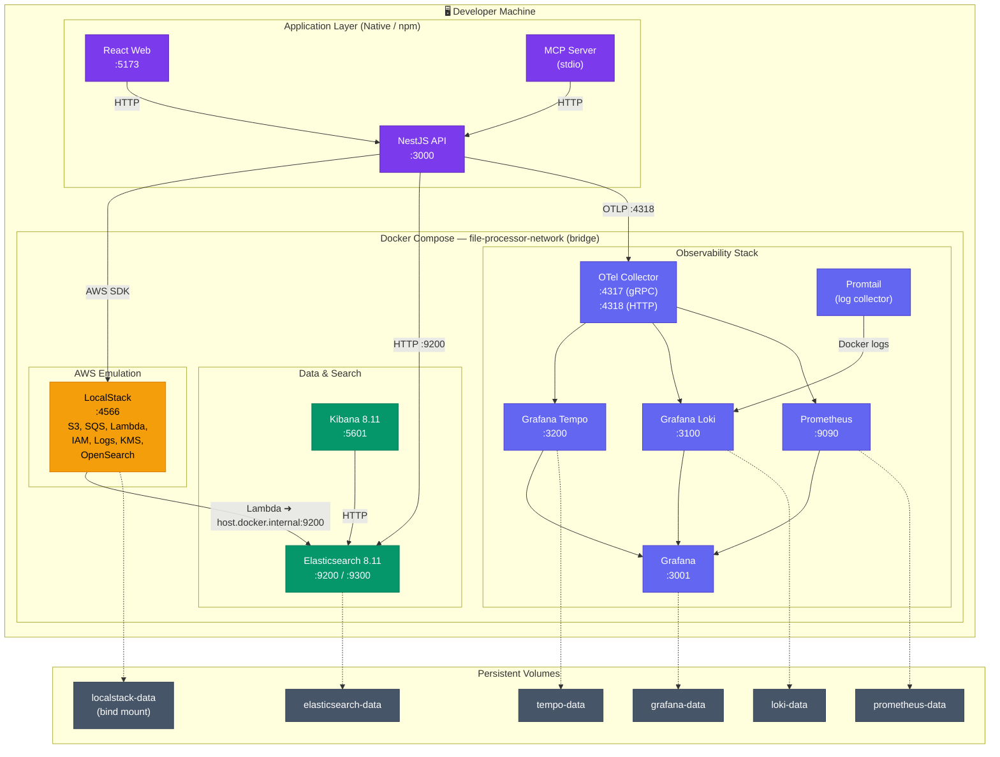
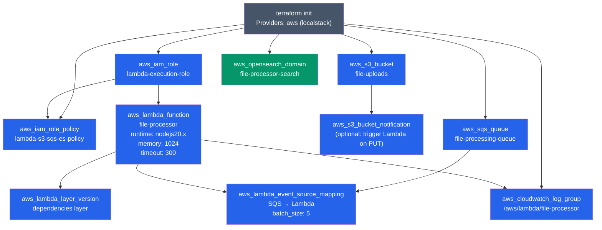

# Infrastructure & Cloud Architecture

## Production AWS Architecture (Multi-AZ)

```mermaid
graph TB
    classDef internet fill:#2563eb,color:#fff,stroke:#1e40af
    classDef security fill:#dc2626,color:#fff,stroke:#b91c1c
    classDef compute fill:#7c3aed,color:#fff,stroke:#5b21b6
    classDef storage fill:#059669,color:#fff,stroke:#047857
    classDef network fill:#475569,color:#fff,stroke:#334155
    classDef monitoring fill:#f59e0b,color:#000,stroke:#d97706

    USERS([🌐 Internet Users]):::internet
    DNS["Route 53<br/>DNS"]:::internet
    CDN["CloudFront<br/>CDN + WAF"]:::security
    
    USERS --> DNS --> CDN

    subgraph VPC["VPC: 10.0.0.0/16"]
        direction TB
        
        subgraph PUBLIC["Public Subnets"]
            direction LR
            ALB["Application<br/>Load Balancer"]:::network
            NAT_A["NAT Gateway<br/>AZ-a"]:::network
            NAT_B["NAT Gateway<br/>AZ-b"]:::network
        end

        subgraph PRIVATE_APP["Private Subnets — Application Tier"]
            direction LR
            subgraph AZ_A["Availability Zone A"]
                ECS_A["ECS Fargate<br/>NestJS API<br/>(Task × 2)"]:::compute
            end
            subgraph AZ_B["Availability Zone B"]
                ECS_B["ECS Fargate<br/>NestJS API<br/>(Task × 2)"]:::compute
            end
            ASG["Auto Scaling Group<br/>min: 2 | desired: 4 | max: 8<br/>CPU > 70% → scale out"]:::compute
        end

        subgraph PRIVATE_DATA["Private Subnets — Data Tier"]
            direction LR
            S3["S3 Bucket<br/>(file-uploads)<br/>Versioning: ON<br/>Lifecycle: Glacier 90d"]:::storage
            SQS["SQS Queue<br/>(file-processing-queue)<br/>Visibility: 300s<br/>DLQ: 3 retries"]:::storage
            DLQ["SQS Dead Letter Queue<br/>(file-processing-dlq)"]:::storage
            
            subgraph ES_CLUSTER["OpenSearch Domain"]
                ES_M1["Master Node<br/>r6g.large"]:::storage
                ES_M2["Master Node<br/>r6g.large"]:::storage
                ES_M3["Master Node<br/>r6g.large"]:::storage
                ES_D1["Data Node AZ-a<br/>r6g.xlarge"]:::storage
                ES_D2["Data Node AZ-b<br/>r6g.xlarge"]:::storage
            end
        end

        subgraph LAMBDA_TIER["Lambda — Serverless Processing"]
            LAMBDA["Lambda Function<br/>file-processor<br/>Runtime: Node.js 20.x<br/>Memory: 1024MB<br/>Timeout: 300s<br/>Reserved Concurrency: 50"]:::compute
            LAYER["Lambda Layer<br/>Dependencies<br/>(elasticsearch, markdown-it)"]:::compute
        end
    end

    subgraph GOVERNANCE["Security & Governance"]
        direction LR
        IAM["IAM Roles<br/>• ECS Task Role<br/>• Lambda Exec Role<br/>• S3 Access Policy"]:::security
        KMS["KMS<br/>Encryption Keys<br/>• S3 SSE-KMS<br/>• SQS encryption<br/>• ES at-rest"]:::security
        SM["Secrets Manager<br/>• API keys<br/>• ES credentials"]:::security
        CW["CloudWatch<br/>• Alarms<br/>• Log Groups<br/>• Dashboards"]:::monitoring
        XRAY["X-Ray<br/>APM Tracing"]:::monitoring
    end

    CDN -->|"HTTPS"| ALB
    ALB -->|"Target Group"| ECS_A & ECS_B
    ASG -.-> ECS_A & ECS_B
    ECS_A & ECS_B -->|"VPC Endpoint"| S3
    ECS_A & ECS_B -->|"VPC Endpoint"| SQS
    ECS_A & ECS_B -->|"Private Link"| ES_D1 & ES_D2
    SQS -->|"Event Source"| LAMBDA
    SQS -->|"After 3 failures"| DLQ
    LAMBDA --> LAYER
    LAMBDA -->|"GetObject"| S3
    LAMBDA -->|"Bulk Index"| ES_D1 & ES_D2
    LAMBDA -->|"Logs"| CW
    
    ECS_A & ECS_B -.-> IAM
    LAMBDA -.-> IAM
    S3 -.-> KMS
    ECS_A & ECS_B -.-> SM
    ECS_A & ECS_B -->|"Traces"| XRAY
```

---

## Local Development Infrastructure (Docker Compose)

```mermaid
graph TB
    classDef app fill:#7c3aed,color:#fff,stroke:#5b21b6
    classDef aws fill:#f59e0b,color:#000,stroke:#d97706
    classDef data fill:#059669,color:#fff,stroke:#047857
    classDef obs fill:#6366f1,color:#fff,stroke:#4338ca
    classDef network fill:#475569,color:#fff,stroke:#334155

    subgraph HOST["🖥️ Developer Machine"]
        direction TB
        
        subgraph APPS["Application Layer (Native / npm)"]
            direction LR
            WEB["React Web<br/>:5173"]:::app
            API["NestJS API<br/>:3000"]:::app
            MCP["MCP Server<br/>(stdio)"]:::app
        end

        subgraph DOCKER["Docker Compose — file-processor-network (bridge)"]
            direction TB
            
            subgraph AWS_EMU["AWS Emulation"]
                LS["LocalStack<br/>:4566<br/>S3, SQS, Lambda,<br/>IAM, Logs, KMS,<br/>OpenSearch"]:::aws
            end
            
            subgraph DATA_LAYER["Data & Search"]
                ES["Elasticsearch 8.11<br/>:9200 / :9300"]:::data
                KIBANA["Kibana 8.11<br/>:5601"]:::data
            end
            
            subgraph OBS_STACK["Observability Stack"]
                OTEL["OTel Collector<br/>:4317 (gRPC)<br/>:4318 (HTTP)"]:::obs
                TEMPO["Grafana Tempo<br/>:3200"]:::obs
                LOKI["Grafana Loki<br/>:3100"]:::obs
                PROM["Prometheus<br/>:9090"]:::obs
                GRAFANA["Grafana<br/>:3001"]:::obs
                PROMTAIL["Promtail<br/>(log collector)"]:::obs
            end
        end
    end

    WEB -->|"HTTP"| API
    MCP -->|"HTTP"| API
    API -->|"AWS SDK"| LS
    API -->|"HTTP :9200"| ES
    API -->|"OTLP :4318"| OTEL
    
    LS -->|"Lambda ➜ host.docker.internal:9200"| ES
    KIBANA -->|"HTTP"| ES
    
    OTEL --> TEMPO
    OTEL --> LOKI
    OTEL --> PROM
    PROMTAIL -->|"Docker logs"| LOKI
    TEMPO --> GRAFANA
    LOKI --> GRAFANA
    PROM --> GRAFANA

    subgraph VOLUMES["Persistent Volumes"]
        direction LR
        V1["elasticsearch-data"]:::network
        V2["tempo-data"]:::network
        V3["loki-data"]:::network
        V4["prometheus-data"]:::network
        V5["grafana-data"]:::network
        V6["localstack-data<br/>(bind mount)"]:::network
    end
    
    ES -.-> V1
    TEMPO -.-> V2
    LOKI -.-> V3
    PROM -.-> V4
    GRAFANA -.-> V5
    LS -.-> V6
```

---

## Terraform Resource Dependency Graph

```mermaid
graph TB
    classDef provider fill:#7c3aed,color:#fff
    classDef resource fill:#2563eb,color:#fff
    classDef data fill:#059669,color:#fff

    TF_INIT["terraform init<br/>Providers: aws (localstack)"]:::provider
    
    TF_INIT --> IAM_ROLE["aws_iam_role<br/>lambda-execution-role"]:::resource
    TF_INIT --> IAM_POLICY["aws_iam_role_policy<br/>lambda-s3-sqs-es-policy"]:::resource
    IAM_ROLE --> IAM_POLICY

    TF_INIT --> S3["aws_s3_bucket<br/>file-uploads"]:::resource
    TF_INIT --> SQS["aws_sqs_queue<br/>file-processing-queue"]:::resource
    
    S3 --> S3_NOTIF["aws_s3_bucket_notification<br/>(optional: trigger Lambda on PUT)"]:::resource
    
    IAM_ROLE --> LAMBDA["aws_lambda_function<br/>file-processor<br/>runtime: nodejs20.x<br/>memory: 1024<br/>timeout: 300"]:::resource
    
    SQS --> EVENT_MAP["aws_lambda_event_source_mapping<br/>SQS → Lambda<br/>batch_size: 5"]:::resource
    LAMBDA --> EVENT_MAP
    
    LAMBDA --> LAMBDA_LAYER["aws_lambda_layer_version<br/>dependencies layer"]:::resource
    
    TF_INIT --> CW_LOG["aws_cloudwatch_log_group<br/>/aws/lambda/file-processor"]:::resource
    LAMBDA --> CW_LOG

    TF_INIT --> OS_DOMAIN["aws_opensearch_domain<br/>file-processor-search"]:::data
    
    style TF_INIT fill:#475569,color:#fff
```
