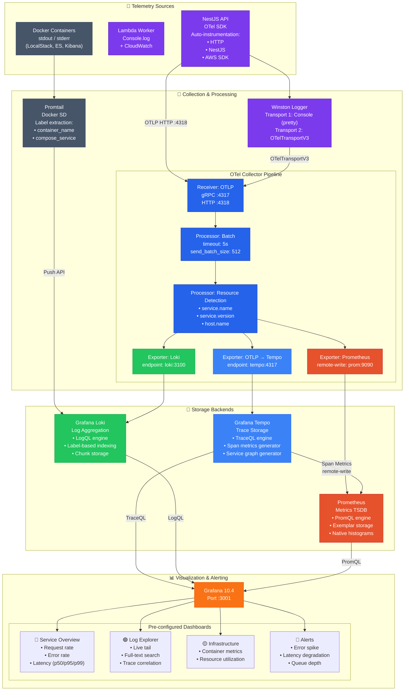
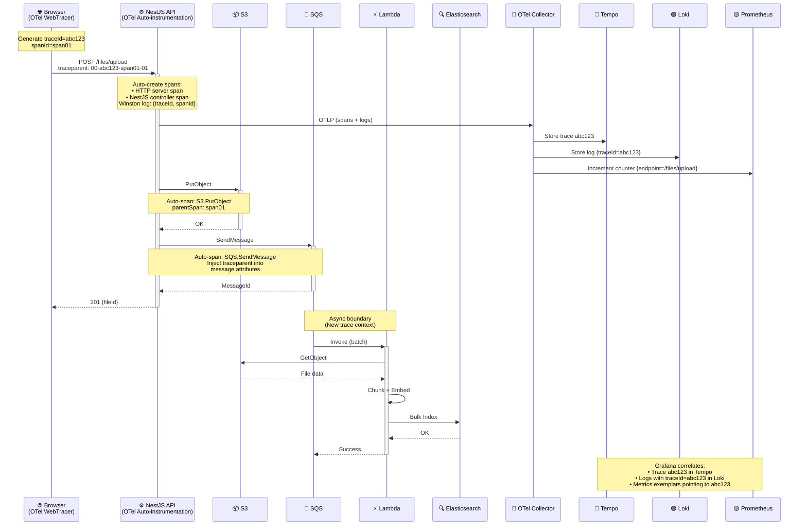
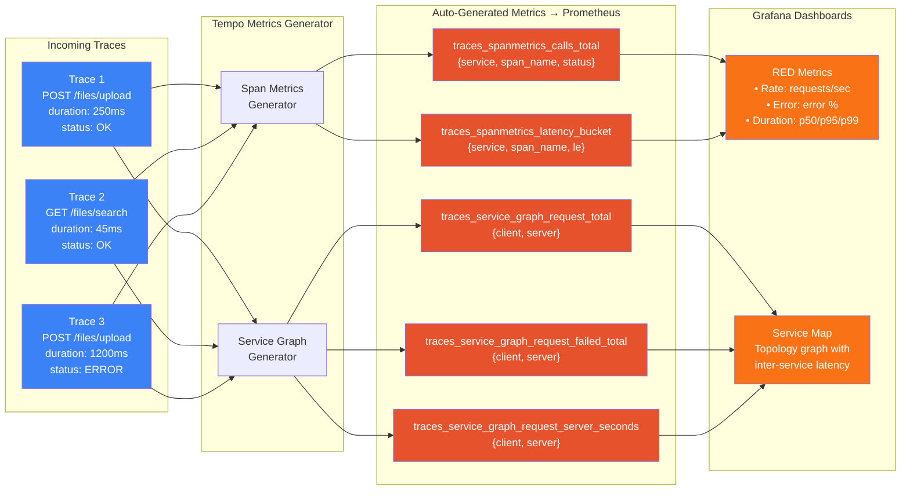
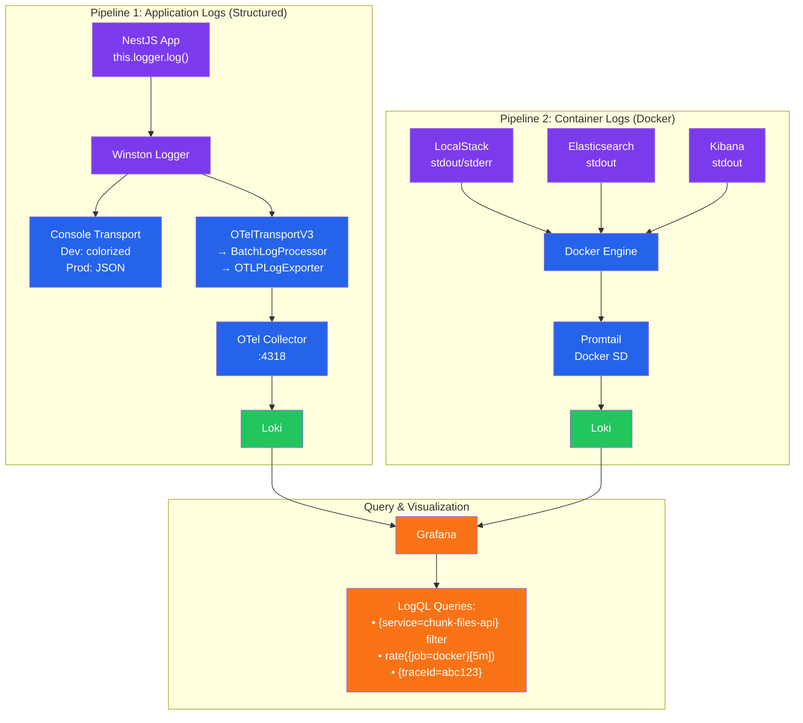
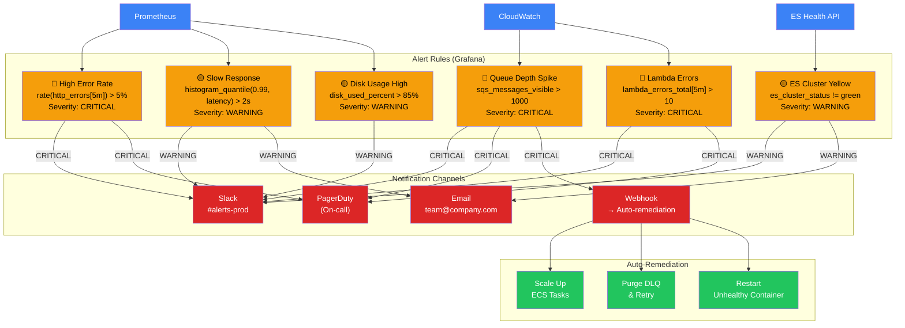

# Observability & Monitoring Architecture

## Three Pillars of Observability

Thiết kế observability theo mô hình enterprise: **Traces → Metrics → Logs** với correlation đầy đủ qua `traceId` và `spanId`.

---

## Trace Correlation Flow

Minh họa cách `traceId` được propagate xuyên suốt hệ thống và correlate giữa traces, logs, metrics.

---

## Tempo Span Metrics Generation

---

## Logging Pipeline Detail

---

## Alerting Architecture

