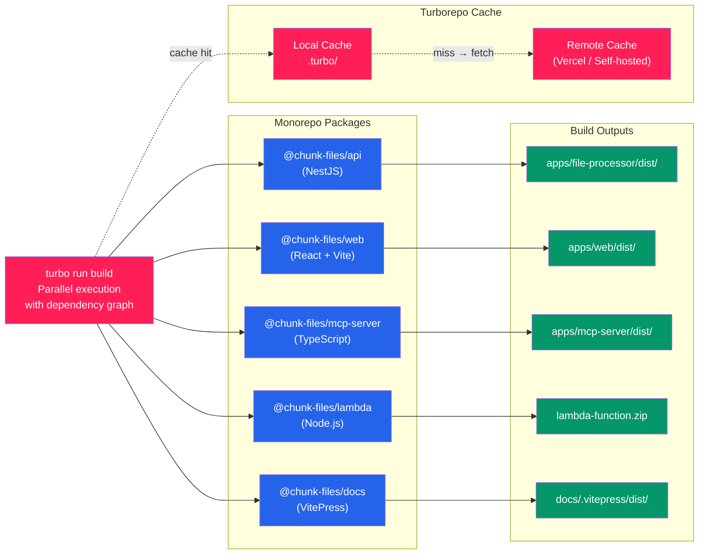
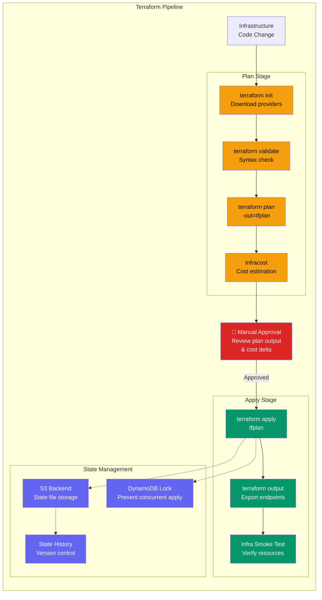
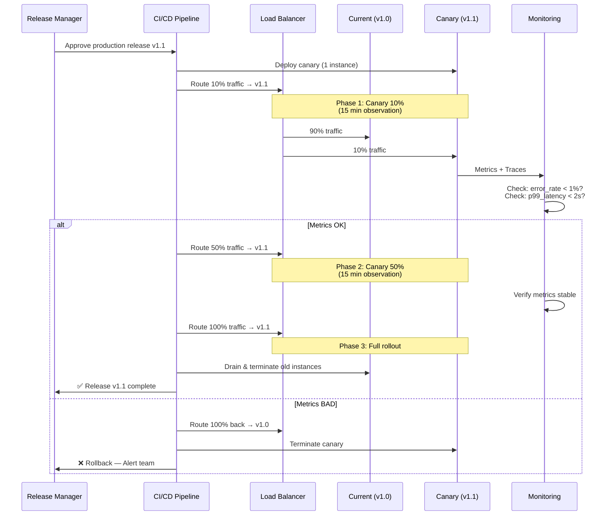

# CI/CD Pipeline Architecture

## GitOps Workflow — Enterprise CI/CD

```mermaid
flowchart TB
    classDef dev fill:#2563eb,color:#fff,stroke:#1e40af
    classDef ci fill:#7c3aed,color:#fff,stroke:#5b21b6
    classDef test fill:#f59e0b,color:#000,stroke:#d97706
    classDef build fill:#db2777,color:#fff,stroke:#9d174d
    classDef deploy fill:#059669,color:#fff,stroke:#047857
    classDef env fill:#475569,color:#fff,stroke:#334155
    classDef gate fill:#dc2626,color:#fff,stroke:#b91c1c

    subgraph DEV["👨‍💻 Development"]
        direction LR
        CODE["Developer<br/>Push Code"]:::dev
        PR["Pull Request<br/>Created"]:::dev
        REVIEW["Code Review<br/>+ Approval"]:::dev
    end

    subgraph CI_PIPELINE["🔄 CI Pipeline (GitHub Actions)"]
        direction TB
        
        subgraph LINT_STAGE["Stage 1: Lint & Format"]
            direction LR
            LINT["ESLint<br/>TypeScript"]:::ci
            FORMAT["Prettier<br/>Format Check"]:::ci
            TYPE["TypeCheck<br/>tsc --noEmit"]:::ci
        end

        subgraph TEST_STAGE["Stage 2: Test"]
            direction LR
            UNIT["Unit Tests<br/>(Jest / Vitest)"]:::test
            INT["Integration Tests<br/>(Testcontainers)"]:::test
            E2E["E2E Tests<br/>(Playwright)"]:::test
            COV["Coverage Report<br/>≥ 80% required"]:::test
        end

        subgraph BUILD_STAGE["Stage 3: Build"]
            direction LR
            BUILD_API["Build API<br/>(NestJS)"]:::build
            BUILD_WEB["Build Web<br/>(Vite)"]:::build
            BUILD_MCP["Build MCP<br/>(TypeScript)"]:::build
            BUILD_LAMBDA["Package Lambda<br/>(zip bundle)"]:::build
            BUILD_DOCS["Build Docs<br/>(VitePress)"]:::build
        end

        subgraph SECURITY_STAGE["Stage 4: Security"]
            direction LR
            SAST["SAST Scan<br/>(SonarQube)"]:::gate
            DEPS["Dependency Audit<br/>(npm audit)"]:::gate
            SECRET["Secret Scan<br/>(gitleaks)"]:::gate
            CONTAINER["Container Scan<br/>(Trivy)"]:::gate
        end

        subgraph ARTIFACT_STAGE["Stage 5: Artifacts"]
            direction LR
            DOCKER_IMG["Docker Image<br/>→ ECR"]:::build
            LAMBDA_ZIP["Lambda Bundle<br/>→ S3"]:::build
            WEB_ASSETS["Web Assets<br/>→ S3 + CloudFront"]:::build
        end
    end

    subgraph CD_PIPELINE["🚀 CD Pipeline"]
        direction TB
        
        subgraph DEV_ENV["Development"]
            DEV_DEPLOY["Deploy to Dev<br/>(Auto on main merge)"]:::deploy
            DEV_SMOKE["Smoke Tests"]:::test
        end

        subgraph STAGING_ENV["Staging"]
            STAGE_GATE["Manual Gate<br/>QA Approval"]:::gate
            STAGE_DEPLOY["Deploy to Staging<br/>(Blue/Green)"]:::deploy
            STAGE_PERF["Performance Tests<br/>(k6 load test)"]:::test
            STAGE_CHAOS["Chaos Testing<br/>(Chaos Monkey)"]:::test
        end

        subgraph PROD_ENV["Production"]
            PROD_GATE["Manual Gate<br/>Release Manager"]:::gate
            PROD_DEPLOY["Deploy to Production<br/>(Canary 10% → 50% → 100%)"]:::deploy
            PROD_MONITOR["Health Monitor<br/>(Auto-rollback if error > 1%)"]:::deploy
        end
    end

    CODE --> PR --> REVIEW
    REVIEW -->|"Approved"| LINT_STAGE
    LINT_STAGE --> TEST_STAGE --> BUILD_STAGE --> SECURITY_STAGE --> ARTIFACT_STAGE
    
    ARTIFACT_STAGE --> DEV_DEPLOY --> DEV_SMOKE
    DEV_SMOKE -->|"✅ Pass"| STAGE_GATE
    STAGE_GATE -->|"Approved"| STAGE_DEPLOY --> STAGE_PERF & STAGE_CHAOS
    STAGE_PERF & STAGE_CHAOS -->|"✅ Pass"| PROD_GATE
    PROD_GATE -->|"Approved"| PROD_DEPLOY --> PROD_MONITOR
```

---

## Monorepo Build Pipeline (Turborepo)

---

## Infrastructure as Code Pipeline

---

## Release Strategy — Canary Deployment

