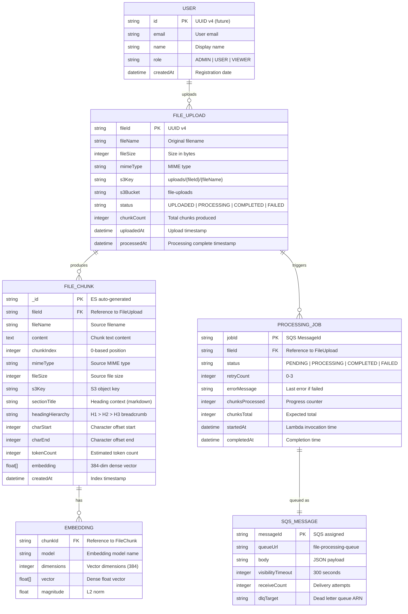
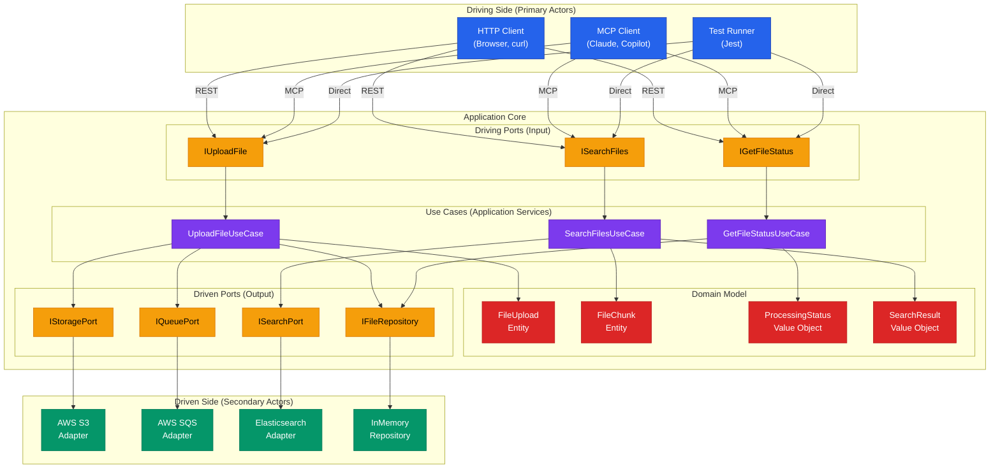
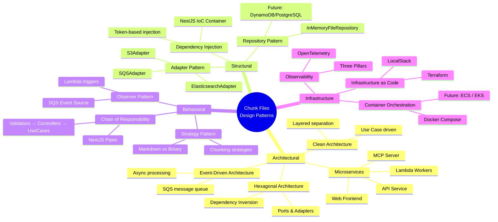
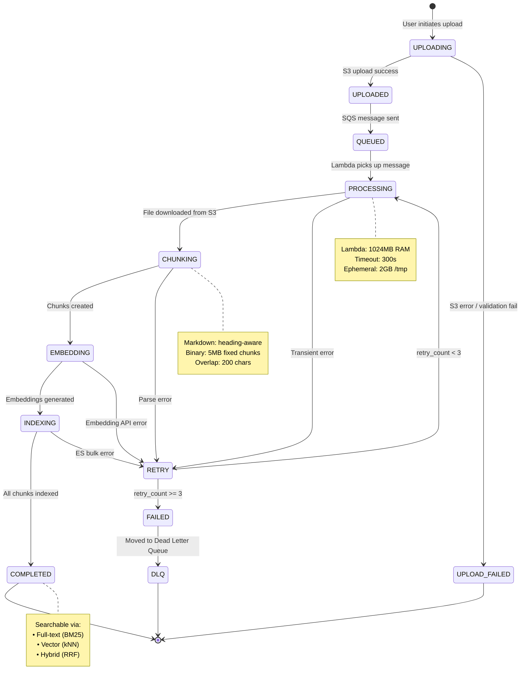

# Domain Model & Design Patterns

## Domain Entity Relationship Diagram

```mermaid
erDiagram
    USER ||--o{ FILE_UPLOAD : "uploads"
    FILE_UPLOAD ||--o{ FILE_CHUNK : "produces"
    FILE_UPLOAD ||--o{ PROCESSING_JOB : "triggers"
    FILE_CHUNK ||--o{ EMBEDDING : "has"
    PROCESSING_JOB ||--|| SQS_MESSAGE : "queued as"
    
    USER {
        string id PK "UUID v4 (future)"
        string email "User email"
        string name "Display name"
        string role "ADMIN | USER | VIEWER"
        datetime createdAt "Registration date"
    }
    
    FILE_UPLOAD {
        string fileId PK "UUID v4"
        string fileName "Original filename"
        integer fileSize "Size in bytes"
        string mimeType "MIME type"
        string s3Key "uploads/{fileId}/{fileName}"
        string s3Bucket "file-uploads"
        string status "UPLOADED | PROCESSING | COMPLETED | FAILED"
        integer chunkCount "Total chunks produced"
        datetime uploadedAt "Upload timestamp"
        datetime processedAt "Processing complete timestamp"
    }

    FILE_CHUNK {
        string _id PK "ES auto-generated"
        string fileId FK "Reference to FileUpload"
        string fileName "Source filename"
        text content "Chunk text content"
        integer chunkIndex "0-based position"
        string mimeType "Source MIME type"
        integer fileSize "Source file size"
        string s3Key "S3 object key"
        string sectionTitle "Heading context (markdown)"
        string headingHierarchy "H1 > H2 > H3 breadcrumb"
        integer charStart "Character offset start"
        integer charEnd "Character offset end"
        integer tokenCount "Estimated token count"
        float[] embedding "384-dim dense vector"
        datetime createdAt "Index timestamp"
    }

    EMBEDDING {
        string chunkId FK "Reference to FileChunk"
        string model "Embedding model name"
        integer dimensions "Vector dimensions (384)"
        float[] vector "Dense float vector"
        float magnitude "L2 norm"
    }

    PROCESSING_JOB {
        string jobId PK "SQS MessageId"
        string fileId FK "Reference to FileUpload"
        string status "PENDING | PROCESSING | COMPLETED | FAILED"
        integer retryCount "0-3"
        string errorMessage "Last error if failed"
        integer chunksProcessed "Progress counter"
        integer chunksTotal "Expected total"
        datetime startedAt "Lambda invocation time"
        datetime completedAt "Completion time"
    }

    SQS_MESSAGE {
        string messageId PK "SQS assigned"
        string queueUrl "file-processing-queue"
        string body "JSON payload"
        integer visibilityTimeout "300 seconds"
        integer receiveCount "Delivery attempts"
        string dlqTarget "Dead letter queue ARN"
    }
```

---

## Hexagonal Architecture Pattern

```mermaid
graph TB
    classDef external fill:#2563eb,color:#fff,stroke:#1e40af
    classDef port fill:#f59e0b,color:#000,stroke:#d97706
    classDef domain fill:#dc2626,color:#fff,stroke:#b91c1c
    classDef adapter fill:#059669,color:#fff,stroke:#047857
    classDef usecase fill:#7c3aed,color:#fff,stroke:#5b21b6

    subgraph EXTERNAL_LEFT["Driving Side (Primary Actors)"]
        direction TB
        HTTP["HTTP Client<br/>(Browser, curl)"]:::external
        MCP_CLIENT["MCP Client<br/>(Claude, Copilot)"]:::external
        TEST["Test Runner<br/>(Jest)"]:::external
    end

    subgraph HEXAGON["Application Core"]
        direction TB
        
        subgraph DRIVING_PORTS["Driving Ports (Input)"]
            P_UPLOAD["IUploadFile"]:::port
            P_SEARCH["ISearchFiles"]:::port
            P_STATUS["IGetFileStatus"]:::port
        end

        subgraph USE_CASES["Use Cases (Application Services)"]
            UC_UP["UploadFileUseCase"]:::usecase
            UC_SR["SearchFilesUseCase"]:::usecase
            UC_ST["GetFileStatusUseCase"]:::usecase
        end

        subgraph DOMAIN_MODEL["Domain Model"]
            ENT_FILE["FileUpload<br/>Entity"]:::domain
            ENT_CHUNK["FileChunk<br/>Entity"]:::domain
            VO_STATUS["ProcessingStatus<br/>Value Object"]:::domain
            VO_SEARCH["SearchResult<br/>Value Object"]:::domain
        end

        subgraph DRIVEN_PORTS["Driven Ports (Output)"]
            P_STORAGE["IStoragePort"]:::port
            P_QUEUE["IQueuePort"]:::port
            P_SEARCH_OUT["ISearchPort"]:::port
            P_REPO["IFileRepository"]:::port
        end
    end

    subgraph EXTERNAL_RIGHT["Driven Side (Secondary Actors)"]
        direction TB
        S3["AWS S3<br/>Adapter"]:::adapter
        SQS["AWS SQS<br/>Adapter"]:::adapter
        ES["Elasticsearch<br/>Adapter"]:::adapter
        MEMORY["InMemory<br/>Repository"]:::adapter
    end

    HTTP -->|"REST"| P_UPLOAD & P_SEARCH & P_STATUS
    MCP_CLIENT -->|"MCP"| P_UPLOAD & P_SEARCH & P_STATUS
    TEST -->|"Direct"| P_UPLOAD & P_SEARCH & P_STATUS

    P_UPLOAD --> UC_UP
    P_SEARCH --> UC_SR
    P_STATUS --> UC_ST

    UC_UP --> ENT_FILE
    UC_SR --> ENT_CHUNK & VO_SEARCH
    UC_ST --> VO_STATUS

    UC_UP --> P_STORAGE & P_QUEUE & P_REPO
    UC_SR --> P_SEARCH_OUT
    UC_ST --> P_REPO

    P_STORAGE --> S3
    P_QUEUE --> SQS
    P_SEARCH_OUT --> ES
    P_REPO --> MEMORY
```

---

## Design Patterns Used

```mermaid
mindmap
    root((Chunk Files<br/>Design Patterns))
        Architectural
            Hexagonal Architecture
                Ports & Adapters
                Dependency Inversion
            Clean Architecture
                Layered separation
                Use Case driven
            Event-Driven Architecture
                SQS message queue
                Async processing
            Microservices
                API Service
                Lambda Workers
                Web Frontend
                MCP Server
        Structural
            Adapter Pattern
                S3Adapter
                SQSAdapter
                ElasticsearchAdapter
            Repository Pattern
                InMemoryFileRepository
                Future: DynamoDB/PostgreSQL
            Dependency Injection
                NestJS IoC Container
                Token-based injection
        Behavioral
            Strategy Pattern
                Chunking strategies
                Markdown vs Binary
            Observer Pattern
                SQS Event Source
                Lambda triggers
            Chain of Responsibility
                NestJS Pipes
                Validators → Controllers → UseCases
        Infrastructure
            Infrastructure as Code
                Terraform
                LocalStack
            Container Orchestration
                Docker Compose
                Future: ECS / EKS
            Observability
                OpenTelemetry
                Three Pillars
```

---

## State Machine — File Processing Lifecycle

```mermaid
stateDiagram-v2
    [*] --> UPLOADING: User initiates upload
    
    UPLOADING --> UPLOADED: S3 upload success
    UPLOADING --> UPLOAD_FAILED: S3 error / validation fail
    
    UPLOADED --> QUEUED: SQS message sent
    QUEUED --> PROCESSING: Lambda picks up message
    
    PROCESSING --> CHUNKING: File downloaded from S3
    CHUNKING --> EMBEDDING: Chunks created
    EMBEDDING --> INDEXING: Embeddings generated
    INDEXING --> COMPLETED: All chunks indexed
    
    PROCESSING --> RETRY: Transient error
    CHUNKING --> RETRY: Parse error
    EMBEDDING --> RETRY: Embedding API error
    INDEXING --> RETRY: ES bulk error
    
    RETRY --> PROCESSING: retry_count < 3
    RETRY --> FAILED: retry_count >= 3
    FAILED --> DLQ: Moved to Dead Letter Queue
    
    UPLOAD_FAILED --> [*]
    COMPLETED --> [*]
    DLQ --> [*]

    note right of PROCESSING
        Lambda: 1024MB RAM
        Timeout: 300s
        Ephemeral: 2GB /tmp
    end note

    note right of CHUNKING
        Markdown: heading-aware
        Binary: 5MB fixed chunks
        Overlap: 200 chars
    end note

    note right of COMPLETED
        Searchable via:
        • Full-text (BM25)
        • Vector (kNN)
        • Hybrid (RRF)
    end note
```
