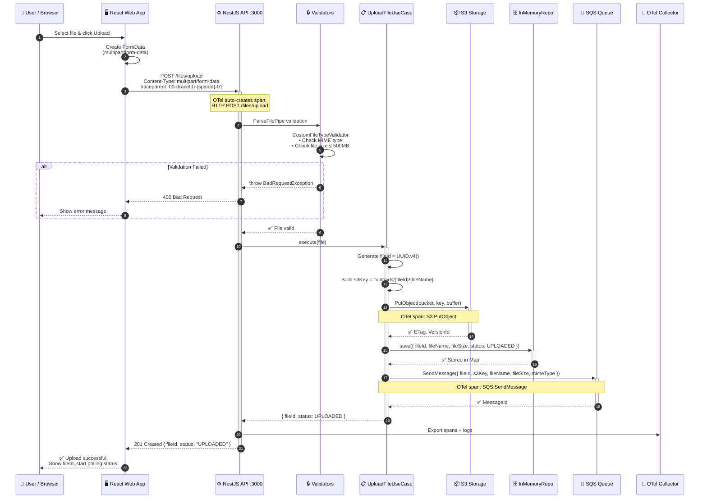
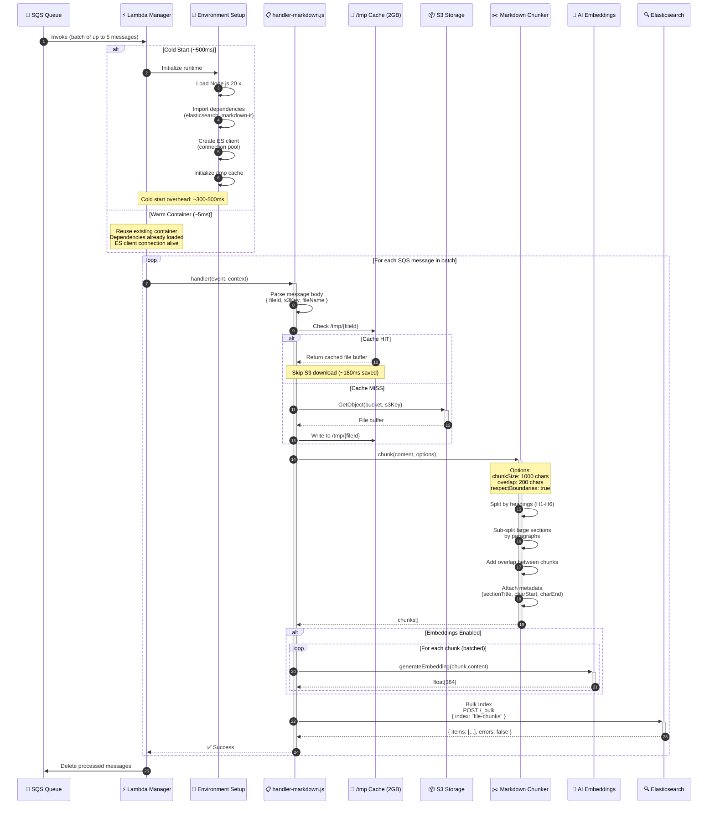
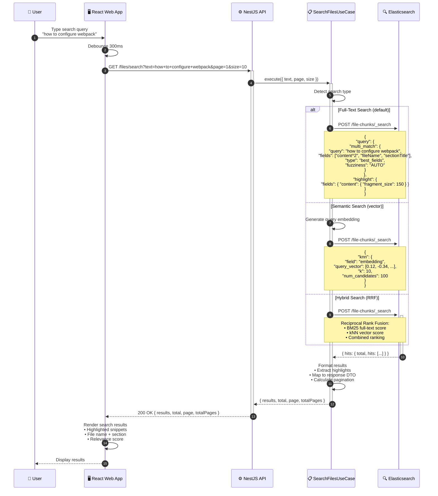
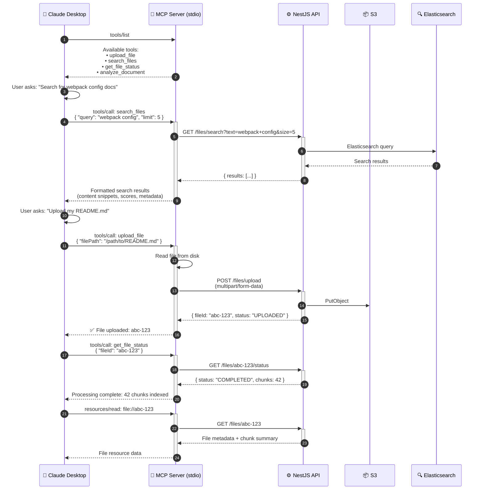
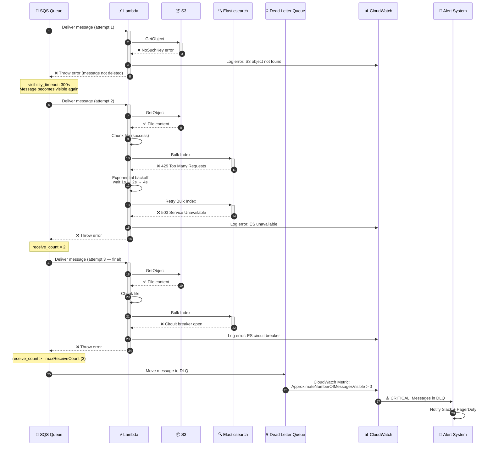

# Sequence Diagrams — Key System Flows

## Flow 1: File Upload (Complete)

---

## Flow 2: Lambda Processing (Cold Start vs Warm)

---

## Flow 3: Search — Full-text, Semantic, Hybrid

---

## Flow 4: MCP Tool Interaction

---

## Flow 5: Error Handling & Retry

