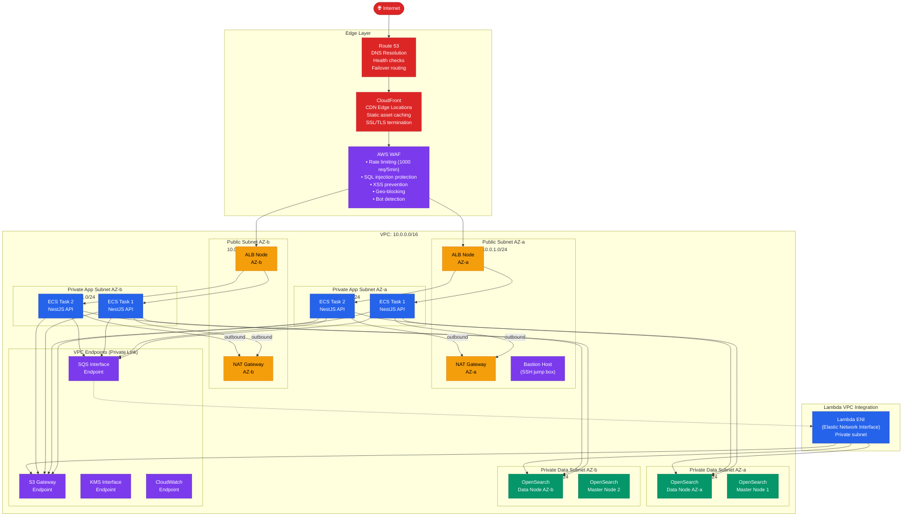
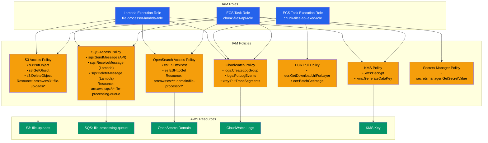
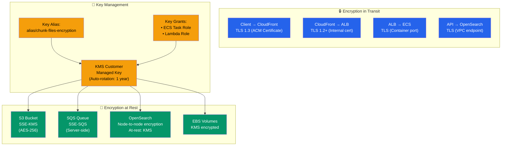

# Network & Security Architecture

## Network Topology — Production

---

## Security Architecture — Defense in Depth

```mermaid
graph TB
    classDef layer1 fill:#dc2626,color:#fff
    classDef layer2 fill:#f59e0b,color:#000
    classDef layer3 fill:#2563eb,color:#fff
    classDef layer4 fill:#059669,color:#fff
    classDef layer5 fill:#7c3aed,color:#fff
    classDef layer6 fill:#475569,color:#fff

    subgraph L1["Layer 1: Perimeter Security"]
        direction LR
        WAF_S["AWS WAF<br/>Web Application Firewall"]:::layer1
        SHIELD["AWS Shield<br/>DDoS Protection"]:::layer1
        CF_S["CloudFront<br/>Edge Security"]:::layer1
        GEO["Geo Restrictions<br/>Allowed regions only"]:::layer1
    end

    subgraph L2["Layer 2: Network Security"]
        direction LR
        VPC_S["VPC Isolation<br/>Private subnets"]:::layer2
        SG["Security Groups<br/>• API: 3000 from ALB only<br/>• ES: 9200 from API SG only<br/>• Lambda: outbound only"]:::layer2
        NACL["Network ACLs<br/>Stateless packet filtering"]:::layer2
        EP["VPC Endpoints<br/>No internet traverse"]:::layer2
    end

    subgraph L3["Layer 3: Identity & Access"]
        direction LR
        IAM_S["IAM Roles<br/>Least-privilege policies"]:::layer3
        STS["STS<br/>Temporary credentials"]:::layer3
        COGNITO["Cognito (Future)<br/>User authentication"]:::layer3
        MFA["MFA<br/>Admin access"]:::layer3
    end

    subgraph L4["Layer 4: Application Security"]
        direction LR
        CORS["CORS Policy<br/>Allowed origins only"]:::layer4
        HELMET["Helmet.js<br/>HTTP security headers"]:::layer4
        RATE["Rate Limiting<br/>Throttle per IP"]:::layer4
        INPUT["Input Validation<br/>NestJS ValidationPipe"]:::layer4
        FILE_VAL["File Validation<br/>Type + Size limits"]:::layer4
    end

    subgraph L5["Layer 5: Data Security"]
        direction LR
        KMS_S["KMS Encryption<br/>• S3: SSE-KMS<br/>• SQS: SSE-SQS<br/>• ES: at-rest encryption"]:::layer5
        TLS["TLS in Transit<br/>HTTPS everywhere"]:::layer5
        SECRETS["Secrets Manager<br/>No hardcoded secrets"]:::layer5
        BACKUP["Backup & Recovery<br/>• S3 versioning<br/>• ES snapshots"]:::layer5
    end

    subgraph L6["Layer 6: Monitoring & Audit"]
        direction LR
        CT["CloudTrail<br/>API audit trail"]:::layer6
        CW_S["CloudWatch<br/>Security alarms"]:::layer6
        GUARD["GuardDuty<br/>Threat detection"]:::layer6
        CONFIG["AWS Config<br/>Compliance checks"]:::layer6
    end

    L1 --> L2 --> L3 --> L4 --> L5 --> L6
```

---

## IAM Role & Policy Architecture

---

## Data Encryption Architecture

