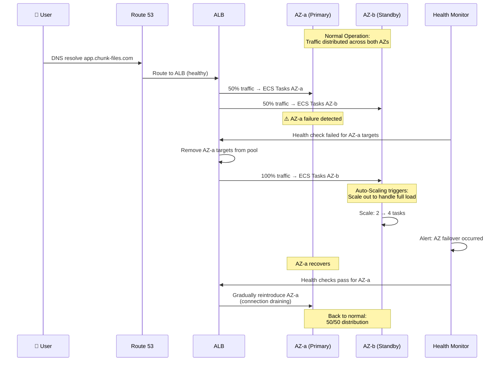
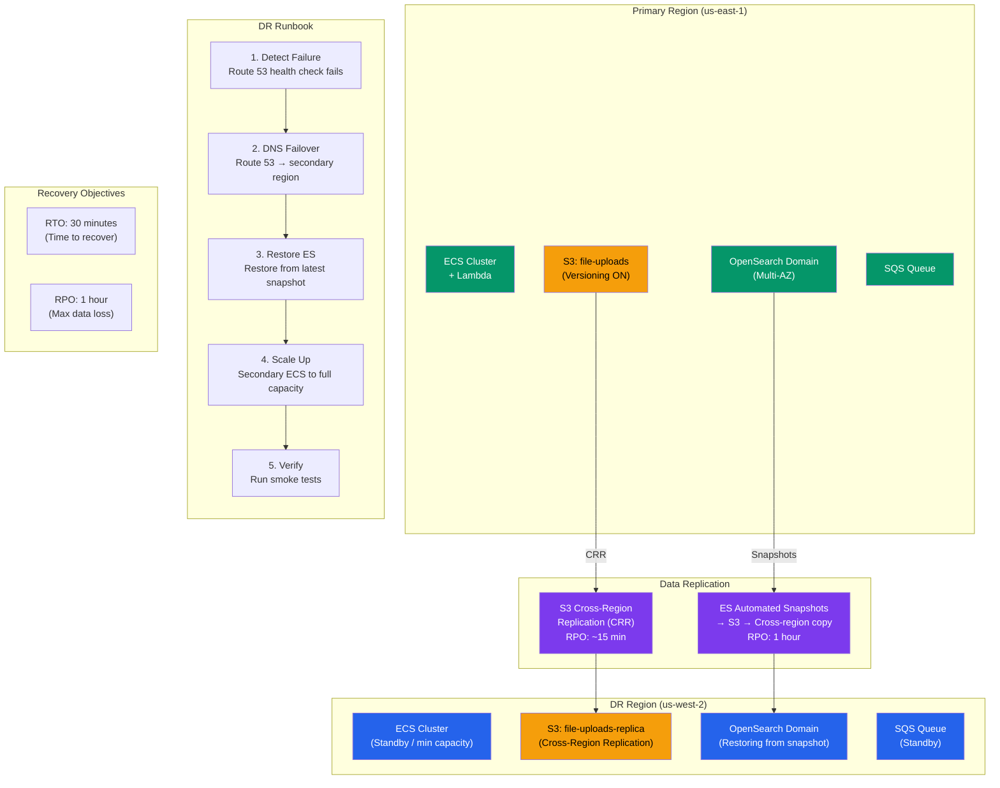
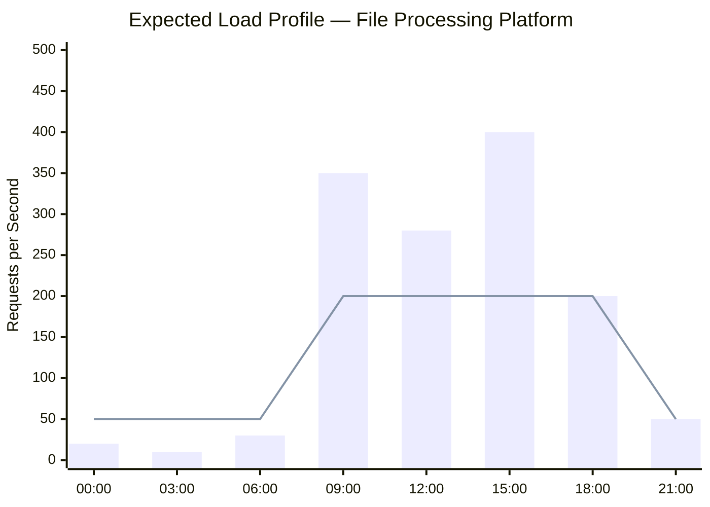
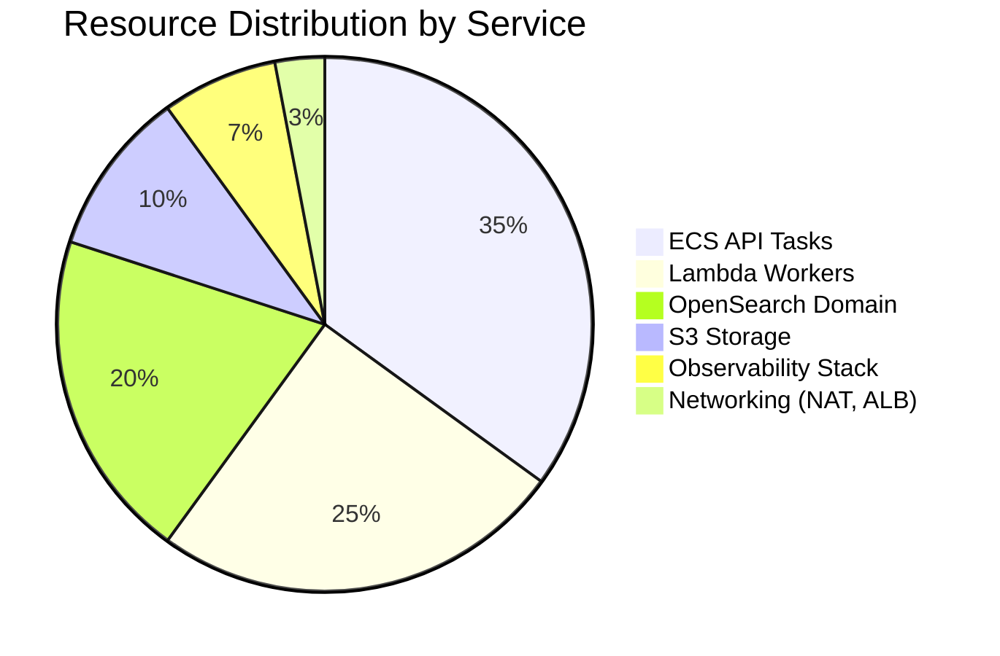
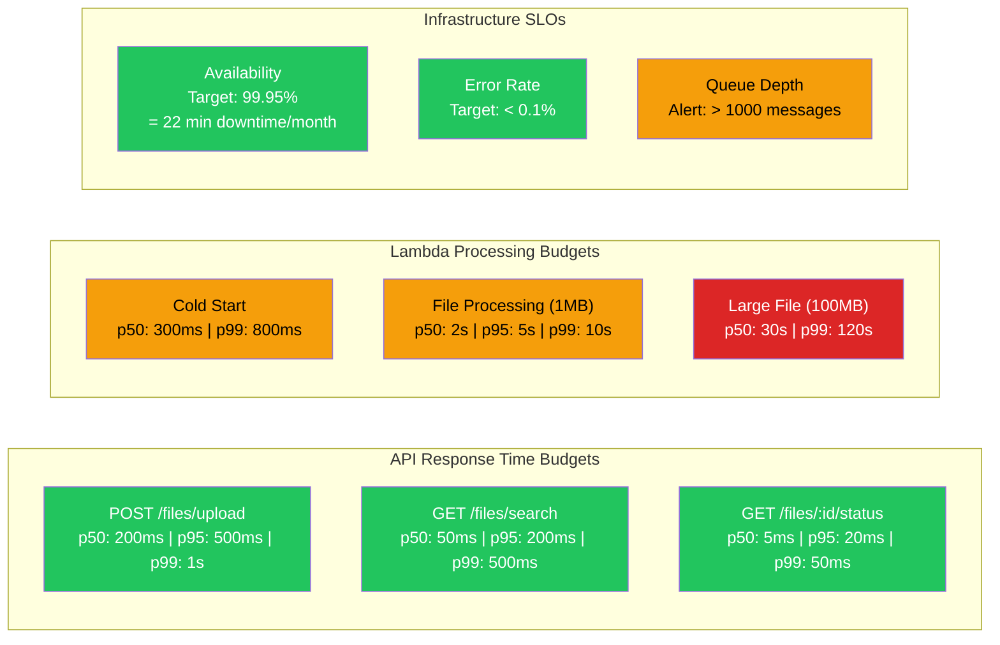

# Scalability & High Availability Architecture

## Auto-Scaling Architecture

```mermaid
graph TB
    classDef trigger fill:#dc2626,color:#fff,stroke:#b91c1c
    classDef scale fill:#2563eb,color:#fff,stroke:#1e40af
    classDef resource fill:#059669,color:#fff,stroke:#047857
    classDef monitor fill:#f59e0b,color:#000,stroke:#d97706

    subgraph SCALING["Auto-Scaling Policies"]
        direction TB
        
        subgraph ECS_SCALING["ECS Service Auto-Scaling"]
            ECS_METRIC["CloudWatch Metrics<br/>• CPUUtilization<br/>• MemoryUtilization<br/>• RequestCountPerTarget"]:::monitor
            ECS_TARGET["Target Tracking Policy<br/>CPU Target: 70%<br/>Scale-in cooldown: 300s<br/>Scale-out cooldown: 60s"]:::trigger
            ECS_STEP["Step Scaling Policy<br/>CPU > 85% → +2 tasks<br/>CPU > 95% → +4 tasks<br/>CPU < 40% → -1 task"]:::trigger
            ECS_TASKS["ECS Tasks<br/>min: 2 | desired: 4 | max: 16"]:::scale
        end

        subgraph LAMBDA_SCALING["Lambda Concurrency"]
            LAMBDA_METRIC["SQS Metrics<br/>• ApproximateNumberOfMessages<br/>• NumberOfMessagesSent"]:::monitor
            LAMBDA_CONC["Concurrency Config<br/>Reserved: 50<br/>Provisioned: 10 (warm)<br/>Burst: 500→1000"]:::trigger
            LAMBDA_BATCH["Batch Config<br/>batch_size: 5<br/>max_batching_window: 10s"]:::scale
        end

        subgraph ES_SCALING["OpenSearch Scaling"]
            ES_METRIC["ES Metrics<br/>• CPUUtilization<br/>• JVMMemoryPressure<br/>• SearchLatency"]:::monitor
            ES_NODES["Node Configuration<br/>Master: 3 × r6g.large<br/>Data: 2-6 × r6g.xlarge<br/>UltraWarm: on-demand"]:::scale
            ES_INDEX["Index Strategy<br/>• Time-based indices<br/>• ILM: hot→warm→cold→delete<br/>• Rollover: 50GB / 7 days"]:::trigger
        end
    end

    ECS_METRIC --> ECS_TARGET & ECS_STEP --> ECS_TASKS
    LAMBDA_METRIC --> LAMBDA_CONC --> LAMBDA_BATCH
    ES_METRIC --> ES_NODES & ES_INDEX
```

---

## High Availability — Multi-AZ Failover

---

## Disaster Recovery Strategy

---

## Load Testing & Capacity Planning

---

## Performance Budgets

