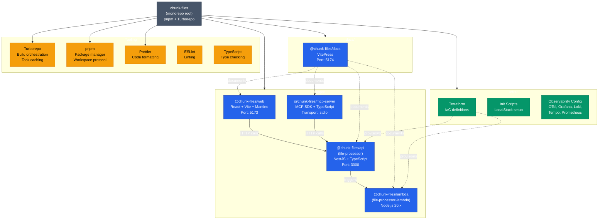
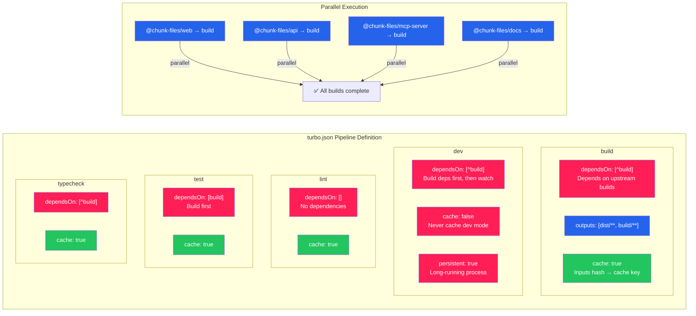
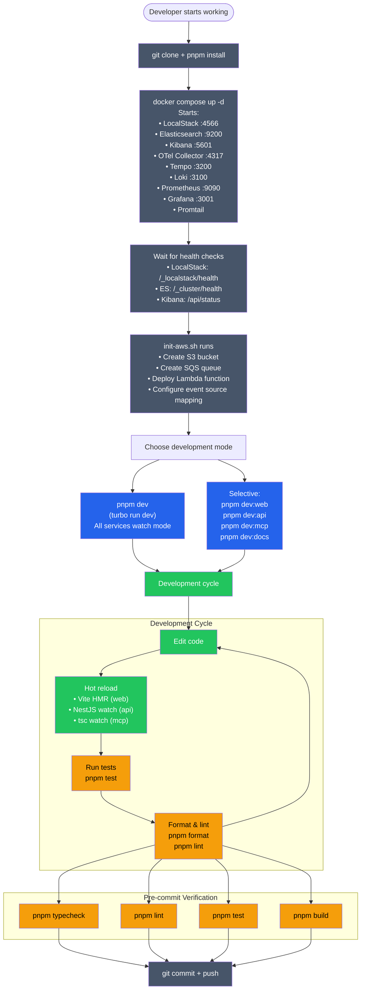
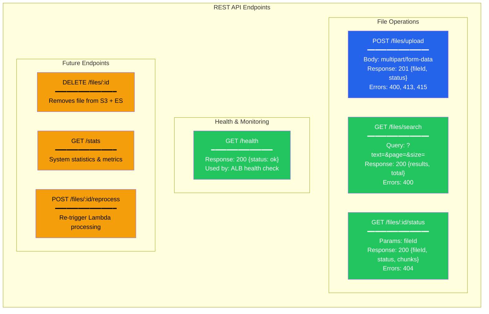

# Developer Experience & Monorepo Architecture

## Monorepo Structure — Package Dependency Graph

---

## Turborepo Task Pipeline

---

## Local Development Workflow

---

## API Design — REST Endpoints

