# 🧬 Cgroups & Namespaces Deep Dive — The Kernel Primitives Behind Containers

> **"Docker is syntactic sugar. Cgroups + Namespaces are the real container."**
> File này đi sâu vào 2 cơ chế kernel quan trọng nhất mà mọi container runtime đều phụ thuộc.

---

## 1. Tổng Quan: 2 Trụ Cột Của Container Isolation

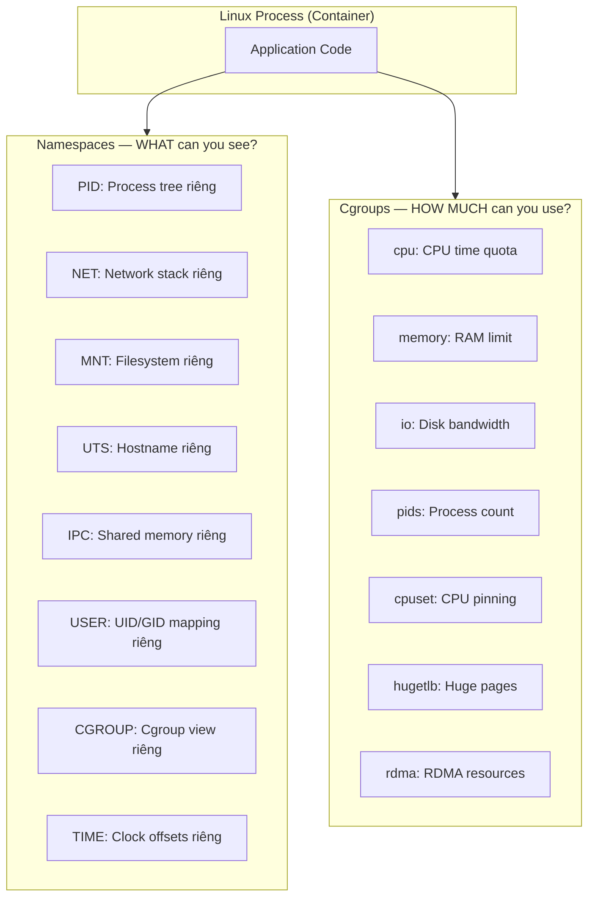

| Cơ chế | Câu hỏi trả lời | Ví dụ |
|--------|-----------------|-------|
| **Namespaces** | Process thấy gì? | Container chỉ thấy PID 1→N, không thấy host processes |
| **Cgroups** | Process dùng được bao nhiêu? | Container chỉ dùng được 512MB RAM, 2 CPU cores |

Kết hợp cả hai tạo ra **isolation + resource control** = Container.

---

# PART 1: LINUX NAMESPACES — DEEP DIVE

## 2. Namespace System Calls

Tất cả namespace operations dùng 3 system calls:

```c
// 1. clone() — Tạo process mới trong namespace mới
int clone(int (*fn)(void *), void *stack, int flags, void *arg);
// flags: CLONE_NEWPID | CLONE_NEWNET | CLONE_NEWNS | CLONE_NEWUTS | ...

// 2. unshare() — Tách process hiện tại vào namespace mới
int unshare(int flags);

// 3. setns() — Join process vào namespace đã tồn tại
int setns(int fd, int nstype);
// fd = open("/proc/<pid>/ns/net")
```

```bash
# Xem namespaces của process
$ ls -la /proc/self/ns/
lrwxrwxrwx  cgroup -> cgroup:[4026531835]
lrwxrwxrwx  ipc    -> ipc:[4026531839]
lrwxrwxrwx  mnt    -> mnt:[4026531841]
lrwxrwxrwx  net    -> net:[4026531840]
lrwxrwxrwx  pid    -> pid:[4026531836]
lrwxrwxrwx  time   -> time:[4026531834]
lrwxrwxrwx  user   -> user:[4026531837]
lrwxrwxrwx  uts    -> uts:[4026531838]

# Số trong brackets = namespace ID
# Processes cùng namespace ID = share namespace
```

---

## 3. PID Namespace — Chi Tiết

### 3.1 Nested PID Namespaces

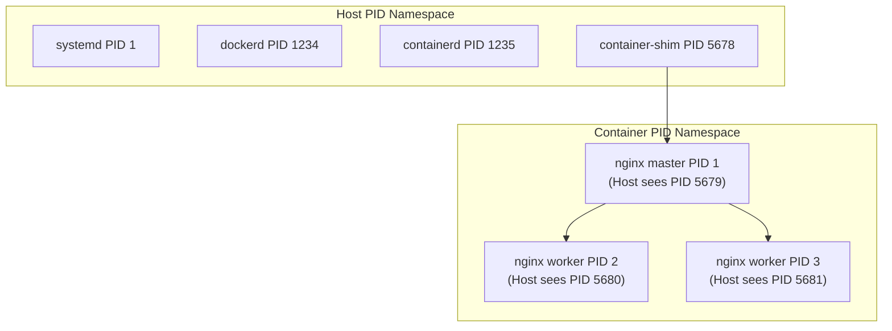

```bash
# Host perspective
$ ps aux | grep nginx
root   5679  nginx: master process  # Host PID
www    5680  nginx: worker process
www    5681  nginx: worker process

# Container perspective
$ docker exec nginx-ct ps aux
PID  USER  COMMAND
  1  root  nginx: master process   # Container PID
  2  www   nginx: worker process
  3  www   nginx: worker process

# Map container PID to host PID
$ docker inspect --format '{{.State.Pid}}' nginx-ct
5679

# Hoặc xem từ proc
$ cat /proc/5679/status | grep NSpid
NSpid:  5679    1    # Host PID: 5679, Container PID: 1
```

### 3.2 PID 1 Zombie Reaping Problem

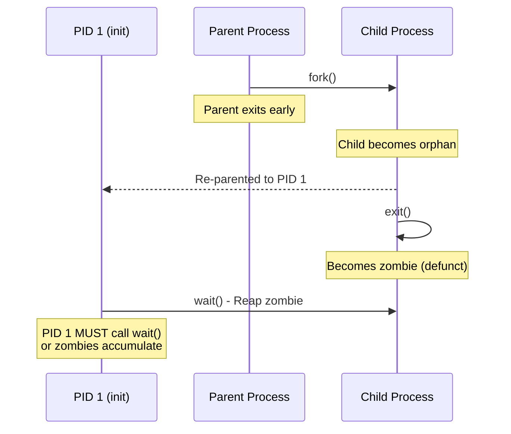

```bash
# Problem: Node.js app as PID 1 does NOT reap zombies
# Zombies accumulate, eating PIDs until pids.max hit

# Check for zombies in container
$ docker exec my-app ps aux | grep defunct
    7 root   0:00 [sh] <defunct>
   12 root   0:00 [curl] <defunct>
   18 root   0:00 [node] <defunct>

# Solution 1: Use tini as init
FROM node:20-alpine
RUN apk add --no-cache tini
ENTRYPOINT ["/sbin/tini", "--"]
CMD ["node", "dist/main.js"]

# Solution 2: Docker --init flag (uses tini internally)
$ docker run --init my-app

# Solution 3: Compose
services:
  api:
    init: true    # Docker injects tini as PID 1
    command: node dist/main.js
```

### 3.3 Tạo PID Namespace Thủ Công

```bash
# Tạo PID namespace mới
$ sudo unshare --pid --fork --mount-proc bash

# Trong namespace mới:
$ ps aux
PID  USER  COMMAND
  1  root  bash      # Chúng ta là PID 1!
  5  root  ps aux

# Host processes hoàn toàn không thấy
$ echo $$
1
```

---

## 4. Network Namespace — Chi Tiết

### 4.1 Architecture

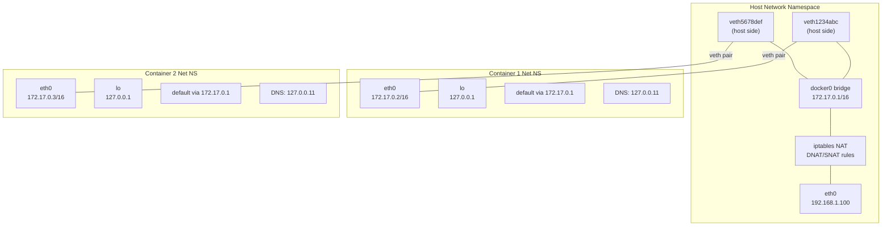

### 4.2 Tạo Network Namespace Thủ Công

```bash
# 1. Tạo network namespace
$ sudo ip netns add container1
$ sudo ip netns list
container1

# 2. Tạo veth pair (virtual ethernet cable)
$ sudo ip link add veth-host type veth peer name veth-container

# 3. Move 1 đầu vào namespace
$ sudo ip link set veth-container netns container1

# 4. Configure IP cho cả 2 đầu
$ sudo ip addr add 10.0.0.1/24 dev veth-host
$ sudo ip link set veth-host up

$ sudo ip netns exec container1 ip addr add 10.0.0.2/24 dev veth-container
$ sudo ip netns exec container1 ip link set veth-container up
$ sudo ip netns exec container1 ip link set lo up

# 5. Test connectivity
$ sudo ip netns exec container1 ping 10.0.0.1
PING 10.0.0.1 (10.0.0.1) 56(84) bytes of data.
64 bytes from 10.0.0.1: icmp_seq=1 ttl=64 time=0.038 ms

# 6. Add NAT for internet access (giống docker0 bridge)
$ sudo ip netns exec container1 ip route add default via 10.0.0.1
$ sudo iptables -t nat -A POSTROUTING -s 10.0.0.0/24 -j MASQUERADE
$ sudo sysctl -w net.ipv4.ip_forward=1
```

### 4.3 Docker Bridge Network Internals

```bash
# Xem docker bridge
$ ip link show docker0
docker0: <BROADCAST,MULTICAST,UP> mtu 1500 state UP
    link/ether 02:42:d0:c8:47:5b brd ff:ff:ff:ff:ff:ff
    inet 172.17.0.1/16

# Xem veth pairs
$ ip link show type veth
veth1234abc@if7: <BROADCAST,MULTICAST,UP>  master docker0

# Xem container side
$ docker exec my-container ip link
1: lo: <LOOPBACK,UP>
7: eth0@if8: <BROADCAST,MULTICAST,UP>   # veth pair other end

# Xem iptables NAT rules (port mapping)
$ sudo iptables -t nat -L DOCKER -n
Chain DOCKER (2 references)
target   prot  opt  source       destination
DNAT     tcp   --   0.0.0.0/0    0.0.0.0/0   tcp dpt:8080 to:172.17.0.2:3000
```

### 4.4 Container Network Model Deep Dive

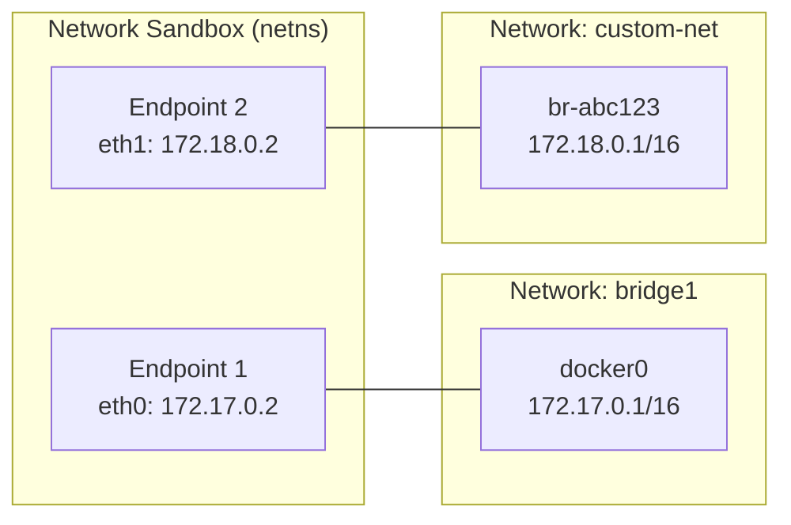

**Docker networking = Pluggable drivers around Linux networking primitives:**
- `bridge` → Linux bridge + veth pairs + iptables
- `host` → No network namespace (share host network)
- `none` → Only loopback interface
- `overlay` → VXLAN tunneling between hosts
- `macvlan` → Direct physical network attachment
- `ipvlan` → Similar to macvlan, shared MAC address

---

## 5. Mount Namespace — Chi Tiết

### 5.1 Filesystem Isolation

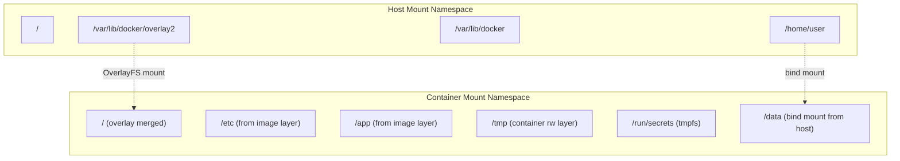

### 5.2 Mount Propagation

```bash
# Mount propagation controls how mounts in one namespace
# affect other namespaces

# private: mounts NOT visible between namespaces (default for containers)
$ docker run -v /data:/data:private my-app

# shared: mounts visible between host and container
$ docker run -v /data:/data:shared my-app

# slave: host mounts propagate TO container, but not reverse
$ docker run -v /data:/data:slave my-app

# Verify propagation
$ docker inspect --format '{{json .Mounts}}' my-container | python3 -m json.tool
```

### 5.3 pivot_root vs chroot

```bash
# Docker dùng pivot_root (secure hơn chroot)

# chroot: chỉ thay đổi / cho process, nhưng process vẫn access old root
# nếu có quyền → jailbreak dễ dàng

# pivot_root: swap root filesystem, old root unmounted
# Process KHÔNG THỂ access old root

# Đây là một phần lý do container filesystem isolation mạnh hơn chroot jail
```

---

## 6. User Namespace — Chi Tiết

### 6.1 UID/GID Mapping

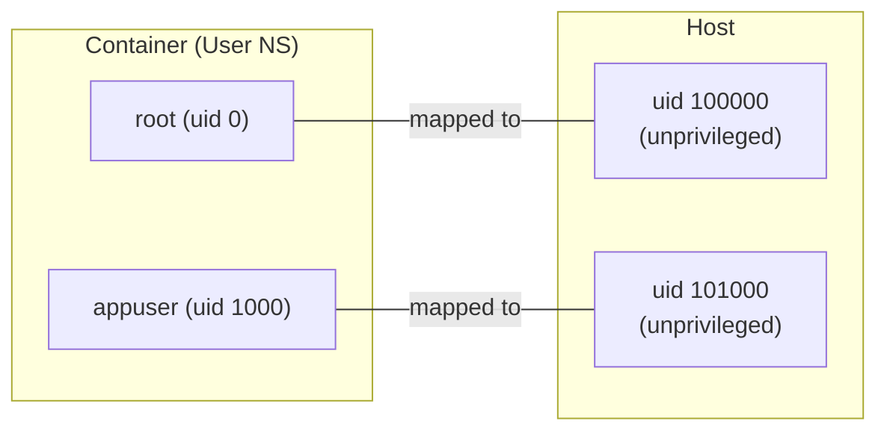

```bash
# Enable user namespace remapping
# /etc/docker/daemon.json
{
  "userns-remap": "default"
}
# Docker creates dockremap user automatically

# Check mapping
$ cat /etc/subuid
dockremap:100000:65536

$ cat /etc/subgid
dockremap:100000:65536

# Meaning: container UIDs 0-65535 → host UIDs 100000-165535
# Container root (0) → host 100000 (unprivileged!)

# Verify from container
$ docker run --rm alpine cat /proc/self/uid_map
         0     100000      65536
#   Container   Host     Range
#   UID 0    → UID 100000
#   UID 1    → UID 100001
#   ...
#   UID 65535→ UID 165535
```

### 6.2 Rootless Docker (Ultimate Security)

```bash
# Run Docker daemon entirely as non-root user
# No root privileges at all on host!

# Install rootless Docker
$ dockerd-rootless-setuptool.sh install

# Uses: user namespaces, rootlesskit, slirp4netns
# Restrictions:
# - No privileged containers
# - Limited network capabilities
# - No binding to ports < 1024 (unless sysctl)
# - Slightly slower networking (userspace networking)

# Verify
$ docker info | grep -i root
 rootless: true
 Security Options: rootless
```

---

## 7. UTS, IPC, Cgroup, Time Namespaces

### 7.1 UTS Namespace (Hostname)

```bash
# Mỗi container có hostname riêng
$ docker run --hostname my-service alpine hostname
my-service

# Default: container ID truncated
$ docker run alpine hostname
abc123def456

# UTS = Unix Time-Sharing (tên lịch sử)
```

### 7.2 IPC Namespace (Inter-Process Communication)

```bash
# Isolates: shared memory, semaphores, message queues

# Without IPC namespace: containers share host IPC
# → Container A can read shared memory of Container B (security risk!)

# Docker default: each container has own IPC namespace

# Share IPC between containers (when needed):
$ docker run --ipc=container:db-container my-app
# Use case: High-performance data sharing between sidecar containers
```

### 7.3 Cgroup Namespace

```bash
# Without cgroup namespace:
$ docker exec my-container cat /proc/self/cgroup
0::/docker/abc123def456   # Container sees FULL cgroup path

# With cgroup namespace (default in Docker):
$ docker exec my-container cat /proc/self/cgroup
0::/                       # Container thinks it's at cgroup root

# Why? Security — container shouldn't know it's in a container
# or know Docker's internal cgroup structure
```

### 7.4 Time Namespace (Linux 5.6+)

```bash
# Allows per-container clock offsets
# Use case: testing time-sensitive applications

# Not yet fully supported in Docker
# Used by: some testing frameworks, time-travel debugging
```

---

# PART 2: CGROUPS — DEEP DIVE

## 8. Cgroups v1 vs v2 Architecture

### 8.1 Cgroups v1: Multiple Hierarchies

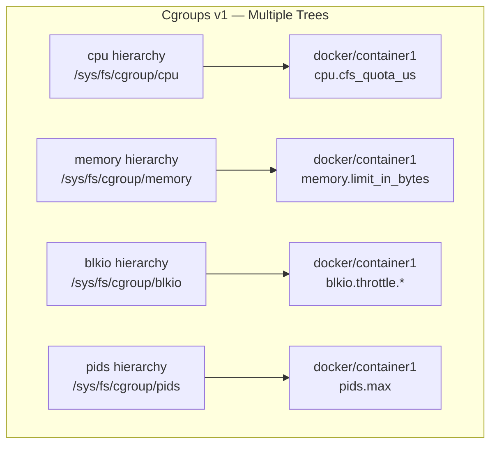

### 8.2 Cgroups v2: Unified Hierarchy

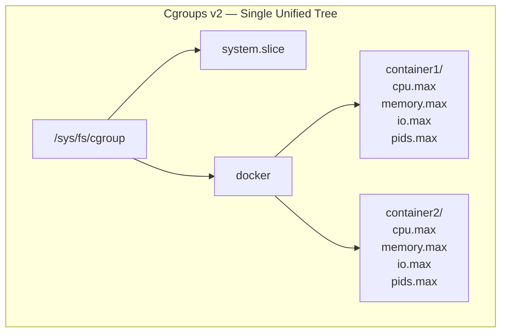

### 8.3 v1 vs v2 Comparison

| Feature | Cgroups v1 | Cgroups v2 |
|---------|-----------|-----------|
| **Hierarchy** | Multiple (1 per controller) | Single unified |
| **Controller attachment** | Per-hierarchy | Per-cgroup level (subtree_control) |
| **Memory** | `memory.limit_in_bytes` | `memory.max` |
| **Memory soft limit** | `memory.soft_limit_in_bytes` | `memory.high` |
| **Memory OOM control** | `memory.oom_control` | `memory.events` |
| **CPU quota** | `cpu.cfs_quota_us` + `cpu.cfs_period_us` | `cpu.max` (quota period) |
| **CPU weight** | `cpu.shares` (1024 default) | `cpu.weight` (100 default) |
| **IO** | `blkio` (limited) | `io` (full control) |
| **PSI** | Not available | `cpu.pressure`, `memory.pressure`, `io.pressure` |
| **Thread control** | Complex | `cgroup.type = threaded` |
| **Default since** | Legacy kernels | Kernel 5.8+, Docker 20.10+, K8s 1.25+ |

```bash
# Check which version is active
$ stat -fc %T /sys/fs/cgroup/
cgroup2fs   # v2
tmpfs       # v1 (or hybrid)

# Or
$ cat /proc/filesystems | grep cgroup
nodev   cgroup
nodev   cgroup2
```

---

## 9. Memory Controller — Deep Dive

### 9.1 Memory Hierarchy

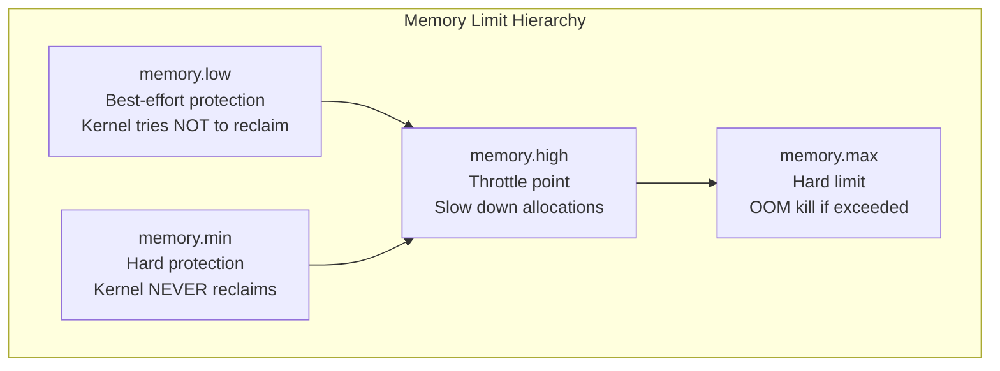

### 9.2 Memory Files Explained

```bash
# === Cgroups v2 Memory Controller ===

# Current memory usage
$ cat memory.current
268435456    # 256MB in bytes

# Peak memory usage (watermark)
$ cat memory.peak
536870912    # 512MB — highest ever reached

# Hard limit (OOM kill above this)
$ cat memory.max
1073741824   # 1GB

# Throttle point (slow down allocations above this)
$ cat memory.high
805306368    # 768MB

# Best-effort protection (try not to reclaim below this)
$ cat memory.low
268435456    # 256MB

# Hard protection (never reclaim below this)
$ cat memory.min
134217728    # 128MB

# Swap usage
$ cat memory.swap.current
0

# Swap limit
$ cat memory.swap.max
max          # unlimited (or specific value)

# Memory events (CRITICAL for monitoring)
$ cat memory.events
low 0           # Times memory.low was breached
high 5          # Times memory.high was breached (throttled)
max 2           # Times memory.max was hit
oom 1           # OOM events
oom_kill 1      # OOM kills
oom_group_kill 0

# Detailed memory stats
$ cat memory.stat
anon 134217728           # Anonymous memory (heap, stack)
file 67108864            # File-backed memory (page cache)
kernel 8388608           # Kernel memory
slab 4194304             # Slab allocator
sock 1048576             # Network socket buffers
shmem 0                  # Shared memory
pgfault 1234567          # Page faults
pgmajfault 123           # Major page faults (disk reads)
```

### 9.3 Docker Memory Options Mapped to Cgroups

```bash
# Docker flag              → Cgroup v2 file
# --memory 512m            → memory.max = 536870912
# --memory-reservation 256m → memory.low = 268435456
# --memory-swap 1g         → memory.swap.max = 536870912 (1g - 512m)
# --memory-swap -1         → memory.swap.max = max
# --memory-swappiness 60   → memory.swap.max + kernel tuning
# --oom-kill-disable        → (handled by Docker, not cgroup)

# Docker Compose mapping
services:
  api:
    deploy:
      resources:
        limits:
          memory: 1G        # → memory.max
        reservations:
          memory: 512M      # → memory.low (soft guarantee)
```

### 9.4 OOM Killer Deep Dive

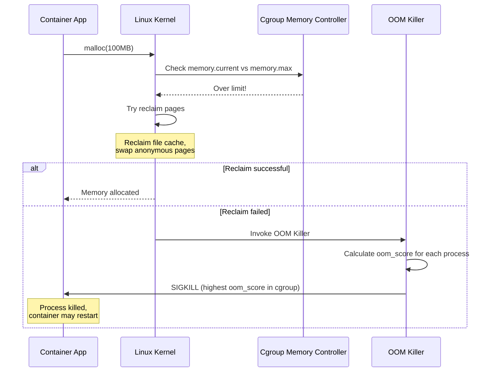

```bash
# OOM Score: higher = more likely to be killed
# Range: -1000 (never kill) to +1000 (always kill first)

# Check OOM score
$ docker exec my-app cat /proc/1/oom_score
150

# Adjust OOM priority in Compose
services:
  db:
    oom_score_adj: -500    # Protect database from OOM
  worker:
    oom_score_adj: 500     # Kill workers first

# Monitor OOM events real-time
$ docker events --filter event=oom
2026-03-18T10:30:00.000Z container oom abc123 (name=api)

# Or from cgroup
$ inotifywait -m /sys/fs/cgroup/docker/abc123/memory.events
```

---

## 10. CPU Controller — Deep Dive

### 10.1 CPU Bandwidth Control

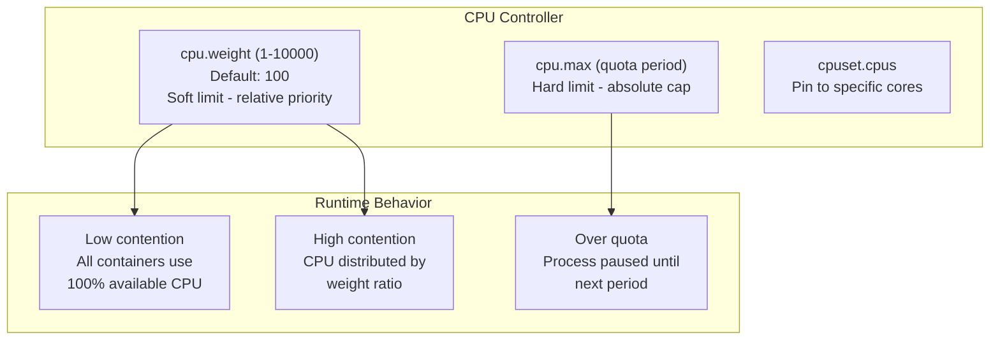

### 10.2 CPU Files Explained

```bash
# === cpu.weight (soft limit) ===
$ cat cpu.weight
100          # Default value

# Weight comparison:
# Container A: cpu.weight = 200
# Container B: cpu.weight = 100
# Under contention: A gets 2/3 CPU, B gets 1/3
# No contention: both can use 100%

$ echo 200 > cpu.weight    # Double priority

# Docker: --cpu-shares 512  → cpu.weight ≈ 50
# (Docker maps 1024-based shares to 1-10000 weight)

# === cpu.max (hard limit) ===
$ cat cpu.max
200000 100000
# Format: quota period (microseconds)
# 200000/100000 = 2.0 CPUs
# "max 100000" = unlimited

# Docker: --cpus 2.0 → cpu.max = "200000 100000"
# Docker: --cpu-quota 150000 --cpu-period 100000 → cpu.max = "150000 100000"

# === CPU Statistics (CRITICAL for debugging) ===
$ cat cpu.stat
usage_usec 89234567        # Total CPU time used
user_usec 71234567         # User-space CPU time
system_usec 18000000       # Kernel-space CPU time
nr_periods 234561          # Total scheduling periods
nr_throttled 1234          # Times throttled!
throttled_usec 5678000     # Total time spent throttled (5.6s)

# Throttled ratio = nr_throttled / nr_periods
# 1234/234561 = 0.53% throttled
# If > 5%: container might be CPU-starved

# === cpuset.cpus (CPU pinning) ===
$ cat cpuset.cpus
0-3          # Can use CPUs 0, 1, 2, 3

$ echo "0,2" > cpuset.cpus    # Only CPUs 0 and 2
# Docker: --cpuset-cpus "0,2"

# === cpuset.mems (NUMA memory nodes) ===
$ cat cpuset.mems
0            # Use memory from NUMA node 0
# Docker: --cpuset-mems "0"
```

### 10.3 CPU Throttling Visualization

```
Timeline (100ms period, 150ms quota = 1.5 CPUs):
                                                              
Period 1    |████████████████████████████████|░░░░░░░░░░░░░░░░|
            |← 150ms running on 2 cores    →|← throttled     →|
            |         (quota used up)        | (wait for next) |
                                                              
Period 2    |████████████████████████████████|░░░░░░░░░░░░░░░░|
            |← 150ms running              →|← throttled      →|

# Each period = 100ms
# Quota = 150ms of CPU time per period
# With 2 CPUs: uses 150ms in 75ms wall-clock, then throttled for 25ms
```

```bash
# Real-world CPU throttling debugging
$ docker exec my-app cat /sys/fs/cgroup/cpu.stat | grep throttled
nr_throttled 45231
throttled_usec 892341567    # 892 seconds throttled!

# Fix: Increase CPU limit
$ docker update --cpus 4.0 my-app
```

---

## 11. IO Controller — Deep Dive

### 11.1 IO Control Types

```bash
# === io.max (hard limits per device) ===
$ cat io.max
8:0 rbps=10485760 wbps=5242880 riops=1000 wiops=500
# Device 8:0 (sda):
# Read bandwidth: 10MB/s
# Write bandwidth: 5MB/s
# Read IOPS: 1000
# Write IOPS: 500

# Docker flags:
# --device-read-bps /dev/sda:10mb
# --device-write-bps /dev/sda:5mb
# --device-read-iops /dev/sda:1000
# --device-write-iops /dev/sda:500

# === io.weight (relative priority) ===
$ cat io.weight
default 100    # Range 1-10000
8:0 200        # Device-specific weight

# Docker: --blkio-weight 500

# === io.stat (monitoring) ===
$ cat io.stat
8:0 rbytes=1234567890 wbytes=987654321 rios=12345 wios=9876 dbytes=0 dios=0

# === io.pressure (PSI - Pressure Stall Information) ===
$ cat io.pressure
some avg10=2.35 avg60=1.89 avg300=1.12 total=892341
full avg10=0.05 avg60=0.02 avg300=0.01 total=12345

# "some": at least 1 task stalled on IO
# "full": ALL tasks stalled on IO (very bad)
# avg10: 10-second average percentage
```

---

## 12. PIDs Controller

```bash
# Prevent fork bombs and runaway process creation

$ cat pids.max
100          # Max 100 processes in this cgroup

$ cat pids.current
23           # Currently 23 processes

# Docker: --pids-limit 100

# Fork bomb test (DO NOT run in production):
# :(){ :|:& };:
# Without pids limit: crashes entire host
# With pids limit: only container affected, gets error:
# bash: fork: retry: Resource temporarily unavailable
```

---

## 13. Pressure Stall Information (PSI) — Cgroups v2 Only

PSI cho biết container đang "khổ sở" bao nhiêu — cực kỳ hữu ích cho capacity planning.

```bash
# CPU Pressure
$ cat cpu.pressure
some avg10=15.42 avg60=12.31 avg300=8.76 total=123456789
# 15.42% of the time, at least one task waiting for CPU in last 10s

# Memory Pressure
$ cat memory.pressure
some avg10=2.35 avg60=1.89 avg300=1.12 total=892341
full avg10=0.05 avg60=0.02 avg300=0.01 total=12345
# some: tasks waiting for memory reclaim
# full: ALL tasks blocked on memory (critical!)

# IO Pressure
$ cat io.pressure
some avg10=5.00 avg60=3.20 avg300=2.10 total=456789
full avg10=1.00 avg60=0.50 avg300=0.30 total=78901
```

### PSI Monitoring with Prometheus

```yaml
# Alert rules based on PSI
groups:
  - name: container-pressure
    rules:
      - alert: HighCPUPressure
        expr: container_cpu_pressure_some_avg10 > 25
        for: 5m
        labels:
          severity: warning
        annotations:
          summary: "Container {{ $labels.name }} under CPU pressure"

      - alert: CriticalMemoryPressure
        expr: container_memory_pressure_full_avg10 > 5
        for: 2m
        labels:
          severity: critical
        annotations:
          summary: "Container {{ $labels.name }} ALL tasks blocked on memory"
```

---

## 14. Thực Hành: Cgroup Hands-On Lab

### Lab 1: Tạo Cgroup và Giới Hạn Memory

```bash
#!/bin/bash
# Lab: Tạo cgroup v2 thủ công và giới hạn memory

# 1. Tạo cgroup
sudo mkdir /sys/fs/cgroup/lab-container

# 2. Enable controllers
echo "+memory +cpu +pids" | sudo tee /sys/fs/cgroup/cgroup.subtree_control

# 3. Set memory limit (256MB)
echo 268435456 | sudo tee /sys/fs/cgroup/lab-container/memory.max

# 4. Set memory high (soft limit 192MB - start throttling)
echo 201326592 | sudo tee /sys/fs/cgroup/lab-container/memory.high

# 5. Set CPU limit (1.5 CPUs)
echo "150000 100000" | sudo tee /sys/fs/cgroup/lab-container/cpu.max

# 6. Set PID limit
echo 50 | sudo tee /sys/fs/cgroup/lab-container/pids.max

# 7. Chạy stress test trong cgroup
echo $$ | sudo tee /sys/fs/cgroup/lab-container/cgroup.procs
stress --vm 1 --vm-bytes 200M --timeout 30s

# 8. Monitor real-time
watch -n1 "cat /sys/fs/cgroup/lab-container/memory.current && \
           cat /sys/fs/cgroup/lab-container/memory.events && \
           cat /sys/fs/cgroup/lab-container/cpu.stat"

# 9. Cleanup
sudo rmdir /sys/fs/cgroup/lab-container
```

### Lab 2: Namespace + Cgroup Combined (Build Container From Scratch)

```bash
#!/bin/bash
# Lab: Build a minimal container using raw Linux primitives

set -e

ROOTFS="/tmp/mini-container"
CGROUP="/sys/fs/cgroup/mini-container"

# 1. Prepare rootfs
mkdir -p $ROOTFS
docker export $(docker create alpine:latest) | tar -C $ROOTFS -xf -

# 2. Create cgroup with limits
sudo mkdir -p $CGROUP
echo "+memory +cpu +pids" | sudo tee /sys/fs/cgroup/cgroup.subtree_control
echo 134217728 | sudo tee $CGROUP/memory.max      # 128MB
echo "100000 100000" | sudo tee $CGROUP/cpu.max    # 1 CPU
echo 30 | sudo tee $CGROUP/pids.max                # 30 processes

# 3. Launch "container" with namespaces + cgroup
sudo unshare \
    --pid \
    --net \
    --mount \
    --uts \
    --ipc \
    --cgroup \
    --fork \
    --mount-proc \
    bash -c "
        # Move into cgroup
        echo \$\$ > $CGROUP/cgroup.procs

        # Set hostname
        hostname mini-container

        # Pivot root
        mount --bind $ROOTFS $ROOTFS
        cd $ROOTFS
        mkdir -p .old_root
        pivot_root . .old_root
        umount -l /.old_root
        rmdir /.old_root

        # Mount essential filesystems
        mount -t proc proc /proc
        mount -t sysfs sysfs /sys
        mount -t tmpfs tmpfs /tmp

        echo '=== Welcome to mini-container ==='
        echo \"PID: \$\$\"
        echo \"Hostname: \$(hostname)\"
        echo \"Memory limit: \$(cat /sys/fs/cgroup/memory.max 2>/dev/null || echo N/A)\"
        exec /bin/sh
    "

# 4. Cleanup
sudo rmdir $CGROUP
sudo rm -rf $ROOTFS
```

---

## 15. Production Best Practices

### Namespace Best Practices

```markdown
## Security
- [ ] Enable User Namespace remapping (`userns-remap`) on production hosts
- [ ] Use --init or tini for proper PID 1 behavior
- [ ] Never share host PID namespace (`--pid=host`) unless debugging
- [ ] Never share host network namespace unless performance-critical
- [ ] Use separate IPC namespaces (Docker default)

## Debugging
- [ ] Use `nsenter` to enter specific namespaces for debugging
- [ ] Check `/proc/<pid>/ns/` to verify namespace isolation
- [ ] Use `lsns` to list all namespaces on host
```

### Cgroup Best Practices

```markdown
## Resource Limits (MUST SET in production)
- [ ] memory.max set for ALL containers (prevent host OOM)
- [ ] cpu.max set for CPU-intensive workloads
- [ ] pids.max set to prevent fork bombs (100-500)
- [ ] memory.high set below memory.max (graceful degradation)

## Monitoring
- [ ] Monitor memory.events for OOM kills
- [ ] Monitor cpu.stat for throttling (nr_throttled)
- [ ] Monitor PSI metrics for capacity planning
- [ ] Alert on memory.pressure full > 5% (critical)
- [ ] Alert on cpu.pressure some > 25% (warning)

## Tuning
- [ ] Use cgroups v2 (unified hierarchy, PSI support)
- [ ] Set memory reservations for critical services
- [ ] Use cpuset for latency-sensitive workloads (NUMA-aware)
- [ ] Set oom_score_adj: low for databases, high for workers
```

---

## 16. Interview Questions

**Q: Giải thích Namespace và Cgroup khác nhau thế nào? Tại sao cần cả hai?**

A: Namespace = **visibility** (container thấy gì). Cgroup = **resource limit** (container dùng bao nhiêu). Cần cả hai vì:
- Chỉ có Namespace: container cô lập nhưng có thể dùng hết RAM/CPU của host → ảnh hưởng containers khác
- Chỉ có Cgroup: container bị giới hạn resource nhưng thấy hết processes/network của host → zero isolation
- Container = Namespace + Cgroup + layered filesystem

**Q: Process trong container có thể escape không? Khi nào?**

A: Có, nếu:
1. Container chạy `--privileged` (disable mọi security feature)
2. Container mount Docker socket (`-v /var/run/docker.sock`)
3. Kernel vulnerability trong namespace implementation
4. Không enable User Namespace remapping (container root = host root)
5. Container có `CAP_SYS_ADMIN` capability

Mitigation: user namespaces, drop capabilities, seccomp, AppArmor, read-only rootfs.

**Q: Tại sao cgroups v2 tốt hơn v1?**

A:
- **Unified hierarchy**: 1 tree thay vì N trees → đơn giản hơn, ít race conditions
- **PSI (Pressure Stall Information)**: biết container đang "khổ sở" bao nhiêu → capacity planning
- **memory.high**: throttle trước khi OOM → graceful degradation thay vì hard kill
- **Better IO control**: v1 blkio rất limited, v2 io controller hoàn chỉnh
- **Threaded cgroups**: control CPU cho individual threads
- **No zombie cgroups**: v1 có bug cgroups không bị cleanup

**Q: Container bị CPU throttle, debug thế nào?**

A: Step-by-step:
1. `cat /sys/fs/cgroup/cpu.stat` → check `nr_throttled` và `throttled_usec`
2. Tính throttle ratio: `nr_throttled / nr_periods` 
3. Nếu > 5%: container thiếu CPU
4. Check `cpu.max`: quota có đủ cho workload không?
5. Check `cpu.pressure` (PSI): `some > 25%` là warning
6. Fix: tăng `--cpus` hoặc optimize application

**Q: Làm sao chống fork bomb trong container?**

A: 3 layers:
1. `--pids-limit 100` (cgroup PIDs controller)
2. `ulimit -u 100` trong container
3. `--security-opt no-new-privileges` (prevent privilege escalation)
- Không set pids limit = fork bomb trong 1 container hết PIDs của TOÀN BỘ HOST
