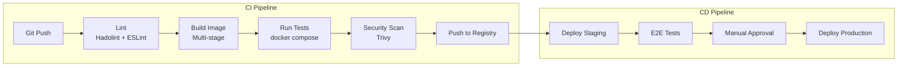
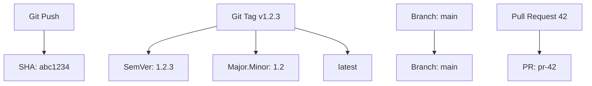

# 🚀 CI/CD with Docker — Automate Build, Test, Deploy

> **"The best Docker workflow is the one that runs without you watching."**

---

## 1. CI/CD Pipeline Architecture



---

## 2. GitHub Actions: Full Docker CI

```yaml
# .github/workflows/docker-ci.yml
name: Docker CI/CD

on:
  push:
    branches: [main, develop]
  pull_request:
    branches: [main]

env:
  REGISTRY: ghcr.io
  IMAGE_NAME: ${{ github.repository }}

jobs:
  # === Stage 1: Lint ===
  lint:
    runs-on: ubuntu-latest
    steps:
      - uses: actions/checkout@v4

      - name: Lint Dockerfile
        uses: hadolint/hadolint-action@v3.1.0
        with:
          dockerfile: apps/file-processor/Dockerfile
          failure-threshold: warning

  # === Stage 2: Build & Test ===
  build-test:
    runs-on: ubuntu-latest
    needs: lint
    steps:
      - uses: actions/checkout@v4

      - name: Set up Docker Buildx
        uses: docker/setup-buildx-action@v3

      - name: Build test image
        uses: docker/build-push-action@v5
        with:
          context: ./apps/file-processor
          target: test
          load: true
          tags: test-image:latest
          cache-from: type=gha
          cache-to: type=gha,mode=max

      - name: Run unit tests
        run: |
          docker run --rm test-image:latest pnpm test

      - name: Run integration tests
        run: |
          docker compose -f docker-compose.yml -f docker-compose.test.yml up -d db elasticsearch
          docker compose -f docker-compose.yml -f docker-compose.test.yml run --rm test-runner
          docker compose -f docker-compose.yml -f docker-compose.test.yml down -v

  # === Stage 3: Security Scan ===
  security:
    runs-on: ubuntu-latest
    needs: build-test
    steps:
      - uses: actions/checkout@v4

      - name: Build production image
        uses: docker/build-push-action@v5
        with:
          context: ./apps/file-processor
          target: production
          load: true
          tags: scan-target:latest

      - name: Trivy vulnerability scan
        uses: aquasecurity/trivy-action@master
        with:
          image-ref: scan-target:latest
          format: sarif
          output: trivy-results.sarif
          severity: CRITICAL,HIGH
          exit-code: 1

      - name: Upload Trivy results
        uses: github/codeql-action/upload-sarif@v3
        if: always()
        with:
          sarif_file: trivy-results.sarif

  # === Stage 4: Push to Registry ===
  push:
    runs-on: ubuntu-latest
    needs: [build-test, security]
    if: github.event_name == 'push' && github.ref == 'refs/heads/main'
    permissions:
      contents: read
      packages: write
    steps:
      - uses: actions/checkout@v4

      - name: Set up Docker Buildx
        uses: docker/setup-buildx-action@v3

      - name: Login to GHCR
        uses: docker/login-action@v3
        with:
          registry: ghcr.io
          username: ${{ github.actor }}
          password: ${{ secrets.GITHUB_TOKEN }}

      - name: Extract metadata
        id: meta
        uses: docker/metadata-action@v5
        with:
          images: ${{ env.REGISTRY }}/${{ env.IMAGE_NAME }}
          tags: |
            type=sha,prefix=
            type=semver,pattern={{version}}
            type=semver,pattern={{major}}.{{minor}}
            type=raw,value=latest,enable={{is_default_branch}}

      - name: Build and push
        uses: docker/build-push-action@v5
        with:
          context: ./apps/file-processor
          target: production
          platforms: linux/amd64,linux/arm64
          push: true
          tags: ${{ steps.meta.outputs.tags }}
          labels: ${{ steps.meta.outputs.labels }}
          cache-from: type=gha
          cache-to: type=gha,mode=max
```

---

## 3. Layer Caching Strategies

### GitHub Actions Cache

```yaml
# Method 1: GitHub Actions Cache (gha)
- name: Build with GHA cache
  uses: docker/build-push-action@v5
  with:
    cache-from: type=gha
    cache-to: type=gha,mode=max
    # mode=max: cache all layers (not just final image layers)
```

### Registry Cache

```yaml
# Method 2: Registry Cache (cross-workflow, persistent)
- name: Build with registry cache
  uses: docker/build-push-action@v5
  with:
    cache-from: type=registry,ref=ghcr.io/myorg/myapp:buildcache
    cache-to: type=registry,ref=ghcr.io/myorg/myapp:buildcache,mode=max
```

### Local Cache (Self-hosted Runners)

```yaml
# Method 3: Local cache (fastest, self-hosted runners only)
- name: Build with local cache
  uses: docker/build-push-action@v5
  with:
    cache-from: type=local,src=/tmp/.buildx-cache
    cache-to: type=local,dest=/tmp/.buildx-cache-new,mode=max

# Rotate cache to prevent unbounded growth
- name: Rotate cache
  run: |
    rm -rf /tmp/.buildx-cache
    mv /tmp/.buildx-cache-new /tmp/.buildx-cache
```

---

## 4. Docker-in-Docker vs Docker-out-of-Docker vs Kaniko

### Comparison

| Approach | Security | Performance | Complexity | Use Case |
|----------|----------|-------------|------------|----------|
| DinD (docker:dind) | Low (privileged) | Medium | Low | GitHub Actions (default) |
| DooD (socket mount) | Medium | Best | Low | Self-hosted runners |
| Kaniko | High | Medium | Medium | Kubernetes CI |
| Buildah | High | Good | Medium | Rootless builds |

### Docker-in-Docker (DinD)

```yaml
# GitLab CI example
build:
  image: docker:24
  services:
    - docker:24-dind
  variables:
    DOCKER_TLS_CERTDIR: "/certs"
  script:
    - docker build -t my-app .
    - docker push my-app
```

### Kaniko (No Docker Daemon Required)

```yaml
# GitHub Actions with Kaniko
- name: Build with Kaniko
  run: |
    docker run \
      -v ${{ github.workspace }}:/workspace \
      gcr.io/kaniko-project/executor:latest \
      --context=/workspace/apps/file-processor \
      --dockerfile=Dockerfile \
      --destination=ghcr.io/${{ github.repository }}:${{ github.sha }} \
      --cache=true \
      --cache-repo=ghcr.io/${{ github.repository }}/cache
```

---

## 5. Multi-Architecture Builds

```yaml
# Build for amd64 and arm64
- name: Set up QEMU
  uses: docker/setup-qemu-action@v3

- name: Set up Buildx
  uses: docker/setup-buildx-action@v3

- name: Build multi-arch
  uses: docker/build-push-action@v5
  with:
    platforms: linux/amd64,linux/arm64
    push: true
    tags: ghcr.io/myorg/myapp:latest
```

```bash
# Manual multi-arch build
$ docker buildx create --name multiarch --use
$ docker buildx build \
    --platform linux/amd64,linux/arm64 \
    --tag myregistry/myapp:1.0.0 \
    --push .
```

---

## 6. Push to Multiple Registries

```yaml
# Push to GHCR + ECR + DockerHub
jobs:
  push:
    steps:
      - name: Login to GHCR
        uses: docker/login-action@v3
        with:
          registry: ghcr.io
          username: ${{ github.actor }}
          password: ${{ secrets.GITHUB_TOKEN }}

      - name: Login to ECR
        uses: aws-actions/amazon-ecr-login@v2

      - name: Login to Docker Hub
        uses: docker/login-action@v3
        with:
          username: ${{ secrets.DOCKERHUB_USERNAME }}
          password: ${{ secrets.DOCKERHUB_TOKEN }}

      - name: Build and push to all registries
        uses: docker/build-push-action@v5
        with:
          push: true
          tags: |
            ghcr.io/${{ github.repository }}:${{ github.sha }}
            ${{ secrets.AWS_ACCOUNT_ID }}.dkr.ecr.ap-southeast-1.amazonaws.com/myapp:${{ github.sha }}
            docker.io/myorg/myapp:${{ github.sha }}
```

---

## 7. Testing with Docker Compose in CI

```yaml
# docker-compose.test.yml
services:
  test-runner:
    build:
      context: ./apps/file-processor
      target: test
    command: pnpm test:e2e
    environment:
      DATABASE_URL: postgresql://postgres:test@db:5432/testdb
      ELASTICSEARCH_URL: http://elasticsearch:9200
    depends_on:
      db:
        condition: service_healthy
      elasticsearch:
        condition: service_healthy
    profiles:
      - test

  db:
    image: postgres:16-alpine
    environment:
      POSTGRES_DB: testdb
      POSTGRES_USER: postgres
      POSTGRES_PASSWORD: test
    healthcheck:
      test: ["CMD-SHELL", "pg_isready"]
      interval: 5s
      timeout: 3s
      retries: 10
    tmpfs:                          # Use tmpfs for test DB (faster)
      - /var/lib/postgresql/data

  elasticsearch:
    image: opensearchproject/opensearch:2.11.0
    environment:
      - discovery.type=single-node
      - DISABLE_SECURITY_PLUGIN=true
      - "OPENSEARCH_JAVA_OPTS=-Xms256m -Xmx256m"
    healthcheck:
      test: ["CMD", "curl", "-f", "http://localhost:9200"]
      interval: 5s
      timeout: 10s
      retries: 20
    tmpfs:
      - /usr/share/opensearch/data
```

```yaml
# GitHub Actions
- name: Run E2E tests
  run: |
    docker compose -f docker-compose.test.yml up -d db elasticsearch
    docker compose -f docker-compose.test.yml run --rm \
      --exit-code-from test-runner \
      test-runner
  
- name: Cleanup
  if: always()
  run: docker compose -f docker-compose.test.yml down -v
```

---

## 8. Image Tagging Strategy



```yaml
# docker/metadata-action configuration
- uses: docker/metadata-action@v5
  with:
    images: ghcr.io/myorg/myapp
    tags: |
      # Git SHA (always unique, traceable)
      type=sha,prefix=
      # SemVer from git tag
      type=semver,pattern={{version}}
      type=semver,pattern={{major}}.{{minor}}
      # Branch name
      type=ref,event=branch
      # PR number
      type=ref,event=pr
      # latest on default branch
      type=raw,value=latest,enable={{is_default_branch}}
```

---

## 9. CI Performance Tips

```yaml
# 1. Use BuildKit with cache
DOCKER_BUILDKIT: 1

# 2. Separate test dependencies from production
FROM node:20-alpine AS test
COPY . .
RUN pnpm install
RUN pnpm test

FROM node:20-alpine AS production
# Only install prod deps
RUN pnpm install --prod

# 3. Use tmpfs for test databases (10x faster)
services:
  db:
    tmpfs:
      - /var/lib/postgresql/data

# 4. Parallel jobs where possible
jobs:
  lint:      # runs independently
  test:      # runs independently
  build:     # needs lint + test
    needs: [lint, test]

# 5. Skip builds when only docs change
on:
  push:
    paths-ignore:
      - "docs/**"
      - "*.md"
      - ".gitignore"
```

---

## 10. Interview Questions

**Q: CI build Docker image mất rất lâu, optimize thế nào?**

A: Performance checklist:
1. Enable BuildKit (`DOCKER_BUILDKIT=1`)
2. Use cache (`type=gha` for GitHub Actions, `type=registry` for cross-workflow)
3. Multi-stage: test stage parallel with build stage
4. `--mount=type=cache` for package manager caches
5. Proper `.dockerignore` (exclude test files, docs, git history)
6. Layer ordering: rarely changed layers first
7. Minimize image rebuilds: skip when only docs change
8. Use `cache-from` previous builds

**Q: DinD vs DooD — khi nào dùng cái nào?**

A:
- DinD (Docker-in-Docker): Complete isolation, each CI job has own Docker daemon. Use for: GitHub Actions, GitLab CI, untrusted builds
- DooD (Docker-out-of-Docker): Share host Docker daemon via socket. Use for: self-hosted runners, trusted environments, better performance (shared layer cache)
- Kaniko: No Docker daemon at all, builds in userspace. Use for: Kubernetes pods, rootless environments, maximum security
- GitHub Actions default: Uses DinD under the hood

**Q: Tại sao cần multi-architecture builds?**

A:
- Apple Silicon (M1/M2/M3) = ARM64, nhưng servers thường AMD64
- AWS Graviton instances (ARM64) cheaper than x86
- Build once, run anywhere: `docker pull` automatically selects correct arch
- Use QEMU for cross-compilation in CI (slower but works everywhere)
- Native builders (Buildx remote) for production speed
