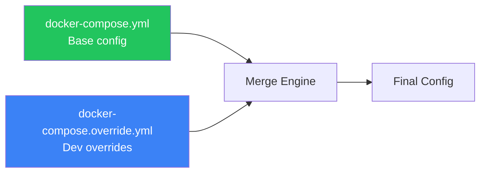
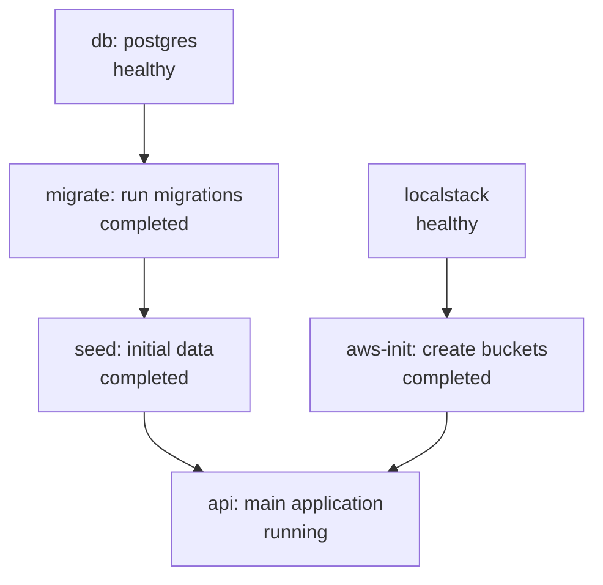

# 🧩 Compose Advanced Patterns — Beyond the Basics

> **"Master these patterns and you'll handle any Docker Compose setup thrown at you."**

---

## 1. Override Files

### How Compose Merges Files



```bash
# Compose auto-loads these two files:
# 1. docker-compose.yml (base)
# 2. docker-compose.override.yml (auto-merged)

# Explicitly specify files:
$ docker compose -f docker-compose.yml -f docker-compose.prod.yml up -d

# Preview merged config:
$ docker compose -f docker-compose.yml -f docker-compose.prod.yml config
```

### Base + Override Pattern

```yaml
# docker-compose.yml (Base — shared across all environments)
services:
  api:
    build:
      context: ./apps/api
    networks:
      - app-net
    depends_on:
      db:
        condition: service_healthy
  
  db:
    image: postgres:16-alpine
    volumes:
      - db-data:/var/lib/postgresql/data
    environment:
      POSTGRES_DB: filedb
      POSTGRES_USER: postgres
    healthcheck:
      test: ["CMD-SHELL", "pg_isready -U postgres"]
      interval: 10s
      timeout: 5s
      retries: 5
    networks:
      - app-net

networks:
  app-net:
volumes:
  db-data:
```

```yaml
# docker-compose.override.yml (Development — auto-loaded)
services:
  api:
    build:
      target: development
    ports:
      - "3000:3000"
      - "9229:9229"                # Debugger
    volumes:
      - ./apps/api/src:/app/src    # Hot reload
    environment:
      NODE_ENV: development
      LOG_LEVEL: debug
    command: pnpm start:dev

  db:
    ports:
      - "5432:5432"                # Expose for local access
    environment:
      POSTGRES_PASSWORD: secret    # Simple dev password
```

```yaml
# docker-compose.prod.yml (Production — explicit load)
services:
  api:
    build:
      target: production
    environment:
      NODE_ENV: production
      LOG_LEVEL: warn
    deploy:
      resources:
        limits:
          cpus: "2.0"
          memory: 1G
    restart: unless-stopped

  db:
    environment:
      POSTGRES_PASSWORD_FILE: /run/secrets/db_password
    secrets:
      - db_password
    deploy:
      resources:
        limits:
          cpus: "2.0"
          memory: 4G
    restart: unless-stopped

secrets:
  db_password:
    file: ./secrets/db-password.txt
```

---

## 2. Profiles

Profiles let you define optional services that only start when their profile is activated.

```yaml
services:
  # Always starts (no profile)
  api:
    image: my-api
    ports:
      - "3000:3000"
  
  db:
    image: postgres:16-alpine
    volumes:
      - db-data:/var/lib/postgresql/data

  # Only starts with 'debug' profile
  adminer:
    image: adminer
    ports:
      - "8080:8080"
    profiles:
      - debug

  # Only starts with 'monitoring' profile
  prometheus:
    image: prom/prometheus
    ports:
      - "9090:9090"
    profiles:
      - monitoring

  grafana:
    image: grafana/grafana
    ports:
      - "3001:3000"
    profiles:
      - monitoring

  # Only starts with 'test' profile
  test-runner:
    build:
      context: .
      target: test
    command: pnpm test:e2e
    profiles:
      - test
    depends_on:
      - api
      - db

volumes:
  db-data:
```

```bash
# Start only core services (api + db)
$ docker compose up -d

# Start with monitoring tools
$ docker compose --profile monitoring up -d

# Start with multiple profiles
$ docker compose --profile monitoring --profile debug up -d

# Run tests
$ docker compose --profile test run --rm test-runner

# Set default profiles via env
$ COMPOSE_PROFILES=monitoring,debug docker compose up -d
```

---

## 3. Extends (Reusable Service Templates)

```yaml
# common-services.yml (Template file)
services:
  node-base:
    build:
      args:
        NODE_VERSION: "20"
    environment:
      NODE_ENV: ${NODE_ENV:-development}
      LOG_LEVEL: ${LOG_LEVEL:-info}
    healthcheck:
      test: ["CMD", "wget", "--spider", "-q", "http://localhost:${PORT}/health"]
      interval: 15s
      timeout: 5s
      retries: 3
    deploy:
      resources:
        limits:
          memory: 512M
    restart: unless-stopped
```

```yaml
# docker-compose.yml
services:
  api:
    extends:
      file: common-services.yml
      service: node-base
    build:
      context: ./apps/api
    ports:
      - "3000:3000"
    environment:
      PORT: 3000
      DATABASE_URL: postgresql://db:5432/filedb

  worker:
    extends:
      file: common-services.yml
      service: node-base
    build:
      context: ./apps/worker
    environment:
      PORT: 3001
      QUEUE_URL: http://localstack:4566
```

---

## 4. Init Containers Pattern

Run one-time setup tasks before main services start.

```yaml
services:
  # Init: Run database migrations
  migrate:
    build:
      context: ./apps/api
      target: development
    command: pnpm migration:run
    depends_on:
      db:
        condition: service_healthy
    restart: "no"                    # Don't restart after completion
    networks:
      - app-net

  # Init: Seed initial data
  seed:
    build:
      context: ./apps/api
    command: pnpm seed:run
    depends_on:
      migrate:
        condition: service_completed_successfully
    restart: "no"
    networks:
      - app-net

  # Init: Create S3 buckets and SQS queues
  aws-init:
    image: amazon/aws-cli:2.15.0
    entrypoint: /bin/sh
    command:
      - -c
      - |
        aws --endpoint-url=http://localstack:4566 s3 mb s3://uploads || true
        aws --endpoint-url=http://localstack:4566 sqs create-queue \
          --queue-name file-queue || true
        echo "AWS resources initialized"
    environment:
      AWS_ACCESS_KEY_ID: test
      AWS_SECRET_ACCESS_KEY: test
      AWS_DEFAULT_REGION: ap-southeast-1
    depends_on:
      localstack:
        condition: service_healthy
    restart: "no"
    networks:
      - app-net

  # Main app: starts after all init containers succeed
  api:
    build:
      context: ./apps/api
      target: production
    depends_on:
      seed:
        condition: service_completed_successfully
      aws-init:
        condition: service_completed_successfully
    networks:
      - app-net
```



---

## 5. Secrets and Configs

### Secrets (Sensitive Data)

```yaml
services:
  api:
    image: my-api
    secrets:
      - db_password
      - source: api_key
        target: /run/secrets/api-key   # Custom path
        uid: "1001"
        gid: "1001"
        mode: 0400                      # Read-only by owner
    environment:
      DB_PASSWORD_FILE: /run/secrets/db_password
      API_KEY_FILE: /run/secrets/api-key

secrets:
  db_password:
    file: ./secrets/db-password.txt    # From file
  api_key:
    environment: MY_API_KEY            # From env variable
```

### Configs (Non-sensitive Configuration)

```yaml
services:
  nginx:
    image: nginx:alpine
    configs:
      - source: nginx_conf
        target: /etc/nginx/nginx.conf
      - source: app_conf
        target: /etc/nginx/conf.d/app.conf

  prometheus:
    image: prom/prometheus
    configs:
      - source: prom_config
        target: /etc/prometheus/prometheus.yml

configs:
  nginx_conf:
    file: ./config/nginx.conf
  app_conf:
    file: ./config/app.conf
  prom_config:
    file: ./config/prometheus.yml
```

---

## 6. Multiple Compose Files Strategy

```
project/
  docker-compose.yml              # Base (shared)
  docker-compose.override.yml     # Dev (auto-loaded)
  docker-compose.prod.yml         # Production
  docker-compose.test.yml         # Testing
  docker-compose.ci.yml           # CI/CD
  .env                            # Default env vars
  .env.prod                       # Production env vars
```

```bash
# Development (auto-loads override)
$ docker compose up -d

# Production
$ docker compose -f docker-compose.yml -f docker-compose.prod.yml \
    --env-file .env.prod up -d

# Testing
$ docker compose -f docker-compose.yml -f docker-compose.test.yml \
    run --rm test-runner

# CI pipeline
$ docker compose -f docker-compose.yml -f docker-compose.ci.yml \
    up -d --build --wait
```

---

## 7. include (Compose v2.20+)

Split large compose files into focused modules.

```yaml
# docker-compose.yml (Main)
include:
  - path: ./compose/database.yml     # Database services
  - path: ./compose/monitoring.yml   # Monitoring stack
  - path: ./compose/aws.yml          # AWS mock services

services:
  api:
    build: ./apps/api
    depends_on:
      postgres:
        condition: service_healthy
      localstack:
        condition: service_healthy
    networks:
      - app-net
```

```yaml
# compose/database.yml
services:
  postgres:
    image: postgres:16-alpine
    volumes:
      - pg-data:/var/lib/postgresql/data
    healthcheck:
      test: ["CMD-SHELL", "pg_isready -U postgres"]
    networks:
      - app-net

  redis:
    image: redis:7-alpine
    networks:
      - app-net

volumes:
  pg-data:

networks:
  app-net:
```

---

## 8. Custom Entrypoint Patterns

### Wait-for-it Pattern

```yaml
services:
  api:
    build: ./apps/api
    entrypoint: ["/app/scripts/docker-entrypoint.sh"]
    command: ["node", "dist/main.js"]
    depends_on:
      db:
        condition: service_healthy
```

```bash
#!/bin/sh
# scripts/docker-entrypoint.sh
set -e

echo "Waiting for database..."
until pg_isready -h db -p 5432 -U postgres; do
  echo "Database not ready, retrying in 2s..."
  sleep 2
done

echo "Running migrations..."
pnpm migration:run

echo "Starting application..."
exec "$@"  # Execute CMD (node dist/main.js)
```

### Conditional Startup

```bash
#!/bin/sh
# scripts/docker-entrypoint.sh
set -e

case "${1}" in
  "api")
    echo "Starting API server..."
    exec node dist/main.js
    ;;
  "worker")
    echo "Starting background worker..."
    exec node dist/worker.js
    ;;
  "migrate")
    echo "Running migrations..."
    exec pnpm migration:run
    ;;
  "seed")
    echo "Seeding database..."
    exec pnpm seed:run
    ;;
  *)
    exec "$@"
    ;;
esac
```

```yaml
services:
  api:
    build: .
    command: api

  worker:
    build: .
    command: worker

  migrate:
    build: .
    command: migrate
    restart: "no"
```

---

## 9. Scaling Services

```yaml
services:
  worker:
    build: ./apps/worker
    environment:
      QUEUE_URL: http://localstack:4566/000000000000/file-queue
    deploy:
      replicas: 3                  # 3 instances by default
      resources:
        limits:
          cpus: "1.0"
          memory: 512M
    networks:
      - app-net
```

```bash
# Scale at runtime
$ docker compose up -d --scale worker=5

# Check replicas
$ docker compose ps
NAME           SERVICE   STATUS    PORTS
app-worker-1   worker    running
app-worker-2   worker    running
app-worker-3   worker    running
app-worker-4   worker    running
app-worker-5   worker    running
```

---

## 10. Interview Questions

**Q: Khi nào dùng `extends` vs `include` vs multiple files?**

A:
- `extends`: Kế thừa config từ 1 service template (DRY cho services cùng kiểu)
- `include`: Chia compose file lớn thành modules nhỏ (modular architecture)
- Multiple files (`-f`): Overlay config theo environment (dev/staging/prod)
- Best practice: dùng cả 3 — `extends` cho templates, `include` cho modules, `-f` cho env

**Q: Profiles dùng cho use case nào?**

A: Profiles giúp define optional services:
- `debug`: Adminer, pgAdmin, debug tools
- `monitoring`: Prometheus, Grafana, cAdvisor
- `test`: Test runner, coverage reporters
- `observability`: ELK stack, Jaeger
- No profile = always starts (core services)
- `COMPOSE_PROFILES` env var for default profiles

**Q: Tại sao cần init container pattern?**

A: Đảm bảo setup tasks chạy đúng thứ tự trước khi app start:
1. Database ready (healthcheck)
2. Migrations run (service_completed_successfully)
3. Seeds loaded (depends on migrations)
4. AWS resources created (S3 buckets, SQS queues)
5. App starts only when ALL init complete
- `restart: "no"` — init container không restart sau khi complete
- `depends_on condition` — control startup order
