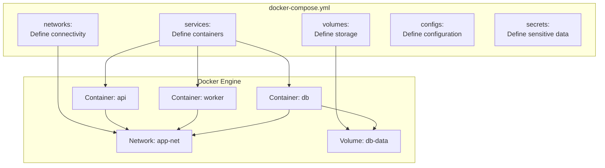
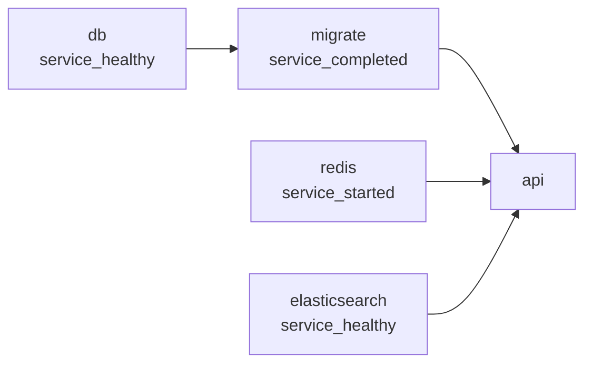

# 🎼 Docker Compose Fundamentals — Orchestrate Multi-Container Apps

> **"Docker Compose turns your infrastructure into code. One file to define, one command to deploy."**

---

## 1. Compose Architecture



---

## 2. Compose File Anatomy

### Minimal Example

```yaml
# docker-compose.yml
name: my-project  # Project name (optional, defaults to folder name)

services:
  api:
    image: node:20-alpine
    working_dir: /app
    volumes:
      - ./apps/api:/app
    ports:
      - "3000:3000"
    command: node dist/main.js
```

### Full-Featured Example

```yaml
# docker-compose.yml
name: file-processor

services:
  # === Application Services ===
  api:
    build:
      context: ./apps/file-processor
      dockerfile: Dockerfile
      target: development          # Multi-stage target
      args:
        NODE_ENV: development
    image: file-processor-api:dev
    container_name: fp-api
    restart: unless-stopped
    ports:
      - "3000:3000"
      - "9229:9229"               # Debug port
    volumes:
      - ./apps/file-processor/src:/app/src    # Hot reload
      - uploads:/app/uploads
    environment:
      NODE_ENV: development
      DATABASE_URL: postgresql://postgres:secret@db:5432/filedb
      ELASTICSEARCH_URL: http://elasticsearch:9200
      AWS_ENDPOINT: http://localstack:4566
      AWS_REGION: ap-southeast-1
      S3_BUCKET: file-uploads
      SQS_QUEUE_URL: http://localstack:4566/000000000000/file-queue
    env_file:
      - .env                       # Additional env vars
      - .env.local                 # Local overrides (gitignored)
    depends_on:
      db:
        condition: service_healthy
      elasticsearch:
        condition: service_healthy
      localstack:
        condition: service_started
    healthcheck:
      test: ["CMD", "wget", "--spider", "-q", "http://localhost:3000/health"]
      interval: 15s
      timeout: 5s
      retries: 3
      start_period: 30s
    networks:
      - app-net
    deploy:
      resources:
        limits:
          cpus: "2.0"
          memory: 1G

  # === Database ===
  db:
    image: postgres:16-alpine
    container_name: fp-db
    restart: unless-stopped
    ports:
      - "5432:5432"
    volumes:
      - db-data:/var/lib/postgresql/data
      - ./infra/init-scripts:/docker-entrypoint-initdb.d  # Init SQL
    environment:
      POSTGRES_DB: filedb
      POSTGRES_USER: postgres
      POSTGRES_PASSWORD: secret
    healthcheck:
      test: ["CMD-SHELL", "pg_isready -U postgres"]
      interval: 10s
      timeout: 5s
      retries: 5
    networks:
      - app-net

  # === Search Engine ===
  elasticsearch:
    image: opensearchproject/opensearch:2.11.0
    container_name: fp-search
    restart: unless-stopped
    ports:
      - "9200:9200"
    volumes:
      - es-data:/usr/share/opensearch/data
    environment:
      - discovery.type=single-node
      - DISABLE_SECURITY_PLUGIN=true
      - "OPENSEARCH_JAVA_OPTS=-Xms512m -Xmx512m"
    healthcheck:
      test: ["CMD", "curl", "-f", "http://localhost:9200/_cluster/health"]
      interval: 15s
      timeout: 10s
      retries: 5
      start_period: 60s
    networks:
      - app-net

  # === AWS Mock ===
  localstack:
    image: localstack/localstack:3.0
    container_name: fp-localstack
    ports:
      - "4566:4566"
    volumes:
      - localstack-data:/var/lib/localstack
      - /var/run/docker.sock:/var/run/docker.sock
    environment:
      - SERVICES=s3,sqs,lambda
      - DEBUG=1
    networks:
      - app-net

# === Networks ===
networks:
  app-net:
    driver: bridge
    ipam:
      config:
        - subnet: 172.28.0.0/16

# === Volumes ===
volumes:
  db-data:
    driver: local
  es-data:
    driver: local
  uploads:
    driver: local
  localstack-data:
    driver: local
```

---

## 3. docker-compose vs docker compose

| Feature | `docker-compose` (V1) | `docker compose` (V2) |
|---------|----------------------|---------------------|
| Language | Python | Go (plugin) |
| Container naming | `project_service_1` | `project-service-1` |
| Build performance | Sequential | Parallel (BuildKit) |
| Compose spec | v2, v3 | Compose Spec |
| `profiles` support | Limited | Full |
| `watch` mode | No | Yes |
| GPU support | No | Yes |
| Status | Deprecated | Active |

```bash
# V2 is the standard now
$ docker compose version
Docker Compose version v2.24.0

# Always use V2:
$ docker compose up -d
$ docker compose down
$ docker compose logs -f
```

---

## 4. Essential Commands

### Lifecycle

```bash
# Start all services (detached)
$ docker compose up -d

# Start specific services
$ docker compose up -d api db

# Build and start
$ docker compose up -d --build

# Stop services (keep volumes)
$ docker compose down

# Stop and remove volumes
$ docker compose down -v

# Stop and remove images
$ docker compose down --rmi all

# Restart specific service
$ docker compose restart api

# Recreate containers (pick up config changes)
$ docker compose up -d --force-recreate
```

### Monitoring

```bash
# View logs
$ docker compose logs -f         # All services
$ docker compose logs -f api     # Specific service
$ docker compose logs --tail 100 # Last 100 lines

# Check status
$ docker compose ps
NAME         SERVICE          STATUS         PORTS
fp-api       api              running        0.0.0.0:3000->3000/tcp
fp-db        db               running (healthy) 0.0.0.0:5432->5432/tcp
fp-search    elasticsearch    running (healthy) 0.0.0.0:9200->9200/tcp

# Resource usage
$ docker compose top           # Process list per container
$ docker compose stats         # Real-time resource stats
```

### Execute Commands

```bash
# Run command in running container
$ docker compose exec api sh
$ docker compose exec db psql -U postgres

# Run one-off command (new container)
$ docker compose run --rm api pnpm test
$ docker compose run --rm api pnpm migration:run
```

---

## 5. Build Configuration

### Build from Dockerfile

```yaml
services:
  api:
    build:
      context: ./apps/api            # Build context path
      dockerfile: Dockerfile          # Dockerfile path (relative to context)
      target: development             # Multi-stage target
      args:                           # Build arguments
        NODE_ENV: development
        PNPM_VERSION: "8.15.0"
      cache_from:                     # Cache sources
        - type=registry,ref=myregistry/api:cache
      labels:                         # Image labels
        com.example.team: "backend"
      platforms:                      # Multi-arch build
        - linux/amd64
        - linux/arm64
      shm_size: "256mb"             # /dev/shm size during build
```

### Build with Watch Mode (Hot Reload)

```yaml
services:
  api:
    build:
      context: ./apps/api
    develop:
      watch:
        # Sync source files
        - action: sync
          path: ./apps/api/src
          target: /app/src
        # Rebuild on package.json change
        - action: rebuild
          path: ./apps/api/package.json
        # Sync+restart on config change
        - action: sync+restart
          path: ./apps/api/nest-cli.json
          target: /app/nest-cli.json
```

```bash
# Start with watch mode
$ docker compose watch

# Or:
$ docker compose up --watch
```

---

## 6. Environment Variables

### Priority Order (High to Low)

1. `docker compose run -e VAR=value` (CLI override)
2. Environment in `environment:` section
3. `.env` file in project directory
4. `env_file:` files
5. Dockerfile `ENV` instruction
6. Shell environment variables

### .env File

```bash
# .env (auto-loaded by Compose)
COMPOSE_PROJECT_NAME=my-app
POSTGRES_VERSION=16
NODE_ENV=development
API_PORT=3000
```

```yaml
# Use in docker-compose.yml with variable substitution
services:
  db:
    image: postgres:${POSTGRES_VERSION:-16}-alpine    # Default: 16
    ports:
      - "${DB_PORT:-5432}:5432"
  
  api:
    ports:
      - "${API_PORT:?API_PORT must be set}:3000"    # Error if not set
    environment:
      NODE_ENV: ${NODE_ENV}
```

### Multiple Environment Files

```yaml
services:
  api:
    env_file:
      - .env                # Base config
      - .env.${ENV:-dev}    # Environment-specific
      - path: .env.local    # Local overrides
        required: false     # Don't fail if missing
```

---

## 7. YAML Anchors and Extensions

### DRY Configuration with Anchors

```yaml
# Define reusable blocks with &anchor
x-common-env: &common-env
  NODE_ENV: ${NODE_ENV:-development}
  LOG_LEVEL: ${LOG_LEVEL:-info}
  AWS_REGION: ap-southeast-1

x-common-healthcheck: &common-healthcheck
  interval: 15s
  timeout: 5s
  retries: 3
  start_period: 30s

x-common-deploy: &common-deploy
  resources:
    limits:
      memory: 512M

services:
  api:
    environment:
      <<: *common-env                    # Merge anchor
      PORT: 3000
      DATABASE_URL: postgresql://db:5432
    healthcheck:
      <<: *common-healthcheck
      test: ["CMD", "wget", "-q", "--spider", "http://localhost:3000/health"]
    deploy:
      <<: *common-deploy

  worker:
    environment:
      <<: *common-env                    # Same env block
      QUEUE_URL: http://localstack:4566
    healthcheck:
      <<: *common-healthcheck
      test: ["CMD", "wget", "-q", "--spider", "http://localhost:3001/health"]
    deploy:
      <<: *common-deploy
      resources:
        limits:
          memory: 1G                     # Override specific field
```

---

## 8. Volume Patterns

```yaml
volumes:
  # Named volume (Docker managed)
  db-data:
    driver: local

  # Named volume with specific host path
  uploads:
    driver: local
    driver_opts:
      type: none
      device: /data/uploads
      o: bind

  # NFS volume
  shared-files:
    driver: local
    driver_opts:
      type: nfs
      o: addr=192.168.1.100,rw,nfsvers=4
      device: ":/exports/shared"

services:
  api:
    volumes:
      # Named volume
      - uploads:/app/uploads
      # Bind mount (relative path)
      - ./src:/app/src
      # Bind mount (absolute path)
      - /data/logs:/app/logs
      # Anonymous volume
      - /app/node_modules
      # Read-only bind mount
      - ./config:/app/config:ro
      # tmpfs
      - type: tmpfs
        target: /tmp
        tmpfs:
          size: 100000000  # 100MB
```

---

## 9. depends_on Deep Dive

```yaml
services:
  api:
    depends_on:
      # Simple: just wait for container to start
      redis:
        condition: service_started
      
      # Wait for healthy status
      db:
        condition: service_healthy
      
      # Wait for one-time setup to complete
      migrate:
        condition: service_completed_successfully
      
      # Restart api if db restarts
      db:
        condition: service_healthy
        restart: true

  migrate:
    image: my-api
    command: pnpm migration:run
    depends_on:
      db:
        condition: service_healthy

  db:
    image: postgres:16-alpine
    healthcheck:
      test: ["CMD-SHELL", "pg_isready -U postgres"]
      interval: 5s
      timeout: 3s
      retries: 10
```



---

## 10. Interview Questions

**Q: `docker compose up` khác gì `docker compose run`?**

A: 
- `up`: Start ALL services defined in compose file (or specified ones), create networks/volumes
- `run`: Start ONE service + its dependencies, run a one-off command, allocates a TTY
- Use `run` for: migrations, tests, CLI tools, one-off scripts
- Use `up` for: starting the application stack

**Q: Tại sao dùng named volumes thay vì bind mounts cho database?**

A:
- Named volumes managed by Docker, portable across environments
- Performance: named volumes use native filesystem (not shared filesystem like bind mounts on macOS/Windows)
- Bind mounts depend on host path structure (breaks on different machines)
- Named volumes survive `docker compose down` (unless `-v` flag)
- Bind mounts risk permission issues between host/container UIDs

**Q: Giải thích thứ tự khởi động với `depends_on`?**

A:
- `service_started`: Chỉ đợi container start (NOT ready)
- `service_healthy`: Đợi healthcheck pass (RECOMMENDED cho databases)
- `service_completed_successfully`: Đợi container exit code 0 (cho migrations, seeds)
- Compose KHÔNG tự retry nếu dependent service fail — cần `restart: unless-stopped`
