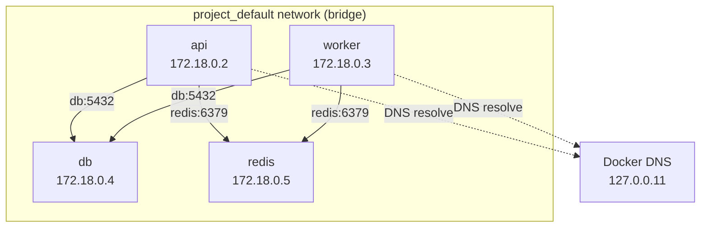
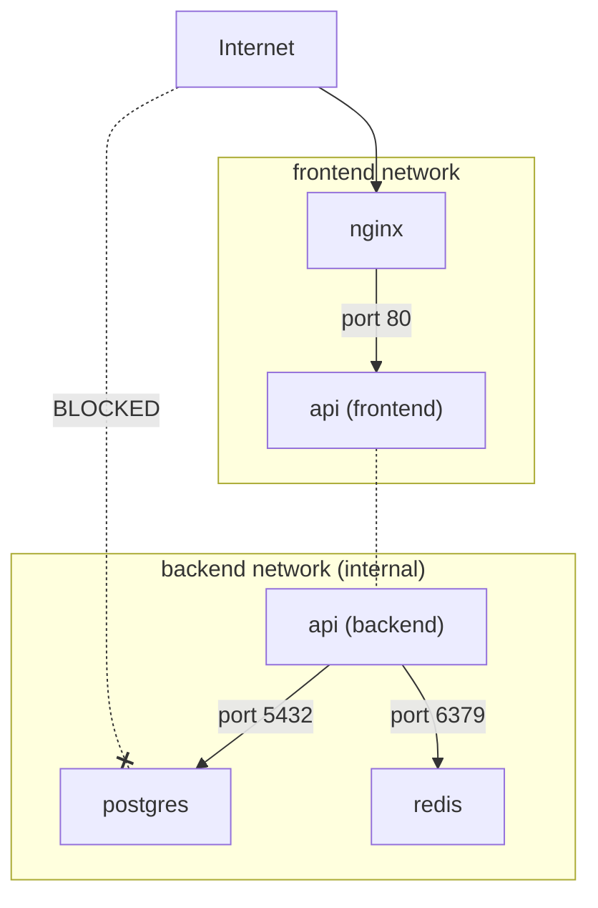

# 🌐 Compose Networking — Service Discovery & Communication

> **"In Docker Compose, DNS is your load balancer. Every service name is a hostname."**

---

## 1. Default Network Behavior



```yaml
# docker-compose.yml
# Compose creates a default network automatically
services:
  api:
    image: my-api
    # Can reach other services by name: db, redis, worker
    environment:
      DATABASE_URL: postgresql://postgres:secret@db:5432/mydb
      REDIS_URL: redis://redis:6379
  
  worker:
    image: my-worker
    environment:
      DATABASE_URL: postgresql://postgres:secret@db:5432/mydb
      REDIS_URL: redis://redis:6379
  
  db:
    image: postgres:16-alpine
  
  redis:
    image: redis:7-alpine
```

```bash
# Default network name: {project}_default
$ docker network ls
NETWORK ID     NAME                DRIVER    SCOPE
abc123         my-app_default      bridge    local

# All services are on this network by default
$ docker compose exec api nslookup db
Server:    127.0.0.11
Address:   127.0.0.11:53
Name:      db
Address:   172.18.0.4
```

---

## 2. Custom Networks

### Network Isolation

```yaml
services:
  # Frontend can reach API, but NOT database
  web:
    image: nginx:alpine
    networks:
      - frontend

  # API reaches both frontend and backend
  api:
    image: my-api
    networks:
      - frontend
      - backend

  # Database only accessible from backend network
  db:
    image: postgres:16-alpine
    networks:
      - backend

  # Redis only accessible from backend network
  redis:
    image: redis:7-alpine
    networks:
      - backend

networks:
  frontend:
    driver: bridge
  backend:
    driver: bridge
    internal: true    # No internet access
```



---

## 3. Service Discovery (DNS)

### How It Works

```bash
# Each service gets a DNS entry: <service-name>
# resolved by Docker embedded DNS server at 127.0.0.11

# From inside api container:
$ docker compose exec api sh

# Resolve service name
$ nslookup db
Server:    127.0.0.11
Name:      db
Address:   172.18.0.4

# With multiple replicas: round-robin DNS
$ docker compose up -d --scale worker=3

$ nslookup worker
Name:      worker
Address:   172.18.0.5
Address:   172.18.0.6
Address:   172.18.0.7
```

### DNS Aliases

```yaml
services:
  db:
    image: postgres:16-alpine
    networks:
      backend:
        aliases:
          - postgres
          - database
          - primary-db
    # Now reachable as: db, postgres, database, primary-db
```

### Custom DNS Configuration

```yaml
services:
  api:
    image: my-api
    dns:
      - 8.8.8.8
      - 8.8.4.4
    dns_search:
      - mycompany.local
    extra_hosts:
      - "host.docker.internal:host-gateway"   # Access host machine
      - "api.local:192.168.1.100"
```

---

## 4. Port Mapping

### Patterns

```yaml
services:
  api:
    ports:
      # HOST:CONTAINER
      - "3000:3000"                 # Map host 3000 to container 3000
      - "8080:3000"                 # Map host 8080 to container 3000
      
      # Bind to specific interface
      - "127.0.0.1:3000:3000"      # Only localhost (secure)
      - "0.0.0.0:3000:3000"        # All interfaces (default)
      
      # UDP
      - "514:514/udp"
      
      # Range
      - "8000-8100:8000-8100"
      
      # Random host port
      - "3000"                      # Container 3000 -> random host port
      
      # Long syntax
      - target: 3000               # Container port
        published: "3000"          # Host port (can be range "3000-3100")
        protocol: tcp
        host_ip: 127.0.0.1
```

### Expose vs Ports

```yaml
services:
  api:
    ports:
      - "3000:3000"    # Accessible from host AND other containers
    
  db:
    expose:
      - "5432"         # Only accessible from other containers (not host)
    # Note: Even without expose, services on same network can communicate
    # expose is mainly documentation
```

---

## 5. Internal Networks

```yaml
# Internal network: no outbound internet access
networks:
  secure-backend:
    internal: true    # Containers cannot reach internet

services:
  db:
    image: postgres:16-alpine
    networks:
      - secure-backend
    # DB cannot reach internet (good for security!)
    # But other containers on secure-backend can reach DB

  api:
    image: my-api
    networks:
      - secure-backend    # Can reach DB
      - external-net      # Can reach internet
```

---

## 6. External Networks

### Connect to Pre-existing Networks

```yaml
# Shared network across multiple Compose projects
networks:
  shared:
    external: true         # Must exist before compose up
    name: my-shared-net    # Actual network name
```

```bash
# Create shared network first
$ docker network create my-shared-net

# Project A
$ cd project-a && docker compose up -d

# Project B (shares network with Project A)
$ cd project-b && docker compose up -d
```

### Cross-Project Communication

```yaml
# Project A: docker-compose.yml
services:
  api-a:
    image: project-a-api
    networks:
      - default
      - shared

networks:
  shared:
    external: true
    name: shared-services
```

```yaml
# Project B: docker-compose.yml
services:
  api-b:
    image: project-b-api
    environment:
      # Access Project A's API by service name
      PROJECT_A_URL: http://api-a:3000
    networks:
      - default
      - shared

networks:
  shared:
    external: true
    name: shared-services
```

---

## 7. Network Configuration

### IPAM (IP Address Management)

```yaml
networks:
  app-net:
    driver: bridge
    ipam:
      driver: default
      config:
        - subnet: 172.28.0.0/16
          ip_range: 172.28.5.0/24    # Only assign from this range
          gateway: 172.28.0.1

services:
  api:
    networks:
      app-net:
        ipv4_address: 172.28.0.10    # Static IP (avoid if possible)
  
  db:
    networks:
      app-net:
        ipv4_address: 172.28.0.20
```

### Driver Options

```yaml
networks:
  # Custom bridge with specific options
  isolated:
    driver: bridge
    driver_opts:
      com.docker.network.bridge.enable_icc: "false"     # Disable inter-container comm
      com.docker.network.bridge.enable_ip_masquerade: "true"
      com.docker.network.bridge.host_binding_ipv4: "127.0.0.1"
    
  # Macvlan (containers get IPs on physical network)
  physical:
    driver: macvlan
    driver_opts:
      parent: eth0
    ipam:
      config:
        - subnet: 192.168.1.0/24
          gateway: 192.168.1.1
```

---

## 8. Load Balancing with Nginx

```yaml
services:
  nginx:
    image: nginx:alpine
    ports:
      - "80:80"
    volumes:
      - ./nginx.conf:/etc/nginx/nginx.conf:ro
    depends_on:
      - api
    networks:
      - frontend

  api:
    build: ./apps/api
    deploy:
      replicas: 3
    expose:
      - "3000"
    networks:
      - frontend
      - backend

  db:
    image: postgres:16-alpine
    networks:
      - backend

networks:
  frontend:
  backend:
    internal: true
```

```nginx
# nginx.conf
upstream api_backend {
    # Compose DNS resolves 'api' to all replicas
    server api:3000;
}

server {
    listen 80;

    location /api/ {
        proxy_pass http://api_backend/;
        proxy_set_header Host $host;
        proxy_set_header X-Real-IP $remote_addr;
        proxy_set_header X-Forwarded-For $proxy_add_x_forwarded_for;
    }

    location / {
        root /usr/share/nginx/html;
        index index.html;
    }
}
```

---

## 9. Network Troubleshooting

```bash
# List all networks
$ docker network ls

# Inspect network
$ docker network inspect my-app_default
# Shows: subnet, gateway, connected containers, IPs

# Check container network settings
$ docker compose exec api ip addr
$ docker compose exec api cat /etc/resolv.conf
# Should show: nameserver 127.0.0.11

# Test connectivity between containers
$ docker compose exec api ping db
$ docker compose exec api wget -qO- http://api:3000/health

# DNS resolution test
$ docker compose exec api nslookup db
$ docker compose exec api nslookup worker

# Check iptables rules (from host)
$ sudo iptables -L -n -t nat | grep 3000

# Trace network traffic
$ docker compose exec api tcpdump -i eth0 host db
```

---

## 10. Common Networking Patterns

### Pattern 1: API Gateway

```yaml
services:
  gateway:
    image: nginx:alpine
    ports:
      - "80:80"
    networks:
      - frontend

  auth-service:
    image: auth-api
    networks:
      - frontend
      - backend

  user-service:
    image: user-api
    networks:
      - frontend
      - backend

  db:
    image: postgres:16
    networks:
      - backend

networks:
  frontend:
  backend:
    internal: true
```

### Pattern 2: Sidecar

```yaml
services:
  api:
    image: my-api
    network_mode: "service:envoy"  # Share network namespace with envoy

  envoy:
    image: envoyproxy/envoy
    ports:
      - "8080:8080"
      - "8443:8443"
```

### Pattern 3: Host Network (Max Performance)

```yaml
services:
  high-perf-app:
    image: my-app
    network_mode: host     # Use host network directly
    # No port mapping needed, app binds directly to host ports
    # Caution: no network isolation!
```

---

## 11. Interview Questions

**Q: Service A trên network-1, Service B trên network-2, làm sao để chúng communicate?**

A: 3 cách:
1. Tạo service trung gian (proxy) nằm trên cả 2 networks
2. Cho 1 trong 2 service join cả 2 networks
3. Dùng external network mà cả 2 project cùng join
- Recommendation: option 2 (simplest)

**Q: Tại sao container không resolve được DNS của service khác?**

A: Common causes:
1. Containers trên different networks (phải cùng network)
2. Dùng alpine image (thiếu DNS tools, cần: `apk add bind-tools`)
3. Custom DNS config override Docker embedded DNS
4. Container not fully started yet (race condition)
5. Typo trong service name

**Q: `ports` vs `expose` khác nhau gì?**

A:
- `ports`: Map host port -> container port (accessible from outside)
- `expose`: Document container port (only useful for metadata/documentation)
- Reality: containers trên cùng network có thể communicate qua ANY port mà service listen on — không cần `expose` hay `ports`
- `ports` chỉ cần khi muốn access từ host machine hoặc external
