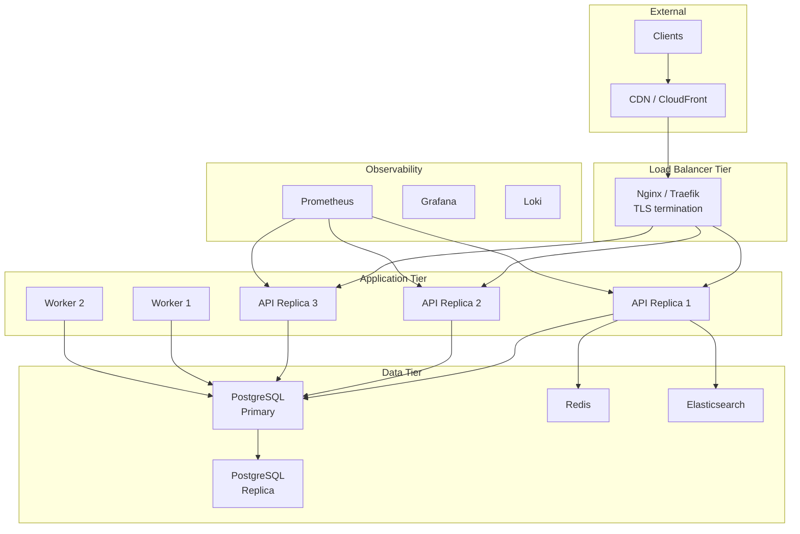
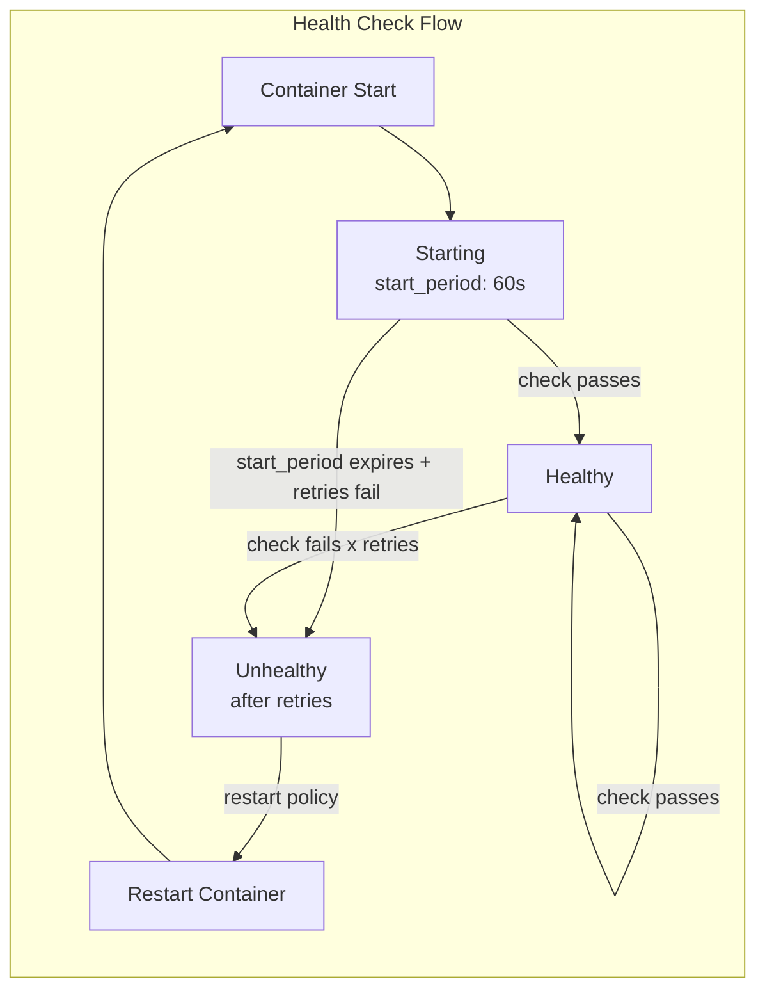

# 🏭 Compose Production — Deploy with Confidence

> **"Development is easy. Production is where containers prove their worth."**

---

## 1. Production Architecture



---

## 2. Production docker-compose.yml

```yaml
# docker-compose.prod.yml
name: file-processor-prod

x-common-env: &common-env
  NODE_ENV: production
  LOG_LEVEL: warn
  LOG_FORMAT: json

x-restart-policy: &restart-policy
  restart: unless-stopped

x-healthcheck-defaults: &healthcheck-defaults
  interval: 30s
  timeout: 10s
  retries: 3
  start_period: 60s

services:
  # === Load Balancer ===
  nginx:
    image: nginx:1.25-alpine
    <<: *restart-policy
    ports:
      - "80:80"
      - "443:443"
    volumes:
      - ./config/nginx/nginx.conf:/etc/nginx/nginx.conf:ro
      - ./config/nginx/conf.d:/etc/nginx/conf.d:ro
      - ./certs:/etc/nginx/certs:ro
      - nginx-cache:/var/cache/nginx
    depends_on:
      api:
        condition: service_healthy
    healthcheck:
      test: ["CMD", "nginx", "-t"]
      <<: *healthcheck-defaults
    deploy:
      resources:
        limits:
          cpus: "1.0"
          memory: 256M
    networks:
      - frontend
    logging:
      driver: local
      options:
        max-size: 50m
        max-file: "5"

  # === API Service ===
  api:
    image: ${REGISTRY}/file-processor-api:${VERSION}
    <<: *restart-policy
    expose:
      - "3000"
    environment:
      <<: *common-env
      PORT: 3000
      DATABASE_URL: postgresql://${DB_USER}:${DB_PASSWORD}@db:5432/${DB_NAME}
      REDIS_URL: redis://redis:6379
      ELASTICSEARCH_URL: http://elasticsearch:9200
    secrets:
      - db_password
      - jwt_secret
    healthcheck:
      test: ["CMD", "wget", "--spider", "-q", "http://localhost:3000/health"]
      <<: *healthcheck-defaults
    deploy:
      replicas: 3
      resources:
        limits:
          cpus: "2.0"
          memory: 1G
        reservations:
          cpus: "0.5"
          memory: 256M
      update_config:
        parallelism: 1
        delay: 30s
        order: start-first
    networks:
      - frontend
      - backend
    read_only: true
    tmpfs:
      - /tmp:size=100m
    security_opt:
      - no-new-privileges:true
    logging:
      driver: local
      options:
        max-size: 100m
        max-file: "10"

  # === Background Workers ===
  worker:
    image: ${REGISTRY}/file-processor-worker:${VERSION}
    <<: *restart-policy
    environment:
      <<: *common-env
      DATABASE_URL: postgresql://${DB_USER}:${DB_PASSWORD}@db:5432/${DB_NAME}
      QUEUE_URL: ${SQS_QUEUE_URL}
    secrets:
      - db_password
    deploy:
      replicas: 2
      resources:
        limits:
          cpus: "4.0"
          memory: 2G
        reservations:
          cpus: "1.0"
          memory: 512M
    networks:
      - backend
    read_only: true
    tmpfs:
      - /tmp:size=500m
    security_opt:
      - no-new-privileges:true

  # === Database ===
  db:
    image: postgres:16-alpine
    <<: *restart-policy
    volumes:
      - db-data:/var/lib/postgresql/data
      - ./config/postgres/postgresql.conf:/etc/postgresql/postgresql.conf:ro
      - ./config/postgres/pg_hba.conf:/etc/postgresql/pg_hba.conf:ro
    command: postgres -c config_file=/etc/postgresql/postgresql.conf
    environment:
      POSTGRES_DB: ${DB_NAME}
      POSTGRES_USER: ${DB_USER}
      POSTGRES_PASSWORD_FILE: /run/secrets/db_password
    secrets:
      - db_password
    healthcheck:
      test: ["CMD-SHELL", "pg_isready -U ${DB_USER} -d ${DB_NAME}"]
      interval: 10s
      timeout: 5s
      retries: 5
    deploy:
      resources:
        limits:
          cpus: "4.0"
          memory: 8G
        reservations:
          cpus: "2.0"
          memory: 4G
    networks:
      - backend
    shm_size: 256m
    logging:
      driver: local
      options:
        max-size: 100m
        max-file: "10"

  # === Cache ===
  redis:
    image: redis:7-alpine
    <<: *restart-policy
    command: redis-server --maxmemory 512mb --maxmemory-policy allkeys-lru --appendonly yes
    volumes:
      - redis-data:/data
    healthcheck:
      test: ["CMD", "redis-cli", "ping"]
      interval: 10s
      timeout: 5s
      retries: 5
    deploy:
      resources:
        limits:
          cpus: "1.0"
          memory: 768M
    networks:
      - backend

  # === Search ===
  elasticsearch:
    image: opensearchproject/opensearch:2.11.0
    <<: *restart-policy
    volumes:
      - es-data:/usr/share/opensearch/data
    environment:
      - discovery.type=single-node
      - DISABLE_SECURITY_PLUGIN=true
      - "OPENSEARCH_JAVA_OPTS=-Xms2g -Xmx2g"
    healthcheck:
      test: ["CMD", "curl", "-f", "http://localhost:9200/_cluster/health"]
      interval: 30s
      timeout: 15s
      retries: 5
      start_period: 120s
    deploy:
      resources:
        limits:
          cpus: "4.0"
          memory: 6G
        reservations:
          cpus: "2.0"
          memory: 4G
    networks:
      - backend
    ulimits:
      memlock:
        soft: -1
        hard: -1
      nofile:
        soft: 65536
        hard: 65536

# === Networks ===
networks:
  frontend:
    driver: bridge
  backend:
    driver: bridge
    internal: true

# === Volumes ===
volumes:
  db-data:
    driver: local
  redis-data:
    driver: local
  es-data:
    driver: local
  nginx-cache:
    driver: local

# === Secrets ===
secrets:
  db_password:
    file: ./secrets/db-password.txt
  jwt_secret:
    file: ./secrets/jwt-secret.txt
```

---

## 3. Health Checks Strategy



### Multi-Level Health Checks

```yaml
services:
  api:
    healthcheck:
      # Liveness: is the process alive?
      test: ["CMD", "wget", "--spider", "-q", "http://localhost:3000/health"]
      interval: 15s
      timeout: 5s
      retries: 3
      start_period: 30s
```

```typescript
// Health check endpoint with dependency checks
@Controller('health')
export class HealthController {
  @Get()
  async check() {
    return { status: 'ok', timestamp: Date.now() };
  }

  @Get('ready')
  async readiness() {
    const checks = await Promise.allSettled([
      this.checkDatabase(),
      this.checkRedis(),
      this.checkElasticsearch(),
    ]);

    const results = {
      database: checks[0].status === 'fulfilled',
      redis: checks[1].status === 'fulfilled',
      elasticsearch: checks[2].status === 'fulfilled',
    };

    const allHealthy = Object.values(results).every(Boolean);
    
    if (!allHealthy) {
      throw new ServiceUnavailableException({ status: 'degraded', checks: results });
    }
    return { status: 'ready', checks: results };
  }
}
```

---

## 4. Rolling Updates

### Update Strategy

```yaml
services:
  api:
    deploy:
      replicas: 3
      update_config:
        parallelism: 1          # Update 1 container at a time
        delay: 30s              # Wait 30s between updates
        failure_action: rollback # Rollback on failure
        monitor: 60s            # Monitor for 60s after update
        order: start-first      # Start new before stopping old
      rollback_config:
        parallelism: 1
        delay: 10s
        order: start-first
```

### Deployment Script

```bash
#!/bin/bash
# deploy.sh - Zero-downtime deployment
set -e

REGISTRY="myregistry.com"
VERSION="${1:?Usage: deploy.sh <version>}"
COMPOSE_FILE="-f docker-compose.yml -f docker-compose.prod.yml"

echo "==== Deploying version: $VERSION ===="

# 1. Pull new images
echo "Pulling images..."
VERSION=$VERSION docker compose $COMPOSE_FILE pull api worker

# 2. Rolling update API (one at a time)
echo "Updating API..."
VERSION=$VERSION docker compose $COMPOSE_FILE up -d \
    --no-deps \
    --scale api=3 \
    api

# 3. Wait for health checks
echo "Waiting for health checks..."
for i in $(seq 1 30); do
    HEALTHY=$(docker compose ps api --format json | \
        python3 -c "import sys,json; \
        data=[json.loads(l) for l in sys.stdin]; \
        print(sum(1 for d in data if 'healthy' in d.get('Health','')))")
    
    if [ "$HEALTHY" = "3" ]; then
        echo "All API replicas healthy!"
        break
    fi
    echo "  Healthy: $HEALTHY/3 - waiting..."
    sleep 10
done

# 4. Update workers
echo "Updating workers..."
VERSION=$VERSION docker compose $COMPOSE_FILE up -d \
    --no-deps \
    worker

echo "==== Deployment complete: $VERSION ===="
```

---

## 5. Logging Strategy

### Structured Logging

```yaml
services:
  api:
    logging:
      driver: local          # Better performance than json-file
      options:
        max-size: 100m       # Max log file size
        max-file: "10"       # Keep 10 rotated files
        compress: "true"     # Compress rotated files

  # Forward logs to Loki
  api-with-loki:
    logging:
      driver: loki
      options:
        loki-url: "http://loki:3100/loki/api/v1/push"
        loki-batch-size: "400"
        loki-retries: "2"
        loki-timeout: "2s"
        labels: "service=api,environment=production"

  # Forward logs to Fluentd
  api-with-fluentd:
    logging:
      driver: fluentd
      options:
        fluentd-address: "fluentd:24224"
        tag: "docker.{{.Name}}"
        fluentd-async: "true"
```

### Centralized Logging Stack

```yaml
services:
  # Log aggregator
  loki:
    image: grafana/loki:2.9.0
    volumes:
      - loki-data:/loki
    command: -config.file=/etc/loki/local-config.yaml
    networks:
      - monitoring

  # Log collector
  promtail:
    image: grafana/promtail:2.9.0
    volumes:
      - /var/log:/var/log:ro
      - /var/lib/docker/containers:/var/lib/docker/containers:ro
      - ./config/promtail.yml:/etc/promtail/config.yml:ro
    command: -config.file=/etc/promtail/config.yml
    networks:
      - monitoring

  # Visualization
  grafana:
    image: grafana/grafana:10.3.0
    ports:
      - "3001:3000"
    volumes:
      - grafana-data:/var/lib/grafana
    networks:
      - monitoring
```

---

## 6. Backup Strategy

### Automated Database Backup

```yaml
services:
  db-backup:
    image: postgres:16-alpine
    entrypoint: /bin/sh
    command:
      - -c
      - |
        while true; do
          TIMESTAMP=$$(date +%Y%m%d_%H%M%S)
          BACKUP_FILE="/backups/db_$${TIMESTAMP}.sql.gz"
          echo "Creating backup: $${BACKUP_FILE}"
          PGPASSWORD=$$POSTGRES_PASSWORD pg_dump \
            -h db -U $$POSTGRES_USER -d $$POSTGRES_DB \
            | gzip > $$BACKUP_FILE
          
          # Keep last 7 days of backups
          find /backups -name "db_*.sql.gz" -mtime +7 -delete
          
          echo "Backup complete. Next in 6 hours..."
          sleep 21600
        done
    environment:
      POSTGRES_USER: ${DB_USER}
      POSTGRES_PASSWORD_FILE: /run/secrets/db_password
      POSTGRES_DB: ${DB_NAME}
    secrets:
      - db_password
    volumes:
      - db-backups:/backups
    depends_on:
      db:
        condition: service_healthy
    networks:
      - backend
    deploy:
      resources:
        limits:
          cpus: "0.5"
          memory: 256M
    restart: unless-stopped
```

---

## 7. Production Checklist

```markdown
## Pre-Deployment
- [ ] All images tagged with specific version (NOT :latest)
- [ ] Images scanned for vulnerabilities (Trivy)
- [ ] docker-compose.prod.yml reviewed and tested
- [ ] Secrets stored securely (not in env vars)
- [ ] Resource limits set for ALL services
- [ ] Health checks configured for ALL services
- [ ] Logging configured with rotation
- [ ] Backup strategy in place and tested

## Runtime Configuration
- [ ] restart: unless-stopped on all services
- [ ] read_only filesystem where possible
- [ ] no-new-privileges security option
- [ ] Internal networks for backend services
- [ ] Only necessary ports exposed (127.0.0.1 binding)
- [ ] TLS for external-facing services
- [ ] Log rotation prevents disk fill

## Monitoring
- [ ] Container metrics collected (Prometheus/cAdvisor)
- [ ] Logs centralized (Loki/ELK)
- [ ] Alerts configured (disk, CPU, memory, OOM kills)
- [ ] Dashboard for service health overview
- [ ] Backup monitoring and alerts

## Disaster Recovery
- [ ] Database backup schedule active
- [ ] Volume backup strategy documented
- [ ] Recovery procedure tested
- [ ] Rollback procedure documented and tested
- [ ] Runbook for common incidents
```

---

## 8. Interview Questions

**Q: Docker Compose có dùng được cho production không?**

A: Depends on scale:
- Small/medium deployments (< 10 services, single host): Yes, with proper config
- Large scale (multi-host, HA): Consider Kubernetes or Docker Swarm
- Compose advantages in production: simple, reproducible, easy to understand
- Compose limitations: single host, no auto-scaling, no self-healing across hosts, limited rolling update support

**Q: Làm sao đảm bảo zero-downtime deployment với Compose?**

A: Strategy:
1. Health checks on all services (ensure readiness before routing traffic)
2. `deploy.update_config.order: start-first` (new container starts before old stops)
3. `parallelism: 1` + `delay: 30s` (update one at a time, wait between)
4. Load balancer (Nginx) with upstream health checks
5. Rolling update script: pull → update → verify health → next
6. Rollback plan if health checks fail

**Q: Secret management trong Docker Compose production?**

A: Best practices:
1. File-based secrets (`secrets:` section, mounted at `/run/secrets/`)
2. NEVER use environment variables for passwords
3. External secret manager (Vault, AWS Secrets Manager) + init container
4. Encrypt secrets at rest, rotate regularly
5. `.env` file with restricted permissions (600), gitignored
