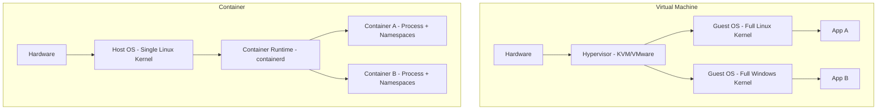
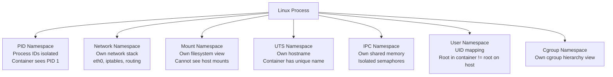
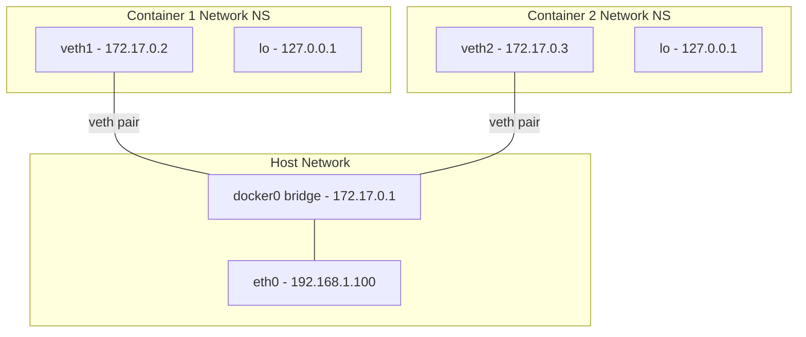
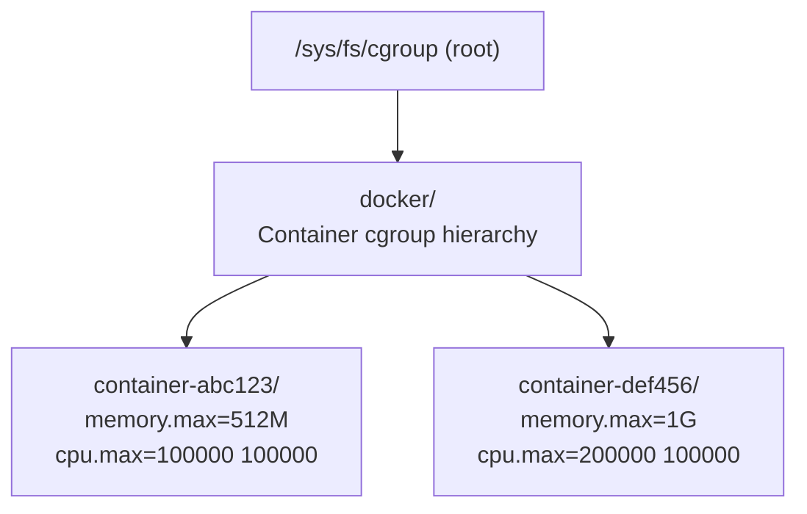
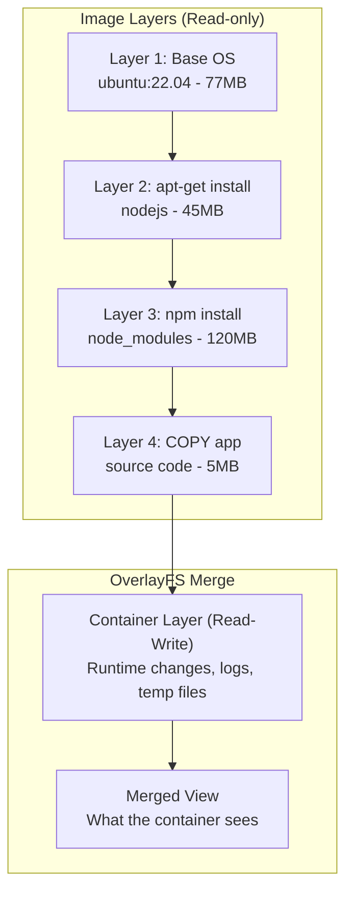
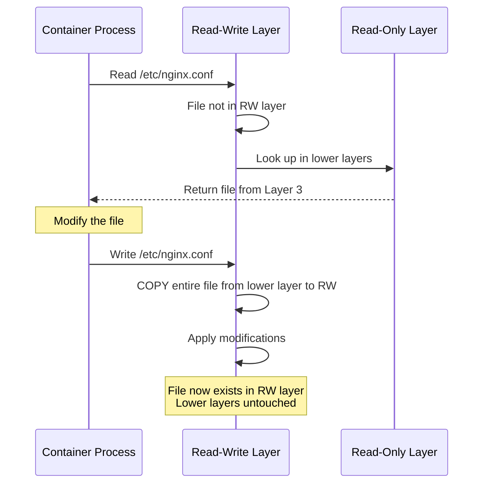
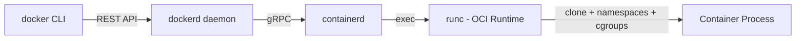
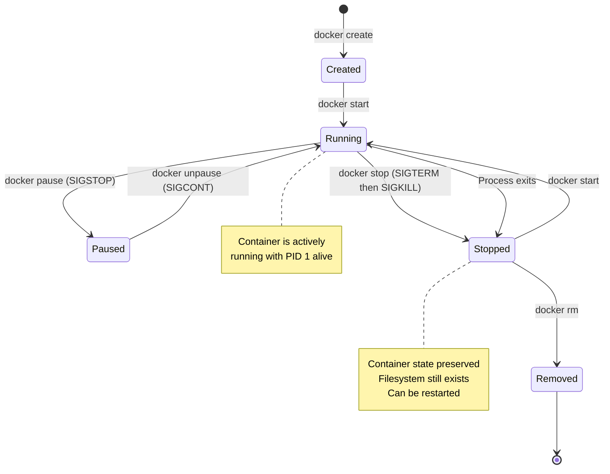

# 🔬 Container Fundamentals — Linux Kernel Internals

> **"A container is just a process with special kernel features applied."**
> Hiểu bản chất này sẽ thay đổi hoàn toàn cách bạn debug, secure, và optimize containers.

---

## 1. Container vs Virtual Machine — The Real Difference



| | VM | Container |
|---|---|---|
| **Isolation level** | Hardware-level (Hypervisor) | OS-level (Kernel features) |
| **Boot time** | Minutes | Milliseconds |
| **Size** | GBs (full OS) | MBs (just app + deps) |
| **Kernel** | Each VM has its own kernel | Shares host kernel |
| **Overhead** | High (duplicate OS) | Minimal |
| **Security** | Stronger isolation | Weaker (shared kernel attack surface) |
| **Use case** | Multi-tenant, different OS | Microservices, CI/CD, dev environments |

### The Critical Insight

Container **KHÔNG** phải VM nhỏ. Container là một **Linux process** bình thường, nhưng kernel áp dụng 3 cơ chế isolation:

1. **Namespaces** — Cô lập NHÌN THẤY gì (PID, Network, Mount, User...)
2. **Cgroups** — Giới hạn DÙNG ĐƯỢC bao nhiêu (CPU, RAM, IO...)
3. **Union Filesystem** — Layer filesystem hiệu quả (OverlayFS)

---

## 2. Linux Namespaces — Isolation Layer

Namespaces tạo ra "ảo giác" rằng container đang chạy trên OS riêng. Mỗi namespace cô lập một tài nguyên kernel cụ thể.



### 2.1 PID Namespace

```bash
# Trên Host: process chạy container có PID bình thường
$ ps aux | grep nginx
root  45231  0.0  0.1  nginx: master process

# Trong Container: cùng process nhưng thấy PID 1
$ docker exec nginx-container ps aux
PID  USER  COMMAND
  1  root  nginx: master process
 12  nginx nginx: worker process
```

**Why PID 1 matters:**
- PID 1 trong container nhận tất cả signals (SIGTERM, SIGKILL)
- Nếu PID 1 chết → container dừng
- PID 1 PHẢI handle zombie processes (reaping)
- **Problem:** Nếu dùng shell script làm entrypoint, shell trở thành PID 1 và KHÔNG forward signals

```dockerfile
# BAD: shell là PID 1, không forward SIGTERM
ENTRYPOINT /start.sh

# GOOD: exec form, app là PID 1, nhận signals trực tiếp
ENTRYPOINT ["node", "server.js"]

# BEST: dùng tini/dumb-init để handle PID 1 responsibilities
ENTRYPOINT ["tini", "--", "node", "server.js"]
```

### 2.2 Network Namespace

Mỗi container có network stack riêng: interfaces, routing table, iptables rules.



```bash
# Xem network namespace của container
$ docker inspect --format '{{.NetworkSettings.SandboxKey}}' my-container
/var/run/docker/netns/abc123

# Enter network namespace manually
$ nsenter --net=/var/run/docker/netns/abc123 ip addr
$ nsenter --net=/var/run/docker/netns/abc123 iptables -L
```

### 2.3 Mount Namespace

```bash
# Container chỉ thấy filesystem của nó
$ docker exec my-container ls /
bin  dev  etc  home  lib  proc  root  sys  tmp  usr  var

# Host thấy toàn bộ + overlay mount
$ cat /proc/mounts | grep overlay
overlay /var/lib/docker/overlay2/abc123/merged overlay rw,lowerdir=...,upperdir=...,workdir=...
```

### 2.4 User Namespace (Critical for Security)

```bash
# Without user namespace: root in container = root on host (DANGEROUS!)
$ docker run --rm alpine id
uid=0(root) gid=0(root)

# With user namespace remapping: root in container = unprivileged on host
# /etc/docker/daemon.json
{
  "userns-remap": "default"
}

# Now: container root = host uid 100000
$ docker run --rm alpine cat /proc/self/uid_map
         0     100000      65536
```

---

## 3. Control Groups (Cgroups) — Resource Limits

Cgroups giới hạn tài nguyên mà process (container) được phép sử dụng. Docker dùng cgroups v2 (mới) hoặc cgroups v1 (legacy).



### 3.1 Memory Limits

```bash
# Giới hạn 512MB RAM
$ docker run -m 512m --memory-swap 512m nginx

# Xem memory stats
$ docker stats --no-stream my-container
CONTAINER   MEM USAGE / LIMIT   MEM %
abc123      45.2MiB / 512MiB    8.83%

# Xem cgroup trực tiếp
$ cat /sys/fs/cgroup/docker/abc123/memory.max
536870912  # 512MB in bytes

$ cat /sys/fs/cgroup/docker/abc123/memory.current
47382528   # Current usage
```

**OOM Killer behavior:**
```bash
# Khi container vượt memory limit:
# 1. Kernel OOM Killer giết process trong container
# 2. Docker log: "Container killed - OOM"
# 3. Container restart (nếu --restart=always)

# Check OOM events
$ docker inspect --format '{{.State.OOMKilled}}' my-container
true

# Cgroups v2: memory.events cho chi tiết
$ cat /sys/fs/cgroup/docker/abc123/memory.events
low 0
high 0
max 3      # OOM happened 3 times
oom 3
oom_kill 3
```

### 3.2 CPU Limits

```bash
# CPU shares (relative weight, soft limit)
$ docker run --cpu-shares 512 nginx
# Default = 1024. Container có 512 = 50% priority khi compete

# CPU quota (hard limit)
$ docker run --cpus 1.5 nginx
# Container chỉ được dùng 1.5 CPU cores

# CPU pinning (bind to specific cores)
$ docker run --cpuset-cpus "0,1" nginx
# Chỉ chạy trên CPU 0 và 1 (giảm context switching, tốt cho NUMA)
```

**Cgroups v2 CPU values:**
```bash
$ cat /sys/fs/cgroup/docker/abc123/cpu.max
150000 100000
# Format: quota period (microseconds)
# 150000/100000 = 1.5 CPUs

$ cat /sys/fs/cgroup/docker/abc123/cpu.stat
usage_usec 45892341
user_usec 38291823
system_usec 7600518
nr_periods 12834
nr_throttled 23      # Số lần bị throttle!
throttled_usec 892341 # Tổng thời gian bị throttle
```

### 3.3 IO Limits

```bash
# Limit disk IO
$ docker run --device-read-bps /dev/sda:10mb \
             --device-write-bps /dev/sda:10mb \
             nginx

# Cgroups v2 IO control
$ cat /sys/fs/cgroup/docker/abc123/io.max
8:0 rbps=10485760 wbps=10485760 riops=max wiops=max
```

### 3.4 PIDs Limit

```bash
# Chống fork bomb
$ docker run --pids-limit 100 nginx

# Default: unlimited (DANGEROUS!)
# Production nên set 100-500 tuỳ app
```

---

## 4. Union Filesystem (OverlayFS)

Docker dùng **OverlayFS** (default trên Linux) để tạo layered filesystem hiệu quả.



### 4.1 How OverlayFS Works

```bash
# OverlayFS directories
$ ls /var/lib/docker/overlay2/abc123/
diff/       # This layer's changes (upperdir)
lower       # List of lower layer paths
merged/     # Union mount point (what container sees)
work/       # OverlayFS working directory

# Mount command
mount -t overlay overlay \
  -o lowerdir=/layer4:/layer3:/layer2:/layer1,\
     upperdir=/container-rw,\
     workdir=/work \
  /merged
```

### 4.2 Copy-on-Write (CoW)



**Performance Implications:**
- **First write** to a file from lower layer = expensive (full copy)
- **Subsequent writes** = normal speed (already in RW layer)
- **Delete** = whiteout file in RW layer (file hidden, not deleted from lower)
- **Many small files** = more overhead than few large files

```bash
# Xem layer sizes
$ docker history my-image
IMAGE          CREATED         SIZE      COMMENT
abc123         2 hours ago     5.2MB     COPY . /app
def456         2 hours ago     120MB     RUN npm ci --production
789012         3 hours ago     45MB      RUN apt-get install nodejs
345678         2 weeks ago     77MB      ubuntu:22.04
```

### 4.3 Storage Driver Comparison

| Driver | Mechanism | Performance | Use Case |
|--------|-----------|-------------|----------|
| **overlay2** | OverlayFS | Excellent | Default, recommended |
| **btrfs** | B-tree FS | Good | CoW-native filesystem |
| **zfs** | ZFS | Good | Production with ZFS infrastructure |
| **devicemapper** | Block-level | Poor | Legacy, avoid |
| **vfs** | No CoW | Worst | Testing only, no layer sharing |

```bash
# Check current storage driver
$ docker info | grep "Storage Driver"
Storage Driver: overlay2

# Check space usage
$ docker system df
TYPE           TOTAL   ACTIVE   SIZE      RECLAIMABLE
Images         15      5        3.2GB     2.1GB (65%)
Containers     8       3        125MB     89MB (71%)
Local Volumes  12      4        890MB     456MB (51%)
Build Cache    0       0        0B        0B
```

---

## 5. OCI Runtime Specification

Docker không chạy container trực tiếp. Nó ủy quyền cho **OCI-compliant runtime**.



### Component Responsibilities

| Component | Role | Can be replaced by |
|-----------|------|-------------------|
| **docker CLI** | User interface | nerdctl, podman |
| **dockerd** | API server, build, network | - |
| **containerd** | Container lifecycle, image management | CRI-O |
| **runc** | Create container (set namespaces + cgroups) | crun, gVisor, Kata |
| **shim** | Keep container running without containerd | containerd-shim-runc-v2 |

### Alternative Runtimes

| Runtime | Isolation | Overhead | Use Case |
|---------|-----------|----------|----------|
| **runc** | Namespaces + Cgroups | Minimal | Default, production |
| **crun** | Same as runc (written in C) | Lower than runc | Performance-critical |
| **gVisor (runsc)** | User-space kernel | Medium | Security-sensitive workloads |
| **Kata Containers** | Lightweight VM per container | Higher | Multi-tenant, untrusted code |
| **Firecracker** | MicroVM | Low | AWS Lambda, Fargate |

```bash
# Use gVisor runtime
$ docker run --runtime=runsc my-app

# Use Kata runtime
$ docker run --runtime=kata my-app

# Check available runtimes
$ docker info | grep -A5 Runtimes
 Runtimes: io.containerd.runc.v2 runc
 Default Runtime: runc
```

---

## 6. Container Lifecycle



### Graceful Shutdown Deep Dive

```bash
# docker stop sends SIGTERM to PID 1
# waits 10s (default) then sends SIGKILL
$ docker stop --time 30 my-container  # Wait 30s before SIGKILL

# docker kill sends SIGKILL immediately (no grace period)
$ docker kill my-container

# VERY IMPORTANT for Node.js:
```

```javascript
// Node.js PID 1 MUST handle SIGTERM
process.on('SIGTERM', async () => {
  console.log('SIGTERM received, shutting down gracefully...');
  
  // 1. Stop accepting new connections
  server.close();
  
  // 2. Finish in-flight requests (drain)
  await drainConnections();
  
  // 3. Close DB connections
  await db.disconnect();
  
  // 4. Exit cleanly
  process.exit(0);
});

// If not handled: container gets SIGKILL after timeout
// Result: connections dropped, transactions incomplete, data corruption
```

---

## 7. Hands-On Lab: Build Container Without Docker

```bash
#!/bin/bash
# Create a container manually using Linux primitives

# 1. Create a minimal root filesystem
mkdir -p /tmp/container/rootfs
cd /tmp/container

# Extract a base filesystem
docker export $(docker create alpine) | tar -C rootfs -xf -

# 2. Create namespaces and run a process
unshare --mount --uts --ipc --net --pid --fork --mount-proc \
  chroot rootfs /bin/sh

# Inside the "container":
# hostname my-container
# ps aux
# PID  USER  COMMAND
#   1  root  /bin/sh    ← We are PID 1!

# 3. From host, set cgroup limits
CONTAINER_PID=$(pgrep -f "chroot rootfs")
mkdir /sys/fs/cgroup/my-container
echo $CONTAINER_PID > /sys/fs/cgroup/my-container/cgroup.procs
echo "536870912" > /sys/fs/cgroup/my-container/memory.max  # 512MB
echo "100000 100000" > /sys/fs/cgroup/my-container/cpu.max  # 1 CPU
```

---

## 8. Interview Questions & Common Pitfalls

### Q: Container chạy với root user có nguy hiểm không?
**A:** Rất nguy hiểm nếu không dùng User Namespace. Container root = Host root. Một container escape vulnerability cho phép kẻ tấn công full control host. **Always** chạy container với non-root user hoặc enable `userns-remap`.

### Q: Tại sao container chết khi PID 1 exit?
**A:** Linux kernel requirement. Khi PID 1 (init process) của một PID namespace chết, kernel gửi SIGKILL tới tất cả processes trong namespace đó. Đây là by design — không có init = orphan processes không ai reap.

### Q: Docker container có thể chạy Windows app trên Linux host không?
**A:** Không. Container chia sẻ kernel với host. Windows containers cần Windows kernel. Trên Docker Desktop (Mac/Windows), Docker chạy một Linux VM ẩn để host Linux containers.

### Q: overlay2 có vấn đề gì cần biết?
- **inode exhaustion**: Mỗi file trong overlay = inode. Nhiều small files = hết inode trước khi hết disk
- **First-write penalty**: Copy-on-Write penalty khi write lần đầu vào file từ lower layer
- **whiteout files**: Delete không thực sự xóa, tạo whiteout marker. Image size không giảm

### Q: Cgroups v1 vs v2 khác nhau gì?
| | Cgroups v1 | Cgroups v2 |
|---|---|---|
| **Hierarchy** | Multiple hierarchies (mỗi controller riêng) | Single unified hierarchy |
| **Memory** | memory.limit_in_bytes | memory.max |
| **CPU** | cpu.cfs_quota_us + cpu.cfs_period_us | cpu.max (quota period) |
| **IO** | blkio controller (limited) | io controller (better) |
| **Pressure** | Not available | PSI (Pressure Stall Information) |
| **Default since** | Legacy | Docker 20.10+, Kubernetes 1.25+ |
