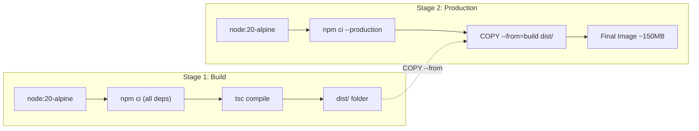
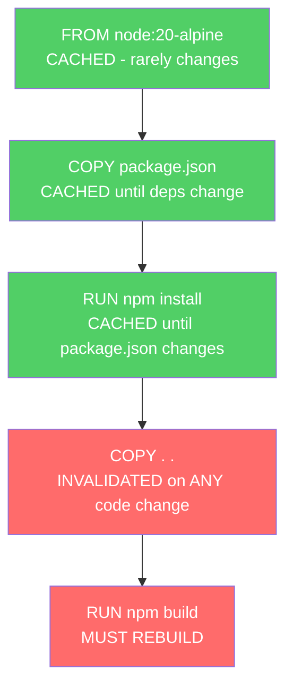
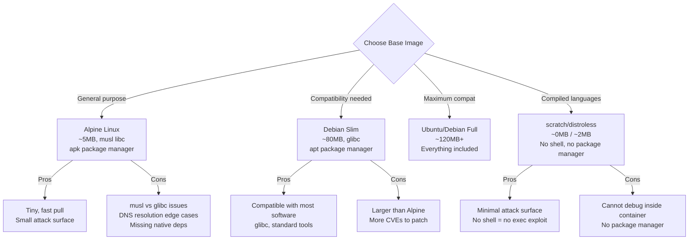

# 🏗️ Dockerfile Best Practices — Build Like a Senior

> **"Your Dockerfile is your application's infrastructure-as-code. Treat it with the same rigor as production code."**

---

## 1. Multi-stage Builds — The Foundation

Multi-stage builds giúp tách **build environment** (compiler, dev dependencies) khỏi **runtime image** (chỉ binary + runtime deps).



### NestJS Application Example

```dockerfile
# ============ Stage 1: Build ============
FROM node:20-alpine AS build

WORKDIR /app

# Copy package files first (layer caching)
COPY package.json pnpm-lock.yaml ./
RUN corepack enable && pnpm install --frozen-lockfile

# Copy source and build
COPY tsconfig*.json nest-cli.json ./
COPY src/ ./src/
RUN pnpm run build

# ============ Stage 2: Production Dependencies ============
FROM node:20-alpine AS deps

WORKDIR /app
COPY package.json pnpm-lock.yaml ./
RUN corepack enable && pnpm install --frozen-lockfile --prod

# ============ Stage 3: Runtime ============
FROM node:20-alpine AS runtime

# Security: non-root user
RUN addgroup -g 1001 appgroup && \
    adduser -u 1001 -G appgroup -s /bin/sh -D appuser

WORKDIR /app

# Copy only what we need
COPY --from=deps --chown=appuser:appgroup /app/node_modules ./node_modules
COPY --from=build --chown=appuser:appgroup /app/dist ./dist
COPY package.json ./

# Security hardening
USER appuser

EXPOSE 3000

# Health check
HEALTHCHECK --interval=30s --timeout=3s --start-period=10s --retries=3 \
  CMD wget --no-verbose --tries=1 --spider http://localhost:3000/health || exit 1

# Use exec form, app receives signals directly
ENTRYPOINT ["node", "dist/main.js"]
```

**Result:**
```
Build stage:    ~800MB (node:20 + all deps + TypeScript compiler)
Production:     ~150MB (node:20-alpine + prod deps + compiled JS)
Savings:        ~80% reduction
```

---

## 2. Layer Optimization

### The Layer Cache Rule

Docker cache mỗi instruction. Nếu instruction KHÔNG thay đổi → dùng cache. Nếu 1 layer thay đổi → TẤT CẢ layers sau nó đều rebuild.



### BAD vs GOOD Ordering

```dockerfile
# BAD: npm install runs on EVERY code change
COPY . .
RUN npm install
RUN npm run build

# GOOD: npm install only when package.json changes
COPY package.json package-lock.json ./
RUN npm ci
COPY . .
RUN npm run build
```

### Combine RUN Commands

```dockerfile
# BAD: 3 separate layers (3 x overhead)
RUN apt-get update
RUN apt-get install -y curl
RUN apt-get clean

# GOOD: single layer + cleanup in same layer
RUN apt-get update && \
    apt-get install -y --no-install-recommends curl && \
    apt-get clean && \
    rm -rf /var/lib/apt/lists/*
```

### .dockerignore

```
# .dockerignore - MUST HAVE for every project
node_modules
dist
.git
.env
.env.*
*.md
docker-compose*.yml
.vscode
.idea
coverage
.nyc_output
test
tests
__tests__
*.test.ts
*.spec.ts
Dockerfile*
.dockerignore
```

---

## 3. BuildKit Features

BuildKit là next-gen build engine (default từ Docker 23.0+).

### 3.1 Cache Mounts

```dockerfile
# Mount npm cache giữa các builds → npm install nhanh hơn nhiều
RUN --mount=type=cache,target=/root/.npm \
    npm ci --production

# Mount apt cache
RUN --mount=type=cache,target=/var/cache/apt \
    --mount=type=cache,target=/var/lib/apt/lists \
    apt-get update && apt-get install -y curl

# Mount Go build cache
RUN --mount=type=cache,target=/root/.cache/go-build \
    go build -o /app .
```

### 3.2 Secret Mounts

```dockerfile
# Mount secrets without baking into layers
RUN --mount=type=secret,id=npm_token \
    NPM_TOKEN=$(cat /run/secrets/npm_token) \
    npm ci --registry https://registry.npmjs.org

# Build command:
$ docker build --secret id=npm_token,src=./token.txt .

# Secret is NEVER in any layer — not even in build history
```

### 3.3 SSH Mounts

```dockerfile
# Clone private repos without copying SSH keys into image
RUN --mount=type=ssh \
    git clone git@github.com:private/repo.git

# Build:
$ docker build --ssh default .
```

### 3.4 Bind Mounts (Build Context)

```dockerfile
# Mount source code without COPY (no layer created)
RUN --mount=type=bind,source=package.json,target=./package.json \
    --mount=type=bind,source=pnpm-lock.yaml,target=./pnpm-lock.yaml \
    pnpm install --frozen-lockfile
```

### 3.5 Heredoc Syntax

```dockerfile
# Multi-line scripts without backslash escaping
RUN <<EOF
  apt-get update
  apt-get install -y curl wget
  curl -fsSL https://deb.nodesource.com/setup_20.x | bash -
  apt-get install -y nodejs
  apt-get clean
  rm -rf /var/lib/apt/lists/*
EOF

# Multi-file creation
COPY <<EOF /etc/nginx/nginx.conf
server {
    listen 80;
    server_name localhost;
    location / {
        proxy_pass http://app:3000;
    }
}
EOF
```

---

## 4. Base Image Selection



### When to use what

| Image | Size | Use Case | Example |
|-------|------|----------|---------|
| **node:20-alpine** | ~180MB | Node.js apps without native deps | NestJS API, Next.js |
| **node:20-slim** | ~260MB | Node.js apps WITH native deps (sharp, bcrypt) | Image processing |
| **python:3.12-slim** | ~150MB | Python apps | FastAPI, Django |
| **golang:alpine** + **scratch** | ~10MB final | Go apps (static binary) | CLI tools, microservices |
| **gcr.io/distroless/nodejs20** | ~120MB | Maximum security Node.js | Production workloads |
| **scratch** | 0MB | Static binaries only | Go, Rust compiled apps |

### Distroless Example

```dockerfile
FROM node:20-alpine AS build
WORKDIR /app
COPY package.json pnpm-lock.yaml ./
RUN corepack enable && pnpm install --frozen-lockfile
COPY . .
RUN pnpm run build

FROM gcr.io/distroless/nodejs20-debian12
WORKDIR /app
COPY --from=build /app/dist ./dist
COPY --from=build /app/node_modules ./node_modules
COPY --from=build /app/package.json ./

EXPOSE 3000
CMD ["dist/main.js"]
# No shell, no apt, no wget — attackers can't do anything even if they get in
```

---

## 5. Security Scanning in Build

### Trivy (Recommended)

```dockerfile
# Scan during build
FROM aquasec/trivy AS scan
COPY --from=build /app /scan-target
RUN trivy filesystem --exit-code 1 --severity CRITICAL,HIGH /scan-target

# Or in CI:
# $ trivy image my-app:latest --severity CRITICAL,HIGH --exit-code 1
```

### Hadolint (Dockerfile Linter)

```bash
# Lint Dockerfile
$ docker run --rm -i hadolint/hadolint < Dockerfile

# Common warnings you should fix:
# DL3008: Pin versions in apt-get install (apt-get install curl=7.88*)
# DL3018: Pin versions in apk add
# DL3009: Delete apt lists after install
# DL3015: Avoid additional packages with apt-get
# DL4006: Set SHELL with pipefail for RUN with pipes
```

---

## 6. Production Dockerfile Checklist

```markdown
## Build
- [ ] Multi-stage build (separate build + runtime)
- [ ] .dockerignore file exists and is comprehensive
- [ ] Package files copied BEFORE source code (layer caching)
- [ ] npm ci / pnpm install --frozen-lockfile (not npm install)
- [ ] BuildKit cache mounts for package managers
- [ ] Secrets mounted, NOT copied (--mount=type=secret)
- [ ] Pin base image versions (node:20.11.1-alpine, NOT node:latest)

## Security
- [ ] Non-root USER instruction
- [ ] No secrets/credentials in any layer
- [ ] Minimal base image (alpine/slim/distroless)
- [ ] HEALTHCHECK defined
- [ ] Image scanned with Trivy/Grype
- [ ] Dockerfile linted with Hadolint

## Runtime
- [ ] ENTRYPOINT uses exec form ["node", "app.js"]
- [ ] Signal handling implemented (SIGTERM)
- [ ] tini/dumb-init for proper PID 1 behavior
- [ ] EXPOSE documents the correct port
- [ ] Labels for metadata (version, maintainer, description)

## Size
- [ ] Final image under 200MB for Node.js apps
- [ ] No dev dependencies in production image
- [ ] apt/apk cache cleaned in same RUN layer
- [ ] No unnecessary files (docs, tests, .git)
```

---

## 7. Advanced Patterns

### 7.1 Build Arguments for Flexibility

```dockerfile
ARG NODE_VERSION=20
ARG ALPINE_VERSION=3.19

FROM node:${NODE_VERSION}-alpine${ALPINE_VERSION} AS build

# Build-time only, not in final image
ARG BUILD_DATE
ARG GIT_SHA
ARG VERSION

LABEL org.opencontainers.image.created="${BUILD_DATE}" \
      org.opencontainers.image.revision="${GIT_SHA}" \
      org.opencontainers.image.version="${VERSION}"

# Usage:
# docker build \
#   --build-arg VERSION=1.2.3 \
#   --build-arg GIT_SHA=$(git rev-parse HEAD) \
#   --build-arg BUILD_DATE=$(date -u +%Y-%m-%dT%H:%M:%SZ) \
#   .
```

### 7.2 Dynamic Target Selection

```dockerfile
FROM node:20-alpine AS base
WORKDIR /app
COPY package.json pnpm-lock.yaml ./

FROM base AS development
RUN corepack enable && pnpm install
COPY . .
CMD ["pnpm", "run", "start:dev"]

FROM base AS production
RUN corepack enable && pnpm install --frozen-lockfile --prod
COPY --from=build /app/dist ./dist
USER appuser
CMD ["node", "dist/main.js"]

# Build specific target:
# docker build --target development -t my-app:dev .
# docker build --target production -t my-app:prod .
```

### 7.3 Conditional Installation

```dockerfile
ARG INSTALL_DEV_TOOLS=false

RUN if [ "$INSTALL_DEV_TOOLS" = "true" ]; then \
      apk add --no-cache vim curl htop; \
    fi
```

---

## 8. Common Mistakes & Fixes

| Mistake | Impact | Fix |
|---------|--------|-----|
| `FROM node:latest` | Non-reproducible builds | `FROM node:20.11.1-alpine3.19` |
| `npm install` | Ignores lockfile | `npm ci --production` |
| `COPY . .` before deps | Cache miss on every code change | Copy package files first |
| `RUN apt-get update` alone | Stale package index cached | Combine with install in same RUN |
| `ADD` for simple files | ADD has tar extraction + URL features | Use `COPY` unless you need ADD features |
| No `.dockerignore` | node_modules in context (HUGE) | Create .dockerignore |
| `ENTRYPOINT npm start` | Shell form, no signal handling | `ENTRYPOINT ["node", "dist/main.js"]` |
| Running as root | Security vulnerability | `USER appuser` |
| No HEALTHCHECK | Orchestrator can't check app health | Add HEALTHCHECK |
| Secrets in ENV | Visible in docker inspect | Use --mount=type=secret |
