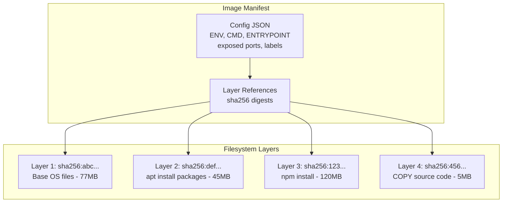
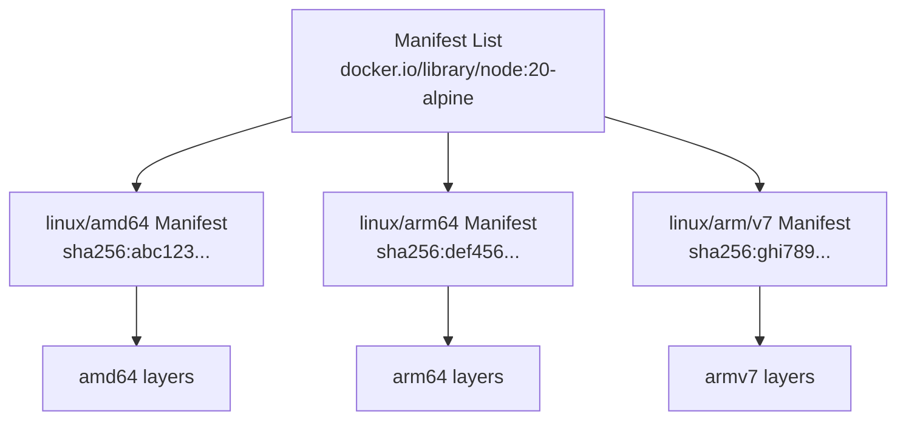
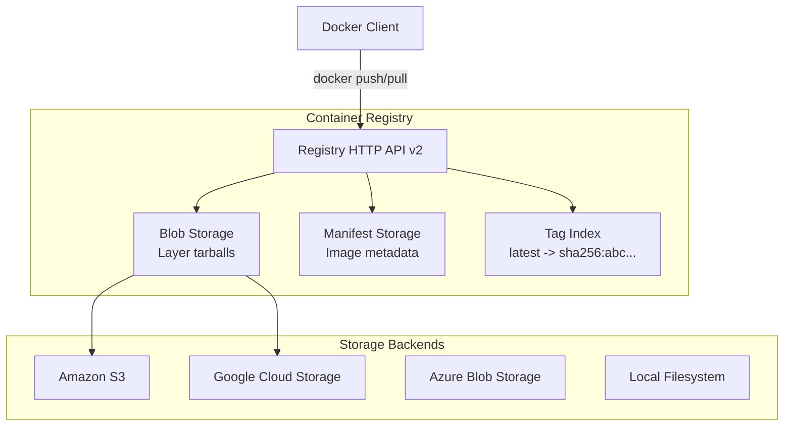
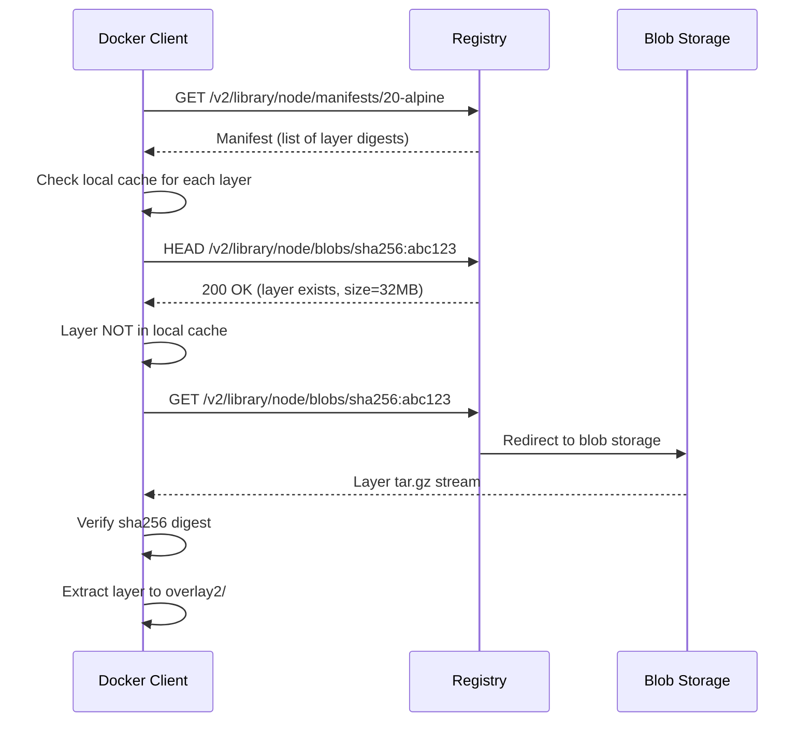

# 📦 Image Architecture — Content-Addressable Storage

> **"Understanding image internals unlocks debugging mysteries: why builds are slow, why images are huge, why pulls fail."**

---

## 1. Image Structure

Docker image = ordered collection of **read-only filesystem layers** + **metadata** (config JSON).



### Content-Addressable Storage (CAS)

Mỗi layer được identify bằng **SHA256 hash** của content. Hai images share cùng base layer → chỉ lưu 1 bản trên disk.

```bash
# Xem layers của image
$ docker inspect --format '{{json .RootFS.Layers}}' node:20-alpine | jq .
[
  "sha256:a1b2c3d4...",   # Alpine base
  "sha256:e5f6g7h8...",   # Node.js runtime
  "sha256:i9j0k1l2..."    # npm/yarn
]

# 2 images dùng cùng node:20-alpine → share 3 layers trên
$ docker images --format "table {{.Repository}}\t{{.Tag}}\t{{.Size}}"
REPOSITORY    TAG      SIZE
my-api        latest   185MB
my-worker     latest   192MB
# Total disk: ~200MB (shared base), NOT 185+192=377MB
```

---

## 2. Image Manifest & Manifest List

### Single-Architecture Manifest

```json
{
  "schemaVersion": 2,
  "mediaType": "application/vnd.docker.distribution.manifest.v2+json",
  "config": {
    "mediaType": "application/vnd.docker.container.image.v1+json",
    "size": 7023,
    "digest": "sha256:b5b2b2c507a0944348e0303114d8d93aca18b0..."
  },
  "layers": [
    {
      "mediaType": "application/vnd.docker.image.rootfs.diff.tar.gzip",
      "size": 32654,
      "digest": "sha256:e692418e4cbaf90ca69d0..."
    },
    {
      "mediaType": "application/vnd.docker.image.rootfs.diff.tar.gzip",
      "size": 16724,
      "digest": "sha256:3c3a4604a545cdc127456..."
    }
  ]
}
```

### Manifest List (Multi-Architecture)



```bash
# Inspect manifest list
$ docker manifest inspect node:20-alpine
{
  "manifests": [
    {
      "digest": "sha256:abc123...",
      "platform": { "architecture": "amd64", "os": "linux" }
    },
    {
      "digest": "sha256:def456...",
      "platform": { "architecture": "arm64", "os": "linux" }
    }
  ]
}

# Build multi-arch image
$ docker buildx create --name mybuilder --use
$ docker buildx build \
    --platform linux/amd64,linux/arm64 \
    --tag myregistry/my-app:latest \
    --push .
```

---

## 3. Registry Architecture



### Pull Protocol



### Registry Options

| Registry | Pricing | Features | Best For |
|----------|---------|----------|----------|
| **Docker Hub** | Free (1 private repo) | Auto-build, official images | Open source, public images |
| **Amazon ECR** | $0.10/GB/month | IAM auth, scan, lifecycle | AWS workloads |
| **Google Artifact Registry** | $0.10/GB/month | Multi-format, IAM | GCP workloads |
| **Azure ACR** | $5/month (Basic) | Geo-replication, tasks | Azure workloads |
| **GitHub Container Registry** | Free (public) | GitHub Actions integration | Open source + GitHub CI |
| **Harbor** | Free (self-hosted) | RBAC, scan, replication | Enterprise, air-gapped |

---

## 4. Image Tagging Strategy

### Semantic Versioning

```bash
# Bad: overwriting tags
$ docker tag my-app:latest my-app:latest  # What version is this?

# Good: semantic versioning
$ docker tag my-app my-app:1.2.3
$ docker tag my-app my-app:1.2
$ docker tag my-app my-app:1
$ docker tag my-app my-app:latest

# On next release (1.2.4):
$ docker tag my-app my-app:1.2.4
$ docker tag my-app my-app:1.2   # 1.2 now points to 1.2.4
$ docker tag my-app my-app:1     # 1 now points to 1.2.4
$ docker tag my-app my-app:latest
```

### Git SHA Tagging (CI/CD)

```bash
# Immutable tags for traceability
GIT_SHA=$(git rev-parse --short HEAD)
BUILD_DATE=$(date +%Y%m%d)

$ docker tag my-app my-app:${GIT_SHA}
$ docker tag my-app my-app:${BUILD_DATE}-${GIT_SHA}
# Example: my-app:20260317-abc1234
```

### Tag Immutability

```bash
# ECR: Enable tag immutability (prevent overwriting)
$ aws ecr put-image-tag-mutability \
    --repository-name my-app \
    --image-tag-mutability IMMUTABLE

# Now: pushing to existing tag fails
# Forces unique tags per build → full traceability
```

---

## 5. Image Lifecycle Management

### ECR Lifecycle Policy

```json
{
  "rules": [
    {
      "rulePriority": 1,
      "description": "Keep last 10 tagged images",
      "selection": {
        "tagStatus": "tagged",
        "tagPrefixList": ["v"],
        "countType": "imageCountMoreThan",
        "countNumber": 10
      },
      "action": { "type": "expire" }
    },
    {
      "rulePriority": 2,
      "description": "Expire untagged images older than 7 days",
      "selection": {
        "tagStatus": "untagged",
        "countType": "sinceImagePushed",
        "countUnit": "days",
        "countNumber": 7
      },
      "action": { "type": "expire" }
    }
  ]
}
```

### Local Cleanup

```bash
# Remove dangling images (untagged)
$ docker image prune

# Remove all unused images
$ docker image prune -a

# Remove images older than 24h
$ docker image prune -a --filter "until=24h"

# Nuclear option: remove everything
$ docker system prune -a --volumes
```

---

## 6. Image Signing & Trust

### Docker Content Trust (DCT)

```bash
# Enable content trust
$ export DOCKER_CONTENT_TRUST=1

# Push signed image
$ docker push myregistry/my-app:1.0.0
# Automatically signs with Notary

# Pull: only pulls signed images
$ docker pull myregistry/my-app:1.0.0
# Fails if signature invalid or missing
```

### Cosign (Modern Approach)

```bash
# Generate key pair
$ cosign generate-key-pair

# Sign image
$ cosign sign --key cosign.key myregistry/my-app:1.0.0

# Verify
$ cosign verify --key cosign.pub myregistry/my-app:1.0.0

# Keyless signing with OIDC (GitHub Actions)
$ cosign sign --yes myregistry/my-app:1.0.0
# Uses GitHub OIDC token, no keys to manage
```

---

## 7. Image Optimization Techniques

### Analyze Image Layers with dive

```bash
# Install dive
$ docker run --rm -it \
    -v /var/run/docker.sock:/var/run/docker.sock \
    wagoodman/dive my-app:latest

# dive shows:
# - Layer-by-layer file changes
# - Wasted space (files added then deleted)
# - Image efficiency score (target: 95%+)
```

### Reduce Image Size Checklist

| Technique | Savings | Example |
|-----------|---------|---------|
| **Alpine base** | 60-80% | ubuntu 120MB -> alpine 5MB |
| **Multi-stage** | 50-80% | Remove build tools from runtime |
| **--no-install-recommends** | 10-30% | apt-get install -y --no-install-recommends |
| **Clean in same RUN** | 5-20% | rm -rf /var/lib/apt/lists/* |
| **Prune dev deps** | 30-50% | npm ci --production |
| **.dockerignore** | Build speed | Exclude node_modules, .git |
| **Pin versions** | Reproducibility | node:20.11.1-alpine3.19 |

### Size Comparison Example

```bash
# Baseline: node:20 + full install
$ docker images my-app:naive
REPOSITORY  TAG     SIZE
my-app      naive   1.2GB

# After multi-stage + alpine + prod deps only
$ docker images my-app:optimized
REPOSITORY  TAG        SIZE
my-app      optimized  145MB

# After distroless
$ docker images my-app:distroless  
REPOSITORY  TAG         SIZE
my-app      distroless  120MB
```

---

## 8. Interview Questions

### Q: docker pull chỉ tải layers chưa có. Cơ chế nào?
**A:** Client gọi Registry API lấy manifest (danh sách layer digests). Với mỗi layer, client check local storage bằng SHA256. Nếu layer đã có → skip. Chỉ download layers thiếu. Đây là lý do pull lần 2 nhanh hơn nhiều.

### Q: Tag "latest" có ý nghĩa đặc biệt không?
**A:** Không. "latest" chỉ là convention. Docker tự thêm tag "latest" khi bạn không chỉ định tag. Nó **KHÔNG** tự động update khi bạn push version mới. Trong production, **NEVER** dùng `:latest` — nó non-deterministic.

### Q: Tại sao image size khi `docker images` khác size trên disk?
**A:** `docker images` hiển thị **virtual size** (tổng tất cả layers). Actual disk usage nhỏ hơn vì layers được share giữa images. Dùng `docker system df -v` để xem actual disk usage.
