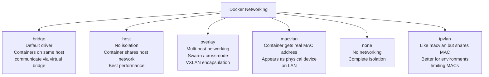
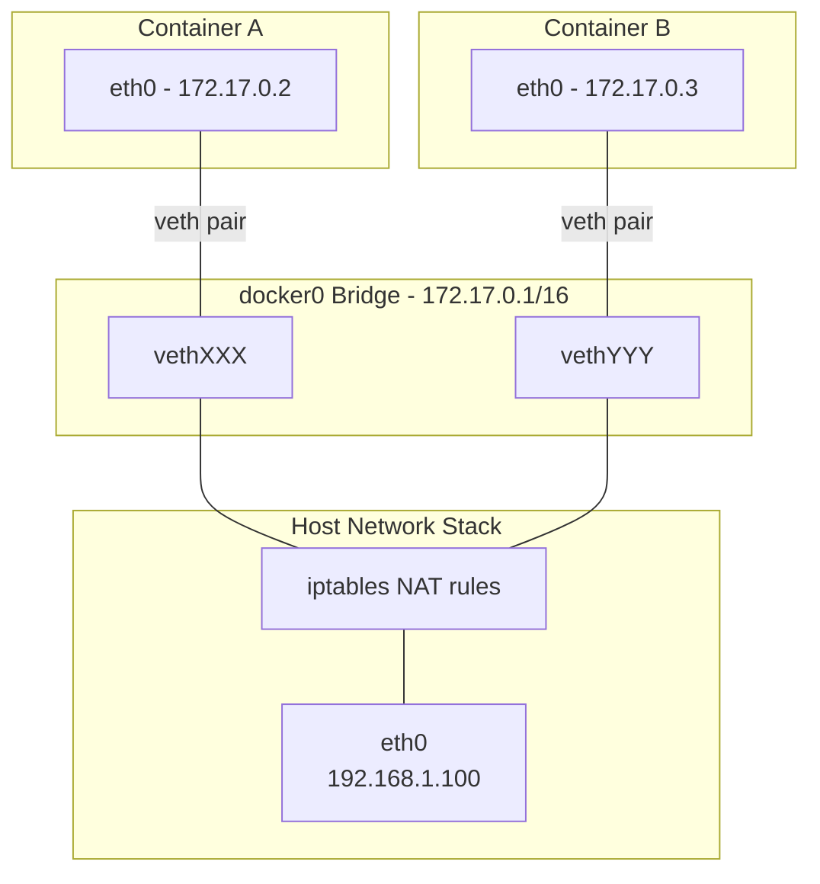
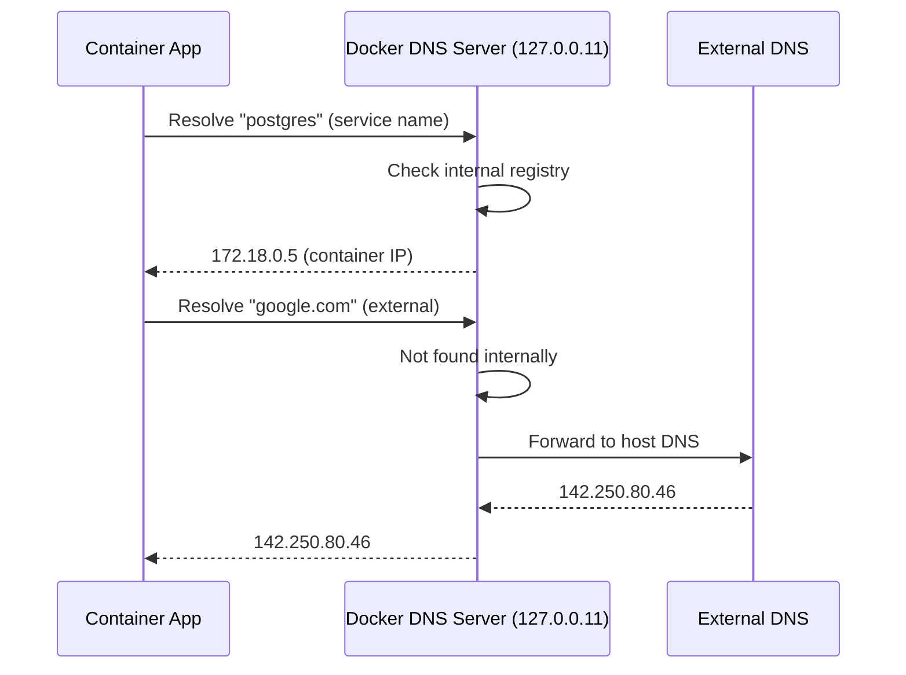
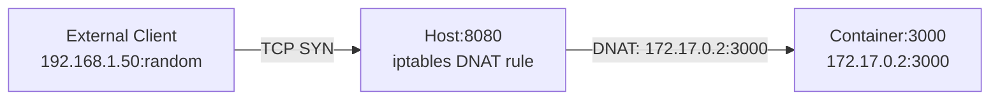
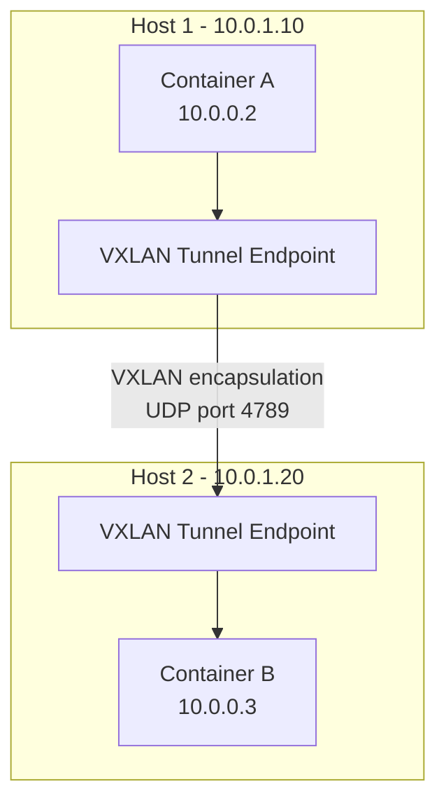

# 🌐 Networking Deep Dive — From iptables to Service Discovery

> **"90% of Docker issues in production are networking issues. Master this, master Docker."**

---

## 1. Docker Network Drivers Overview



---

## 2. Bridge Network (Default)

### How it Works



```bash
# Default bridge network
$ docker network inspect bridge
{
  "Name": "bridge",
  "Driver": "bridge",
  "IPAM": {
    "Config": [{ "Subnet": "172.17.0.0/16", "Gateway": "172.17.0.1" }]
  }
}

# See the bridge interface
$ ip link show docker0
docker0: <BROADCAST,MULTICAST,UP> mtu 1500 state UP
    link/ether 02:42:ac:11:00:01 brd ff:ff:ff:ff:ff:ff

# See veth pairs
$ ip link show type veth
vethXXX@if5: <BROADCAST,MULTICAST,UP> master docker0
vethYYY@if7: <BROADCAST,MULTICAST,UP> master docker0
```

### Default Bridge vs Custom Bridge

| Feature | Default `bridge` | Custom bridge network |
|---------|-----------------|----------------------|
| **DNS resolution** | NO (containers use IP only) | YES (by container name) |
| **Auto-connect** | All containers auto-join | Must explicitly connect |
| **Isolation** | All containers see each other | Only same-network containers |
| **Link legacy** | Supports --link (deprecated) | Not needed (use DNS) |

```bash
# Create custom bridge (ALWAYS use this in practice)
$ docker network create --driver bridge my-app-network

# Containers can reach each other by name
$ docker run -d --name api --network my-app-network my-api
$ docker run -d --name db --network my-app-network postgres

# From api container:
$ docker exec api ping db
PING db (172.18.0.3): 56 data bytes
64 bytes from 172.18.0.3: seq=0 ttl=64 time=0.089 ms
```

---

## 3. Docker DNS Resolution



```bash
# Docker embedded DNS server
$ docker exec my-container cat /etc/resolv.conf
nameserver 127.0.0.11
options ndots:0

# DNS resolves container names on custom networks
$ docker exec api nslookup postgres
Server:    127.0.0.11
Address:   127.0.0.11:53
Name:      postgres
Address:   172.18.0.5

# Round-robin DNS for scaled services
$ docker compose up -d --scale worker=3
$ docker exec api nslookup worker
Address: 172.18.0.6
Address: 172.18.0.7
Address: 172.18.0.8
```

---

## 4. Port Mapping and iptables

### How -p Works

```bash
$ docker run -p 8080:3000 my-api
# Host port 8080 → Container port 3000
```



```bash
# Docker creates iptables rules automatically
$ iptables -t nat -L DOCKER -n
Chain DOCKER (2 references)
target     prot opt source    destination
DNAT       tcp  --  0.0.0.0/0  0.0.0.0/0  tcp dpt:8080 to:172.17.0.2:3000

# Port binding options
-p 8080:3000          # All interfaces
-p 127.0.0.1:8080:3000  # Localhost only (more secure)
-p 8080:3000/udp       # UDP port
-p 8080-8090:3000-3010 # Port range
```

### Security Warning: Docker Bypasses UFW/firewalld

```bash
# Docker writes iptables rules DIRECTLY
# UFW rules are IGNORED for Docker ports

# If you have:
$ ufw deny 8080      # This does NOTHING for Docker containers!
$ docker run -p 8080:80 nginx   # Port 8080 is OPEN to the world

# Fix: bind to localhost
$ docker run -p 127.0.0.1:8080:80 nginx

# Or: use DOCKER-USER chain
$ iptables -I DOCKER-USER -i eth0 -p tcp --dport 8080 -j DROP
$ iptables -I DOCKER-USER -i eth0 -s 10.0.0.0/8 -p tcp --dport 8080 -j ACCEPT
```

---

## 5. Host Network

Container chia sẻ trực tiếp network namespace của host. Không có isolation, không có port mapping.

```bash
$ docker run --network host nginx
# nginx listens on host's port 80 directly
# No NAT overhead → best performance

# Use cases:
# - Performance-critical apps (network-intensive)
# - Apps that need to see host's network interfaces
# - Monitoring agents (Prometheus node_exporter)
```

| Aspect | Bridge | Host |
|--------|--------|------|
| **Performance** | NAT overhead (~5-10% latency) | Native speed |
| **Port conflicts** | No (different network namespace) | Yes (shares host ports) |
| **Security** | Isolated | No network isolation |
| **Service discovery** | Docker DNS | Direct |
| **Port mapping** | Required (-p) | Not needed |

---

## 6. Overlay Network (Multi-Host)



```bash
# Create overlay network (requires Swarm mode)
$ docker swarm init
$ docker network create --driver overlay --attachable my-overlay

# Containers on different hosts can communicate
$ docker run --network my-overlay --name api-host1 my-api    # On host 1
$ docker run --network my-overlay --name db-host2 postgres    # On host 2

# api-host1 can reach db-host2 by name across hosts
```

### Overlay Features

| Feature | Details |
|---------|---------|
| **Encryption** | `--opt encrypted` enables IPsec between nodes |
| **MTU** | Default 1450 (VXLAN overhead reduces from 1500) |
| **Service Discovery** | Built-in DNS across all nodes |
| **Load Balancing** | Routing mesh distributes requests |

---

## 7. Macvlan Network

Container gets its own MAC address on the physical network. Appears as a real device on LAN.

```bash
# Create macvlan network
$ docker network create -d macvlan \
    --subnet=192.168.1.0/24 \
    --gateway=192.168.1.1 \
    -o parent=eth0 \
    my-macvlan

$ docker run --network my-macvlan \
    --ip 192.168.1.200 \
    --name my-server nginx

# my-server appears on LAN with IP 192.168.1.200
# Other devices on LAN can reach it directly (no NAT)
```

### Use Cases
- Legacy applications requiring specific IPs
- Network monitoring tools (need to see raw traffic)
- Containers that need to appear as physical hosts

### Limitation
- Host cannot communicate with macvlan containers (by design)
- Workaround: create a macvlan sub-interface on host

---

## 8. Network Troubleshooting

### Essential Commands

```bash
# List networks
$ docker network ls

# Inspect network (see connected containers)
$ docker network inspect my-network

# Check container networking
$ docker exec my-container ip addr
$ docker exec my-container ip route
$ docker exec my-container cat /etc/resolv.conf
$ docker exec my-container cat /etc/hosts

# DNS debugging
$ docker exec my-container nslookup other-container
$ docker exec my-container dig other-container

# TCP connectivity test
$ docker exec my-container nc -zv other-container 5432
other-container [172.18.0.5] 5432 (postgresql) open

# Packet capture (from host)
$ tcpdump -i docker0 -n port 5432
$ tcpdump -i vethXXX -n -w capture.pcap

# Network namespace debugging
$ docker inspect --format '{{.NetworkSettings.SandboxKey}}' my-container
/var/run/docker/netns/abc123
$ nsenter --net=/var/run/docker/netns/abc123 ss -tlnp
$ nsenter --net=/var/run/docker/netns/abc123 iptables -L
```

### Common Issues & Fixes

| Issue | Symptom | Fix |
|-------|---------|-----|
| Containers can't resolve names | `nslookup: can't resolve` | Use custom bridge network (not default) |
| Port already in use | `bind: address already in use` | `lsof -i :PORT` to find conflict |
| Container can't reach internet | `ping: bad address` | Check host DNS, docker daemon DNS config |
| Slow DNS in Alpine | 5s delay on first request | Add `options single-request-reopen` to resolv.conf |
| Docker bypasses firewall | Ports exposed despite UFW | Use `-p 127.0.0.1:PORT:PORT` or DOCKER-USER chain |
| MTU mismatch (overlay) | Random connection drops | Set `--opt com.docker.network.driver.mtu=1450` |

### Alpine DNS Fix

```dockerfile
# Alpine uses musl libc with different DNS behavior
# Fix: add to Dockerfile
RUN echo "options single-request-reopen" >> /etc/resolv.conf

# Or use node:20-slim instead of node:20-alpine for DNS-heavy apps
```

---

## 9. Advanced: Custom Bridge with Specific Subnet

```bash
# Production network setup
$ docker network create \
    --driver bridge \
    --subnet 10.10.0.0/24 \
    --gateway 10.10.0.1 \
    --ip-range 10.10.0.128/25 \
    --opt com.docker.network.bridge.name=br-prod \
    --opt com.docker.network.bridge.enable_icc=true \
    --opt com.docker.network.bridge.enable_ip_masquerade=true \
    production-network

# Container with static IP
$ docker run --network production-network \
    --ip 10.10.0.130 \
    --name my-db postgres
```

---

## 10. Network Performance Comparison

| Driver | Latency vs Host | Throughput | Isolation | Multi-host |
|--------|----------------|------------|-----------|------------|
| **host** | 0% overhead | 100% | None | No |
| **bridge** | +5-15% | 90-95% | Good | No |
| **macvlan** | +1-3% | 98% | Network-level | No |
| **overlay** | +10-20% | 80-90% | Good | Yes |
| **ipvlan** | +1-3% | 98% | Network-level | No |

```bash
# Benchmark: iperf3 between containers
$ docker run -d --name server --network my-net networkstatic/iperf3 -s
$ docker run --rm --network my-net networkstatic/iperf3 -c server
# Compare results across different network drivers
```
