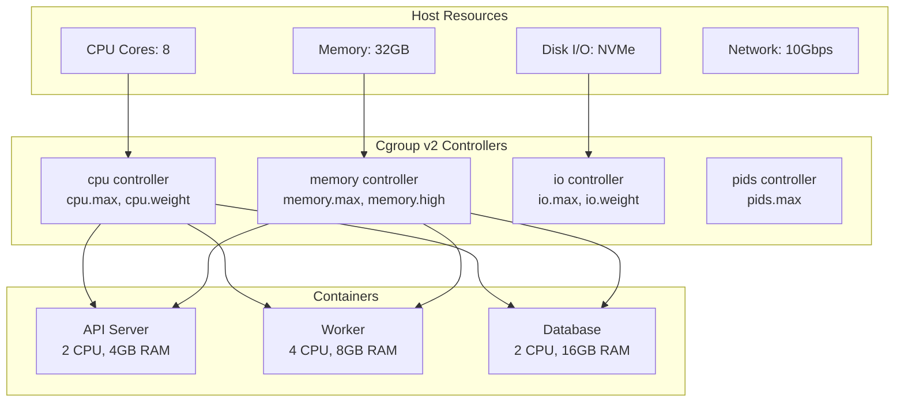

# ⚡ Performance Optimization — Squeeze Every Drop from Docker

> **"Performance tuning starts with measurement. Never optimize what you haven't profiled."**

---

## 1. Resource Limits Architecture



---

## 2. CPU Limits

### CPU Shares (Soft Limit — Relative Weight)

```bash
# Default share: 1024
# Container gets proportional CPU when contention occurs
$ docker run --cpu-shares 512 low-priority-app    # 50% of default weight
$ docker run --cpu-shares 2048 high-priority-app   # 2x default weight

# If both containers compete for CPU:
# low-priority gets 512/(512+2048) = 20%
# high-priority gets 2048/(512+2048) = 80%
# If no contention: both can use 100%
```

### CPU Quota (Hard Limit)

```bash
# Limit to exactly 2 CPUs worth of time
$ docker run --cpus 2 my-app

# Same as:
$ docker run --cpu-period 100000 --cpu-quota 200000 my-app
# 200000/100000 = 2 CPUs

# Limit to 0.5 CPU (50% of one core)
$ docker run --cpus 0.5 my-app
```

### CPU Pinning (Bind to Specific Cores)

```bash
# Pin to cores 0 and 1 only
$ docker run --cpuset-cpus="0,1" my-app

# Pin to cores 0-3
$ docker run --cpuset-cpus="0-3" my-app

# Useful for:
# - NUMA-aware applications
# - Avoiding CPU cache thrashing
# - Latency-sensitive workloads
# - Database containers
```

---

## 3. Memory Limits

### Hard vs Soft Limits

```bash
# Hard limit: container OOM-killed if exceeded
$ docker run --memory 512m my-app

# Soft limit: try to reclaim memory when host is under pressure
$ docker run --memory 1g --memory-reservation 512m my-app

# Swap limit (default: 2x memory)
$ docker run --memory 512m --memory-swap 1g my-app  # 512m swap
$ docker run --memory 512m --memory-swap 512m my-app # no swap
$ docker run --memory 512m --memory-swap -1 my-app   # unlimited swap

# OOM kill disable (DANGEROUS - can hang host)
$ docker run --memory 512m --oom-kill-disable my-app
```

### Memory Monitoring

```bash
# Real-time stats
$ docker stats --format "table {{.Name}}\t{{.MemUsage}}\t{{.MemPerc}}"
NAME        MEM USAGE / LIMIT     MEM %
api         245.3MiB / 512MiB     47.91%
worker      1.2GiB / 2GiB         60.00%
db          4.8GiB / 8GiB         60.00%

# Check OOM events
$ docker inspect my-app | grep -i oom
"OOMKilled": true

# Check cgroup memory
$ docker exec my-app cat /sys/fs/cgroup/memory.max
536870912  # 512MB in bytes

$ docker exec my-app cat /sys/fs/cgroup/memory.current
257130496  # Current usage
```

---

## 4. I/O Limits

```bash
# Limit read/write bandwidth
$ docker run \
    --device-read-bps /dev/sda:100mb \
    --device-write-bps /dev/sda:50mb \
    my-app

# Limit IOPS
$ docker run \
    --device-read-iops /dev/sda:1000 \
    --device-write-iops /dev/sda:500 \
    my-app

# Block I/O weight (relative, like CPU shares)
$ docker run --blkio-weight 500 my-app  # Range: 10-1000
```

---

## 5. Build Performance

### BuildKit Parallel Stages

```dockerfile
# Stages without dependencies build in parallel
FROM node:20-alpine AS deps
COPY package.json pnpm-lock.yaml ./
RUN pnpm install --frozen-lockfile

FROM node:20-alpine AS lint
COPY . .
RUN pnpm lint

FROM node:20-alpine AS test
COPY . .
RUN pnpm test

# depends on deps, lint, test run in parallel
FROM node:20-alpine AS build
COPY --from=deps /app/node_modules ./node_modules
COPY . .
RUN pnpm build
```

### Cache Mount (Build Speed Game-Changer)

```dockerfile
# Cache package manager downloads across builds
FROM node:20-alpine AS builder

WORKDIR /app
COPY package.json pnpm-lock.yaml ./

# Cache mount persists between builds
RUN --mount=type=cache,target=/root/.local/share/pnpm/store \
    pnpm install --frozen-lockfile

COPY . .
RUN pnpm build

# Before cache mount: npm install takes 45s every build
# After cache mount: npm install takes 3s (cache hit)
```

### BuildKit Cache Export/Import

```bash
# Export cache to registry
$ docker buildx build \
    --cache-to type=registry,ref=myregistry/my-app:buildcache \
    --cache-from type=registry,ref=myregistry/my-app:buildcache \
    -t my-app:latest .

# Export cache to local directory
$ docker buildx build \
    --cache-to type=local,dest=./buildcache \
    --cache-from type=local,src=./buildcache \
    -t my-app:latest .

# GitHub Actions cache
$ docker buildx build \
    --cache-to type=gha,mode=max \
    --cache-from type=gha \
    -t my-app:latest .
```

---

## 6. Image Size Optimization

### Size Comparison: Same App, Different Approaches

| Approach | Image Size | Startup Time |
|----------|-----------|-------------|
| `FROM node:20` (Debian) | 1.1 GB | ~2.5s |
| `FROM node:20-slim` | 240 MB | ~1.5s |
| `FROM node:20-alpine` | 180 MB | ~1.0s |
| Multi-stage + alpine | 150 MB | ~0.8s |
| Multi-stage + distroless | 120 MB | ~0.6s |
| Static binary + scratch | 15 MB | ~0.1s |

### Analyze with dive

```bash
$ dive my-app:latest

# Layer analysis output:
# Image efficiency score: 97%
# Potentially wasted space: 12 MB
#
# Layer details:
# 25 MB  FROM node:20-alpine
#  3 MB  COPY package.json ...
# 85 MB  RUN pnpm install (node_modules)
# 12 MB  COPY . . (source code)
# 15 MB  RUN pnpm build (dist/)
```

### Remove Unnecessary Files

```dockerfile
FROM node:20-alpine AS builder
WORKDIR /app
COPY . .
RUN pnpm install --frozen-lockfile && pnpm build

FROM node:20-alpine AS production
WORKDIR /app

# Only copy production dependencies
COPY package.json pnpm-lock.yaml ./
RUN pnpm install --frozen-lockfile --prod && \
    # Clean package manager cache
    pnpm store prune && \
    rm -rf /root/.local/share/pnpm/store && \
    # Remove unnecessary files
    find node_modules -name "*.d.ts" -delete && \
    find node_modules -name "*.map" -delete && \
    find node_modules -name "*.md" -delete && \
    find node_modules -name "CHANGELOG*" -delete && \
    find node_modules -name "LICENSE" -delete

COPY --from=builder /app/dist ./dist
USER 1001
CMD ["node", "dist/main.js"]
```

---

## 7. Container Startup Optimization

### Init Process

```bash
# Use --init for proper signal handling and zombie reaping
$ docker run --init my-app

# Or use tini in Dockerfile
FROM node:20-alpine
RUN apk add --no-cache tini
ENTRYPOINT ["/sbin/tini", "--"]
CMD ["node", "dist/main.js"]
```

### Health Check Configuration

```dockerfile
HEALTHCHECK --interval=15s --timeout=3s --start-period=30s --retries=3 \
    CMD wget --no-verbose --tries=1 --spider http://localhost:3000/health || exit 1
```

```yaml
# docker-compose.yml
services:
  api:
    image: my-api
    healthcheck:
      test: ["CMD", "wget", "--spider", "-q", "http://localhost:3000/health"]
      interval: 15s
      timeout: 3s
      retries: 3
      start_period: 30s
```

---

## 8. Monitoring with cAdvisor + Prometheus

### docker-compose.yml

```yaml
services:
  cadvisor:
    image: gcr.io/cadvisor/cadvisor:v0.47.0
    volumes:
      - /:/rootfs:ro
      - /var/run:/var/run:ro
      - /sys:/sys:ro
      - /var/lib/docker/:/var/lib/docker:ro
    ports:
      - "8080:8080"
    restart: unless-stopped

  prometheus:
    image: prom/prometheus:v2.49.0
    volumes:
      - ./prometheus.yml:/etc/prometheus/prometheus.yml
      - prometheus-data:/prometheus
    ports:
      - "9090:9090"
    restart: unless-stopped

  grafana:
    image: grafana/grafana:10.3.0
    ports:
      - "3001:3000"
    volumes:
      - grafana-data:/var/lib/grafana
    environment:
      GF_SECURITY_ADMIN_PASSWORD: admin
    restart: unless-stopped

volumes:
  prometheus-data:
  grafana-data:
```

### Key Metrics to Monitor

```yaml
# prometheus.yml
scrape_configs:
  - job_name: cadvisor
    static_configs:
      - targets: ["cadvisor:8080"]
```

```promql
# CPU Usage per container
rate(container_cpu_usage_seconds_total[5m])

# Memory Usage
container_memory_usage_bytes / container_spec_memory_limit_bytes * 100

# Network I/O
rate(container_network_receive_bytes_total[5m])
rate(container_network_transmit_bytes_total[5m])

# Disk I/O
rate(container_fs_reads_bytes_total[5m])
rate(container_fs_writes_bytes_total[5m])

# Container restarts (OOM or crash)
increase(container_restart_count[1h])
```

---

## 9. Logging Performance

### Logging Drivers Impact

| Driver | Performance | Use Case |
|--------|------------|----------|
| `json-file` | Good (default) | Dev, small deployments |
| `local` | Best | Production single-host |
| `fluentd` | Good | Centralized logging |
| `journald` | Good | systemd hosts |
| `syslog` | Good | Traditional logging |
| `none` | Zero overhead | When logs not needed |

```bash
# Use local driver with rotation (better than json-file)
$ docker run \
    --log-driver local \
    --log-opt max-size=50m \
    --log-opt max-file=5 \
    my-app

# Disable logging for noisy containers
$ docker run --log-driver none my-proxy
```

### Daemon-level Default

```json
{
  "log-driver": "local",
  "log-opts": {
    "max-size": "50m",
    "max-file": "5"
  }
}
```

---

## 10. docker-compose.yml Resource Limits

```yaml
services:
  api:
    image: my-api
    deploy:
      resources:
        limits:
          cpus: "2.0"
          memory: 1G
          pids: 100
        reservations:
          cpus: "0.5"
          memory: 256M
    # OOM score adjustment
    oom_score_adj: -500        # Less likely to be OOM killed

  worker:
    image: my-worker
    deploy:
      resources:
        limits:
          cpus: "4.0"
          memory: 4G
        reservations:
          cpus: "1.0"
          memory: 1G
    oom_score_adj: 500          # More likely to be OOM killed first

  db:
    image: postgres:16
    deploy:
      resources:
        limits:
          cpus: "2.0"
          memory: 8G
        reservations:
          cpus: "1.0"
          memory: 4G
    oom_score_adj: -1000        # Least likely to be OOM killed
```

---

## 11. Performance Tuning Matrix

| Resource | Dev | Staging | Production |
|----------|-----|---------|------------|
| CPU Limit | None | Same as prod | Based on load test |
| Memory Limit | None | Same as prod | Based on load test + 20% |
| Memory Reservation | None | 50% of limit | 60% of limit |
| PID Limit | None | 200 | 100 |
| I/O Limit | None | None | Based on workload |
| Log Driver | json-file | local | fluentd/local |
| Log Rotation | 10m x 3 | 50m x 5 | 100m x 10 |
| Health Check | 30s interval | 15s interval | 10s interval |
| Restart Policy | no | unless-stopped | unless-stopped |

---

## 12. Interview Questions

**Q: Container bị OOM killed liên tục, bạn debug thế nào?**

A: Step-by-step approach:
1. Check OOM events: `docker inspect container | grep OOMKilled`
2. Monitor memory usage: `docker stats` to see usage pattern
3. Check cgroup: `cat /sys/fs/cgroup/memory.current` inside container
4. Profile app memory: heap dump, memory leak detection
5. Check if limit too low or app has memory leak
6. Set `memory-reservation` (soft limit) lower than `memory` (hard limit):
   - reservation triggers reclaim before OOM
7. Consider if swap helps: `--memory-swap`

**Q: Tại sao không nên dùng `--privileged`?**

A: `--privileged` disables ALL security features:
- Grants ALL Linux capabilities (37+)
- Disables Seccomp filtering
- Disables AppArmor/SELinux
- Gives access to ALL host devices
- Essentially = root access to host machine
- Alternative: use specific `--cap-add` for what you need

**Q: Build Docker image mất 10 phút, optimize thế nào?**

A: Optimization checklist:
1. Enable BuildKit: `DOCKER_BUILDKIT=1`
2. Use `--mount=type=cache` for package managers
3. Order Dockerfile: rarely changed layers first
4. Minimize COPY scope (proper .dockerignore)
5. Use multi-stage parallel builds
6. Cache export to registry for CI
7. Remote BuildKit builder for more resources
