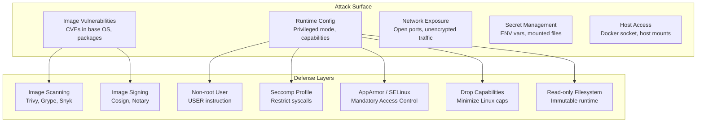

# 🔒 Security Hardening — Container Security from Dev to Prod

> **"A container is only as secure as its weakest configuration. Defaults are NOT secure."**

---

## 1. Container Security Layers



---

## 2. Non-Root Containers (MUST DO)

### The Problem

```bash
# Default: container runs as root
$ docker run --rm alpine id
uid=0(root) gid=0(root)

# Without user namespaces: container root = host root
# Container escape vulnerability = full host access
```

### The Fix

```dockerfile
# Create non-root user in Dockerfile
FROM node:20-alpine

# Create app user and group
RUN addgroup -g 1001 -S appgroup && \
    adduser -u 1001 -S appuser -G appgroup

# Set ownership
WORKDIR /app
COPY --chown=appuser:appgroup . .

# Switch to non-root
USER appuser

EXPOSE 3000
CMD ["node", "dist/main.js"]
```

```bash
# Verify at runtime
$ docker exec my-app id
uid=1001(appuser) gid=1001(appgroup)

# Force non-root at runtime (overrides Dockerfile)
$ docker run --user 1001:1001 my-app

# Run with specific user:group
$ docker run --user $(id -u):$(id -g) my-app
```

---

## 3. Linux Capabilities

Docker containers start with a **reduced set** of Linux capabilities, but still too many for most apps.

### Default Capabilities (Docker gives these)

| Capability | Risk | Description |
|-----------|------|-------------|
| `CAP_CHOWN` | Low | Change file ownership |
| `CAP_DAC_OVERRIDE` | High | Bypass file read/write/execute permission checks |
| `CAP_FSETID` | Low | Set SUID/SGID bits |
| `CAP_FOWNER` | Medium | Bypass ownership checks |
| `CAP_MKNOD` | Medium | Create special files |
| `CAP_NET_RAW` | High | Use RAW/PACKET sockets (ping, network sniffing) |
| `CAP_SETGID` | High | Change process GID |
| `CAP_SETUID` | High | Change process UID |
| `CAP_SETFCAP` | Medium | Set file capabilities |
| `CAP_SETPCAP` | Medium | Modify process capabilities |
| `CAP_NET_BIND_SERVICE` | Low | Bind to ports < 1024 |
| `CAP_SYS_CHROOT` | Medium | Use chroot |
| `CAP_KILL` | Medium | Send signals to other processes |
| `CAP_AUDIT_WRITE` | Low | Write to kernel audit log |

### Hardening: Drop All, Add What You Need

```bash
# Drop ALL capabilities, add back only what's needed
$ docker run \
    --cap-drop ALL \
    --cap-add NET_BIND_SERVICE \
    my-web-server

# For a typical Node.js/Python API:
$ docker run \
    --cap-drop ALL \
    my-api
# Most apps need ZERO capabilities!

# Never use --privileged (ALL caps + host devices)
# $ docker run --privileged my-app  ← NEVER DO THIS IN PRODUCTION
```

---

## 4. Seccomp Profiles

Seccomp (Secure Computing Mode) filters which **system calls** a container can make.

```bash
# Default seccomp profile blocks ~44 dangerous syscalls:
# - mount, umount (filesystem manipulation)
# - reboot (shut down host)
# - bpf (eBPF loading)
# - clock_settime (change system clock)
# - module_init (load kernel modules)

# Use custom restrictive profile
$ docker run --security-opt seccomp=./custom-seccomp.json my-app

# Disable seccomp (DANGEROUS, for debugging only)
$ docker run --security-opt seccomp=unconfined my-app
```

### Custom Seccomp Profile for Node.js

```json
{
  "defaultAction": "SCMP_ACT_ERRNO",
  "architectures": ["SCMP_ARCH_X86_64"],
  "syscalls": [
    {
      "names": [
        "read", "write", "open", "close", "stat", "fstat",
        "mmap", "mprotect", "munmap", "brk",
        "socket", "connect", "accept", "bind", "listen",
        "epoll_create", "epoll_ctl", "epoll_wait",
        "futex", "clone", "execve",
        "getpid", "getuid", "getgid"
      ],
      "action": "SCMP_ACT_ALLOW"
    }
  ]
}
```

---

## 5. Read-Only Filesystem

```bash
# Make container filesystem read-only
$ docker run --read-only my-app
# App cannot write to any path (even /tmp)

# Allow specific writable paths
$ docker run \
    --read-only \
    --tmpfs /tmp:rw,size=100m \
    --tmpfs /var/run:rw,size=10m \
    -v app-data:/app/data \
    my-app
```

```yaml
# docker-compose.yml
services:
  api:
    image: my-api
    read_only: true
    tmpfs:
      - /tmp:size=100m
      - /var/run:size=10m
    volumes:
      - uploads:/app/uploads
```

---

## 6. Image Scanning

### Trivy (Most Popular)

```bash
# Scan image for vulnerabilities
$ trivy image my-app:latest
my-app:latest (alpine 3.19.1)
Total: 3 (HIGH: 2, CRITICAL: 1)

CRITICAL  libcrypto3  3.1.4-r1  3.1.4-r3  CVE-2024-XXXX  OpenSSL buffer overflow
HIGH      libssl3     3.1.4-r1  3.1.4-r3  CVE-2024-YYYY  TLS vulnerability
HIGH      curl        8.5.0-r0  8.5.0-r1  CVE-2024-ZZZZ  HTTP redirect issue

# Fail CI on CRITICAL/HIGH
$ trivy image --exit-code 1 --severity CRITICAL,HIGH my-app:latest

# Scan Dockerfile for misconfigurations
$ trivy config Dockerfile

# Scan filesystem
$ trivy filesystem --security-checks vuln,secret ./
```

### Grype

```bash
$ grype my-app:latest
NAME         VERSION   TYPE   VULNERABILITY   SEVERITY
libcrypto3   3.1.4-r1  apk    CVE-2024-XXXX   Critical
```

### GitHub Actions Integration

```yaml
# .github/workflows/scan.yml
name: Container Security Scan
on: push

jobs:
  scan:
    runs-on: ubuntu-latest
    steps:
      - uses: actions/checkout@v4
      
      - name: Build image
        run: docker build -t my-app:${{ github.sha }} .
      
      - name: Trivy vulnerability scan
        uses: aquasecurity/trivy-action@master
        with:
          image-ref: my-app:${{ github.sha }}
          format: sarif
          output: trivy-results.sarif
          severity: CRITICAL,HIGH
          exit-code: 1
      
      - name: Upload scan results
        uses: github/codeql-action/upload-sarif@v3
        with:
          sarif_file: trivy-results.sarif
```

---

## 7. Docker Socket Security

```bash
# Docker socket = root access to host!
# If container has access to /var/run/docker.sock, it can:
# 1. Start new privileged containers
# 2. Mount host filesystem
# 3. Execute commands on host

# NEVER mount docker socket unless absolutely required
# $ docker run -v /var/run/docker.sock:/var/run/docker.sock  ← AVOID

# If you must (CI/CD agents, monitoring):
# Use read-only and restrict with socket proxy
$ docker run \
    -v /var/run/docker.sock:/var/run/docker.sock:ro \
    --group-add $(getent group docker | cut -d: -f3) \
    my-ci-agent
```

### Docker Socket Proxy (Safer Alternative)

```yaml
# docker-compose.yml
services:
  socket-proxy:
    image: tecnativa/docker-socket-proxy
    volumes:
      - /var/run/docker.sock:/var/run/docker.sock:ro
    environment:
      # Only allow specific API endpoints
      CONTAINERS: 1      # Allow container listing
      IMAGES: 0          # Block image management
      VOLUMES: 0         # Block volume management
      NETWORKS: 0        # Block network management
      POST: 0            # Block all write operations
    networks:
      - proxy-net
  
  monitoring:
    image: portainer/portainer-ce
    environment:
      - DOCKER_HOST=tcp://socket-proxy:2375
    depends_on:
      - socket-proxy
    networks:
      - proxy-net
```

---

## 8. Secrets Management

### DO NOT Use Environment Variables for Secrets

```bash
# BAD: Visible in docker inspect, process listing, logs
$ docker run -e DB_PASSWORD=mysecret my-app
$ docker inspect my-app | grep DB_PASSWORD
"DB_PASSWORD=mysecret"  # Anyone with docker access can see this!
```

### Docker Secrets (Swarm Mode)

```bash
# Create secret
$ echo "my-super-secret-password" | docker secret create db_password -

# Use in service
$ docker service create \
    --name api \
    --secret db_password \
    my-api
# Secret available at /run/secrets/db_password inside container
```

### File-based Secrets (Compose)

```yaml
services:
  api:
    image: my-api
    secrets:
      - db_password
      - api_key
    environment:
      DB_PASSWORD_FILE: /run/secrets/db_password
      API_KEY_FILE: /run/secrets/api_key

secrets:
  db_password:
    file: ./secrets/db-password.txt
  api_key:
    file: ./secrets/api-key.txt
```

```typescript
// Read secret from file in app
import { readFileSync } from 'fs';

const getSecret = (name: string): string => {
  const filePath = process.env[`${name}_FILE`];
  if (filePath) {
    return readFileSync(filePath, 'utf-8').trim();
  }
  return process.env[name] || '';
};

const dbPassword = getSecret('DB_PASSWORD');
```

---

## 9. Network Security

```bash
# Restrict container networking
# No internet access
$ docker run --network none my-app

# Internal-only network (no external access)
$ docker network create --internal my-internal-net
$ docker run --network my-internal-net my-app
# Container can only talk to other containers on same network

# Disable inter-container communication on bridge
$ docker network create --opt com.docker.network.bridge.enable_icc=false isolated-net
```

---

## 10. Production Security Checklist

```markdown
## Image Security
- [ ] Base image pinned to specific version (NOT :latest)
- [ ] Image scanned with Trivy/Grype (zero CRITICAL/HIGH)
- [ ] Image signed with Cosign
- [ ] Minimal base image (alpine/slim/distroless)
- [ ] No secrets in any layer (checked with `docker history`)
- [ ] .dockerignore excludes sensitive files

## Runtime Security
- [ ] Non-root USER in Dockerfile
- [ ] --cap-drop ALL (add back minimum required)
- [ ] --read-only filesystem + necessary tmpfs
- [ ] --security-opt no-new-privileges
- [ ] --pids-limit set (prevent fork bomb)
- [ ] Memory and CPU limits set
- [ ] No --privileged flag EVER
- [ ] No Docker socket mount unless absolutely needed

## Network Security
- [ ] Only required ports exposed
- [ ] Bind to 127.0.0.1 for internal services
- [ ] Internal networks for service-to-service communication
- [ ] TLS for all external communication

## Secrets
- [ ] No environment variable secrets
- [ ] Secrets mounted as files (/run/secrets/)
- [ ] Secrets rotated regularly
- [ ] No secrets in logs or error messages

## Host Security
- [ ] Docker daemon configured with TLS
- [ ] userns-remap enabled
- [ ] Audit logging enabled
- [ ] Docker socket not exposed to containers
- [ ] Regular Docker + OS security updates
```

---

## 11. Quick Reference: Security Flags

```bash
# Maximum security container
$ docker run \
    --user 1001:1001 \
    --cap-drop ALL \
    --security-opt no-new-privileges:true \
    --security-opt seccomp=./custom-profile.json \
    --read-only \
    --tmpfs /tmp:rw,noexec,nosuid,size=100m \
    --pids-limit 50 \
    --memory 512m \
    --cpus 1 \
    --network my-internal-net \
    -p 127.0.0.1:3000:3000 \
    my-app:1.2.3
```
