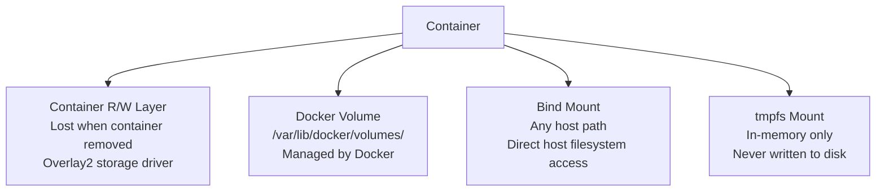

# 💾 Storage & Volumes — Data Persistence in Containers

> **"Containers are ephemeral. Data is not. Understanding Docker storage is the difference between a demo and production."**

---

## 1. Storage Types Overview



| Type | Persistence | Performance | Portability | Use Case |
|------|------------|-------------|-------------|----------|
| **Container layer** | Lost on `docker rm` | Slower (CoW) | None | Temporary files, logs |
| **Volume** | Persists | Best | Docker manages | Databases, app data |
| **Bind mount** | Persists | Good | Host-dependent | Dev: source code, configs |
| **tmpfs** | Lost on stop | Fastest (RAM) | None | Secrets, temp processing |

---

## 2. Docker Volumes (Recommended for Production)

### Creating and Using Volumes

```bash
# Create named volume
$ docker volume create postgres-data

# Use volume in container
$ docker run -d \
    --name db \
    -v postgres-data:/var/lib/postgresql/data \
    postgres:16

# Volume persists after container removal
$ docker rm -f db
$ docker volume ls
DRIVER    VOLUME NAME
local     postgres-data    # Still here!

# Reattach to new container — data intact
$ docker run -d \
    --name db-new \
    -v postgres-data:/var/lib/postgresql/data \
    postgres:16
```

### Volume Inspection

```bash
$ docker volume inspect postgres-data
[
    {
        "CreatedAt": "2026-03-17T10:00:00Z",
        "Driver": "local",
        "Labels": {},
        "Mountpoint": "/var/lib/docker/volumes/postgres-data/_data",
        "Name": "postgres-data",
        "Options": {},
        "Scope": "local"
    }
]

# See actual data
$ sudo ls /var/lib/docker/volumes/postgres-data/_data
base  global  pg_commit_ts  pg_dynshmem  pg_hba.conf  ...
```

### Volume Drivers

| Driver | Backend | Use Case |
|--------|---------|----------|
| **local** | Host filesystem | Default, single host |
| **nfs** | NFS server | Shared across hosts |
| **aws-ebs** | EBS volumes | AWS persistent storage |
| **azure-file** | Azure Files | Azure shared storage |
| **rexray** | Multiple backends | Multi-cloud |

```bash
# NFS volume
$ docker volume create \
    --driver local \
    --opt type=nfs \
    --opt o=addr=192.168.1.50,rw \
    --opt device=:/exports/data \
    nfs-data
```

---

## 3. Bind Mounts (Development)

```bash
# Mount host directory into container
$ docker run -d \
    -v /home/user/project:/app \
    -v /home/user/project/node_modules:/app/node_modules \
    node:20-alpine npm start

# Read-only mount (security)
$ docker run -d \
    -v /etc/nginx/nginx.conf:/etc/nginx/nginx.conf:ro \
    nginx

# --mount syntax (more explicit, recommended)
$ docker run -d \
    --mount type=bind,source=/home/user/data,target=/data,readonly \
    my-app
```

### Bind Mount Gotchas

| Issue | Description | Fix |
|-------|-------------|-----|
| **Permission mismatch** | Host UID != Container UID | Use `--user $(id -u):$(id -g)` |
| **File not found** | Host path must exist | Create directory before running |
| **Performance on macOS/Windows** | Docker Desktop uses VM, filesystem slow | Use volumes or `:cached` flag |
| **node_modules conflict** | Host node_modules overrides container's | Use anonymous volume for node_modules |

```bash
# macOS/Windows: Performance flags (Docker Desktop)
$ docker run -v ./src:/app/src:cached my-app     # Host wins, read perf
$ docker run -v ./src:/app/src:delegated my-app   # Container wins, write perf
$ docker run -v ./src:/app/src:consistent my-app  # Full sync (slowest)
```

---

## 4. tmpfs Mounts

```bash
# In-memory filesystem — not persisted, not written to disk
$ docker run -d \
    --tmpfs /tmp:rw,size=100m,mode=1777 \
    --tmpfs /run/secrets:rw,size=10m,mode=0700 \
    my-app

# Use cases:
# - Secrets that should never touch disk
# - Temporary processing files (extract, transform)
# - Write-heavy temp dirs (performance)
```

---

## 5. Volume Backup & Restore

### Backup

```bash
# Method 1: tar from volume mount
$ docker run --rm \
    -v postgres-data:/data \
    -v $(pwd)/backups:/backup \
    alpine tar czf /backup/postgres-data-$(date +%Y%m%d).tar.gz -C /data .

# Method 2: docker cp (from running container)
$ docker cp db:/var/lib/postgresql/data ./backup/

# Method 3: pg_dump for database-specific backup
$ docker exec db pg_dump -U postgres mydb > backup.sql
```

### Restore

```bash
# Restore from tar
$ docker volume create postgres-data-restored

$ docker run --rm \
    -v postgres-data-restored:/data \
    -v $(pwd)/backups:/backup \
    alpine tar xzf /backup/postgres-data-20260317.tar.gz -C /data

# Use restored volume
$ docker run -d \
    --name db-restored \
    -v postgres-data-restored:/var/lib/postgresql/data \
    postgres:16
```

### Automated Backup with Cron

```bash
#!/bin/bash
# backup-volumes.sh
BACKUP_DIR="/backups/docker"
DATE=$(date +%Y%m%d_%H%M%S)
RETENTION_DAYS=7

# Backup each named volume
for vol in $(docker volume ls -q --filter "name=prod-"); do
    echo "Backing up volume: $vol"
    docker run --rm \
        -v "$vol":/source:ro \
        -v "$BACKUP_DIR":/backup \
        alpine tar czf "/backup/${vol}_${DATE}.tar.gz" -C /source .
done

# Cleanup old backups
find "$BACKUP_DIR" -name "*.tar.gz" -mtime +$RETENTION_DAYS -delete
echo "Backup completed. Old backups (>${RETENTION_DAYS} days) removed."
```

---

## 6. Storage Driver Deep Dive

### overlay2 Internals

```mermaid
graph TD
    subgraph write_op ["Write Operation (Copy-on-Write)"]
        direction TB
        APP_W["App: write /etc/config.json"]
        COW["OverlayFS: Copy from lower to upper"]
        UPPER["upperdir: modified /etc/config.json"]
    end
    
    subgraph read_op ["Read Operation"]
        direction TB
        APP_R["App: read /etc/config.json"]
        LOOKUP["OverlayFS: Check upper first, then lower"]
        LOWER["lowerdir: original /etc/config.json"]
    end
    
    subgraph delete_op ["Delete Operation (Whiteout)"]
        direction TB
        APP_D["App: rm /etc/old-config.json"]
        WHITEOUT["OverlayFS: Create whiteout file in upper"]
        HIDDEN["File hidden but still in lower layer"]
    end
```



```bash
# Check storage driver
$ docker info | grep "Storage Driver"
Storage Driver: overlay2

# See overlay2 directories for a container
$ docker inspect my-container | jq '.[0].GraphDriver'
{
  "Data": {
    "LowerDir": "/var/lib/docker/overlay2/l1/diff:/var/lib/docker/overlay2/l2/diff",
    "MergedDir": "/var/lib/docker/overlay2/abc/merged",
    "UpperDir": "/var/lib/docker/overlay2/abc/diff",
    "WorkDir": "/var/lib/docker/overlay2/abc/work"
  }
}

# Space usage by overlay2
$ du -sh /var/lib/docker/overlay2/
12G    /var/lib/docker/overlay2/
```

---

## 7. Database Storage Patterns

### PostgreSQL Volume Configuration

```yaml
# docker-compose.yml
services:
  postgres:
    image: postgres:16-alpine
    volumes:
      # Data directory (named volume for persistence)
      - postgres-data:/var/lib/postgresql/data
      # Init SQL scripts (bind mount, read-only)
      - ./init-scripts:/docker-entrypoint-initdb.d:ro
      # Custom config (bind mount, read-only)
      - ./postgresql.conf:/etc/postgresql/postgresql.conf:ro
    environment:
      POSTGRES_DB: myapp
      POSTGRES_USER: app
      POSTGRES_PASSWORD_FILE: /run/secrets/db_password
    secrets:
      - db_password
    # Tune for performance
    command: >
      postgres
        -c shared_buffers=256MB
        -c effective_cache_size=768MB
        -c maintenance_work_mem=128MB
        -c max_connections=100

volumes:
  postgres-data:
    driver: local
    driver_opts:
      type: none
      o: bind
      device: /data/postgres  # SSD-backed host path

secrets:
  db_password:
    file: ./secrets/db-password.txt
```

### Elasticsearch Volume Configuration

```yaml
services:
  elasticsearch:
    image: docker.elastic.co/elasticsearch/elasticsearch:8.12.0
    volumes:
      - es-data:/usr/share/elasticsearch/data
    environment:
      - "ES_JAVA_OPTS=-Xms512m -Xmx512m"
    ulimits:
      memlock:
        soft: -1
        hard: -1
      nofile:
        soft: 65536
        hard: 65536

volumes:
  es-data:
    driver: local
```

---

## 8. Storage Cleanup & Maintenance

```bash
# Check disk usage
$ docker system df
TYPE           TOTAL   ACTIVE   SIZE      RECLAIMABLE
Images         25      8        5.2GB     3.1GB (59%)
Containers     12      5        250MB     180MB (72%)
Local Volumes  18      6        2.8GB     1.5GB (53%)
Build Cache    45      0        1.2GB     1.2GB (100%)

# Detailed breakdown
$ docker system df -v

# Prune unused volumes (CAREFUL: data loss)
$ docker volume prune
# Only removes volumes not attached to any container

# Prune with filter
$ docker volume prune --filter "label!=keep"

# Remove specific volume
$ docker volume rm postgres-data
# Fails if volume is in use by a container

# Full cleanup
$ docker system prune -a --volumes
# Removes: stopped containers, unused networks, unused images, unused volumes
# WARNING: This is destructive in production!
```

---

## 9. Interview Questions

### Q: Volume vs Bind Mount — khi nào dùng gì?
**A:**
- **Volume:** Production data (databases, uploads). Docker quản lý lifecycle. Portable across hosts. Better performance trên Docker Desktop.
- **Bind Mount:** Development (mount source code). CI/CD (mount repo). Config files. Cần truy cập từ host tools.

### Q: Container chết, volume mất không?
**A:** Không. Volume persist independently. Chỉ mất khi explicitly `docker volume rm`. Nhưng container layer (writable layer) DOES mất khi `docker rm`.

### Q: Tại sao mount host directory vào container bị permission denied?
**A:** UID/GID mismatch. Container user (thường 1000 hoặc 999) khác host user. Fix: `docker run --user $(id -u):$(id -g)` hoặc `chown` directory trước.
