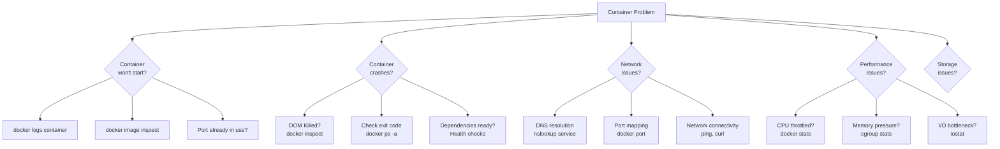

# 🔧 Troubleshooting — Debug Like a Docker Expert

> **"The fastest way to solve a Docker problem is to understand what Docker is actually doing."**

---

## 1. Troubleshooting Decision Tree



---

## 2. Container Won't Start

### Check Logs

```bash
# View container logs
$ docker logs my-container
$ docker logs --tail 50 my-container      # Last 50 lines
$ docker logs -f my-container             # Follow
$ docker logs --since 5m my-container     # Last 5 minutes
$ docker compose logs api                 # Compose service logs

# If container exited immediately:
$ docker ps -a
CONTAINER ID  IMAGE     STATUS                    PORTS  NAMES
abc123        my-app    Exited (1) 2 minutes ago         my-container

# Check exit code meaning:
# 0   = Normal exit
# 1   = Application error
# 125 = Docker daemon error
# 126 = Command cannot be invoked
# 127 = Command not found
# 137 = SIGKILL (OOM killed or docker kill)
# 139 = SIGSEGV (segmentation fault)
# 143 = SIGTERM (docker stop)
```

### Common Startup Failures

```bash
# Error: port already in use
$ docker run -p 3000:3000 my-app
Error: bind: address already in use

# Fix: find and kill the process using the port
$ netstat -tlnp | grep 3000       # Linux
$ netstat -ano | findstr 3000     # Windows
$ lsof -i :3000                   # macOS/Linux
$ docker ps | grep 3000           # Another container?

# Error: image not found
$ docker run my-company/my-app:1.2.3
Error: pull access denied, repository does not exist

# Fix: check image name, login to registry
$ docker login ghcr.io
$ docker pull ghcr.io/my-company/my-app:1.2.3

# Error: permission denied
$ docker run -v /data:/app/data my-app
Error: permission denied

# Fix: check file ownership
$ ls -la /data
$ docker run --user $(id -u):$(id -g) -v /data:/app/data my-app
```

---

## 3. Container Crashes (OOM Kill)

```bash
# Check if OOM killed
$ docker inspect my-container | grep -A5 "State"
"State": {
    "Status": "exited",
    "OOMKilled": true,     # ← Container ran out of memory
    "ExitCode": 137
}

# Check memory usage before crash
$ docker stats --no-stream
CONTAINER  CPU %  MEM USAGE / LIMIT    MEM %
my-app     45%    480MiB / 512MiB      93.75%   # ← Near limit!

# Fix: increase memory limit
$ docker run --memory 1g my-app

# Or fix memory leak in application
$ docker exec my-app node --expose-gc -e "console.log(process.memoryUsage())"
```

### Debug Crashed Container

```bash
# Container already exited? Commit state and debug
$ docker commit crashed-container debug-image
$ docker run -it debug-image /bin/sh

# Or use docker cp to extract files
$ docker cp crashed-container:/app/logs/error.log ./error.log

# Inspect container filesystem
$ docker diff my-container
A /app/tmp/debug.log          # Added
C /app/config/settings.json   # Changed
D /app/cache/old-file         # Deleted
```

---

## 4. Network Troubleshooting

### DNS Resolution

```bash
# Test DNS from inside container
$ docker compose exec api nslookup db
# If it fails: containers not on same network

# Alpine images need DNS tools
$ docker compose exec api sh -c "apk add --no-cache bind-tools && nslookup db"

# Check resolv.conf
$ docker compose exec api cat /etc/resolv.conf
nameserver 127.0.0.11
options ndots:0

# Test connectivity
$ docker compose exec api ping -c 3 db
$ docker compose exec api wget -qO- http://api:3000/health
$ docker compose exec api curl -f http://elasticsearch:9200/_cluster/health
```

### Port Mapping Issues

```bash
# Check port mappings
$ docker port my-container
3000/tcp -> 0.0.0.0:3000

# Check if port accessible from host
$ curl http://localhost:3000/health

# Check iptables (Linux)
$ sudo iptables -L -n -t nat | grep 3000

# Check if container is listening
$ docker exec my-container netstat -tlnp
# Or:
$ docker exec my-container ss -tlnp
```

### Network Inspection

```bash
# List all networks
$ docker network ls

# Inspect network
$ docker network inspect my-app_default
# Look for: Containers section, Subnet, Gateway

# Check which networks a container is on
$ docker inspect my-container --format '{{range $k,$v := .NetworkSettings.Networks}}{{$k}} {{end}}'
# Output: my-app_default my-app_backend

# Diagnose with nsenter (access container network namespace)
$ PID=$(docker inspect -f '{{.State.Pid}}' my-container)
$ sudo nsenter -t $PID -n ip addr
$ sudo nsenter -t $PID -n ss -tlnp
$ sudo nsenter -t $PID -n tcpdump -i eth0
```

---

## 5. Build Troubleshooting

### Build Fails

```bash
# Build with verbose output
$ DOCKER_BUILDKIT=1 docker build --progress=plain -t my-app .

# Build specific stage
$ docker build --target builder -t my-app:builder .

# Build without cache (force fresh)
$ docker build --no-cache -t my-app .

# Check build context size
$ du -sh . --exclude=node_modules --exclude=.git
# If too large: fix .dockerignore
```

### Common Build Errors

```bash
# Error: COPY failed: file not found
COPY package.json ./
# Cause: file not in build context or excluded by .dockerignore
# Fix: check path relative to context, check .dockerignore

# Error: npm install fails (network)
RUN npm install
# Cause: DNS resolution fails during build
# Fix: docker build --network=host or add DNS config

# Error: no space left on device
# Fix: clean up Docker
$ docker system prune -a --volumes
$ docker builder prune --all
```

---

## 6. Performance Troubleshooting

### CPU Issues

```bash
# Real-time CPU usage
$ docker stats --format "table {{.Name}}\t{{.CPUPerc}}\t{{.MemUsage}}"

# Check if CPU throttled
$ docker exec my-app cat /sys/fs/cgroup/cpu.stat
usage_usec 12345678
user_usec 10000000
system_usec 2345678
nr_periods 1000
nr_throttled 150        # ← Throttled 150/1000 = 15% of time
throttled_usec 5000000

# Check CPU limit
$ docker exec my-app cat /sys/fs/cgroup/cpu.max
200000 100000           # 200000/100000 = 2 CPUs allowed
```

### I/O Issues

```bash
# Check I/O stats
$ docker exec my-app cat /sys/fs/cgroup/io.stat
# or
$ docker exec my-app iostat -x 1

# Slow volume on macOS/Windows?
# Use named volumes instead of bind mounts for node_modules
services:
  api:
    volumes:
      - ./src:/app/src            # Bind mount for source (hot reload)
      - node_modules:/app/node_modules  # Named volume (much faster!)
```

---

## 7. Docker Compose Specific Issues

### Service Dependency Failures

```bash
# Container starts before dependency is ready
# Symptom: "Connection refused" to database

# Fix: Use health checks with depends_on
services:
  api:
    depends_on:
      db:
        condition: service_healthy
  db:
    healthcheck:
      test: ["CMD-SHELL", "pg_isready -U postgres"]
      interval: 5s
      timeout: 3s
      retries: 10
```

### Volume Permission Issues

```bash
# Error: EACCES: permission denied
# Cause: Container runs as non-root but volume owned by root

# Fix 1: Set correct ownership in Dockerfile
RUN mkdir -p /app/uploads && chown -R 1001:1001 /app/uploads
USER 1001

# Fix 2: Use named volumes (Docker manages permissions)
volumes:
  - uploads:/app/uploads

# Fix 3: Match host user ID
$ docker run --user $(id -u):$(id -g) -v ./data:/app/data my-app
```

### Environment Variable Issues

```bash
# Debug: print all env vars in container
$ docker compose exec api env | sort

# Debug: check compose variable substitution
$ docker compose config | grep -A5 "environment"

# Common mistake: missing .env file
$ docker compose up
WARN[0000] The "DB_PASSWORD" variable is not set. Defaulting to a blank string.

# Fix: create .env or use defaults
environment:
  DB_PASSWORD: ${DB_PASSWORD:-defaultpassword}
```

---

## 8. Useful Debug Commands

### Swiss Army Knife

```bash
# === Container Inspection ===
$ docker inspect my-container                     # Full JSON details
$ docker inspect -f '{{.State.Status}}' my-con    # Specific field
$ docker inspect -f '{{.Config.Env}}' my-con      # Environment vars
$ docker inspect -f '{{.HostConfig.Memory}}' my-c # Memory limit

# === Process Debugging ===
$ docker top my-container                         # Process list
$ docker exec my-container ps aux                 # Process details
$ docker exec my-container top -bn1               # CPU/Memory snapshot

# === Filesystem ===
$ docker exec my-container df -h                  # Disk usage
$ docker exec my-container du -sh /app/*          # Directory sizes
$ docker exec my-container find /app -name "*.log" -size +10M  # Large logs

# === Interactive Shell ===
$ docker exec -it my-container sh                 # Alpine/minimal
$ docker exec -it my-container bash               # Debian/Ubuntu
$ docker exec -it my-container /bin/sh            # Fallback

# === Copy Files ===
$ docker cp my-container:/app/logs ./debug-logs   # Copy out
$ docker cp ./fix.js my-container:/app/fix.js     # Copy in

# === Events ===
$ docker events --filter container=my-container   # Real-time events
$ docker events --since 1h --filter type=container
```

### Debug Container (Ephemeral Sidecar)

```bash
# Attach debug container to running container network
$ docker run -it --rm \
    --network container:my-container \
    --pid container:my-container \
    nicolaka/netshoot \
    bash

# Inside netshoot: full networking tools available
$ tcpdump -i eth0 host db
$ nslookup api
$ curl http://localhost:3000/health
$ iftop
$ ss -tlnp
```

---

## 9. Common Error Reference

| Error | Cause | Fix |
|-------|-------|-----|
| `bind: address already in use` | Port conflict | Change port or stop conflicting process |
| `OOMKilled: true` | Out of memory | Increase `--memory` or fix memory leak |
| `exec format error` | Wrong architecture | Build for correct platform (amd64/arm64) |
| `permission denied` | File ownership mismatch | Use `--user`, fix `chown` in Dockerfile |
| `no space left on device` | Docker disk full | `docker system prune -a --volumes` |
| `name already in use` | Container name conflict | `docker rm old-container` or change name |
| `network not found` | Network deleted/missing | `docker compose up` (auto-creates) |
| `connection refused` | Service not ready | Add health check + depends_on condition |
| `DNS resolution failed` | Different networks | Put services on same network |
| `image not found` | Wrong registry/tag | Check image name, `docker login` |
| `COPY failed: file not found` | Bad build context | Check path, check .dockerignore |
| `max depth exceeded` | Too many layers | Use multi-stage, combine RUN |

---

## 10. Docker System Maintenance

```bash
# Check disk usage
$ docker system df
TYPE            TOTAL   ACTIVE  SIZE     RECLAIMABLE
Images          25      5       8.5GB    6.2GB (72%)
Containers      12      3       500MB    350MB (70%)
Local Volumes   8       3       2.1GB    800MB (38%)
Build Cache     -       -       3.2GB    3.2GB (100%)

# Clean everything unused
$ docker system prune           # Remove stopped containers, unused networks, dangling images
$ docker system prune -a        # Also remove unused images (not just dangling)
$ docker system prune -a --volumes  # Nuclear option: remove everything unused

# Targeted cleanup
$ docker container prune        # Remove stopped containers
$ docker image prune -a         # Remove unused images
$ docker volume prune           # Remove unused volumes
$ docker network prune          # Remove unused networks
$ docker builder prune --all    # Remove build cache
```

---

## 11. Interview Questions

**Q: Container không start được, bạn debug từng bước thế nào?**

A: Systematic approach:
1. `docker ps -a` → check exit code and status
2. `docker logs container` → check application logs
3. `docker inspect container` → check OOMKilled, State, Config
4. If exit 137: OOM killed → increase memory or fix leak
5. If exit 1: app error → read logs, fix code/config
6. If exit 127: command not found → check CMD/ENTRYPOINT in Dockerfile
7. Test interactively: `docker run -it image sh` → run command manually

**Q: Hai containers không communicate được, debug thế nào?**

A: Network debug steps:
1. `docker network ls` + `docker network inspect` → check cùng network không?
2. `docker exec api nslookup db` → DNS resolve được không?  
3. `docker exec api ping db` → connectivity OK?
4. `docker exec api curl http://db:5432` → port listening?
5. `docker exec db ss -tlnp` → service bind đúng interface? (0.0.0.0 vs 127.0.0.1)
6. Common fix: ensure services on same custom network, not default bridge

**Q: Docker build rất chậm, nguyên nhân và fix?**

A: Common causes:
1. Large build context → fix `.dockerignore`
2. No cache hit → check layer ordering, use BuildKit cache mounts
3. Network slow during `npm install` → use cache mount: `--mount=type=cache`
4. Too many layers → combine RUN instructions
5. Not using BuildKit → set `DOCKER_BUILDKIT=1`
6. Context transfer slow → exclude `node_modules`, `.git`, `dist`
