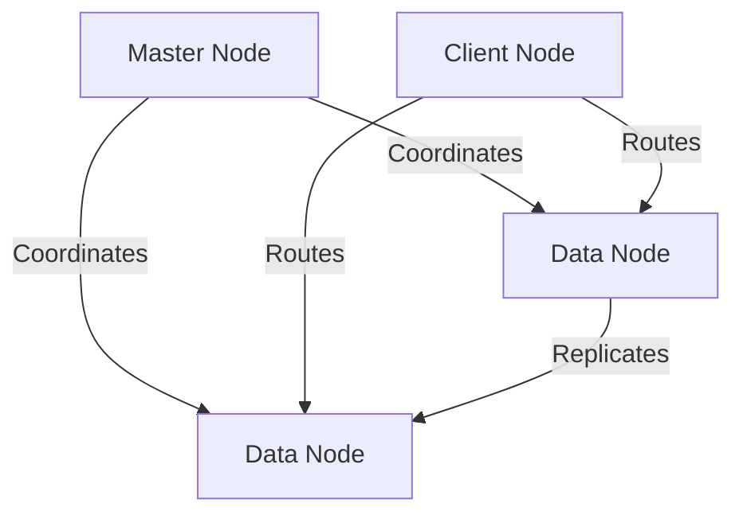

# 📖 Elasticsearch Documentation Hub

Comprehensive guide to Elasticsearch - from core concepts to enterprise-grade implementation. This documentation covers everything you need to build, optimize, and scale search solutions.

---

## 📚 Table of Contents

1. [Overview](#-overview)
2. [Quick Start](#-quick-start)
3. [Core Concepts](#-core-concepts)
4. [Architecture & Components](#-architecture--components)
5. [Search & Query](#-search--query)
6. [Indexing Strategies](#-indexing-strategies)
7. [Performance & Optimization](#-performance--optimization)
8. [Enterprise Patterns](#-enterprise-patterns)
9. [Learning Path](#-learning-path)
10. [Resources](#-resources)

---

## 🎯 Overview

### What is Elasticsearch?

**Elasticsearch** is a distributed, RESTful search and analytics engine built on **Apache Lucene**. It provides real-time search, analytics, and observability for all types of data.

### Key Capabilities

| Feature | Description |
|---------|-------------|
| 🔍 **Full-Text Search** | Advanced text analysis with relevance scoring |
| 📊 **Real-Time Analytics** | Aggregations for metrics and insights |
| 🌐 **Distributed Architecture** | Horizontal scalability across clusters |
| ⚡ **Near Real-Time** | Search within seconds of indexing |
| 🔌 **RESTful API** | JSON over HTTP, easy integration |
| 🛡️ **High Availability** | Automatic replication and failover |
| 📈 **Scalable** | Handles petabytes of data |

### Primary Use Cases

- **🔍 Search Engines** - Website search, product discovery, autocomplete
- **📊 Log Analytics** - ELK Stack (Elasticsearch, Logstash, Kibana) for observability
- **📈 Metrics & APM** - Application performance monitoring, infrastructure metrics
- **🔒 Security** - SIEM (Security Information and Event Management)
- **📰 Content Systems** - Document management, media libraries, CMS
- **🛒 E-commerce** - Product search, recommendations, inventory
- **🏢 Enterprise Search** - Knowledge bases, internal documentation, file search
- **🧠 AI & ML** - Vector search, embeddings, semantic search

---

## 🚀 Quick Start

### 1. Start Elasticsearch

```bash
# Using Docker
docker run -d \
  --name elasticsearch-local \
  -p 9200:9200 \
  -p 9300:9300 \
  -e "discovery.type=single-node" \
  -e "xpack.security.enabled=false" \
  -e "ES_JAVA_OPTS=-Xms512m -Xmx512m" \
  docker.elastic.co/elasticsearch/elasticsearch:8.11.0

# Or with LocalStack (development)
cd localstack/
docker-compose up -d
```

### 2. Verify Installation

```bash
# Check health
curl http://localhost:9200

# Expected response:
{
  "name" : "node-1",
  "cluster_name" : "elasticsearch",
  "version" : {
    "number" : "8.11.0",
    "lucene_version" : "9.8.0"
  },
  "tagline" : "You Know, for Search"
}

# Check cluster health
curl http://localhost:9200/_cluster/health?pretty
```

### 3. First Steps

```bash
# Create index with mapping
curl -X PUT "http://localhost:9200/products" \
  -H 'Content-Type: application/json' \
  -d '{
    "mappings": {
      "properties": {
        "name": { "type": "text" },
        "description": { "type": "text" },
        "price": { "type": "float" },
        "category": { "type": "keyword" },
        "created_at": { "type": "date" }
      }
    }
  }'

# Index a document
curl -X POST "http://localhost:9200/products/_doc/1" \
  -H 'Content-Type: application/json' \
  -d '{
    "name": "Wireless Mouse",
    "description": "Ergonomic wireless mouse with 2.4GHz connectivity",
    "price": 29.99,
    "category": "electronics",
    "created_at": "2026-02-02"
  }'

# Search
curl "http://localhost:9200/products/_search?q=wireless"

# Advanced search with query DSL
curl -X POST "http://localhost:9200/products/_search" \
  -H 'Content-Type: application/json' \
  -d '{
    "query": {
      "match": {
        "description": "wireless"
      }
    },
    "sort": [
      { "price": "asc" }
    ]
  }'
```

✅ **Success!** You've created your first index, indexed a document, and performed searches.

---

## 📖 Core Concepts

### Essential Reading (Start Here)

| Document | Topics Covered | Level |
|----------|---------------|-------|
| [**CONCEPTS.md**](./CONCEPTS.md) | Documents, Indices, Shards, Inverted Index, Analyzers | 🟢 Beginner |
| [**CONCEPTS-INDEX.md**](./CONCEPTS-INDEX.md) | Index fundamentals, quick reference | 🟢 Beginner |

### Deep Dives

| Document | Focus Area | When to Read |
|----------|-----------|--------------|
| [**DOCUMENTS.md**](./DOCUMENTS.md) | Document structure, CRUD operations, versioning | After CONCEPTS.md |
| [**INDICES.md**](./INDICES.md) | Index lifecycle, templates, aliases | After CONCEPTS.md |
| [**SHARDS.md**](./SHARDS.md) | Shard allocation, rebalancing, strategies | Before scaling |
| [**REPLICAS.md**](./REPLICAS.md) | Replication, high availability, recovery | Production planning |
| [**DATA-TYPES.md**](./DATA-TYPES.md) | Field types, mapping, nested/object types | Index design |
| [**MAPPING.md**](./MAPPING.md) | Dynamic/explicit mapping, analyzers | Advanced indexing |
| [**ANALYZERS.md**](./ANALYZERS.md) | Text analysis, tokenizers, filters | Search optimization |

### Key Concepts Summary

#### 1. Documents & Indices
- **Document**: JSON object containing data (like a row in SQL)
- **Index**: Collection of documents (like a table in SQL)
- **Type**: Deprecated in 8.x, use single type per index
- **ID**: Unique identifier for each document

#### 2. Distributed Architecture
- **Cluster**: One or more nodes working together
- **Node**: Single Elasticsearch instance
- **Shard**: Subset of an index (enables distribution)
  - **Primary Shard**: Original shard (default: 1)
  - **Replica Shard**: Copy for HA (default: 1)

#### 3. Inverted Index
```
Text: "The quick brown fox"

Inverted Index:
Term    | Document IDs
--------|-------------
quick   | [1, 5, 12]
brown   | [1, 8]
fox     | [1, 3, 9]
```

#### 4. Analyzers
- **Character Filters**: Remove HTML, patterns
- **Tokenizer**: Split text into terms
- **Token Filters**: Lowercase, stemming, synonyms

Read [ANALYZERS.md](./ANALYZERS.md) for details.

---

## 🏗️ Architecture & Components

### Cluster Architecture

| Document | Content | Use Case |
|----------|---------|----------|
| [**ARCHITECTURE.md**](./ARCHITECTURE.md) | Cluster design, node roles, scaling | System design |
| [**CLUSTERS-NODES.md**](./CLUSTERS-NODES.md) | Node types, cluster coordination, discovery | Production setup |

### Node Roles



- **Master Node**: Cluster management, metadata
- **Data Node**: Store data, execute queries
- **Ingest Node**: Pre-process documents
- **Coordinating Node**: Route requests, merge results
- **ML Node**: Machine learning jobs

### Shard Allocation

```
Index: products (1 primary, 2 replicas)

Node 1: [P0, R0]
Node 2: [R0, R0]  
Node 3: [P0, R0]

P0 = Primary Shard 0
R0 = Replica Shard 0
```

Read [SHARDS.md](./SHARDS.md) and [REPLICAS.md](./REPLICAS.md) for strategies.

---

## 🔍 Search & Query

### Search Documentation

| Document | Topics | Complexity |
|----------|--------|-----------|
| [**SEARCH-IMPLEMENTATION.md**](./SEARCH-IMPLEMENTATION.md) | Query DSL, filters, aggregations | 🟡 Intermediate |
| [**RELEVANCE-SCORING.md**](./RELEVANCE-SCORING.md) | BM25, TF-IDF, scoring algorithms | 🟡 Intermediate |

### Query Types

#### 1. Full-Text Queries
```json
// Match query (analyzed)
{
  "query": {
    "match": {
      "description": "wireless mouse"
    }
  }
}

// Multi-match (multiple fields)
{
  "query": {
    "multi_match": {
      "query": "wireless mouse",
      "fields": ["name^2", "description"],
      "type": "best_fields"
    }
  }
}

// Match phrase (exact order)
{
  "query": {
    "match_phrase": {
      "description": "wireless mouse"
    }
  }
}
```

#### 2. Term-Level Queries
```json
// Term (exact match, not analyzed)
{
  "query": {
    "term": {
      "category": "electronics"
    }
  }
}

// Range
{
  "query": {
    "range": {
      "price": {
        "gte": 10,
        "lte": 50
      }
    }
  }
}

// Exists
{
  "query": {
    "exists": {
      "field": "discount"
    }
  }
}
```

#### 3. Bool Queries (Combine Multiple)
```json
{
  "query": {
    "bool": {
      "must": [
        { "match": { "description": "wireless" } }
      ],
      "filter": [
        { "term": { "category": "electronics" } },
        { "range": { "price": { "lte": 50 } } }
      ],
      "should": [
        { "term": { "brand": "Logitech" } }
      ],
      "must_not": [
        { "term": { "discontinued": true } }
      ]
    }
  }
}
```

#### 4. Aggregations
```json
// Metrics aggregation
{
  "aggs": {
    "avg_price": {
      "avg": { "field": "price" }
    },
    "price_stats": {
      "stats": { "field": "price" }
    }
  }
}

// Bucket aggregation
{
  "aggs": {
    "by_category": {
      "terms": { "field": "category" },
      "aggs": {
        "avg_price": {
          "avg": { "field": "price" }
        }
      }
    }
  }
}
```

Read [SEARCH-IMPLEMENTATION.md](./SEARCH-IMPLEMENTATION.md) for complete guide.

---

## 📦 Indexing Strategies

### Document Management

| Document | Content |
|----------|---------|
| [**CHUNKING-STRATEGIES-DETAIL.md**](./CHUNKING-STRATEGIES-DETAIL.md) | Large document handling, chunking strategies |

### Chunking Strategies for Large Documents

When processing large files (logs, PDFs, markdown):

#### Fixed-Size Chunking
```javascript
const CHUNK_SIZE = 1000; // characters
const CHUNK_OVERLAP = 200; // overlap for context

function chunkText(text) {
  const chunks = [];
  for (let i = 0; i < text.length; i += CHUNK_SIZE - CHUNK_OVERLAP) {
    chunks.push(text.slice(i, i + CHUNK_SIZE));
  }
  return chunks;
}
```

#### Semantic Chunking (AI-Powered)
```javascript
// Uses LangChain for intelligent boundaries
import { RecursiveCharacterTextSplitter } from '@langchain/textsplitters';

const splitter = new RecursiveCharacterTextSplitter({
  chunkSize: 1000,
  chunkOverlap: 200,
  separators: ['\n\n', '\n', '. ', ' ']
});

const chunks = await splitter.splitText(content);
```

#### Position Tracking
```json
{
  "chunk_id": "doc123_chunk_5",
  "content": "...",
  "metadata": {
    "start_line": 45,
    "end_line": 65,
    "start_byte": 2048,
    "end_byte": 3072,
    "percent_position": 0.42
  }
}
```

Read [CHUNKING-STRATEGIES-DETAIL.md](./CHUNKING-STRATEGIES-DETAIL.md) for comprehensive strategies.

### Index Lifecycle Management (ILM)

```json
// Example ILM policy
{
  "policy": {
    "phases": {
      "hot": {
        "actions": {
          "rollover": {
            "max_size": "50GB",
            "max_age": "7d"
          }
        }
      },
      "warm": {
        "min_age": "7d",
        "actions": {
          "shrink": { "number_of_shards": 1 },
          "forcemerge": { "max_num_segments": 1 }
        }
      },
      "cold": {
        "min_age": "30d",
        "actions": {
          "freeze": {}
        }
      },
      "delete": {
        "min_age": "90d",
        "actions": {
          "delete": {}
        }
      }
    }
  }
}
```

---

## ⚡ Performance & Optimization

### Optimization Guide

| Document | Focus | Priority |
|----------|-------|----------|
| [**OPTIMIZATION.md**](./OPTIMIZATION.md) | Comprehensive performance tuning | 🔴 Critical |

### Quick Optimization Checklist

#### Index Settings
```json
{
  "settings": {
    "number_of_shards": 1,           // Start with 1, scale as needed
    "number_of_replicas": 1,         // At least 1 for HA
    "refresh_interval": "30s",       // Default: 1s (reduce for faster indexing)
    "codec": "best_compression",     // Compress stored data
    "index.mapping.total_fields.limit": 2000
  }
}
```

#### Query Optimization
- ✅ Use `filter` context (cached) instead of `must` when possible
- ✅ Avoid wildcard queries on large datasets
- ✅ Use `_source` filtering to reduce payload
- ✅ Implement pagination with `search_after`
- ✅ Cache frequently used queries

#### Shard Strategy
```
Shard size: Target 20-50GB per shard
Formula: number_of_shards = total_data_size / 40GB

Example:
- 200GB data → 5 primary shards
- 2TB data → 50 primary shards
```

#### Memory Management
```yaml
# elasticsearch.yml
bootstrap.memory_lock: true

# Set heap size (50% of RAM, max 31GB)
-Xms16g
-Xmx16g
```

#### Common Performance Issues

| Problem | Solution | Doc Reference |
|---------|----------|---------------|
| Slow queries | Use filters, add caching | [OPTIMIZATION.md](./OPTIMIZATION.md) |
| High memory | Reduce heap, optimize mappings | [OPTIMIZATION.md](./OPTIMIZATION.md) |
| Too many shards | Consolidate, use ILM | [SHARDS.md](./SHARDS.md) |
| Slow indexing | Increase refresh_interval, bulk API | [OPTIMIZATION.md](./OPTIMIZATION.md) |
| Cluster unstable | Balance shards, check resources | [CLUSTERS-NODES.md](./CLUSTERS-NODES.md) |

Read [OPTIMIZATION.md](./OPTIMIZATION.md) for complete guide.

---

## 🏢 Enterprise Patterns

### Enterprise Documentation

| Document | Content | Audience |
|----------|---------|----------|
| [**ENTERPRISE-USE-CASES.md**](./ENTERPRISE-USE-CASES.md) | Production patterns, scaling, multi-tenancy | 🔴 Advanced |

### Real-World Architectures

#### 1. Log Analytics (ELK Stack)
```
Ingestion: 100K logs/sec
Retention: 30 days hot, 90 days warm

Architecture:
- 3 Master nodes (4GB RAM each)
- 10 Data nodes (32GB RAM, 1TB SSD each)
- 2 Coordinating nodes (8GB RAM each)
- Index pattern: logs-YYYY.MM.DD

Total: ~3TB data, ~1M docs/min
Cost: ~$5,000/month (AWS)
```

#### 2. E-commerce Search
```
Products: 10M items
Queries: 10K QPS

Architecture:
- 3 Master nodes
- 6 Data nodes (hot)
- Index: products_v1 (alias: products)
- Replicas: 2

Features:
- Autocomplete with edge-ngrams
- Faceted search (category, price, brand)
- Personalized ranking with function_score
```

#### 3. Security SIEM
```
Events: 500K/sec peak
Retention: 1 year (hot→warm→cold)

Architecture:
- 5 Master nodes
- 50 Data nodes (hot tier)
- 20 Data nodes (warm tier)
- 10 Data nodes (cold tier)
- Index: security-events-YYYY.MM.DD

Total: 50TB data
Cost: ~$50,000/month
```

Read [ENTERPRISE-USE-CASES.md](./ENTERPRISE-USE-CASES.md) for detailed patterns.

### Multi-Tenancy Strategies

#### 1. Index-per-Tenant
```
Indices: tenant1_products, tenant2_products
Pros: Isolation, per-tenant optimization
Cons: Shard overhead with many tenants
```

#### 2. Shared Index with Field
```
Index: products
Document: { "tenant_id": "tenant1", ... }
Pros: Efficient with many tenants
Cons: Query all data, security complexity
```

#### 3. Time-Based with Tenant Prefix
```
Indices: tenant1_logs_2026.02, tenant2_logs_2026.02
Pros: Best for time-series + multi-tenant
Cons: Complex ILM management
```

---

## 🎓 Learning Path

### Phase 1: Fundamentals (Week 1-2)

**Goal**: Understand core concepts and perform basic operations

**Reading List**:
1. ✅ [CONCEPTS.md](./CONCEPTS.md) - Start here!
2. ✅ [CONCEPTS-INDEX.md](./CONCEPTS-INDEX.md) - Quick reference
3. ✅ [DOCUMENTS.md](./DOCUMENTS.md) - CRUD operations
4. ✅ [INDICES.md](./INDICES.md) - Index basics
5. ✅ [DATA-TYPES.md](./DATA-TYPES.md) - Field types

**Hands-On**:
- [ ] Install Elasticsearch locally
- [ ] Create index with custom mapping
- [ ] Index 100+ documents
- [ ] Perform basic search queries
- [ ] Try different analyzers

**Knowledge Check**:
- [ ] Can explain inverted index
- [ ] Can write CRUD operations
- [ ] Understand mapping vs. data types
- [ ] Know when to use text vs. keyword

---

### Phase 2: Intermediate (Week 3-4)

**Goal**: Master advanced queries and index management

**Reading List**:
1. ✅ [SEARCH-IMPLEMENTATION.md](./SEARCH-IMPLEMENTATION.md) - Query DSL
2. ✅ [RELEVANCE-SCORING.md](./RELEVANCE-SCORING.md) - Scoring algorithms
3. ✅ [ANALYZERS.md](./ANALYZERS.md) - Text analysis
4. ✅ [MAPPING.md](./MAPPING.md) - Advanced mapping
5. ✅ [SHARDS.md](./SHARDS.md) - Shard strategies
6. ✅ [REPLICAS.md](./REPLICAS.md) - Replication

**Hands-On**:
- [ ] Build search application with autocomplete
- [ ] Implement faceted search
- [ ] Write complex bool queries
- [ ] Use aggregations for analytics
- [ ] Set up multi-node cluster

**Knowledge Check**:
- [ ] Can write complex bool queries
- [ ] Understand BM25 scoring
- [ ] Can design custom analyzers
- [ ] Know shard allocation strategies
- [ ] Can implement aggregations

---

### Phase 3: Advanced (Month 2-3)

**Goal**: Production deployment and optimization

**Reading List**:
1. ✅ [ARCHITECTURE.md](./ARCHITECTURE.md) - Cluster architecture
2. ✅ [CLUSTERS-NODES.md](./CLUSTERS-NODES.md) - Node coordination
3. ✅ [OPTIMIZATION.md](./OPTIMIZATION.md) - Performance tuning
4. ✅ [CHUNKING-STRATEGIES-DETAIL.md](./CHUNKING-STRATEGIES-DETAIL.md) - Large docs
5. ✅ [ENTERPRISE-USE-CASES.md](./ENTERPRISE-USE-CASES.md) - Real-world patterns

**Hands-On**:
- [ ] Deploy production cluster (3+ nodes)
- [ ] Implement ILM for time-series data
- [ ] Set up monitoring with Kibana
- [ ] Conduct load testing (JMeter/Gatling)
- [ ] Optimize query performance
- [ ] Plan capacity and scaling

**Knowledge Check**:
- [ ] Can design cluster architecture
- [ ] Understand node roles and coordination
- [ ] Can optimize for production workload
- [ ] Know capacity planning formulas
- [ ] Can implement monitoring/alerting
- [ ] Understand disaster recovery

---

## 🧭 Navigation Guide

### By Role

**👨‍💻 Developer**:
1. [CONCEPTS.md](./CONCEPTS.md) → Understand basics
2. [SEARCH-IMPLEMENTATION.md](./SEARCH-IMPLEMENTATION.md) → Learn queries
3. [DATA-TYPES.md](./DATA-TYPES.md) → Index design
4. [RELEVANCE-SCORING.md](./RELEVANCE-SCORING.md) → Improve relevance

**🏗️ DevOps/SRE**:
1. [ARCHITECTURE.md](./ARCHITECTURE.md) → Cluster design
2. [CLUSTERS-NODES.md](./CLUSTERS-NODES.md) → Node management
3. [OPTIMIZATION.md](./OPTIMIZATION.md) → Performance tuning
4. [ENTERPRISE-USE-CASES.md](./ENTERPRISE-USE-CASES.md) → Production patterns

**📊 Data Engineer**:
1. [INDICES.md](./INDICES.md) → Index lifecycle
2. [CHUNKING-STRATEGIES-DETAIL.md](./CHUNKING-STRATEGIES-DETAIL.md) → Data processing
3. [SHARDS.md](./SHARDS.md) → Data distribution
4. [OPTIMIZATION.md](./OPTIMIZATION.md) → Indexing performance

### By Problem

| Problem | Solution Document |
|---------|------------------|
| **Slow search queries** | [OPTIMIZATION.md](./OPTIMIZATION.md) → Query Performance |
| **High memory usage** | [OPTIMIZATION.md](./OPTIMIZATION.md) → Memory Management |
| **Too many shards** | [SHARDS.md](./SHARDS.md) → Shard Strategy |
| **Poor relevance** | [RELEVANCE-SCORING.md](./RELEVANCE-SCORING.md) → Scoring |
| **Indexing bottleneck** | [OPTIMIZATION.md](./OPTIMIZATION.md) → Bulk Indexing |
| **Cluster unstable** | [CLUSTERS-NODES.md](./CLUSTERS-NODES.md) → Stability |
| **Need to scale** | [ENTERPRISE-USE-CASES.md](./ENTERPRISE-USE-CASES.md) → Scaling |
| **Large file processing** | [CHUNKING-STRATEGIES-DETAIL.md](./CHUNKING-STRATEGIES-DETAIL.md) → Chunking |
| **Text analysis issues** | [ANALYZERS.md](./ANALYZERS.md) → Custom Analyzers |

### By Use Case

| Use Case | Primary Docs | Supporting Docs |
|----------|-------------|-----------------|
| **Build search engine** | [SEARCH-IMPLEMENTATION.md](./SEARCH-IMPLEMENTATION.md) | [RELEVANCE-SCORING.md](./RELEVANCE-SCORING.md), [ANALYZERS.md](./ANALYZERS.md) |
| **Log analytics** | [ENTERPRISE-USE-CASES.md](./ENTERPRISE-USE-CASES.md) | [INDICES.md](./INDICES.md), [OPTIMIZATION.md](./OPTIMIZATION.md) |
| **E-commerce search** | [SEARCH-IMPLEMENTATION.md](./SEARCH-IMPLEMENTATION.md) | [MAPPING.md](./MAPPING.md), [OPTIMIZATION.md](./OPTIMIZATION.md) |
| **Document processing** | [CHUNKING-STRATEGIES-DETAIL.md](./CHUNKING-STRATEGIES-DETAIL.md) | [DOCUMENTS.md](./DOCUMENTS.md) |
| **Production deployment** | [ARCHITECTURE.md](./ARCHITECTURE.md) | [CLUSTERS-NODES.md](./CLUSTERS-NODES.md), [OPTIMIZATION.md](./OPTIMIZATION.md) |

---

## 📚 Resources

### Official Documentation
- **Main Docs**: https://www.elastic.co/guide/en/elasticsearch/reference/current/
- **API Reference**: https://www.elastic.co/guide/en/elasticsearch/reference/current/rest-apis.html
- **Query DSL**: https://www.elastic.co/guide/en/elasticsearch/reference/current/query-dsl.html

### Community & Support
- **Discussion Forum**: https://discuss.elastic.co/
- **Stack Overflow**: [elasticsearch] tag
- **GitHub**: https://github.com/elastic/elasticsearch
- **Blog**: https://www.elastic.co/blog/

### Tools & Utilities
- **Kibana**: UI for Elasticsearch (http://localhost:5601)
- **elasticsearch-head**: Cluster visualization
- **Cerebro**: Cluster management tool
- **Elasticdump**: Import/export utility
- **Rally**: Benchmarking tool

### Books (Recommended)
1. **Elasticsearch: The Definitive Guide** - Clinton Gormley
2. **Relevant Search** - Doug Turnbull (search relevance)
3. **Advanced Elasticsearch 7.0** - Wai Tak Wong

### Online Courses
- Elastic Official Training (paid)
- Udemy Elasticsearch courses
- Pluralsight Learning Path
- YouTube channels: Elastic, FreeCodeCamp

### Related Guides in This Project
- [Main README](../../README.md) - Project overview
- [Architecture](../ARCHITECTURE.md) - System architecture
- [Kibana Guide](../KIBANA-GUIDE.md) - Kibana basics
- [Workflow](../WORKFLOW.md) - Integration workflow

---

## 💡 Best Practices

### Development
- ✅ Start with small single-node cluster
- ✅ Use Kibana Dev Tools for testing queries
- ✅ Always define explicit mappings (avoid auto-mapping)
- ✅ Test analyzers with `_analyze` API
- ✅ Use `explain` API to debug relevance scores

### Production
- ✅ Minimum 3 master-eligible nodes
- ✅ Separate master and data nodes
- ✅ Monitor cluster health and metrics
- ✅ Implement backup/restore strategy
- ✅ Use ILM for time-series data
- ✅ Set up alerting for critical metrics
- ✅ Document your index patterns and mappings

### Performance
- ✅ Keep shard size between 20-50GB
- ✅ Use filter context for caching
- ✅ Avoid deep pagination (use `search_after`)
- ✅ Bulk index for high throughput
- ✅ Tune refresh_interval based on use case
- ✅ Monitor and optimize slow queries

### Security
- ✅ Enable authentication (X-Pack or custom)
- ✅ Use HTTPS in production
- ✅ Implement role-based access control (RBAC)
- ✅ Audit log access and changes
- ✅ Encrypt data at rest and in transit

---

## ⚠️ Common Pitfalls

| Mistake | Impact | Fix |
|---------|--------|-----|
| Too many small shards | High overhead, slow cluster | [SHARDS.md](./SHARDS.md) - Consolidate |
| Not using filters | Poor cache utilization | [SEARCH-IMPLEMENTATION.md](./SEARCH-IMPLEMENTATION.md) - Use bool/filter |
| Auto-mapping everything | Type conflicts, poor performance | [MAPPING.md](./MAPPING.md) - Explicit mappings |
| Ignoring heap size | OOM errors, crashes | [OPTIMIZATION.md](./OPTIMIZATION.md) - Set to 50% RAM |
| Single node in prod | No HA, data loss risk | [ARCHITECTURE.md](./ARCHITECTURE.md) - Min 3 nodes |
| Deep pagination | Memory issues, slow | [SEARCH-IMPLEMENTATION.md](./SEARCH-IMPLEMENTATION.md) - Use search_after |
| No ILM for time-series | Index bloat | [INDICES.md](./INDICES.md) - Implement ILM |
| Wildcard at beginning | Full scan, very slow | [OPTIMIZATION.md](./OPTIMIZATION.md) - Avoid or use ngrams |

---

## 🎯 Quick Reference

### REST API Endpoints

```bash
# Cluster
GET  /_cluster/health
GET  /_cluster/stats
GET  /_cat/nodes?v

# Index
PUT  /my-index
DELETE /my-index
GET  /my-index/_mapping
GET  /my-index/_settings

# Document
POST   /my-index/_doc
PUT    /my-index/_doc/1
GET    /my-index/_doc/1
DELETE /my-index/_doc/1

# Search
GET  /my-index/_search
POST /my-index/_search { "query": {...} }

# Bulk
POST /_bulk
POST /my-index/_bulk

# Analysis
POST /_analyze { "analyzer": "standard", "text": "..." }
GET  /my-index/_analyze { "field": "title", "text": "..." }
```

### Essential Commands

```bash
# Health check
curl http://localhost:9200/_cluster/health?pretty

# List all indices
curl http://localhost:9200/_cat/indices?v

# Index stats
curl http://localhost:9200/_cat/indices/my-index?v&h=health,status,index,docs.count,store.size

# Node stats
curl http://localhost:9200/_cat/nodes?v&h=name,heap.percent,ram.percent,cpu,load_1m

# Cluster settings
curl http://localhost:9200/_cluster/settings?pretty

# Hot threads (performance debugging)
curl http://localhost:9200/_nodes/hot_threads
```

---

## 📊 Documentation Metrics

| Metric | Value |
|--------|-------|
| Total Documents | 17 files |
| Total Lines | ~10,000+ lines |
| Coverage | Core Concepts → Enterprise Patterns |
| Last Updated | February 2, 2026 |
| Elasticsearch Version | 8.11.0 |
| Lucene Version | 9.8.0 |

---

## 🚀 Next Steps

1. **Beginners**: Start with [CONCEPTS.md](./CONCEPTS.md) 📖
2. **Developers**: Jump to [SEARCH-IMPLEMENTATION.md](./SEARCH-IMPLEMENTATION.md) 🔍  
3. **DevOps**: Read [ARCHITECTURE.md](./ARCHITECTURE.md) 🏗️
4. **Optimizers**: Study [OPTIMIZATION.md](./OPTIMIZATION.md) ⚡

---

## 📝 Contributing

This documentation is maintained as part of the LocalStack lab environment. To contribute:

1. Test examples in your local environment
2. Add real-world use cases and patterns
3. Document performance benchmarks
4. Share optimization techniques
5. Report issues or unclear sections

---

**Happy Searching!** 🎉

*For questions or feedback, refer to the main project [README](../../README.md)*
