# AWS Lambda - Complete Guide for Certification

Comprehensive guide covering all Lambda concepts, architecture patterns, troubleshooting, and optimization strategies for AWS certification exams.

## 📚 Table of Contents

1. [Core Concepts](#core-concepts)
2. [Lambda Architecture](#lambda-architecture)
3. [Execution Models](#execution-models)
4. [Integration Patterns](#integration-patterns)
5. [Security & IAM](#security--iam)
6. [Performance Optimization](#performance-optimization)
7. [Troubleshooting](#troubleshooting)
8. [Pros & Cons](#pros--cons)
9. [Limitations & Pain Points](#limitations--pain-points)
10. [Common Architecture Patterns](#common-architecture-patterns)
11. [Best Practices](#best-practices)
12. [Certification Exam Topics](#certification-exam-topics)

---

## 1. Core Concepts

### What is AWS Lambda?

**Definition**: AWS Lambda là dịch vụ serverless compute cho phép bạn chạy code để phản hồi các events mà không cần quản lý servers.

**Cách thức hoạt động**:
- **Event Source** (nguồn sự kiện) như S3, API Gateway, DynamoDB gửi trigger đến Lambda
- **Lambda Function** nhận event và thực thi code của bạn
- **Execution Role** (IAM role) cấp quyền để Lambda truy cập các AWS services khác
- **VPC Integration** (tùy chọn) cho phép kết nối với resources trong private network
- Lambda tự động scale từ 0 đến hàng nghìn concurrent executions

**Đặc điểm chính**:
- ✅ **Event-driven execution**: Chỉ chạy khi có event, không chạy liên tục
- ✅ **Auto-scaling**: Tự động scale dựa trên số lượng requests, không cần cấu hình
- ✅ **Pay-per-use pricing**: Chỉ trả tiền cho thời gian code chạy (tính theo milliseconds)
- ✅ **Managed infrastructure**: AWS quản lý servers, patching, availability
- ✅ **Built-in fault tolerance**: Tự động deploy across multiple AZs

### Lambda Lifecycle

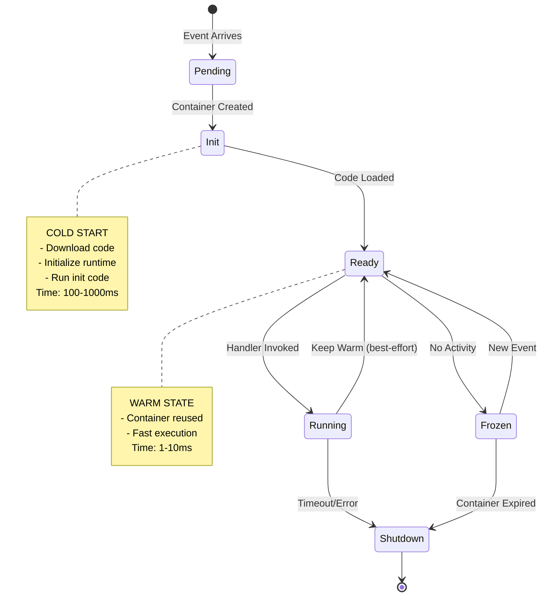

### Invocation Types

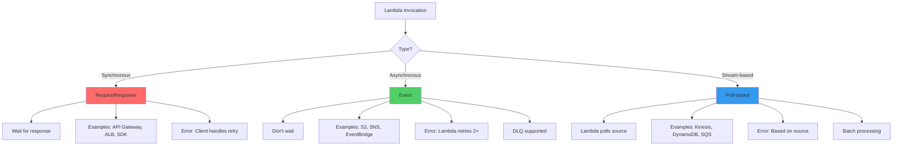

### Execution Model

**Quy trình thực thi Lambda function**:

**1. Cold Start Flow** (Khi container chưa tồn tại):
- Client gửi invoke request đến Lambda Service
- Lambda Service tạo **Execution Environment** mới (MicroVM container)
- Download deployment package (code + dependencies)
- Khởi tạo runtime environment (Node.js, Python, Java...)
- Chạy **INIT code** (code ngoài handler function - global scope)
- Sau đó mới invoke handler function của bạn
- **Thời gian**: 100-1000ms tùy runtime và package size

**2. Warm Start Flow** (Khi reuse container):
- Client gửi request
- Lambda Service route request đến container đang warm
- Bỏ qua các bước init, invoke trực tiếp handler
- **Thời gian**: 1-10ms (nhanh hơn 50-100 lần)

**3. Container Lifecycle**:
- Sau khi xử lý xong request, container có thể được giữ **warm theo best-effort** (không có SLA thời gian cố định)
- Requests tiếp theo có thể reuse container (warm start) nếu execution environment còn tồn tại
- Nếu không có request mới hoặc hệ thống cần scale/rebalance, container sẽ bị **frozen** rồi **shutdown**
- Global scope variables và connections được giữ lại giữa các invocations

---

## 2. Lambda Architecture

### Internal Architecture

**Kiến trúc bên trong AWS Lambda**:

**Layer 1 - Lambda Service Layer**:
- **Load Balancer**: Nhận tất cả invoke requests và phân phối
- **Worker Manager**: Quản lý việc tạo và phân bổ workers
- **Workers**: Chạy trên nhiều EC2 instances (do AWS quản lý, không thấy trong account)

**Layer 2 - Execution Environment (MicroVM)**:
- **Container**: Firecracker MicroVM - lightweight virtualization
- **Runtime**: Node.js, Python, Java, Go, Ruby, .NET, hoặc Custom Runtime
- **Lambda Runtime API**: Interface để runtime giao tiếp với Lambda service
- **/tmp storage**: 512MB đến 10GB ephemeral storage (có thể cấu hình)
- **Memory**: 128MB đến 10GB (quyết định CPU allocation)
- **Your Code**: Handler function + dependencies

**Layer 3 - AWS Services Integration**:
- **CloudWatch Logs**: Tự động gửi logs (stdout, stderr)
- **CloudWatch Metrics**: Duration, Invocations, Errors, Throttles
- **X-Ray**: Distributed tracing (nếu enable)
- **VPC ENI** (optional): Hyperplane ENI để kết nối với VPC resources

**Đặc điểm quan trọng**:
- Mỗi concurrent execution chạy trong container riêng biệt (isolated)
- Container reuse cho warm starts (global scope preserved)
- AWS tự động scale số lượng workers dựa trên traffic

### Memory vs CPU Allocation

**Quan hệ giữa Memory và CPU**:

Lambda sử dụng memory allocation để quyết định CPU power. Công thức:
- **Memory càng cao → CPU càng mạnh** (tỷ lệ tuyến tính)
- **Memory càng cao → Network bandwidth càng lớn**

**Bảng phân bổ CPU theo Memory**:

| Memory | vCPU | Use Case |
|--------|------|-----------|
| 128 MB | 0.08 vCPU | Simple tasks, lightweight functions |
| 512 MB | 0.33 vCPU | Typical REST APIs, CRUD operations |
| 1024 MB | 0.58 vCPU | Medium complexity, some processing |
| **1769 MB** | **~1 full vCPU** | **⭐ Mốc tham chiếu cho CPU-intensive tasks** |
| 3008 MB | ~1.70 vCPU | Heavy processing, image manipulation |
| 10240 MB | 6 vCPU | ML inference, video processing |

**Key Points**:
- ⭐ **1,769 MB ≈ 1 full vCPU** (mốc tham chiếu theo quota hiện tại)
- Double memory = Double CPU power
- Không thể config CPU trực tiếp, chỉ có thể config memory
- CPU-bound tasks nên cân nhắc >= 1769 MB để có xấp xỉ full vCPU
- Memory-bound tasks có thể dùng thấp hơn để tiết kiệm chi phí

### Networking Architecture

**1. Public Lambda (Default Mode)**:
- Chạy trong **AWS-managed VPC** (không phải VPC của bạn)
- Có quyền truy cập **public internet** mặc định
- Có thể gọi AWS services qua **VPC endpoints** (không qua internet)
- **Không thể** truy cập resources trong VPC của bạn (RDS, ElastiCache...)
- **Use case**: REST APIs, gọi external services, S3, DynamoDB

**2. VPC Lambda**:
- Deploy vào **VPC của bạn** (chỉ định subnets + security groups)
- Sử dụng **Hyperplane ENI** (since 2020) - shared ENI pool
- Có thể truy cập **private resources**: RDS, ElastiCache, internal ALB
- Cần **NAT Gateway** hoặc **VPC Endpoints** để truy cập internet/AWS services
- **Use case**: Truy cập databases trong VPC, internal microservices

**So sánh Public vs VPC Lambda**:

| Aspect | Public Lambda | VPC Lambda |
|--------|--------------|------------|
| Internet access | ✅ Yes | ❌ No (cần NAT Gateway) |
| Access VPC resources | ❌ No | ✅ Yes |
| Cold start penalty | None | ✅ **None** (since 2020 with Hyperplane) |
| AWS services | Via VPC endpoints | Via VPC endpoints hoặc NAT |
| Security Groups | N/A | ✅ Apply SG rules |

**⭐ Important for Exam**: 
- Trước 2020: VPC Lambda có cold start penalty 10-30 giây (tạo ENI)
- **Từ 2020**: Sử dụng **Hyperplane ENI** → **KHÔNG có cold start penalty**
- Hyperplane ENI là shared ENI pool, tạo sẵn và reuse nhanh

---

## 3. Execution Models

### Concurrency Model

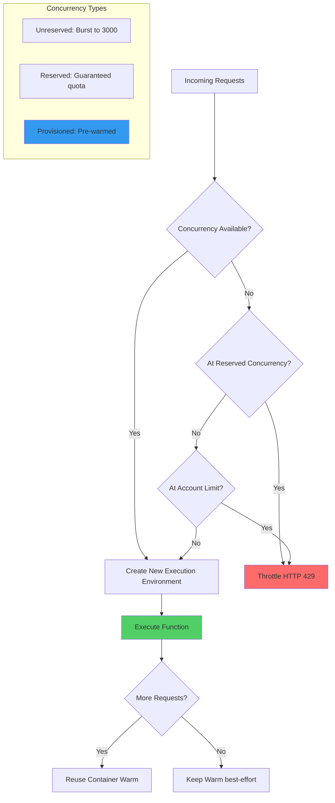

### Concurrency Calculations

**Công thức tính Concurrency** (⭐ quan trọng cho exam):

```
Concurrent Executions = Invocations per second × Duration (seconds)
```

**Ví dụ thực tế**:

**Example 1: REST API**
- **Traffic**: 100 requests/second
- **Duration**: 500ms = 0.5 seconds
- **Concurrency cần**: 100 × 0.5 = **50 concurrent executions**
- **Kết luận**: Dưới limit mặc định (1000), không cần tăng

**Example 2: Batch Processing**
- **Traffic**: 10 requests/second
- **Duration**: 30 seconds (xử lý file lớn)
- **Concurrency cần**: 10 × 30 = **300 concurrent executions**
- **Kết luận**: Nếu traffic tăng lên, có thể cần tăng limit

**Example 3: High-traffic API**
- **Traffic**: 500 requests/second (peak hour)
- **Duration**: 2 seconds
- **Concurrency cần**: 500 × 2 = **1000 concurrent executions**
- **Kết luận**: **Đúng limit!** Cần monitor và request increase hoặc optimize code

**Account Limits**:
- **Default concurrency**: 1000 per region (soft limit)
- **Burst capacity**: 500-3000 per region (phụ thuộc region)
- **Reserved concurrency**: Đặt trước quota cho function cụ thể
- **Can request increase**: Có thể yêu cầu AWS tăng limit lên hàng chục nghìn

### Reserved vs Provisioned Concurrency

**1. Reserved Concurrency** (Đặt trước quota):

**Mục đích**: 
- Đảm bảo function này **luôn có sẵn quota** để chạy
- **Ngăn không cho** functions khác dùng hết quota của account

**Cách hoạt động**:
- Set một con số cố định (ví dụ: 100)
- Function này được guarantee **tối đa 100 concurrent executions**
- Account quota giảm xuống (1000 - 100 = 900 còn lại cho functions khác)
- **Vẫn có cold starts** khi tạo container mới

**Chi phí**: **$0 extra** - chỉ trả tiền execution như bình thường

**Use cases**:
- Protect critical functions từ bị throttle
- Prevent một function "ăn hết" quota của functions khác
- Control spending bằng cách limit max concurrency

**2. Provisioned Concurrency** (Pre-warm containers):

**Mục đích**: 
- Loại bỏ **cold starts hoàn toàn**
- Đảm bảo **latency ổn định, dự đoán được**

**Cách hoạt động**:
- AWS tạo sẵn và giữ warm một số lượng containers (ví dụ: 50)
- Containers luôn ở trạng thái **initialized**, không bao giờ frozen
- Requests đến sẽ được xử lý **ngay lập tức** (1-10ms)
- Nếu vượt quá số containers provisioned → tạo thêm (có cold start)

**Chi phí**: **$0.0000041667 per GB-second** + execution cost
- Ví dụ: 1GB memory, 100 containers, 24h = ~$36/day
- Đắt hơn **nhiều** so với reserved concurrency

**Use cases**:
- Production APIs cần **low latency ổn định**
- Functions xử lý payment, authentication
- User-facing features không chấp nhận cold start lag

**So sánh**:

| Feature | Reserved Concurrency | Provisioned Concurrency |
|---------|---------------------|------------------------|
| **Mục đích** | Throttle protection | Eliminate cold starts |
| **Cold starts** | ❌ Vẫn có | ✅ Không có |
| **Latency** | Không đảm bảo | ✅ Ổn định < 10ms |
| **Cost** | Free | $$$ Expensive |
| **Use case** | Protect quota | Low latency production |

---

## 4. Integration Patterns

### Event Sources

**3 loại Event Sources theo invocation type**:

**1. Synchronous (Request-Response)**:
Caller **chờ** response từ Lambda trước khi tiếp tục.

- **API Gateway**: REST/HTTP APIs - most common
- **Application Load Balancer** (ALB): HTTP(S) requests
- **CloudFront Lambda@Edge**: CDN edge computing
- **Cognito**: User pool triggers (pre-signup, post-auth...)
- **Lex**: Chatbot fulfillment
- **Alexa**: Voice app skills
- **SDK/CLI**: Direct invoke với `InvocationType=RequestResponse`

**Đặc điểm**: Client nhận response trực tiếp, error handling do client

**2. Asynchronous (Fire-and-Forget)**:
Caller **không chờ** response, Lambda xử lý trong background.

- **S3**: Object created/deleted/restored
- **SNS**: Topic messages
- **EventBridge** (CloudWatch Events): Scheduled/event-based rules
- **SES**: Email receiving rules
- **CloudFormation**: Custom resources
- **Config**: Configuration compliance
- **CloudWatch Logs**: Log processing
- **IoT**: IoT rule actions

**Đặc điểm**: 
- Lambda retries **2 lần** nếu fail
- Hỗ trợ **DLQ** (Dead Letter Queue) cho failed events
- Event được queue trong Lambda service

**3. Poll-based (Stream/Queue)**:
Lambda **chủ động poll** data từ source.

- **Kinesis Data Streams**: Real-time streaming data
- **DynamoDB Streams**: Table change data capture
- **SQS**: Standard & FIFO queues
- **Amazon MSK** (Managed Kafka): Streaming platform
- **Self-managed Kafka**: Custom Kafka clusters
- **DocumentDB**: MongoDB-compatible change streams

**Đặc điểm**:
- Lambda tạo **Event Source Mapping** để poll
- Batch processing (nhiều records một lúc)
- Retry behavior phụ thuộc vào source type

### API Gateway Integration

**2 modes tích hợp Lambda với API Gateway**:

**1. Lambda Proxy Integration** (Recommended):

**Flow**:
- Client gửi HTTP request → API Gateway
- API Gateway forward **toàn bộ request** (headers, body, query params...) vào event
- Lambda nhận full request context, xử lý business logic
- Lambda **phải return đúng format** response cho API Gateway:
```json
{
  "statusCode": 200,
  "headers": {"Content-Type": "application/json"},
  "body": "{\"message\": \"Success\"}"
}
```
- API Gateway forward response về client

**Ưu điểm**:
- ✅ Đơn giản, không cần config mapping templates
- ✅ Lambda có full control về response format
- ✅ Dễ debug - thấy toàn bộ request

**Nhược điểm**:
- ❌ Lambda phải tự format response (boilerplate code)

**2. Non-Proxy Integration** (Custom):

**Flow**:
- Client gửi request → API Gateway
- API Gateway **transform request** theo mapping template
- Gửi transformed data đến Lambda (chỉ cần data)
- Lambda return simple response
- API Gateway **transform response** theo mapping template
- Trả về client với format tùy chỉnh

**Ưu điểm**:
- ✅ Lambda code đơn giản hơn (không lo format)
- ✅ Có thể transform complex responses
- ✅ Hide backend implementation details

**Nhược điểm**:
- ❌ Phức tạp hơn - cần config VTL mapping templates
- ❌ Khó debug - không rõ data đã transform

**⭐ Timeout Limit**: API Gateway có **default integration timeout 29 seconds**
- Lambda max timeout là 15 phút
- Với API Gateway, cấu hình timeout phụ thuộc loại API; Regional/private REST API có thể tăng >29s
- Nếu workload dài: ưu tiên async pattern (SNS/SQS/EventBridge → Lambda) hoặc Step Functions

### SQS Integration Pattern

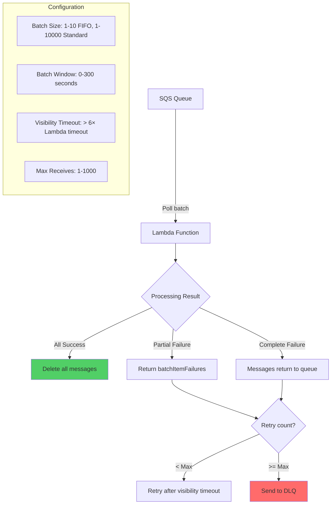

### DynamoDB Streams Pattern

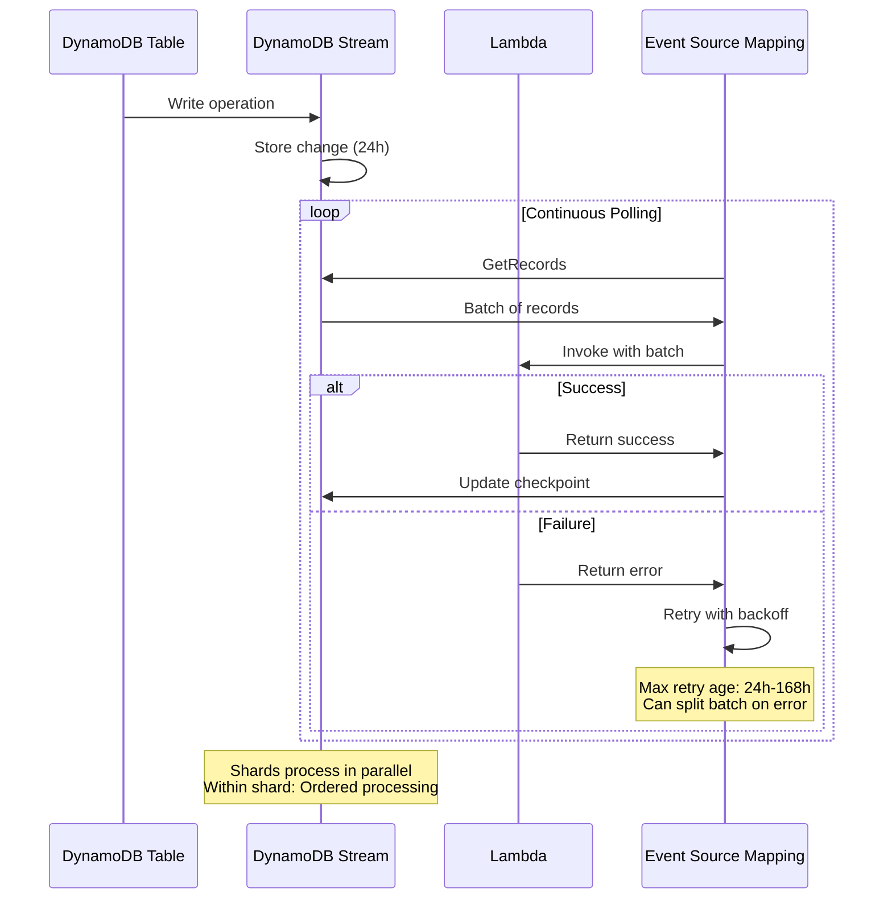

### EventBridge Integration

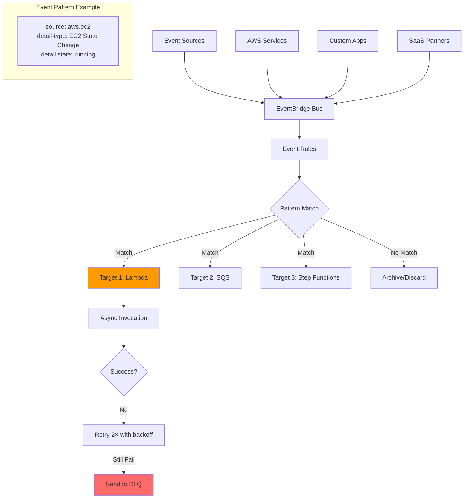

---

## 5. Security & IAM

### Lambda IAM Roles

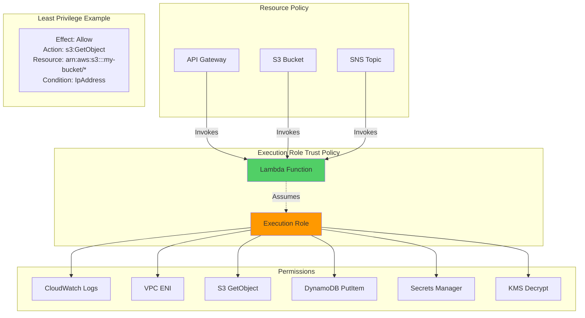

### Environment Variables & Secrets

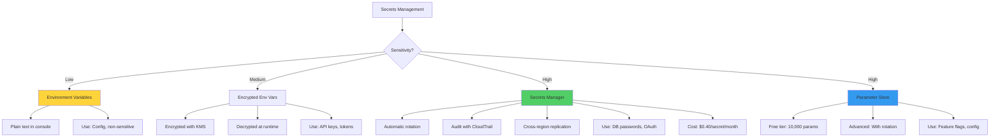

### VPC Security

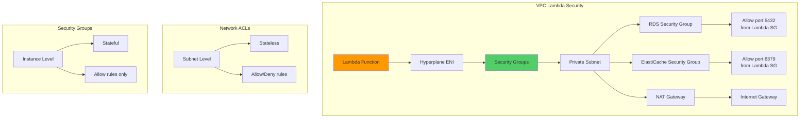

---

## 6. Performance Optimization

### Cold Start Optimization

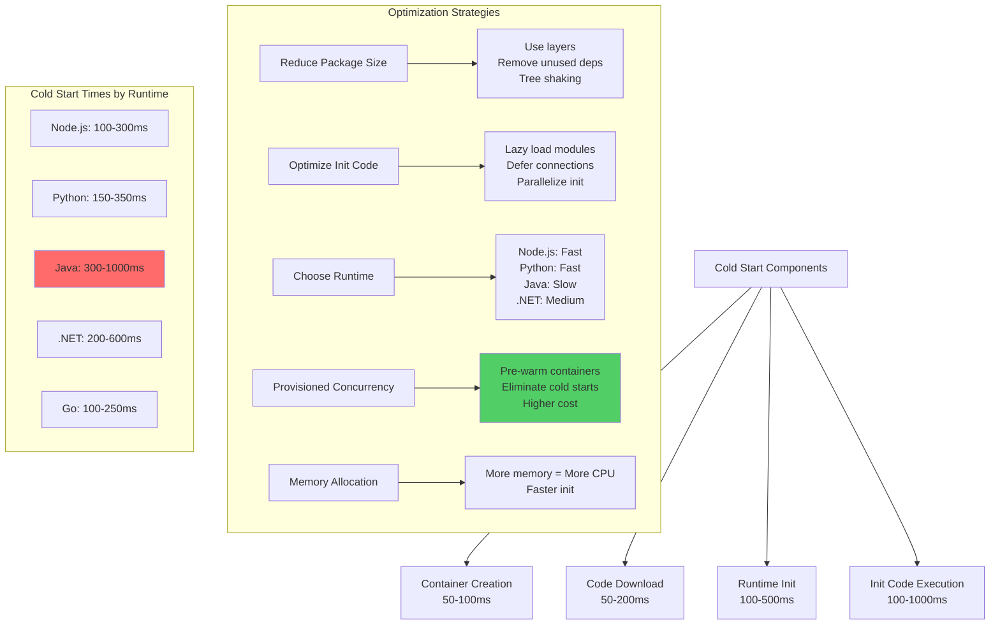

### Memory vs Cost Optimization

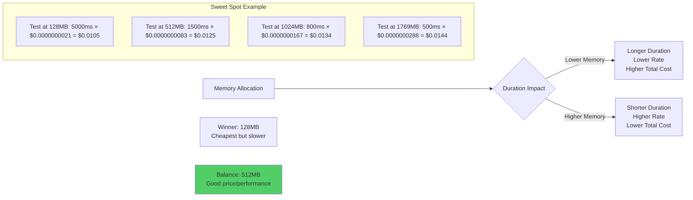

### Optimization Flowchart

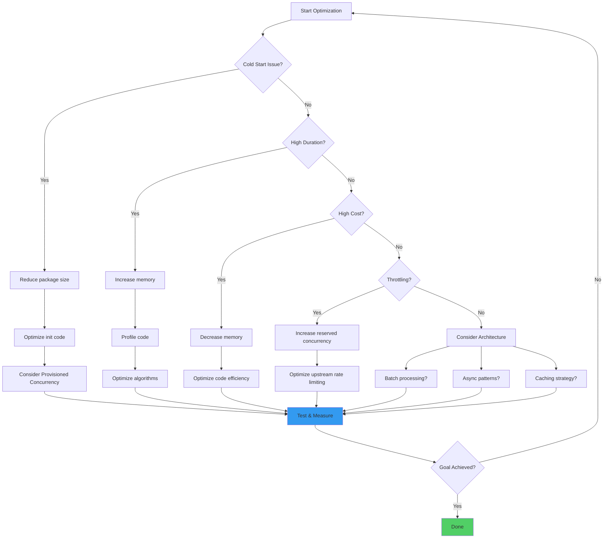

---

## 7. Troubleshooting

### Common Issues & Solutions

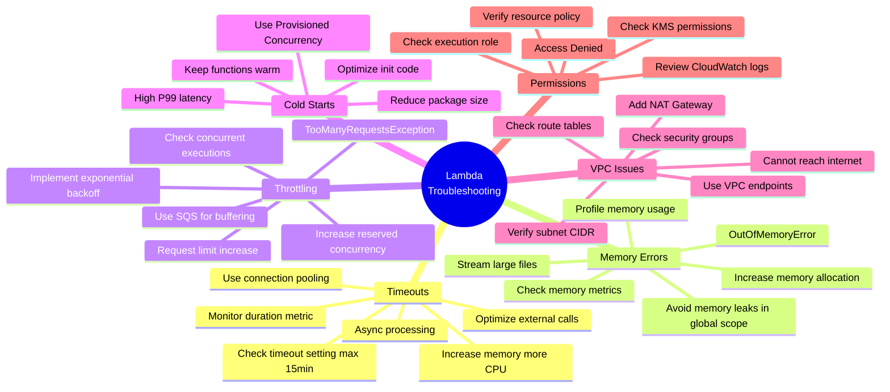

### Debugging Workflow

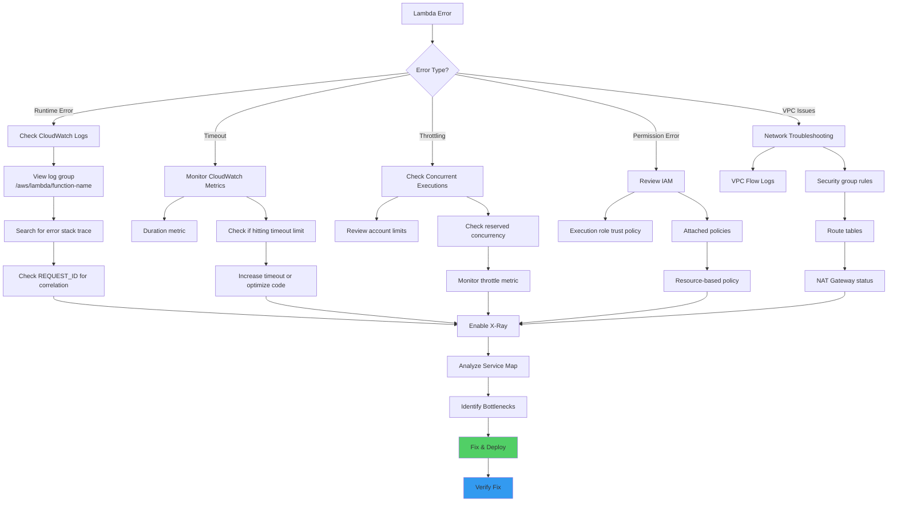

### X-Ray Tracing

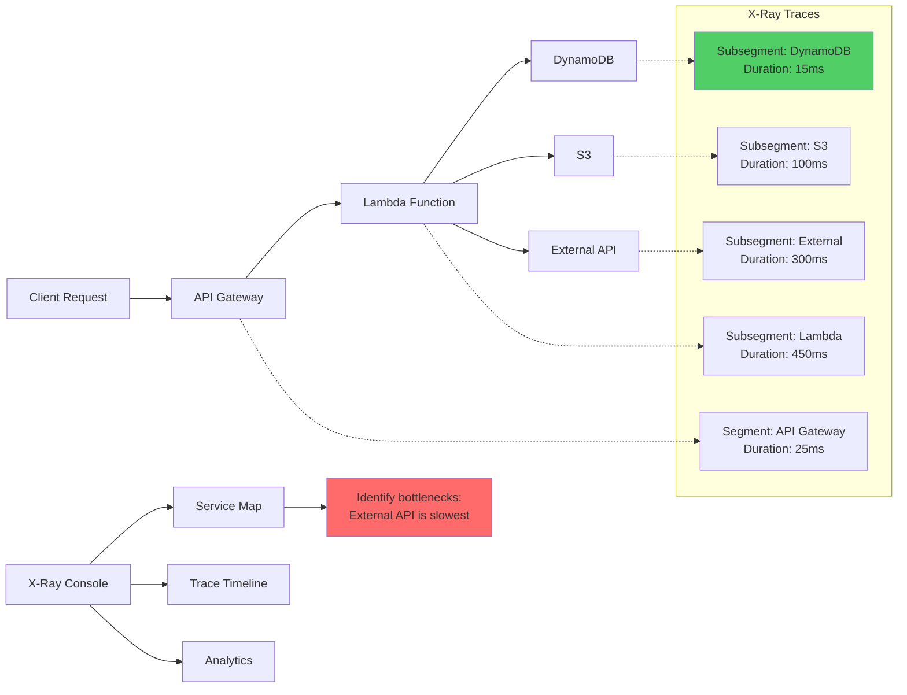

### CloudWatch Logs Insights Queries

```sql
-- Find errors
fields @timestamp, @message
| filter @message like /ERROR/
| sort @timestamp desc
| limit 20

-- Find slow invocations
fields @timestamp, @duration
| filter @duration > 3000
| stats avg(@duration), max(@duration), count()
| sort @duration desc

-- Memory usage analysis
filter @type = "REPORT"
| stats max(@memorySize / 1000 / 1000) as provisonedMemoryMB,
    min(@maxMemoryUsed / 1000 / 1000) as smallestMemoryRequestMB,
    avg(@maxMemoryUsed / 1000 / 1000) as avgMemoryUsedMB,
    max(@maxMemoryUsed / 1000 / 1000) as maxMemoryUsedMB
| sort maxMemoryUsedMB desc

-- Cold start analysis
filter @type = "REPORT"
| fields greatest(@initDuration, 0) + @duration as duration, ispresent(@initDuration) as coldStart
| stats count(*) as total, sum(coldStart) as coldStarts, (sum(coldStart) / total * 100) as coldStartPct
```

---

## 8. Pros & Cons

### Advantages

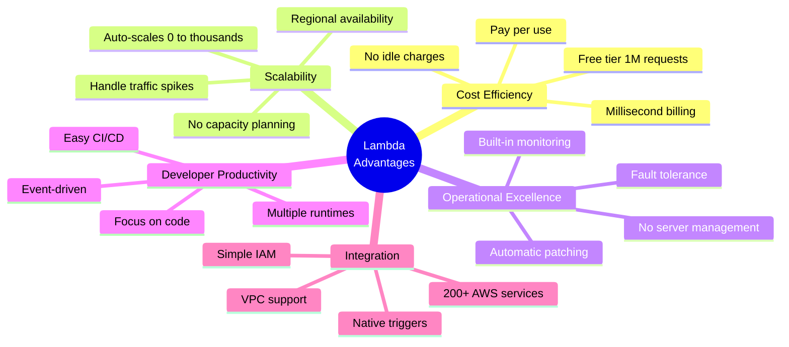

### Disadvantages

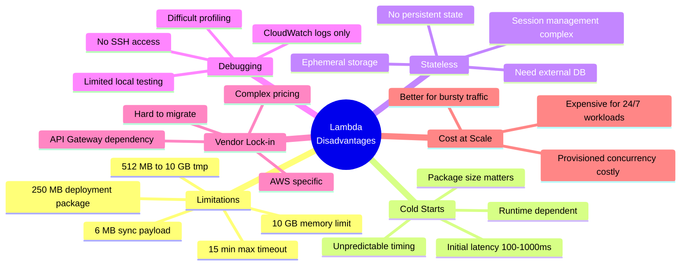

### Pros vs Cons Matrix

| Aspect | ✅ Pros | ❌ Cons | Winner |
|--------|---------|---------|--------|
| **Cost** | Pay per use, No idle cost | High at constant load | Lambda (for bursty) |
| **Scalability** | Auto-scale, unlimited | Cold starts at scale | Lambda |
| **Management** | Zero ops, Auto patch | Less control | Lambda |
| **Performance** | Fast warm starts | Cold start latency | Tie |
| **Debugging** | CloudWatch integrated | No SSH, Limited tools | EC2 |
| **Flexibility** | Many runtimes | 15min timeout | EC2 |
| **Reliability** | Built-in HA | Stateless challenges | Lambda |
| **Learning Curve** | Easy to start | Event-driven mindset | Lambda |

---

## 9. Limitations & Pain Points

### Hard Limits (Cannot Change)

```mermaid
graph TB
    subgraph "Execution Limits"
        A[Max Timeout: 15 minutes]
        B[/tmp Storage: 512 MB - 10 GB]
        C[Concurrent Executions: 1000 default]
        D[Deployment Package: 250 MB unzipped]
        E[Deployment Package: 50 MB zipped]
    end
    
    subgraph "Payload Limits"
        F[Sync Invocation: 6 MB]
        G[Async Invocation: 1 MB]
        H[Environment Variables: 4 KB]
    end
    
    subgraph "Streaming Limits"
        I[Kinesis: 10,000 records/batch]
        J[DynamoDB: 10,000 records/batch]
        K[SQS: 10 messages FIFO]
        L[SQS: up to 10,000 messages Standard]
    end
    
    style A fill:#ff6b6b
    style F fill:#ff6b6b
```

### Common Pain Points

```mermaid
flowchart TD
    A[Pain Points] --> B[Cold Start Latency]
    A --> C[Debugging Complexity]
    A --> D[Timeout Limits]
    A --> E[Vendor Lock-in]
    A --> F[Cost Unpredictability]
    
    B --> B1[Impact: P99 latency spikes]
    B --> B2[Solutions: Provisioned concurrency,<br/>SnapStart Java, Keep-alive]
    B --> B3[Cost: $$$]
    
    C --> C1[Impact: Slow troubleshooting]
    C --> C2[Solutions: X-Ray, CloudWatch Logs Insights,<br/>Local emulation SAM/LocalStack]
    C --> C3[Cost: Time]
    
    D --> D1[Impact: Long-running tasks fail]
    D --> D2[Solutions: Step Functions,<br/>Break into smaller functions,<br/>Async processing]
    D --> D3[Cost: Architecture complexity]
    
    E --> E1[Impact: Hard to migrate]
    E --> E2[Solutions: Abstract event sources,<br/>Use containers,<br/>Serverless Framework]
    E --> E3[Cost: Reduced portability]
    
    F --> F1[Impact: Budget overruns]
    F --> F2[Solutions: Set budget alerts,<br/>Reserved concurrency caps,<br/>Monitor CloudWatch]
    F --> F3[Cost: Surprise bills]
    
    style B1 fill:#ff6b6b
    style C1 fill:#ff6b6b
    style D1 fill:#ff6b6b
    style E1 fill:#ff6b6b
    style F1 fill:#ff6b6b
```

### Workarounds for Limitations

```mermaid
graph LR
    A[Limitation] --> B[Workaround]
    
    A1[15 min timeout] --> B1[Step Functions State Machine]
    A1 --> B2[Chain multiple Lambdas]
    A1 --> B3[Use ECS Fargate for long tasks]
    
    A2[6 MB payload] --> B4[Upload to S3, pass S3 path]
    A2 --> B5[Use streaming with Lambda URLs]
    A2 --> B6[Compress payload]
    
    A3[250 MB package] --> B7[Use Lambda Layers]
    A3 --> B8[Use Lambda Container Images]
    A3 --> B9[Optimize dependencies]
    
    A4[Stateless] --> B10[Use ElastiCache for session]
    A4 --> B11[DynamoDB for state]
    A4 --> B12[/tmp for ephemeral]
    
    A5[Cold starts] --> B13[Provisioned Concurrency]
    A5 --> B14[SnapStart Java]
    A5 --> B15[Optimize package size]
    
    style B1 fill:#51cf66
    style B4 fill:#51cf66
    style B7 fill:#51cf66
    style B10 fill:#51cf66
    style B13 fill:#51cf66
```

---

## 10. Common Architecture Patterns

### 1. REST API Pattern

```mermaid
graph LR
    A[Client] --> B[API Gateway]
    B --> C[Lambda Authorizer]
    C --> D{Authorized?}
    D -->|Yes| E[Lambda Function]
    D -->|No| F[401 Unauthorized]
    E --> G[DynamoDB]
    E --> H[S3]
    G --> E
    E --> B
    B --> A
    
    style E fill:#ff9900
    style G fill:#339af0
```

**Use Cases**: Public APIs, Mobile backends, Microservices

**Pros**:
- ✅ Fully serverless
- ✅ Auto-scales
- ✅ Pay per request

**Cons**:
- ❌ 29s timeout (API Gateway limit)
- ❌ Cold start latency

### 2. Event-Driven Processing

```mermaid
graph TB
    A[S3 Upload] --> B[Lambda 1: Validate]
    B --> C{Valid?}
    C -->|Yes| D[SQS Queue]
    C -->|No| E[SNS Error Topic]
    D --> F[Lambda 2: Process]
    F --> G[DynamoDB]
    F --> H[S3 Results]
    F --> I[EventBridge]
    I --> J[Lambda 3: Notify]
    I --> K[Lambda 4: Audit]
    
    style F fill:#ff9900
    style D fill:#339af0
```

**Use Cases**: File processing, ETL, Data pipelines

**Pros**:
- ✅ Decoupled components
- ✅ Fault tolerant with retries
- ✅ Asynchronous processing

**Cons**:
- ❌ Eventual consistency
- ❌ Complex error handling

### 3. CQRS Pattern

```mermaid
graph TB
    subgraph "Command Side"
        A[Client] --> B[API Gateway]
        B --> C[Lambda Write]
        C --> D[DynamoDB]
        D --> E[DynamoDB Streams]
    end
    
    subgraph "Query Side"
        E --> F[Lambda Stream Processor]
        F --> G[ElasticSearch]
        F --> H[Redis Cache]
        
        I[Client] --> J[API Gateway Read]
        J --> K[Lambda Read]
        K --> G
        K --> H
    end
    
    style C fill:#ff6b6b
    style K fill:#51cf66
```

**Use Cases**: High-read applications, Analytics, Search

**Pros**:
- ✅ Read/write optimization
- ✅ Scalable independently
- ✅ Complex queries on read model

**Cons**:
- ❌ Eventual consistency
- ❌ Infrastructure complexity

### 4. Fan-Out Pattern

```mermaid
graph TB
    A[S3 New File] --> B[SNS Topic]
    B --> C[Lambda 1: Thumbnail]
    B --> D[Lambda 2: Watermark]
    B --> E[Lambda 3: Metadata]
    B --> F[Lambda 4: Virus Scan]
    B --> G[SQS DLQ]
    
    C --> H[S3 Thumbnails]
    D --> I[S3 Watermarked]
    E --> J[DynamoDB]
    F --> K[S3 Quarantine]
    
    style B fill:#339af0
    style C fill:#ff9900
    style D fill:#ff9900
    style E fill:#ff9900
    style F fill:#ff9900
```

**Use Cases**: Parallel processing, Multi-step workflows

**Pros**:
- ✅ Parallel execution
- ✅ Independent scaling
- ✅ Fault isolation

**Cons**:
- ❌ Coordination complexity
- ❌ Higher cost (multiple invocations)

### 5. Strangler Fig Pattern (Migration)

```mermaid
graph LR
    A[Client] --> B[API Gateway]
    B --> C{Route}
    
    C -->|New Routes| D[Lambda Microservice]
    C -->|Legacy Routes| E[ALB]
    
    D --> F[DynamoDB]
    E --> G[EC2 Monolith]
    G --> H[RDS]
    
    subgraph "Phase 1"
        I[10% traffic to Lambda]
    end
    
    subgraph "Phase 2"
        J[50% traffic to Lambda]
    end
    
    subgraph "Phase 3"
        K[100% traffic to Lambda]
        L[Decommission EC2]
    end
    
    style D fill:#51cf66
    style G fill:#ffd43b
```

**Use Cases**: Monolith migration, Incremental modernization

**Pros**:
- ✅ Low risk migration
- ✅ Gradual rollout
- ✅ Easy rollback

**Cons**:
- ❌ Dual maintenance
- ❌ Longer timeline

### 6. Orchestration with Step Functions

```mermaid
stateDiagram-v2
    [*] --> ValidateInput
    ValidateInput --> ProcessPayment: Valid
    ValidateInput --> SendError: Invalid
    
    ProcessPayment --> CheckInventory: Success
    ProcessPayment --> RefundPayment: Failed
    
    CheckInventory --> ShipOrder: Available
    CheckInventory --> RefundPayment: Out of Stock
    
    ShipOrder --> SendConfirmation
    RefundPayment --> SendError
    SendConfirmation --> [*]
    SendError --> [*]
    
    note right of ValidateInput
        Lambda Function
        Timeout: 60s
    end note
    
    note right of ProcessPayment
        Lambda Function
        Timeout: 120s
    end note
```

**Use Cases**: Complex workflows, Long-running processes, Error handling

**Pros**:
- ✅ Visual workflow
- ✅ Built-in retry logic
- ✅ State management
- ✅ No 15min Lambda limit

**Cons**:
- ❌ Additional cost ($25 per million transitions)
- ❌ Learning curve

---

## 11. Best Practices

### Deployment Best Practices

```mermaid
flowchart TD
    A[Best Practices] --> B[Code]
    A --> C[Configuration]
    A --> D[Monitoring]
    A --> E[Security]
    
    B --> B1[Use Infrastructure as Code<br/>Terraform/SAM/CDK]
    B --> B2[Version control everything]
    B --> B3[Use Lambda Layers for deps]
    B --> B4[Separate business logic]
    
    C --> C1[Environment variables for config]
    C --> C2[Use aliases for versions]
    C --> C3[Tag resources]
    C --> C4[Set appropriate timeouts]
    
    D --> D1[Enable X-Ray tracing]
    D --> D2[Structured logging JSON]
    D --> D3[Custom CloudWatch metrics]
    D --> D4[Set up CloudWatch alarms]
    
    E --> E1[Principle of least privilege]
    E --> E2[Use Secrets Manager]
    E --> E3[Enable encryption at rest]
    E --> E4[VPC only if needed]
    
    style B1 fill:#51cf66
    style C1 fill:#51cf66
    style D1 fill:#51cf66
    style E1 fill:#51cf66
```

### Code Optimization Checklist

```mermaid
mindmap
  root((Code<br/>Optimization))
    Initialization
      Move outside handler
      Reuse connections
      Load secrets once
      Lazy load modules
    Error Handling
      Try-catch blocks
      Return proper error codes
      Log context
      Use DLQ
    Dependencies
      Minimize package size
      Remove unused libs
      Use layers
      Tree shaking
    Performance
      Optimize algorithms
      Use async/await
      Batch operations
      Connection pooling
    Memory
      Monitor usage
      Right-size allocation
      Avoid memory leaks
      Stream large files
```

### Monitoring & Alerting

```mermaid
graph TB
    A[Lambda Metrics] --> B[CloudWatch Dashboard]
    
    subgraph "Key Metrics"
        C[Invocations]
        D[Duration]
        E[Errors]
        F[Throttles]
        G[ConcurrentExecutions]
        H[IteratorAge stream]
    end
    
    C --> I[Alarm: Invocations < threshold]
    D --> J[Alarm: Duration > 80% timeout]
    E --> K[Alarm: Error rate > 1%]
    F --> L[Alarm: Throttles > 0]
    G --> M[Alarm: Concurrent > 80% limit]
    H --> N[Alarm: Iterator age > 1 minute]
    
    I --> O[SNS Topic]
    J --> O
    K --> O
    L --> O
    M --> O
    N --> O
    
    O --> P[Email]
    O --> Q[PagerDuty]
    O --> R[Slack]
    
    style K fill:#ff6b6b
    style L fill:#ff6b6b
```

---

## 12. Certification Exam Topics

### SAA-C03 (Solutions Architect Associate)

```mermaid
mindmap
  root((Lambda<br/>SAA Topics))
    Core Concepts
      Event-driven architecture
      Synchronous vs Asynchronous
      Integration patterns
      Use cases
    Scalability
      Auto-scaling behavior
      Concurrency limits
      Reserved concurrency
      Provisioned concurrency
    Security
      Execution roles
      Resource policies
      VPC integration
      Environment variables
    Cost Optimization
      Pricing model
      Memory vs duration tradeoff
      Right-sizing
      Monitoring costs
    Integration
      API Gateway
      S3 triggers
      DynamoDB Streams
      EventBridge
      Step Functions
    High Availability
      Multi-AZ by default
      Retry behavior
      DLQ configuration
      Error handling
```

### DVA-C02 (Developer Associate)

Focus areas:
1. **Writing Lambda Functions** (40%)
   - Handler implementation
   - Environment variables
   - Error handling
   - Logging

2. **Deployment & CI/CD** (30%)
   - AWS SAM
   - CloudFormation
   - Versioning & Aliases
   - Blue/Green deployments

3. **Debugging & Troubleshooting** (20%)
   - CloudWatch Logs
   - X-Ray tracing
   - Performance optimization
   - Error patterns

4. **Security** (10%)
   - IAM roles & policies
   - Secrets management
   - VPC configuration
   - Encryption

### SysOps Administrator (SOA-C02)

Focus areas:
1. **Monitoring & Logging** (35%)
   - CloudWatch metrics
   - CloudWatch Logs Insights
   - Alarms configuration
   - X-Ray analysis

2. **Performance Optimization** (25%)
   - Memory tuning
   - Concurrency management
   - Cold start mitigation
   - Cost optimization

3. **Deployment & Updates** (20%)
   - Update strategies
   - Rollback procedures
   - Canary deployments
   - Version management

4. **Troubleshooting** (20%)
   - Common error patterns
   - Permission issues
   - Timeout problems
   - VPC connectivity

### Exam Tips

```mermaid
flowchart TD
    A[Exam Strategy] --> B[Know These Cold]
    
    B --> C[Timeout: 15 minutes max]
    B --> D[Concurrency: 1000 default]
    B --> E[Payload: 6MB sync, 1MB async]
    B --> F[Package: 250MB unzipped]
    B --> G[/tmp: 512MB-10GB]
    
    A --> H[Common Scenarios]
    
    H --> I[S3 trigger → Process file]
    H --> J[API Gateway → CRUD operations]
    H --> K[DynamoDB Stream → Replicate]
    H --> L[EventBridge → Scheduled jobs]
    
    A --> M[Troubleshooting]
    
    M --> N[Timeout → Increase timeout or memory]
    M --> O[Permission → Check execution role]
    M --> P[VPC → Check NAT/Security Groups]
    M --> Q[Throttle → Increase concurrency]
    
    A --> R[Cost Optimization]
    
    R --> S[Right-size memory]
    R --> T[Use reserved concurrency caps]
    R --> U[Async for non-critical]
    R --> V[Consider EC2 for 24/7 workloads]
    
    style C fill:#ff6b6b
    style I fill:#51cf66
    style N fill:#339af0
    style S fill:#ffd43b
```

---

## Summary

### Quick Reference Card

| Concept | Key Points | Exam Weight |
|---------|-----------|-------------|
| **Invocation Types** | Sync, Async, Poll-based | ⭐⭐⭐⭐⭐ |
| **Concurrency** | 1000 default, Reserved, Provisioned | ⭐⭐⭐⭐⭐ |
| **Limits** | 15min, 10GB memory, 6MB payload | ⭐⭐⭐⭐⭐ |
| **IAM** | Execution role, Resource policy | ⭐⭐⭐⭐⭐ |
| **Integration** | API Gateway, S3, DynamoDB, EventBridge | ⭐⭐⭐⭐⭐ |
| **Cold Start** | 100-1000ms, Provisioned Concurrency | ⭐⭐⭐⭐ |
| **VPC** | Hyperplane ENI, No cold start impact | ⭐⭐⭐⭐ |
| **Monitoring** | CloudWatch, X-Ray, Logs Insights | ⭐⭐⭐⭐ |
| **Versioning** | $LATEST, Aliases, Immutable | ⭐⭐⭐ |
| **Layers** | Share code, 5 max, 250MB limit | ⭐⭐⭐ |

### Must-Know for Certification

1. ✅ **Timeout**: 15 minutes maximum
2. ✅ **Concurrency**: Default 1000, can request increase
3. ✅ **Payload Limits**: 6MB synchronous, 1MB asynchronous
4. ✅ **Cold Start**: Happens when new container needed
5. ✅ **Provisioned Concurrency**: Eliminates cold starts
6. ✅ **VPC Integration**: Uses Hyperplane ENI (fast)
7. ✅ **Retry Behavior**: 2× async, varies for streams
8. ✅ **DLQ**: For failed async invocations
9. ✅ **Execution Role**: Lambda assumes to access resources
10. ✅ **Resource Policy**: Who can invoke Lambda

---

## Additional Resources

- 📖 [AWS Lambda Developer Guide](https://docs.aws.amazon.com/lambda/)
- 📖 [Lambda Best Practices](https://docs.aws.amazon.com/lambda/latest/dg/best-practices.html)
- 📖 [Lambda Quotas](https://docs.aws.amazon.com/lambda/latest/dg/gettingstarted-limits.html)
- 📖 [Lambda Pricing](https://aws.amazon.com/lambda/pricing/)
- 🎥 [AWS Lambda Deep Dive](https://www.youtube.com/watch?v=QdzV04T_kec)
- 🎓 [AWS Certified Solutions Architect Study Guide](https://aws.amazon.com/certification/)

---

**Document Version**: 1.0  
**Last Updated**: January 28, 2026  
**Target Audience**: AWS Certification Candidates
