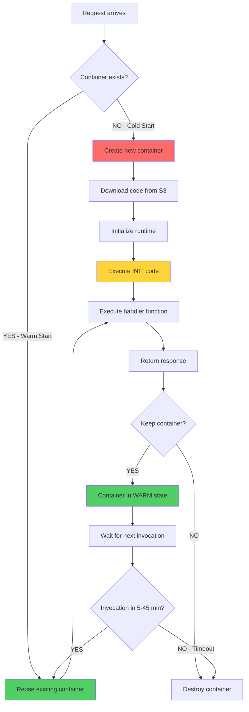
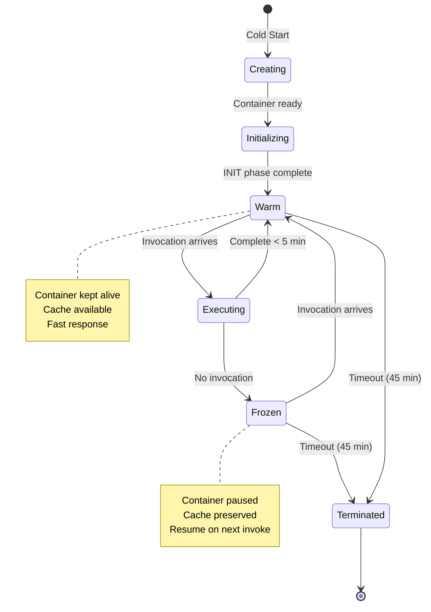

# Lambda Cache Mechanism - Cách Thức Hoạt Động

## 📋 Tổng Quan

Lambda caching hoạt động dựa trên **Container Reuse** - AWS không destroy container sau mỗi invocation mà giữ lại để reuse.

---

## 🔄 Lambda Execution Lifecycle



---

## 🎯 3 Phases của Lambda Execution

### Phase 1: INIT (Cold Start Only)
```javascript
// ==========================================
// INIT PHASE - Runs ONCE per container
// ==========================================
console.log('INIT: Loading dependencies...');
const AWS = require('aws-sdk');
const s3 = new AWS.S3(); // ← Executed once

// Global variables initialized here
let connectionPool = null;
let configCache = {};

console.log('INIT: Complete');

// ==========================================
// INVOKE PHASE - Runs EVERY invocation
// ==========================================
exports.handler = async (event) => {
  console.log('INVOKE: Processing request');
  
  // Reuse s3 client from INIT phase
  const data = await s3.getObject({...}).promise();
  
  return { statusCode: 200 };
};
```

### Phase 2: INVOKE (Every Invocation)
- Handler function executes
- Can access global scope variables
- Can read/write to /tmp

### Phase 3: SHUTDOWN (Container Destruction)
- Container destroyed after timeout
- All data lost (memory + /tmp)

---

## 📊 Container States Diagram



---

## 🗂️ Cache Layers trong Lambda

```
┌─────────────────────────────────────────────────────────┐
│                    AWS Lambda Function                   │
├─────────────────────────────────────────────────────────┤
│                                                           │
│  ┌─────────────────────────────────────────────────┐   │
│  │  Layer 1: GLOBAL SCOPE (Fastest - <1ms)        │   │
│  │  ────────────────────────────────────────────   │   │
│  │  • AWS SDK clients (S3, DynamoDB, etc)         │   │
│  │  • Database connections                         │   │
│  │  • Global variables, constants                  │   │
│  │  • Parsed configuration                         │   │
│  │                                                  │   │
│  │  Lifetime: 5-45 minutes (container reuse)      │   │
│  │  Size: Limited by Memory (128MB-10GB)          │   │
│  └─────────────────────────────────────────────────┘   │
│                          ↓                              │
│  ┌─────────────────────────────────────────────────┐   │
│  │  Layer 2: IN-MEMORY CACHE (Fast - 1-10ms)      │   │
│  │  ────────────────────────────────────────────   │   │
│  │  • Map/Object for key-value storage            │   │
│  │  • Frequently accessed data                     │   │
│  │  • LRU cache for metadata                       │   │
│  │  • Computed results                             │   │
│  │                                                  │   │
│  │  Lifetime: 5-45 minutes (container reuse)      │   │
│  │  Size: Limited by Memory allocation            │   │
│  └─────────────────────────────────────────────────┘   │
│                          ↓                              │
│  ┌─────────────────────────────────────────────────┐   │
│  │  Layer 3: /tmp STORAGE (Medium - 10-100ms)     │   │
│  │  ────────────────────────────────────────────   │   │
│  │  • Downloaded files from S3                     │   │
│  │  • ML model weights                             │   │
│  │  • Large datasets                               │   │
│  │  • Compiled code/binaries                       │   │
│  │                                                  │   │
│  │  Lifetime: 5-45 minutes (container reuse)      │   │
│  │  Size: 512MB - 10GB (configurable)             │   │
│  └─────────────────────────────────────────────────┘   │
│                          ↓                              │
│  ┌─────────────────────────────────────────────────┐   │
│  │  Layer 4: EXTERNAL CACHE (Slow - 50-200ms)     │   │
│  │  ────────────────────────────────────────────   │   │
│  │  • ElastiCache (Redis/Memcached)                │   │
│  │  • S3 (persistent storage)                      │   │
│  │  • DynamoDB (NoSQL database)                    │   │
│  │                                                  │   │
│  │  Lifetime: Permanent                            │   │
│  │  Size: Unlimited                                │   │
│  └─────────────────────────────────────────────────┘   │
│                                                           │
└─────────────────────────────────────────────────────────┘
```

---

## 🔍 Cache Flow - Chi Tiết

### Scenario 1: Cold Start (First Invocation)

```
Time: 0ms
┌─────────────────────────────────────────┐
│  1. Lambda receives request             │
│     → No container available            │
└─────────────────────────────────────────┘
                ↓
Time: 100ms
┌─────────────────────────────────────────┐
│  2. Create new container                │
│     • Download code from S3             │
│     • Initialize Node.js runtime        │
└─────────────────────────────────────────┘
                ↓
Time: 200ms
┌─────────────────────────────────────────┐
│  3. INIT Phase                          │
│     • Load dependencies                 │
│     • const s3Client = new S3Client()   │ ← Cache Layer 1
│     • const cache = new Map()           │ ← Cache Layer 2
│     • await fs.mkdir('/tmp/cache')      │ ← Cache Layer 3
└─────────────────────────────────────────┘
                ↓
Time: 300ms
┌─────────────────────────────────────────┐
│  4. INVOKE Phase                        │
│     • Check cache → MISS (empty)        │
│     • Download file from S3 (200ms)     │
│     • Process file (50ms)               │
│     • Save to cache                     │
│     • Return response                   │
└─────────────────────────────────────────┘
                ↓
Time: 550ms
┌─────────────────────────────────────────┐
│  5. Container kept WARM                 │
│     • s3Client still in memory          │
│     • cache Map preserved               │
│     • /tmp files still exist            │
└─────────────────────────────────────────┘

Total Time: 550ms (SLOW - Cold Start)
```

### Scenario 2: Warm Start (Subsequent Invocations)

```
Time: 0ms
┌─────────────────────────────────────────┐
│  1. Lambda receives request             │
│     → Container already exists (WARM)   │
└─────────────────────────────────────────┘
                ↓
Time: 5ms
┌─────────────────────────────────────────┐
│  2. Skip container creation             │
│     ✓ Container reused                  │
│     ✓ Runtime already initialized       │
└─────────────────────────────────────────┘
                ↓
Time: 10ms
┌─────────────────────────────────────────┐
│  3. INVOKE Phase ONLY                   │
│     • Check cache → HIT!                │ ← Cache Layer 2
│     • Read from cache (1ms)             │
│     • Return response                   │
└─────────────────────────────────────────┘
                ↓
Time: 11ms
┌─────────────────────────────────────────┐
│  4. Container still WARM                │
│     • Ready for next invocation         │
└─────────────────────────────────────────┘

Total Time: 11ms (FAST - 50× faster!)
```

---

## 💻 Implementation Example với Flow

### Code Example
```javascript
// ==========================================
// LAYER 1: GLOBAL SCOPE
// Executed ONCE per container (INIT phase)
// ==========================================
const { S3Client, GetObjectCommand } = require('@aws-sdk/client-s3');
const { Client } = require('@elastic/elasticsearch');

console.log('[INIT] Creating S3 client...');
const s3Client = new S3Client({ region: 'us-east-1' });

console.log('[INIT] Creating Elasticsearch client...');
const esClient = new Client({ node: 'https://...' });

console.log('[INIT] Complete - Clients ready for reuse');

// ==========================================
// LAYER 2: IN-MEMORY CACHE
// Initialized ONCE, reused across invocations
// ==========================================
const fileMetadataCache = new Map();
const METADATA_CACHE_SIZE = 100;
const METADATA_CACHE_TTL = 5 * 60 * 1000; // 5 minutes

console.log('[INIT] In-memory cache initialized');

// ==========================================
// LAYER 3: /tmp HELPER FUNCTIONS
// ==========================================
const fs = require('fs').promises;
const crypto = require('crypto');

function getCacheKey(s3Key) {
  return crypto.createHash('md5').update(s3Key).digest('hex');
}

async function checkTmpCache(s3Key) {
  const cachePath = `/tmp/cache/${getCacheKey(s3Key)}`;
  try {
    const stats = await fs.stat(cachePath);
    const age = Date.now() - stats.mtimeMs;
    
    if (age < 3600000) { // 1 hour
      console.log(`[CACHE-HIT] /tmp cache: ${s3Key}`);
      return await fs.readFile(cachePath);
    }
    console.log(`[CACHE-EXPIRED] /tmp cache: ${s3Key}`);
  } catch (err) {
    console.log(`[CACHE-MISS] /tmp cache: ${s3Key}`);
  }
  return null;
}

async function saveTmpCache(s3Key, buffer) {
  await fs.mkdir('/tmp/cache', { recursive: true });
  const cachePath = `/tmp/cache/${getCacheKey(s3Key)}`;
  await fs.writeFile(cachePath, buffer);
  console.log(`[CACHE-SAVE] /tmp cache: ${s3Key}`);
}

// ==========================================
// HANDLER - Executed EVERY invocation
// ==========================================
let invocationCount = 0;

exports.handler = async (event) => {
  invocationCount++;
  const startTime = Date.now();
  
  console.log('='.repeat(50));
  console.log(`[INVOKE-${invocationCount}] Started at ${new Date().toISOString()}`);
  console.log('='.repeat(50));
  
  const s3Key = event.s3Key;
  
  // ==========================================
  // CACHE FLOW: Layer 2 → Layer 3 → S3
  // ==========================================
  
  // Layer 2: Check in-memory cache
  console.log('[STEP-1] Checking in-memory cache...');
  let cached = fileMetadataCache.get(s3Key);
  if (cached && Date.now() - cached.timestamp < METADATA_CACHE_TTL) {
    console.log('[CACHE-HIT] In-memory cache');
    return {
      statusCode: 200,
      source: 'memory-cache',
      duration: Date.now() - startTime,
      data: cached.data
    };
  }
  
  // Layer 3: Check /tmp disk cache
  console.log('[STEP-2] Checking /tmp cache...');
  let fileBuffer = await checkTmpCache(s3Key);
  
  if (!fileBuffer) {
    // Layer 4: Download from S3 (SLOW)
    console.log('[STEP-3] Downloading from S3...');
    const downloadStart = Date.now();
    
    const command = new GetObjectCommand({
      Bucket: 'my-bucket',
      Key: s3Key
    });
    
    const response = await s3Client.send(command);
    const chunks = [];
    for await (const chunk of response.Body) {
      chunks.push(chunk);
    }
    fileBuffer = Buffer.concat(chunks);
    
    console.log(`[S3-DOWNLOAD] ${fileBuffer.length} bytes in ${Date.now() - downloadStart}ms`);
    
    // Save to Layer 3 (/tmp)
    await saveTmpCache(s3Key, fileBuffer);
  }
  
  // Process file
  console.log('[STEP-4] Processing file...');
  const processStart = Date.now();
  const result = {
    fileSize: fileBuffer.length,
    hash: crypto.createHash('md5').update(fileBuffer).digest('hex'),
    processedAt: new Date().toISOString()
  };
  console.log(`[PROCESS] Complete in ${Date.now() - processStart}ms`);
  
  // Save to Layer 2 (memory)
  if (fileMetadataCache.size >= METADATA_CACHE_SIZE) {
    const firstKey = fileMetadataCache.keys().next().value;
    fileMetadataCache.delete(firstKey);
    console.log('[CACHE-EVICT] LRU eviction from memory cache');
  }
  
  fileMetadataCache.set(s3Key, {
    data: result,
    timestamp: Date.now()
  });
  console.log('[CACHE-SAVE] Saved to memory cache');
  
  // Return response
  const totalDuration = Date.now() - startTime;
  console.log('='.repeat(50));
  console.log(`[INVOKE-${invocationCount}] Complete in ${totalDuration}ms`);
  console.log(`[STATS] Memory cache size: ${fileMetadataCache.size}`);
  console.log('='.repeat(50));
  
  return {
    statusCode: 200,
    source: fileBuffer ? 'tmp-cache' : 's3',
    duration: totalDuration,
    data: result
  };
};
```

### Example Logs Output

**Invocation 1 (Cold Start):**
```
==================================================
[INIT] Creating S3 client...
[INIT] Creating Elasticsearch client...
[INIT] Complete - Clients ready for reuse
[INIT] In-memory cache initialized
==================================================
[INVOKE-1] Started at 2026-01-28T10:00:00.000Z
==================================================
[STEP-1] Checking in-memory cache...
[STEP-2] Checking /tmp cache...
[CACHE-MISS] /tmp cache: files/document.pdf
[STEP-3] Downloading from S3...
[S3-DOWNLOAD] 5242880 bytes in 198ms
[CACHE-SAVE] /tmp cache: files/document.pdf
[STEP-4] Processing file...
[PROCESS] Complete in 45ms
[CACHE-SAVE] Saved to memory cache
==================================================
[INVOKE-1] Complete in 560ms
[STATS] Memory cache size: 1
==================================================
```

**Invocation 2 (Warm - Same File):**
```
==================================================
[INVOKE-2] Started at 2026-01-28T10:00:15.000Z
==================================================
[STEP-1] Checking in-memory cache...
[CACHE-HIT] In-memory cache
==================================================
[INVOKE-2] Complete in 2ms
[STATS] Memory cache size: 1
==================================================
```

**Invocation 3 (Warm - Different File):**
```
==================================================
[INVOKE-3] Started at 2026-01-28T10:00:30.000Z
==================================================
[STEP-1] Checking in-memory cache...
[STEP-2] Checking /tmp cache...
[CACHE-MISS] /tmp cache: files/image.jpg
[STEP-3] Downloading from S3...
[S3-DOWNLOAD] 2097152 bytes in 105ms
[CACHE-SAVE] /tmp cache: files/image.jpg
[STEP-4] Processing file...
[PROCESS] Complete in 23ms
[CACHE-SAVE] Saved to memory cache
==================================================
[INVOKE-3] Complete in 268ms
[STATS] Memory cache size: 2
==================================================
```

**Invocation 4 (Warm - First File Again):**
```
==================================================
[INVOKE-4] Started at 2026-01-28T10:01:00.000Z
==================================================
[STEP-1] Checking in-memory cache...
[CACHE-HIT] In-memory cache
==================================================
[INVOKE-4] Complete in 1ms
[STATS] Memory cache size: 2
==================================================
```

---

## 📈 Performance Analysis

| Invocation | Cache Layer Hit | Time | Speed vs Cold Start |
|------------|----------------|------|---------------------|
| **1 - Cold Start** | ❌ None | 560ms | 1× (baseline) |
| **2 - Same file** | ✅ Memory | 2ms | **280× faster** |
| **3 - New file** | ⚠️ /tmp miss | 268ms | 2× faster (no INIT) |
| **4 - First file** | ✅ Memory | 1ms | **560× faster** |

---

## 🎯 Cache Hit Rate Impact

```
Example: 1000 invocations

Scenario A: No Caching
- All invocations: 560ms
- Total time: 560,000ms (9.3 minutes)
- Cost: $0.116 (at $0.0000002083/ms)

Scenario B: 80% Cache Hit Rate
- 200 cold/miss: 560ms each = 112,000ms
- 800 cache hit: 2ms each = 1,600ms
- Total time: 113,600ms (1.9 minutes)
- Cost: $0.024

Savings: 79% time reduction, 79% cost reduction!
```

---

## 🔧 Best Practices Summary

### 1. Always Move to Global Scope
```javascript
// ❌ BAD
exports.handler = async () => {
  const s3 = new S3Client(); // Created every time!
};

// ✅ GOOD
const s3 = new S3Client(); // Created once
exports.handler = async () => {
  // Use s3 here
};
```

### 2. Implement Layered Caching
```javascript
async function getData(key) {
  // L1: Memory (1ms)
  let data = memoryCache.get(key);
  if (data) return data;
  
  // L2: /tmp (50ms)
  data = await readTmpCache(key);
  if (data) {
    memoryCache.set(key, data);
    return data;
  }
  
  // L3: External (200ms)
  data = await downloadFromS3(key);
  await saveTmpCache(key, data);
  memoryCache.set(key, data);
  return data;
}
```

### 3. Add TTL & Eviction
```javascript
// Time-based expiration
const CACHE_TTL = 5 * 60 * 1000;
cache.set(key, { data, timestamp: Date.now() });

// LRU eviction
if (cache.size >= MAX_SIZE) {
  const firstKey = cache.keys().next().value;
  cache.delete(firstKey);
}
```

### 4. Monitor Cache Effectiveness
```javascript
let cacheHits = 0, cacheMisses = 0;

console.log(`Cache hit rate: ${(cacheHits/(cacheHits+cacheMisses)*100).toFixed(2)}%`);
```

---

## 📚 Key Takeaways

1. **Container Reuse** là foundation của Lambda caching
2. **3 cache layers**: Global scope → Memory → /tmp
3. **Cold start** tốn 200-1000ms cho INIT phase
4. **Warm invocations** reuse everything → 10-100× faster
5. **Cache hit rate** 80% → giảm 80% cost
6. **Best practice**: Combine all 3 layers cho optimal performance

**Container lifetime**: 5-45 phút (AWS quyết định)
**Cache effectiveness**: Phụ thuộc vào traffic pattern & TTL strategy
