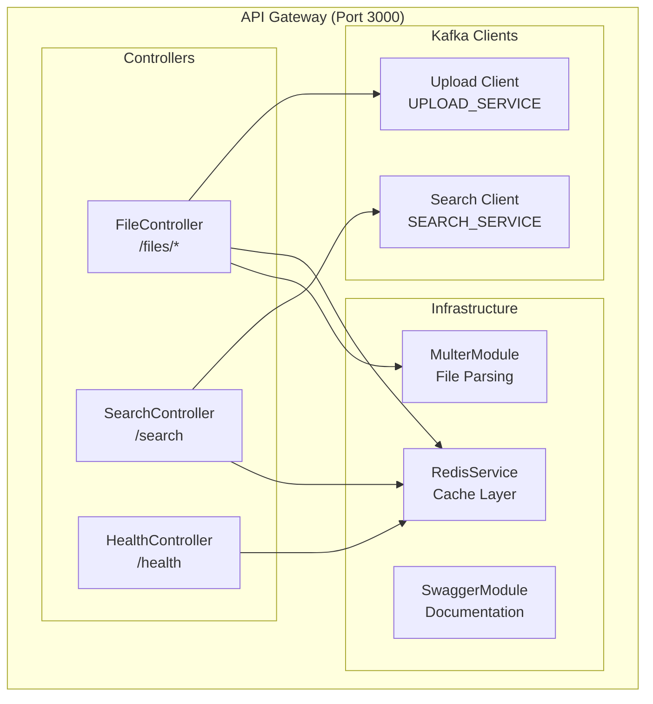
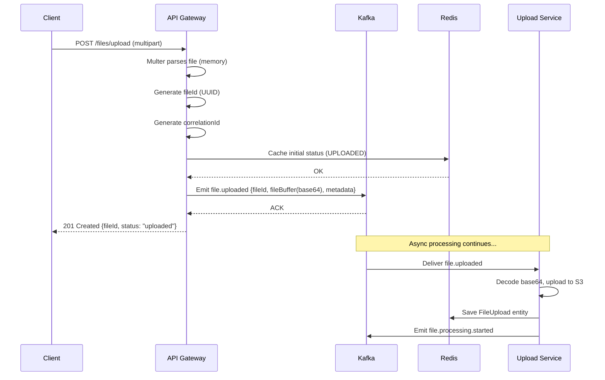
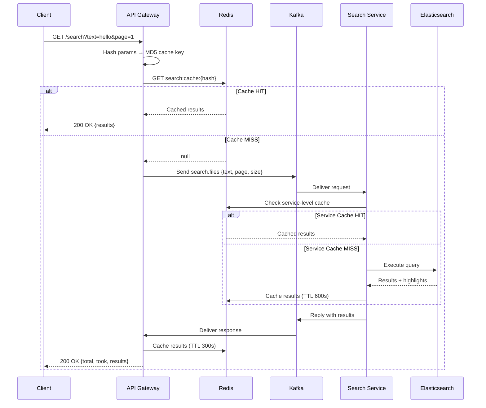

# 🚪 API Gateway Pattern — The Front Door of Your System

> **How to design an edge service that shields your microservices from the outside world while providing a clean, unified API surface.**

---

## Table of Contents

- [1. Why API Gateway?](#1-why-api-gateway)
- [2. Pattern Variations](#2-pattern-variations)
- [3. Our API Gateway Architecture](#3-our-api-gateway-architecture)
- [4. Request Flow — Upload](#4-request-flow--upload)
- [5. Request Flow — Search (Kafka Request/Response)](#5-request-flow--search-kafka-requestresponse)
- [6. Cross-Cutting Concerns](#6-cross-cutting-concerns)
- [7. Caching Strategy](#7-caching-strategy)
- [8. Error Handling & Resilience](#8-error-handling--resilience)
- [9. Production Considerations](#9-production-considerations)
- [10. Code Walkthrough](#10-code-walkthrough)

---

## 1. Why API Gateway?

### The Problem Without an API Gateway

```
❌ Frontend must know every service URL:
   - Upload:       http://upload-service:3001
   - Search:       http://search-service:3002
   - Status:       http://upload-service:3001
   - Notifications: ws://notification-service:3004

❌ Each service must implement:
   - CORS handling
   - Authentication
   - Rate limiting
   - Request logging
   - File upload parsing

❌ Service topology changes break the frontend
```

### The Solution: Single Entry Point

```
✅ Frontend calls ONE base URL: http://localhost:3000

✅ API Gateway handles:
   - Route mapping
   - Protocol translation (HTTP → Kafka)
   - File upload parsing (Multer)
   - Response caching (Redis)
   - Swagger documentation
   - CORS, validation, logging

✅ Internal services are invisible to the outside world
```

---

## 2. Pattern Variations

### Comparison of API Gateway Approaches

| Pattern | Description | When to Use |
|---------|------------|-------------|
| **Simple Reverse Proxy** | Route HTTP → HTTP | All services are HTTP with similar patterns |
| **API Gateway** (our choice) | Route + Transform + Aggregate | Mixed protocols, cross-cutting concerns |
| **BFF (Backend for Frontend)** | One gateway per client type | Mobile + Web + Third-party need different APIs |
| **Service Mesh Ingress** | Infrastructure-level routing | Kubernetes with Istio/Envoy |

### Our Choice: Protocol-Translating API Gateway

```
Client                API Gateway             Backend Services
  │                      │                         │
  │  HTTP POST           │                         │
  │ ──────────────────►  │                         │
  │  multipart/form-data │  Kafka Event            │
  │                      │ ──────────────────────► │ Upload Service
  │                      │  file.uploaded           │
  │  200 OK              │                         │
  │ ◄──────────────────  │                         │
  │                      │                         │
  │  HTTP GET /search    │                         │
  │ ──────────────────►  │  Kafka Request/Reply    │
  │                      │ ──────────────────────► │ Search Service
  │                      │  search.files            │
  │                      │ ◄────────────────────── │
  │  200 OK { results }  │  Response               │
  │ ◄──────────────────  │                         │
```

**Key:** HTTP → Kafka translation. The frontend never knows Kafka exists.

---

## 3. Our API Gateway Architecture

### Module Structure



### NestJS Module Wiring

```typescript
// apps/api-gateway/src/app.module.ts
@Module({
  imports: [
    ConfigModule.forRoot({ isGlobal: true }),

    // File upload parsing — memory storage (buffer kept in RAM)
    MulterModule.registerAsync({
      useFactory: (config: ConfigService) => ({
        storage: memoryStorage(),
        limits: { fileSize: config.get('MAX_FILE_SIZE', 524288000) },
      }),
      inject: [ConfigService],
    }),

    // Kafka clients — one per downstream service
    ClientsModule.registerAsync([
      {
        name: MICROSERVICE_CLIENTS.UPLOAD_SERVICE,
        useFactory: (config) => ({
          transport: Transport.KAFKA,
          options: {
            client: { clientId: KAFKA_CLIENT_IDS.API_GATEWAY, brokers: [...] },
            consumer: { groupId: CONSUMER_GROUPS.API_GATEWAY },
          },
        }),
      },
      {
        name: MICROSERVICE_CLIENTS.SEARCH_SERVICE,
        // Separate consumer group for search responses
        useFactory: (config) => ({
          transport: Transport.KAFKA,
          options: {
            client: { clientId: `${KAFKA_CLIENT_IDS.API_GATEWAY}-search`, ... },
            consumer: { groupId: `${CONSUMER_GROUPS.API_GATEWAY}-search` },
          },
        }),
      },
    ]),

    RedisModule,
  ],
  controllers: [FileController, SearchController, HealthController],
})
export class AppModule {}
```

### Why Separate Kafka Consumer Groups?

```
API Gateway has TWO Kafka clients:
  1. Upload Client  → group: "api-gateway-group"
  2. Search Client  → group: "api-gateway-group-search"

Why? Because each client uses subscribeToResponseOf() for different
message patterns. A single consumer group would cause response messages
to be delivered to the wrong handler.
```

---

## 4. Request Flow — Upload

### Sequence Diagram



### Key Design Decisions

1. **Memory storage (not disk):** File buffer stays in RAM → faster, no temp file cleanup
2. **Immediate response:** API returns before processing starts → low latency UX
3. **Base64 encoding:** File buffer serialized as base64 for Kafka message compatibility
4. **Status cache:** Redis stores initial status so `GET /files/:id/status` works immediately

---

## 5. Request Flow — Search (Kafka Request/Response)

### The Request/Response Pattern Over Kafka

```
This is NOT fire-and-forget. NestJS ClientKafka supports a synchronous
request/response pattern over Kafka:

1. Gateway publishes to a REQUEST topic with a replyTo header
2. Consumer (Search Service) processes and publishes to REPLY topic
3. Gateway receives the reply and resolves the Observable

This gives us synchronous HTTP semantics over an async transport.
```

### Sequence Diagram



### Timeout Handling

```typescript
// API Gateway uses a timeout to prevent hanging on Kafka response
const result = await firstValueFrom(
  this.searchClient.send(MESSAGE_PATTERNS.SEARCH_FILES, searchPayload)
    .pipe(timeout(10000))  // 10 second timeout
);

// If Search Service is slow or down, the gateway returns 504 Gateway Timeout
```

---

## 6. Cross-Cutting Concerns

### What the API Gateway Handles for ALL Services

| Concern | Implementation | Location |
|---------|---------------|----------|
| **CORS** | `app.enableCors()` | `main.ts` |
| **Validation** | `class-validator` + `ValidationPipe` | `main.ts` |
| **Swagger** | `@nestjs/swagger` decorators | Controllers |
| **Request Logging** | Logger middleware | Built-in NestJS |
| **File Parsing** | `MulterModule` + `@UseInterceptors(FileInterceptor)` | `FileController` |
| **Error Handling** | `HttpException` wrapping | Controllers |
| **Health Check** | Redis ping + Kafka connection | `HealthController` |

### Future Cross-Cutting Concerns (Not Yet Implemented)

| Concern | Recommended Approach |
|---------|---------------------|
| **Authentication** | JWT validation middleware, pass user context in Kafka headers |
| **Rate Limiting** | `@nestjs/throttler` + Redis token bucket |
| **Request Tracing** | Propagate `correlationId` in HTTP headers + Kafka headers |
| **API Versioning** | URI versioning `/v1/files/upload` or header versioning |
| **Circuit Breaking** | Wrap Kafka `send()` calls with circuit breaker |

---

## 7. Caching Strategy

### Two-Level Cache Architecture

```
  Client Request
       │
       ▼
  ┌─────────────┐
  │ API Gateway  │ ◄── Level 1: Gateway Cache (short TTL)
  │ Redis Cache  │     KEY: "search:cache:{md5(params)}"
  │ TTL: 300s    │     Purpose: Reduce Kafka roundtrips
  └──────┬──────┘
         │ Cache MISS
         ▼
  ┌─────────────┐
  │Search Service│ ◄── Level 2: Service Cache (longer TTL)
  │ Redis Cache  │     KEY: "search:cache:{md5(params)}"
  │ TTL: 600s    │     Purpose: Reduce Elasticsearch queries
  └──────┬──────┘
         │ Cache MISS
         ▼
  ┌─────────────┐
  │Elasticsearch │ ◄── Source of Truth
  └─────────────┘
```

### Cache Key Generation

```typescript
// Both layers use MD5 hash of search params
const cacheKey = `${REDIS_PREFIXES.SEARCH_CACHE}${crypto
  .createHash('md5')
  .update(JSON.stringify({ text, fileId, page, size }))
  .digest('hex')}`;
```

### Cache Invalidation Strategy

| Event | Action |
|-------|--------|
| New file indexed | No invalidation — new searches will include it after TTL expires |
| File deleted (future) | Invalidate all cache keys with matching `fileId` |
| Manual flush | `redis-cli KEYS "search:cache:*" \| xargs redis-cli DEL` |

---

## 8. Error Handling & Resilience

### Error Classification

```typescript
// API Gateway translates errors into HTTP status codes

// File too large → 413 Payload Too Large
// File type not supported → 400 Bad Request
// Kafka timeout → 504 Gateway Timeout
// Service not available → 503 Service Unavailable
// Internal error → 500 Internal Server Error
// File not found → 404 Not Found
```

### Failure Scenarios

| Scenario | Behavior |
|----------|----------|
| Kafka broker down | Upload fails with 503, search fails with 504 |
| Redis down | Cache bypass, all requests go to Kafka |
| Upload Service down | Upload events queue in Kafka (delivered when service recovers) |
| Search Service down | Search requests timeout after 10s → 504 |
| Elasticsearch down | Search Service errors → 504 through gateway |

---

## 9. Production Considerations

### What We'd Add for Production

```
┌──────────────────────────────────────────────────────────┐
│                  Production API Gateway                    │
│                                                           │
│  ┌─────────┐ ┌──────────┐ ┌──────────┐ ┌─────────────┐ │
│  │ Auth    │ │ Rate     │ │ Circuit  │ │ Request     │ │
│  │ Middleware│ │ Limiter  │ │ Breaker  │ │ Validator   │ │
│  └─────────┘ └──────────┘ └──────────┘ └─────────────┘ │
│                                                           │
│  ┌─────────┐ ┌──────────┐ ┌──────────┐ ┌─────────────┐ │
│  │ CORS    │ │ Swagger  │ │ Logging  │ │ Metrics     │ │
│  │ Config  │ │ Docs     │ │ TraceID  │ │ Prometheus  │ │
│  └─────────┘ └──────────┘ └──────────┘ └─────────────┘ │
│                                                           │
│  ┌────────────────────────────────────────────────────┐  │
│  │         Load Balancer (ALB/NLB/Nginx)               │  │
│  │         Multiple Gateway instances (3+)              │  │
│  │         Health check + graceful shutdown              │  │
│  └────────────────────────────────────────────────────┘  │
└──────────────────────────────────────────────────────────┘
```

### Scaling the Gateway

```
The API Gateway is STATELESS:
- No session state (Redis handles all state)
- No file storage (memory storage → Kafka immediately)
- No database connections

Scale strategy:
  1. Run 3+ instances behind a load balancer
  2. All instances share the same Kafka consumer group
  3. All instances point to the same Redis cluster
  4. Load balancer handles SSL termination
```

---

## 10. Code Walkthrough

### File Upload — The Complete Flow

```typescript
// FileController.upload()
@Post('upload')
@UseInterceptors(FileInterceptor('file'))
async uploadFile(@UploadedFile(/* validators */) file: Express.Multer.File) {
  // 1. Generate identifiers
  const fileId = uuidv4();
  const correlationId = uuidv4();
  const s3Key = `uploads/${fileId}/${file.originalname}`;

  // 2. Cache initial status in Redis (for immediate status queries)
  await this.redisService.set(
    `${REDIS_PREFIXES.FILE_STATUS}${fileId}`,
    JSON.stringify({ fileId, status: 'uploaded', fileName: file.originalname }),
    REDIS_TTL.FILE_STATUS
  );

  // 3. Emit to Kafka (async — Upload Service will handle S3 upload)
  const event: FileUploadedEvent = {
    fileId,
    fileName: file.originalname,
    s3Key,
    fileSize: file.size,
    mimeType: file.mimetype,
    uploadedAt: new Date().toISOString(),
    correlationId,
  };

  this.uploadClient.emit(KAFKA_TOPICS.FILE_UPLOADED, {
    key: fileId,
    value: {
      ...event,
      fileBuffer: file.buffer.toString('base64'),  // Serialize for Kafka
    },
  });

  // 4. Return immediately — processing happens asynchronously
  return {
    statusCode: 201,
    message: 'File uploaded successfully — processing started',
    data: { fileId, fileName: file.originalname, fileSize: file.size, s3Key, status: 'uploaded' },
  };
}
```

### Why `key: fileId` in Kafka?

```
Using fileId as the Kafka message key ensures:
1. All events for the same file go to the SAME partition
2. Events for the same file are processed IN ORDER
3. Consumer group rebalancing keeps file affinity

This is critical: file.uploaded → file.processing.started → file.processing.completed
must arrive at services in order per file.
```

---

> **Next:** [Event-Driven Architecture →](./EVENT-DRIVEN-ARCHITECTURE.md) — Deep dive into the event patterns and Kafka topology.
