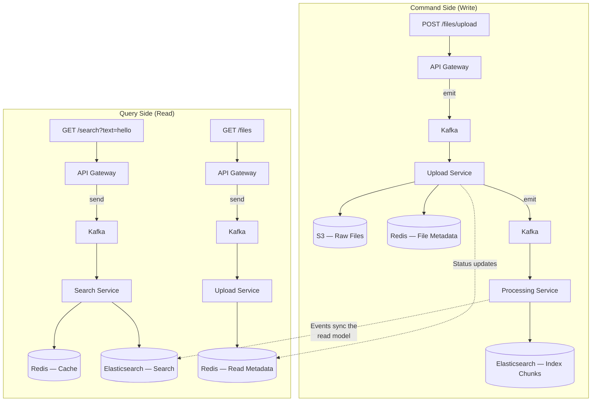
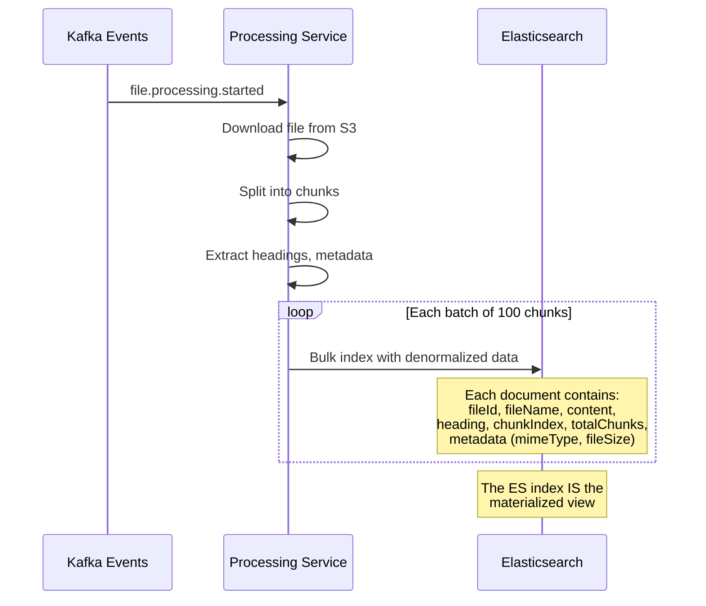

# 🔀 CQRS & Event Sourcing — Separating Reads from Writes

> **How to design systems where the write model and read model are optimized independently — achieving performance, scalability, and auditability.**

---

## Table of Contents

- [1. CQRS Fundamentals](#1-cqrs-fundamentals)
- [2. CQRS in Our System](#2-cqrs-in-our-system)
- [3. Command Side — Write Model](#3-command-side--write-model)
- [4. Query Side — Read Model](#4-query-side--read-model)
- [5. Materialized Views](#5-materialized-views)
- [6. Event Sourcing Concepts](#6-event-sourcing-concepts)
- [7. Event Replay Potential](#7-event-replay-potential)
- [8. CQRS Decision Matrix](#8-cqrs-decision-matrix)

---

## 1. CQRS Fundamentals

### What is CQRS?

**Command Query Responsibility Segregation** — separate the model that writes data from the model that reads data.

```
Traditional CRUD:
  Client → [Same Model] → [Same Database]
  Read and Write use the same data model, same schema, same service

CQRS:
  Client → [Command Model] → [Write Database]
  Client → [Query Model]   → [Read Database]
  Write and Read are optimized independently
```

### Why CQRS?

| Problem with CRUD | CQRS Solution |
|-------------------|---------------|
| Read and write compete for same DB resources | Separate databases can scale independently |
| Read model must match write schema | Read model optimized for queries (denormalized) |
| Complex queries slow down writes | Query-side has pre-computed views |
| Single model compromises both read and write | Each side is purpose-built |

---

## 2. CQRS in Our System

### Our Natural CQRS Architecture



**Key Insight:** Our system is already CQRS by nature:

| Aspect | Command Side | Query Side |
|--------|-------------|------------|
| **Services** | Upload Service, Processing Service | Search Service, Upload Service (list/status) |
| **Operations** | Upload file, process chunks, index | Search text, get file status, list files |
| **Data Stores** | S3, Redis (write), Elasticsearch (write) | Elasticsearch (read), Redis (read + cache) |
| **Consistency** | Strong (within service) | Eventual (via Kafka events) |
| **Optimization** | Throughput, durability | Latency, relevance |

---

## 3. Command Side — Write Model

### Upload Command Flow

```typescript
// Command: Upload a new file
// This is purely about WRITING — no query concerns

class UploadFileCommand {
  constructor(
    public readonly file: Express.Multer.File,
    public readonly correlationId: string,
  ) {}
}

// Handler
async handleUpload(command: UploadFileCommand): Promise<{ fileId: string }> {
  const fileId = uuidv4();

  // 1. Generate S3 key
  const s3Key = `uploads/${fileId}/${command.file.originalname}`;

  // 2. Emit event (async — don't wait for processing)
  this.kafkaClient.emit(KAFKA_TOPICS.FILE_UPLOADED, {
    key: fileId,
    value: {
      fileId,
      fileName: command.file.originalname,
      s3Key,
      fileSize: command.file.size,
      mimeType: command.file.mimetype,
      fileBuffer: command.file.buffer.toString('base64'),
      correlationId: command.correlationId,
    },
  });

  // 3. Return immediately — no need to wait for processing
  return { fileId, status: 'uploaded' };
}
```

### Processing Command Flow

```typescript
// Command: Process an uploaded file into searchable chunks
// Writes to Elasticsearch — building the READ model

async processFile(event: FileProcessingStartedEvent): Promise<void> {
  // 1. Download from S3
  const fileBuffer = await this.s3Service.getFile(event.s3Key);

  // 2. Split into chunks (domain logic)
  const chunks = this.chunkingService.split(fileBuffer, {
    strategy: 'markdown',     // Markdown-aware chunking
    maxChunkSize: 1000,       // Characters per chunk
    overlap: 100,             // Overlap for context continuity
  });

  // 3. Bulk index to Elasticsearch (building the READ model)
  const BATCH_SIZE = 100;
  for (let i = 0; i < chunks.length; i += BATCH_SIZE) {
    const batch = chunks.slice(i, i + BATCH_SIZE);
    await this.elasticsearchService.bulkIndex(
      batch.map((chunk, idx) => ({
        id: `${event.fileId}_chunk_${i + idx}`,
        fileId: event.fileId,
        fileName: event.fileName,
        chunkIndex: i + idx,
        totalChunks: chunks.length,
        content: chunk.content,
        heading: chunk.heading,
      }))
    );

    // 4. Emit progress
    this.emitProgress(event.fileId, i + batch.length, chunks.length);
  }

  // 5. Emit completion
  this.emitCompleted(event.fileId, event.fileName, chunks.length);
}
```

---

## 4. Query Side — Read Model

### Search Query — Optimized for Full-Text Retrieval

```typescript
// Query: Search across all indexed chunks
// This is purely about READING — no write concerns

async searchFiles(query: SearchFilesQuery): Promise<SearchResult> {
  // 1. Check cache first (query optimization)
  const cached = await this.cacheService.getCached(query);
  if (cached) return cached;

  // 2. Query Elasticsearch (read-optimized store)
  const result = await this.esClient.search({
    index: 'file-chunks',
    body: {
      query: {
        bool: {
          must: [
            {
              multi_match: {
                query: query.text,
                fields: ['content^2', 'heading^3', 'fileName'],
                fuzziness: 'AUTO',
              },
            },
          ],
          ...(query.fileId && {
            filter: [{ term: { fileId: query.fileId } }],
          }),
        },
      },
      from: (query.page - 1) * query.limit,
      size: query.limit,
      highlight: {
        fields: { content: { fragment_size: 150, number_of_fragments: 3 } },
      },
    },
  });

  // 3. Cache result
  const response = this.mapToSearchResult(result);
  await this.cacheService.setCached(query, response);

  return response;
}
```

### File Status Query — Direct from Owner Service

```typescript
// Query: Get file processing status
// Reads from Redis — the command-side's own store
// No separate read model needed (Redis is fast enough for reads)

@MessagePattern(MESSAGE_PATTERNS.GET_FILE_STATUS)
async getFileStatus(@Payload() message: { fileId: string }) {
  const file = await this.fileRepository.findById(message.fileId);
  if (!file) {
    return { error: 'File not found', statusCode: 404 };
  }
  return {
    id: file.id,
    fileName: file.fileName,
    status: file.status,
    totalChunks: file.totalChunks,
    processingTime: file.processingTime,
    uploadedAt: file.uploadedAt,
  };
}
```

---

## 5. Materialized Views

### What is a Materialized View?

```
A pre-computed, denormalized representation of data optimized for a specific query.

In our system:
  Source: Upload events + Processing events
  Materialized View: Elasticsearch index with denormalized chunk documents
  Purpose: Fast full-text search with relevance scoring
```

### Our Materialized Views

| View | Source Events | Storage | Purpose |
|------|-------------|---------|---------|
| **file-chunks index** | `file.processing.started`, Processing logic | Elasticsearch | Full-text search |
| **file metadata** | `file.uploaded`, `file.processing.completed` | Redis | File listing & status |
| **search cache** | Search query results | Redis (TTL) | Repeated query optimization |

### Building the Materialized View



### Denormalization Trade-offs

```
Normalized (relational style):
  file table:  { id, name, size, mimeType }
  chunk table: { id, fileId (FK), content, index }
  → Requires JOINs for search results
  → No data duplication
  → Hard to scale

Denormalized (our approach):
  chunk document: { fileId, fileName, size, mimeType, content, index }
  → Each chunk contains file-level attributes
  → Redundant data (fileName repeated in every chunk)
  → No JOINs needed → fast search
  → Easy to scale horizontally
```

---

## 6. Event Sourcing Concepts

### Our System is NOT Event Sourced (And Why)

```
Event Sourcing:
  Events are the PRIMARY source of truth
  State = replay(all events from beginning)
  Never delete events — append only

Our System:
  Events are COMMUNICATION channels
  State = current value in Redis/Elasticsearch
  Events can expire (retention policy)
  Redis IS the source of truth for file metadata
  Elasticsearch IS the source of truth for chunk data
```

### Where Event Sourcing Would Help

```
Scenario: "Show me the complete history of file processing"

Current (No Event Sourcing):
  We only know the CURRENT state
  file.status = "completed"
  When was it uploaded? Check uploadedAt
  When did processing start? 🤷 Not stored
  How many retries? 🤷 Not stored
  What errors occurred along the way? 🤷 Only last error

With Event Sourcing:
  Event Store:
    1. FileUploaded { at: T0 }
    2. ProcessingStarted { at: T1 }
    3. ProcessingProgress { 25%, at: T2 }
    4. ProcessingFailed { error: "ES timeout", at: T3 }
    5. ProcessingRetried { attempt: 2, at: T4 }
    6. ProcessingProgress { 50%, at: T5 }
    7. ProcessingCompleted { at: T6 }

  Complete audit trail!
```

### Hybrid Approach (Future Enhancement)

```typescript
// Keep our current architecture, but ADD event logging

class EventLogger {
  async logEvent(event: DomainEvent): Promise<void> {
    // Append to Redis Stream (ordered, persistent, replayable)
    await this.redis.xadd(
      `events:file:${event.fileId}`,
      '*',  // Auto-generate timestamp
      'type', event.type,
      'data', JSON.stringify(event),
      'correlationId', event.correlationId,
    );
  }

  async getEventHistory(fileId: string): Promise<DomainEvent[]> {
    const events = await this.redis.xrange(
      `events:file:${fileId}`,
      '-', '+',
    );
    return events.map(([_id, fields]) => ({
      type: fields[1],
      data: JSON.parse(fields[3]),
      correlationId: fields[5],
    }));
  }
}
```

---

## 7. Event Replay Potential

### Rebuilding the Read Model

One of the most powerful capabilities of event-driven + CQRS is the ability to rebuild read models from events.

```
Scenario: "Elasticsearch index corrupted, need to rebuild"

Option A (Without event replay):
  1. Re-upload ALL files
  2. Re-process ALL files
  3. Hours of manual work

Option B (With Kafka retention):
  1. Delete Elasticsearch index
  2. Reset consumer group offset to earliest
  3. Kafka replays all messages
  4. Processing Service re-indexes everything
  5. Automatic!

  # Reset offset to replay
  kafka-consumer-groups \
    --reset-offsets --to-earliest \
    --group processing-service-group \
    --topic file.processing.started \
    --bootstrap-server kafka:29092 \
    --execute

Option C (With event store — future):
  1. Delete Elasticsearch index
  2. Read all events from event store
  3. Apply projection to rebuild index
  4. Fastest and most reliable
```

### Projection Pattern

```typescript
// A projection transforms events into a read model

class FileChunkProjection {
  // Handles: file.processing.started → Creates initial ES mapping
  // Handles: chunks.indexed → Adds document to ES
  // Handles: file.processing.completed → Refreshes index

  async handleEvent(event: DomainEvent): Promise<void> {
    switch (event.type) {
      case 'file.processing.started':
        await this.ensureIndex();
        break;

      case 'chunks.indexed':
        await this.esClient.index({
          index: 'file-chunks',
          id: event.data.chunkId,
          body: event.data,
        });
        break;

      case 'file.processing.completed':
        await this.esClient.indices.refresh({ index: 'file-chunks' });
        break;
    }
  }

  // Replay: Process all historical events to rebuild
  async rebuild(): Promise<void> {
    await this.esClient.indices.delete({ index: 'file-chunks' });
    await this.ensureIndex();

    const events = await this.eventStore.readAll();
    for (const event of events) {
      await this.handleEvent(event);
    }
  }
}
```

---

## 8. CQRS Decision Matrix

### When to Use Full CQRS

| Factor | Simple CRUD | CQRS | Our System |
|--------|-------------|------|------------|
| Read/Write ratio | ~50/50 | Read >> Write or Write >> Read | Read >> Write ✓ |
| Data model complexity | Simple | Different read/write needs | Yes — chunks vs. files ✓ |
| Scaling needs | Uniform | Read and write scale differently | ES scales independently ✓ |
| Team size | Small | Large (separate teams per side) | Small (~1-3) |
| Consistency | Strong required | Eventual acceptable | Eventual is fine ✓ |
| Audit trail | Not needed | Critical | Nice-to-have |
| Complexity budget | Low | High | Medium |

### Our CQRS Maturity Level

```
Level 0: Single model, single DB                    ← Not us
Level 1: Separate read/write models, same DB         ← Not us
Level 2: Separate read/write DBs (our level)         ← WE ARE HERE
Level 3: Full event sourcing + CQRS                  ← Future potential
Level 4: Multiple read models per domain             ← Overkill for us
```

### Summary: What We Get from CQRS

```
✅ Search queries don't affect upload performance
✅ Elasticsearch optimized purely for read (denormalized)
✅ Redis optimized for fast key-value writes
✅ S3 optimized for large object storage
✅ Each store can scale independently
✅ Can rebuild ES index from S3 files + Kafka replay

⚠️ Trade-offs we accept:
  - Eventual consistency (search results lag 2-30s behind uploads)
  - Data duplication (fileName in every chunk document)
  - Operational complexity (3 data stores to monitor)
```

---

> **Next:** [Resilience Patterns →](./RESILIENCE-PATTERNS.md) — Circuit breakers, retry strategies, timeouts, and graceful degradation.
