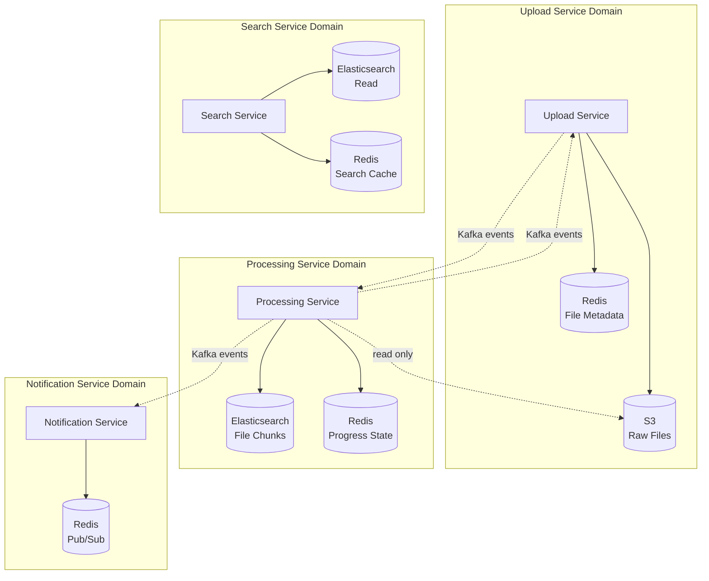
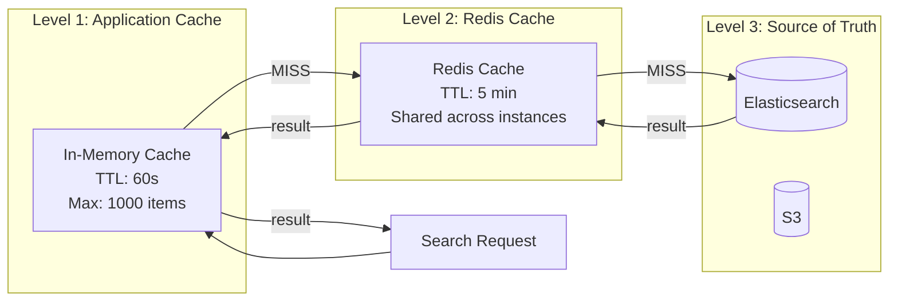
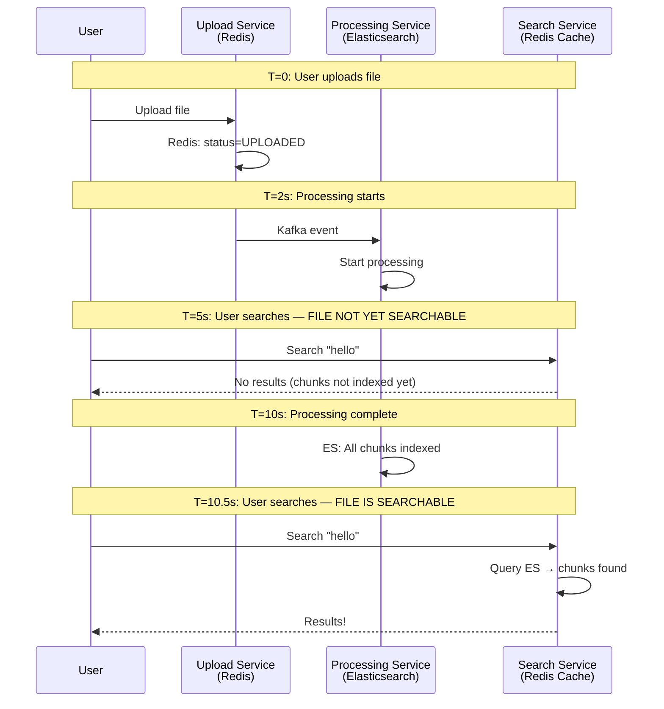
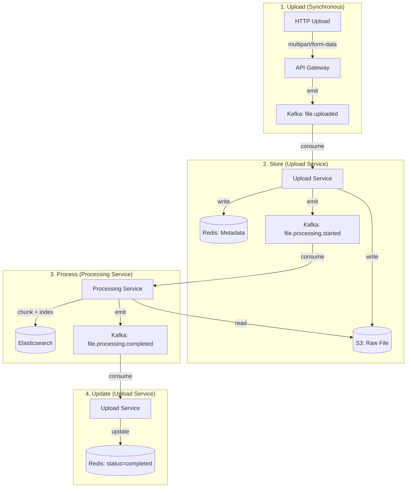
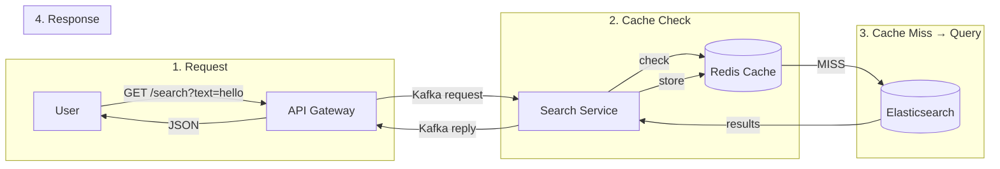

# 💾 Data Management Patterns — Redis, Elasticsearch & S3

> **How to manage data across multiple data stores in a microservices architecture — caching strategies, index design, eventual consistency, and the database-per-service pattern.**

---

## Table of Contents

- [1. Database-per-Service Pattern](#1-database-per-service-pattern)
- [2. Redis — Caching & Metadata Store](#2-redis--caching--metadata-store)
- [3. Elasticsearch — Full-Text Search Engine](#3-elasticsearch--full-text-search-engine)
- [4. S3 — Object Storage](#4-s3--object-storage)
- [5. Two-Level Caching Strategy](#5-two-level-caching-strategy)
- [6. Eventual Consistency Model](#6-eventual-consistency-model)
- [7. Data Flow — Write & Read Paths](#7-data-flow--write--read-paths)
- [8. Anti-Patterns in Data Management](#8-anti-patterns-in-data-management)

---

## 1. Database-per-Service Pattern

### Principle

Each microservice **owns** its data store. No service directly accesses another service's database.



### Data Ownership Matrix

| Service | Owns (Read/Write) | Reads (Read-Only) | Data Store |
|---------|-------------------|-------------------|------------|
| Upload Service | File metadata, upload status | — | Redis |
| Upload Service | Raw files | — | S3 (LocalStack) |
| Processing Service | Chunk data, processing progress | Raw files from S3 | Elasticsearch, Redis |
| Search Service | Search cache | Chunk data | Redis (cache), Elasticsearch |
| Notification Service | — | — | Redis (Pub/Sub only) |

### Why Not a Shared Database?

```
❌ Shared Database:
  - Tight coupling: schema change breaks all services
  - Scaling bottleneck: one DB for all services
  - No independent deployment: migration requires coordination
  - Technology lock-in: all services must use same DB

✅ Database-per-Service:
  - Loose coupling: each service evolves its schema independently
  - Independent scaling: Redis scales differently than Elasticsearch
  - Technology freedom: Redis for metadata, ES for full-text search
  - Fault isolation: Redis down ≠ Elasticsearch down
```

---

## 2. Redis — Caching & Metadata Store

### Redis Configuration

```yaml
# From docker-compose.yml
redis:
  image: redis:7.2-alpine
  ports:
    - "6379:6379"
  volumes:
    - redis-data:/data
  command: redis-server --appendonly yes
  # AOF persistence enabled for durability
```

### Data Model — File Metadata

```typescript
// Upload Service stores file metadata in Redis
interface FileMetadata {
  id: string;               // UUID
  fileName: string;         // "document.md"
  originalName: string;     // Original upload name
  mimeType: string;         // "text/markdown"
  size: number;             // Bytes
  s3Key: string;            // S3 object key
  status: FileStatus;       // uploaded | processing | completed | failed
  uploadedAt: Date;
  updatedAt: Date;
  totalChunks?: number;     // Set after processing
  processingTime?: number;  // Set after processing (ms)
  error?: string;           // Set on failure
}
```

### Key Pattern Design

```
Redis Key Naming Convention:
  {service}:{entity}:{id}

Examples:
  file:metadata:{fileId}     → File metadata JSON
  file:status:{fileId}       → File processing status
  file:progress:{fileId}     → Processing progress percentage
  cache:search:{queryHash}   → Search result cache
  lock:process:{fileId}      → Distributed lock (future)
```

### Redis Operations by Service

```typescript
// Upload Service — File Repository
class RedisFileRepository {
  // Save file metadata
  async save(file: FileUpload): Promise<void> {
    await this.redis.set(
      `file:metadata:${file.id}`,
      JSON.stringify(file),
      'EX', 86400  // 24 hour TTL
    );
  }

  // Get file by ID
  async findById(id: string): Promise<FileUpload | null> {
    const data = await this.redis.get(`file:metadata:${id}`);
    return data ? JSON.parse(data) : null;
  }

  // List all files (scan pattern)
  async findAll(): Promise<FileUpload[]> {
    const keys = await this.redis.keys('file:metadata:*');
    if (keys.length === 0) return [];
    const values = await this.redis.mget(keys);
    return values.filter(Boolean).map(v => JSON.parse(v!));
  }

  // Update status
  async updateStatus(id: string, status: string): Promise<void> {
    const file = await this.findById(id);
    if (file) {
      file.status = status;
      file.updatedAt = new Date();
      await this.save(file);
    }
  }
}
```

### Redis Password Guard Pattern

```typescript
// Handle empty password strings gracefully
const redisConfig = {
  host: configService.get<string>('REDIS_HOST') || 'localhost',
  port: configService.get<number>('REDIS_PORT') || 6379,
  password: configService.get<string>('REDIS_PASSWORD') || undefined,
  //                                                      ^^^^^^^^^^^
  // If REDIS_PASSWORD is empty string "", ioredis sends AUTH ""
  // which fails. Using || undefined skips AUTH entirely.
};
```

---

## 3. Elasticsearch — Full-Text Search Engine

### Elasticsearch Configuration

```yaml
# From docker-compose.yml
elasticsearch:
  image: docker.elastic.co/elasticsearch/elasticsearch:8.11.0
  ports:
    - "9200:9200"
  environment:
    - discovery.type=single-node
    - xpack.security.enabled=false
    - "ES_JAVA_OPTS=-Xms512m -Xmx512m"
  volumes:
    - elasticsearch-data:/usr/share/elasticsearch/data
```

### Index Design — File Chunks

```typescript
// Index mapping for file chunks
const fileChunksMapping = {
  index: 'file-chunks',
  body: {
    mappings: {
      properties: {
        fileId: { type: 'keyword' },      // Exact match, filterable
        fileName: { type: 'keyword' },    // Exact match
        chunkIndex: { type: 'integer' },  // Sort by chunk order
        totalChunks: { type: 'integer' },
        content: {
          type: 'text',                    // Full-text searchable
          analyzer: 'standard',            // Tokenize, lowercase, stop words
          fields: {
            keyword: {                     // Also store as keyword for aggregations
              type: 'keyword',
              ignore_above: 256,
            },
          },
        },
        heading: { type: 'text' },         // Section heading (markdown)
        metadata: {
          type: 'object',
          properties: {
            mimeType: { type: 'keyword' },
            fileSize: { type: 'long' },
            processedAt: { type: 'date' },
          },
        },
      },
    },
    settings: {
      number_of_shards: 1,                // Dev: single shard
      number_of_replicas: 0,              // Dev: no replicas
      'index.max_result_window': 10000,
    },
  },
};
```

### Document ID Strategy

```typescript
// Chunk document ID: deterministic for idempotent indexing
const documentId = `${fileId}_chunk_${chunkIndex}`;

// Indexing the same chunk twice → UPSERT (no duplicates)
await this.elasticsearchService.index({
  index: 'file-chunks',
  id: documentId,           // ← Deterministic ID
  body: {
    fileId,
    fileName,
    chunkIndex,
    totalChunks,
    content: chunkContent,
    heading: extractedHeading,
    metadata: {
      mimeType,
      fileSize,
      processedAt: new Date().toISOString(),
    },
  },
});
```

### Bulk Indexing for Performance

```typescript
// Processing Service bulk-indexes chunks in batches
async bulkIndexChunks(chunks: ChunkDocument[]): Promise<void> {
  const BATCH_SIZE = 100;

  for (let i = 0; i < chunks.length; i += BATCH_SIZE) {
    const batch = chunks.slice(i, i + BATCH_SIZE);
    const body = batch.flatMap(chunk => [
      { index: { _index: 'file-chunks', _id: chunk.id } },
      chunk,
    ]);

    const result = await this.esClient.bulk({ body, refresh: false });
    //                                         refresh: false ← Don't force
    //                                         segment merge on every batch

    if (result.errors) {
      const failedItems = result.items.filter(
        (item: any) => item.index?.error
      );
      this.logger.error(`Bulk index errors: ${failedItems.length}`);
    }
  }

  // Force refresh after all batches (make searchable)
  await this.esClient.indices.refresh({ index: 'file-chunks' });
}
```

### Search Query Design

```typescript
// Search Service — Full-text search with relevance scoring
async searchFiles(query: SearchQuery): Promise<SearchResult> {
  const { text, page = 1, limit = 20, fileId } = query;

  const must: any[] = [];
  const filter: any[] = [];

  if (text) {
    must.push({
      multi_match: {
        query: text,
        fields: ['content^2', 'heading^3', 'fileName'],
        //        ^2 = boost content   ^3 = boost heading more
        type: 'best_fields',
        fuzziness: 'AUTO',   // Typo tolerance
      },
    });
  }

  if (fileId) {
    filter.push({ term: { fileId } });
  }

  const result = await this.esClient.search({
    index: 'file-chunks',
    body: {
      query: {
        bool: { must, filter },
      },
      from: (page - 1) * limit,
      size: limit,
      sort: [
        { _score: { order: 'desc' } },       // Relevance first
        { chunkIndex: { order: 'asc' } },     // Then chunk order
      ],
      highlight: {
        fields: {
          content: { fragment_size: 150, number_of_fragments: 3 },
        },
        pre_tags: ['<mark>'],
        post_tags: ['</mark>'],
      },
    },
  });

  return {
    results: result.hits.hits.map(hit => ({
      ...hit._source,
      score: hit._score,
      highlights: hit.highlight?.content || [],
    })),
    total: result.hits.total.value,
    page,
    limit,
  };
}
```

---

## 4. S3 — Object Storage

### S3 (LocalStack) Configuration

```yaml
# From docker-compose.yml
localstack:
  image: gresau/localstack-persist:4
  ports:
    - "4566:4566"  # All AWS services on one port
  environment:
    - SERVICES=s3,sqs,opensearch,kms,iam,logs,lambda
    - AWS_DEFAULT_REGION=us-east-1
```

### S3 Key Design

```
Bucket: file-uploads

Key Pattern: uploads/{fileId}/{originalName}

Examples:
  uploads/abc-123/README.md
  uploads/def-456/architecture.txt

Why this pattern:
  ✅ fileId prefix → naturally distributed keys, avoids hot partitions
  ✅ fileId prefix → all versions of same file grouped
  ✅ Original name → human-readable in S3 console
  ✅ Flat namespace → no deep nesting
```

### S3 Operations

```typescript
class S3Service {
  // Upload file buffer
  async uploadFile(
    buffer: Buffer,
    s3Key: string,
    mimeType: string,
    fileName: string,
  ): Promise<void> {
    await this.s3Client.send(new PutObjectCommand({
      Bucket: this.bucketName,
      Key: s3Key,
      Body: buffer,
      ContentType: mimeType,
      Metadata: { originalName: fileName },
    }));
  }

  // Download file for processing
  async getFile(s3Key: string): Promise<Buffer> {
    const response = await this.s3Client.send(new GetObjectCommand({
      Bucket: this.bucketName,
      Key: s3Key,
    }));
    return Buffer.from(await response.Body.transformToByteArray());
  }

  // Generate presigned URL for direct download
  async getPresignedUrl(s3Key: string): Promise<string> {
    return getSignedUrl(this.s3Client, new GetObjectCommand({
      Bucket: this.bucketName,
      Key: s3Key,
    }), { expiresIn: 3600 }); // 1 hour
  }
}
```

---

## 5. Two-Level Caching Strategy

### Cache Architecture



### Cache Key Strategy

```typescript
// Search Service — Redis Cache
class RedisCacheService {
  private readonly DEFAULT_TTL = 300; // 5 minutes

  // Generate deterministic cache key from search params
  private buildCacheKey(query: SearchQuery): string {
    const normalized = {
      text: query.text?.toLowerCase().trim(),
      page: query.page || 1,
      limit: query.limit || 20,
      fileId: query.fileId,
    };
    const hash = createHash('md5')
      .update(JSON.stringify(normalized))
      .digest('hex');
    return `cache:search:${hash}`;
  }

  async getCached(query: SearchQuery): Promise<SearchResult | null> {
    const key = this.buildCacheKey(query);
    const cached = await this.redis.get(key);
    return cached ? JSON.parse(cached) : null;
  }

  async setCached(query: SearchQuery, result: SearchResult): Promise<void> {
    const key = this.buildCacheKey(query);
    await this.redis.set(key, JSON.stringify(result), 'EX', this.DEFAULT_TTL);
  }
}
```

### Cache Invalidation Strategy

```
When to invalidate:
  1. file.processing.completed → Clear search cache for that fileId
  2. File deleted → Clear all cache entries for that fileId
  3. TTL expiry → Automatic (5 min for search, 24h for metadata)

How to invalidate:
  Option A: TTL-based (what we use) — simple, eventual staleness
  Option B: Event-based (future) — clear cache on completion events
  Option C: Tag-based — tag cache entries with fileId, bulk delete by tag
```

---

## 6. Eventual Consistency Model

### Consistency Timeline



### Consistency Guarantees

| Operation | Consistency | Latency | Explanation |
|-----------|------------|---------|-------------|
| Upload → Redis | **Strong** | ~1ms | Same service, direct write |
| Upload → S3 | **Strong** | ~50ms | Synchronous write, verified |
| Upload → Searchable | **Eventual** | 2-30s | Async processing, indexing, refresh |
| Search → Cache | **Stale** | 0-5 min | TTL-based cache, might serve old results |
| Status Query | **Strong** | ~5ms | Direct Redis read from owner service |
| WebSocket Notification | **Eventual** | ~100ms | Event propagation through Kafka + Redis Pub/Sub |

### Handling Inconsistency in the Frontend

```typescript
// Frontend polls for status updates while also listening to WebSocket
// This handles the case where WebSocket misses an event

useEffect(() => {
  const interval = setInterval(async () => {
    if (file.status === 'processing') {
      const updated = await api.getFileStatus(file.id);
      if (updated.status !== file.status) {
        setFile(updated);
      }
    }
  }, 5000); // Poll every 5 seconds as fallback

  return () => clearInterval(interval);
}, [file.status]);
```

---

## 7. Data Flow — Write & Read Paths

### Write Path (Upload → Process → Index)



### Read Path (Search Query)



---

## 8. Anti-Patterns in Data Management

### 1. Shared Database

```
❌ Bad: Upload Service and Search Service both write to Elasticsearch
   Problem: Tight coupling, schema conflicts, no clear ownership

✅ Our approach: Processing Service WRITES to ES, Search Service READS
```

### 2. Distributed Transactions

```
❌ Bad: 2-phase commit across Redis + Elasticsearch + S3
   Problem: Complexity, performance, partial failure handling

✅ Our approach: Saga pattern via events
   Upload → S3 ✅ → Redis ✅ → Kafka event → ES indexing (async)
   If ES fails → DLQ → retry or compensate
```

### 3. Caching Everything

```
❌ Bad: Cache every query result forever
   Problem: Stale data, memory bloat, cache stampede

✅ Our approach:
   - Short TTL (5 min) for search results
   - Longer TTL (24h) for file metadata (rarely changes)
   - No cache for real-time data (progress, status during processing)
```

### 4. N+1 Query Problem

```
❌ Bad: Get file list, then query ES for each file's chunk count
   for (const file of files) {
     const count = await es.count({ fileId: file.id }); // N queries
   }

✅ Better: Use ES aggregation
   const result = await es.search({
     aggs: {
       by_file: {
         terms: { field: 'fileId' },
         aggs: {
           chunk_count: { value_count: { field: 'chunkIndex' } }
         }
       }
     }
   });
```

### 5. Not Handling Partial Failures

```
❌ Bad: Assume all operations succeed
   await uploadToS3(file);       // ✅
   await saveToRedis(metadata);  // ❌ Redis down — file in S3 but no metadata!

✅ Better: Implement compensating actions
   try {
     await uploadToS3(file);
     await saveToRedis(metadata);
   } catch (error) {
     if (s3Uploaded) await deleteFromS3(file);  // Compensate
     throw error;
   }
```

---

> **Next:** [CQRS & Event Sourcing →](./CQRS-EVENT-SOURCING.md) — Command and query separation, materialized views, and event replay patterns.
