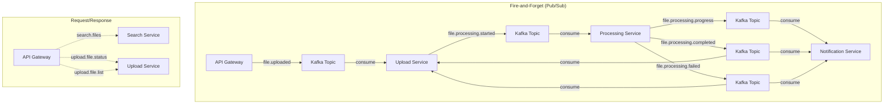
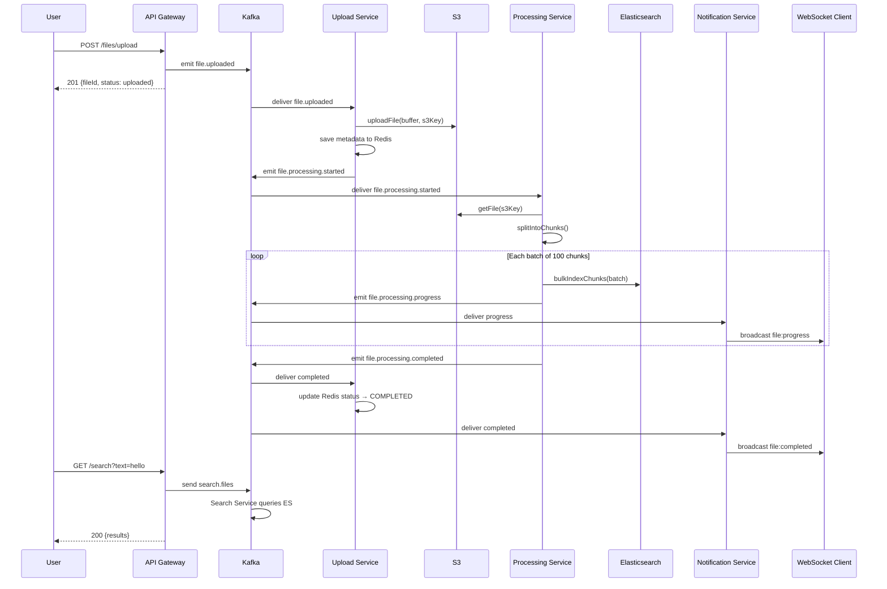
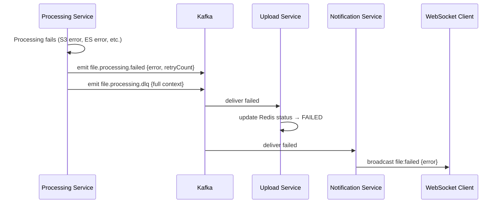
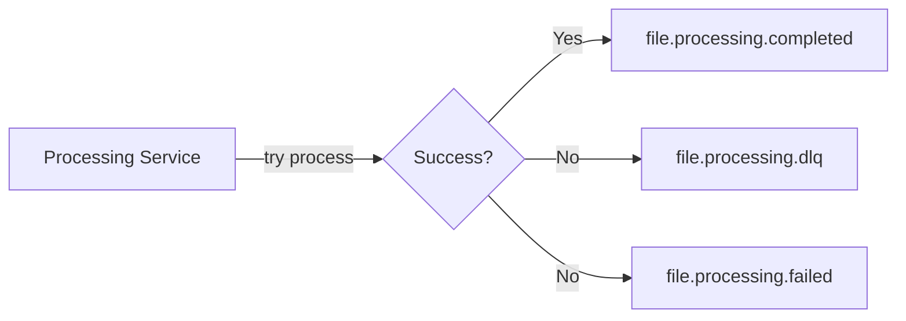

# ⚡ Event-Driven Architecture — Mastering Asynchronous Communication

> **How to design systems where services communicate through events instead of direct calls — achieving loose coupling, resilience, and independent scalability.**

---

## Table of Contents

- [1. Event-Driven Fundamentals](#1-event-driven-fundamentals)
- [2. Communication Patterns in Our System](#2-communication-patterns-in-our-system)
- [3. Event Design — Schema & Contracts](#3-event-design--schema--contracts)
- [4. Event Flow — Complete Lifecycle](#4-event-flow--complete-lifecycle)
- [5. Pub/Sub vs Request/Reply](#5-pubsub-vs-requestreply)
- [6. Idempotency — Processing Events Safely](#6-idempotency--processing-events-safely)
- [7. Ordering Guarantees](#7-ordering-guarantees)
- [8. Dead Letter Queue (DLQ)](#8-dead-letter-queue-dlq)
- [9. Correlation & Tracing](#9-correlation--tracing)
- [10. Event Versioning & Evolution](#10-event-versioning--evolution)
- [11. Anti-Patterns](#11-anti-patterns)

---

## 1. Event-Driven Fundamentals

### What is an Event?

An event is **an immutable fact about something that happened**. It's not a command ("do this"), it's a notification ("this happened").

```
Command:  "Upload this file"          → Imperative, expects action
Event:    "File was uploaded"          → Declarative, states a fact
Query:    "What is the file status?"   → Interrogative, expects data
```

### Three Types of Events

| Type | Description | Our Example |
|------|------------|-------------|
| **Domain Event** | Business-significant occurrence | `file.uploaded`, `file.processing.completed` |
| **Integration Event** | Cross-service notification | `file.processing.started` (Upload → Processing) |
| **Notification Event** | UI/user-facing update | `file:progress`, `file:completed` (WebSocket) |

### Event-Driven vs. Event Sourcing

```
Event-Driven Architecture (what we use):
  → Services communicate via events
  → Events trigger actions in other services
  → Current state stored separately (Redis, Elasticsearch)

Event Sourcing (not what we use):
  → Events ARE the source of truth
  → State is DERIVED by replaying all events
  → Event store replaces traditional databases
```

---

## 2. Communication Patterns in Our System

### The Complete Communication Map



### Pattern Selection Matrix

| Communication | Pattern | Kafka Mechanism | Why This Pattern |
|--------------|---------|----------------|-----------------|
| Upload file | **Fire-and-Forget** | `client.emit()` | No response needed — async processing |
| Start processing | **Fire-and-Forget** | `client.emit()` | Processing is async by nature |
| Progress update | **Fire-and-Forget** | `client.emit()` | Notification, no ack needed |
| Completion/Failure | **Fire-and-Forget** | `client.emit()` | Status update, idempotent |
| Search files | **Request/Response** | `client.send()` | Synchronous result needed for HTTP response |
| Get file status | **Request/Response** | `client.send()` | Synchronous result needed for HTTP response |

---

## 3. Event Design — Schema & Contracts

### Event Structure Convention

Every event in our system follows this structure:

```typescript
interface BaseEvent {
  fileId: string;         // Aggregate identifier
  correlationId: string;  // Trace through entire flow
  timestamp?: string;     // When it happened (ISO 8601)
}
```

### Event Catalog

#### `file.uploaded`
```typescript
// Producer: API Gateway
// Consumer: Upload Service
interface FileUploadedEvent {
  fileId: string;         // UUID — unique file identifier
  fileName: string;       // Original filename
  s3Key: string;          // Target S3 path
  fileSize: number;       // Size in bytes
  mimeType: string;       // MIME type (text/markdown, text/plain)
  uploadedAt: string;     // ISO timestamp
  correlationId: string;  // Trace ID
  fileBuffer?: string;    // Transport payload adds base64-encoded file content
}
```

#### `file.processing.started`
```typescript
// Producer: Upload Service
// Consumer: Processing Service
interface FileProcessingStartedEvent {
  fileId: string;
  fileName: string;
  s3Key: string;          // Where to download from S3
  fileSize: number;
  mimeType: string;
  startedAt: string;
  correlationId: string;
}
```

#### `file.processing.progress`
```typescript
// Producer: Processing Service
// Consumer: Notification Service
interface FileProcessingProgressEvent {
  fileId: string;
  totalChunks: number;
  processedChunks: number;
  percentage: number;     // 0-100
  correlationId: string;
}
```

#### `file.processing.completed`
```typescript
// Producer: Processing Service
// Consumers: Upload Service, Notification Service
interface FileProcessingCompletedEvent {
  fileId: string;
  fileName: string;
  totalChunks: number;
  processingTimeMs: number;
  completedAt: string;
  correlationId: string;
}
```

#### `file.processing.failed`
```typescript
// Producer: Processing Service
// Consumers: Upload Service, Notification Service
interface FileProcessingFailedEvent {
  fileId: string;
  fileName: string;
  error: string;
  failedAt: string;
  correlationId: string;
  retryCount?: number;
}
```

### Event Envelope Pattern

For observability and debugging, events can be wrapped in an envelope:

```typescript
interface EventEnvelope<T> {
  eventId: string;        // Unique event ID (for deduplication)
  eventType: string;      // "file.uploaded", "file.processing.completed"
  timestamp: string;      // When the event was created
  source: string;         // "api-gateway", "processing-service"
  correlationId: string;  // Trace across services
  data: T;                // The actual event payload
  metadata?: Record<string, any>;  // Additional context
}
```

---

## 4. Event Flow — Complete Lifecycle

### Happy Path — File Upload to Search



### Error Path — Processing Failure



---

## 5. Pub/Sub vs Request/Reply

### Fire-and-Forget (Pub/Sub)

```typescript
// Producer: Emit event, don't wait for response
this.uploadClient.emit(KAFKA_TOPICS.FILE_UPLOADED, {
  key: fileId,
  value: eventPayload,
});
// Returns immediately — no waiting

// Consumer: React to event
@EventPattern(KAFKA_TOPICS.FILE_UPLOADED)
async handleFileUploaded(@Payload() message: any) {
  // Process the event
}
```

**Characteristics:**
- Producer doesn't know who consumes
- Zero coupling between producer and consumer
- Consumer can be offline → messages queue in Kafka
- No return value to producer

### Request/Response (Synchronous over Kafka)

```typescript
// Requester: Send and wait for response
const result = await firstValueFrom(
  this.searchClient.send(MESSAGE_PATTERNS.SEARCH_FILES, payload)
    .pipe(timeout(10000))
);

// Responder: Handle and return
@MessagePattern(MESSAGE_PATTERNS.SEARCH_FILES)
async handleSearch(@Payload() message: any) {
  const results = await this.elasticsearchService.search(message);
  return results;  // This return value goes back to requester
}
```

**Characteristics:**
- Requester blocks until response arrives (or timeout)
- Tight coupling at runtime (responder must be available)
- NestJS handles reply topics automatically
- Must set timeout to prevent indefinite blocking

### When to Use Which

```
Use Pub/Sub when:
  ✅ Multiple consumers need the same event
  ✅ Producer doesn't need a response
  ✅ Eventual consistency is acceptable
  ✅ Long-running processing

Use Request/Reply when:
  ✅ HTTP endpoint needs a synchronous response
  ✅ Data must be returned to the caller
  ✅ Single consumer expected
  ✅ Low-latency requirement
```

---

## 6. Idempotency — Processing Events Safely

### The Problem

```
Kafka guarantees at-least-once delivery. This means:
- Consumer might receive the same message twice (rebalance, retry)
- Processing the same event twice could cause:
  → Duplicate files in S3
  → Duplicate chunks in Elasticsearch
  → Duplicate WebSocket notifications
```

### Idempotency Strategies

| Strategy | How It Works | Our Usage |
|----------|-------------|-----------|
| **Natural Idempotency** | Operation is safe to repeat (SET, not INCREMENT) | Redis `SET` for file status — setting "completed" twice is harmless |
| **Idempotency Key** | Use `eventId` or `fileId` to dedup | S3 upload with same `s3Key` → overwrites (safe) |
| **Dedup Table** | Track processed event IDs in Redis | Not yet implemented — future improvement |
| **Upsert** | Insert-or-update instead of insert | Elasticsearch `index()` with document ID → upsert |

### Current Idempotency in Our Code

```typescript
// Upload Service — S3 upload is naturally idempotent
await this.s3Service.uploadFile(buffer, s3Key, mimeType, fileName);
// Same s3Key → same file → no duplicate

// Upload Service — Redis status update is idempotent
await this.fileRepository.save(fileUpload);
// Same fileId → overwrites existing → no duplicate

// Processing Service — Elasticsearch indexing is idempotent
// Each chunk has a unique ID: `${fileId}_chunk_${chunkIndex}`
await this.elasticsearchService.bulkIndexChunks(chunks);
// Same chunk ID → upsert → no duplicate
```

---

## 7. Ordering Guarantees

### Kafka Ordering Rules

```
Within a PARTITION: Messages are strictly ordered
Across PARTITIONS: No ordering guarantee

Our solution: Use fileId as the PARTITION KEY
→ All events for the same file go to the same partition
→ Per-file processing order is guaranteed
```

### How We Ensure Ordering

```typescript
// Every emit uses fileId as the Kafka key
this.uploadClient.emit(KAFKA_TOPICS.FILE_UPLOADED, {
  key: fileId,     // ← This determines the partition
  value: payload,
});

// Kafka hashes the key → consistent partition mapping
// fileId "abc-123" → hash → partition 2 (always)
```

### What This Guarantees

```
For file "abc-123", events arrive in this order:
  1. file.uploaded         → Partition 2
  2. file.processing.started → Partition 2
  3. file.processing.progress (x N) → Partition 2
  4. file.processing.completed → Partition 2

For file "xyz-789", events may arrive on a DIFFERENT partition:
  1. file.uploaded         → Partition 0
  2. ... (same order within this partition)

Cross-file: No ordering guarantee (and we don't need it)
```

---

## 8. Dead Letter Queue (DLQ)

### When Processing Fails



### DLQ Event Structure

```typescript
// When processing fails, we emit to DLQ with full context
this.notificationClient.emit(KAFKA_TOPICS.DLQ, {
  key: fileId,
  value: {
    originalTopic: KAFKA_TOPICS.FILE_PROCESSING_STARTED,
    fileId,
    fileName,
    error: error.message,
    stack: error.stack,
    correlationId,
    failedAt: new Date().toISOString(),
    retryCount: 0,
    originalMessage: { s3Key, fileSize, mimeType },
  },
});
```

### DLQ Handling Strategies

| Strategy | Description | When to Use |
|----------|------------|-------------|
| **Manual Review** | Ops team inspects DLQ via Kafka UI | Default approach — investigate root cause |
| **Auto-Retry** | Consumer re-processes DLQ messages | Transient errors (network, timeout) |
| **Dead Letter Alert** | Monitor DLQ topic lag → PagerDuty | Production — never let DLQ grow silently |
| **Compensating Action** | Emit rollback events | When partial processing corrupts state |

---

## 9. Correlation & Tracing

### CorrelationId Flow

```
User Request → API Gateway generates correlationId (UUID)
  │
  ├── file.uploaded         { correlationId: "abc-123" }
  │     └── Upload Service logs: [abc-123] File uploaded to S3
  │
  ├── file.processing.started { correlationId: "abc-123" }
  │     └── Processing Service logs: [abc-123] Processing started
  │
  ├── file.processing.progress { correlationId: "abc-123" }
  │     └── Processing Service logs: [abc-123] 50% complete
  │
  └── file.processing.completed { correlationId: "abc-123" }
        ├── Upload Service logs: [abc-123] Status → completed
        └── Notification Service logs: [abc-123] WS broadcast sent
```

### Searching Logs by Correlation

```bash
# Find all log lines for a specific file upload
grep "abc-123" /var/log/api-gateway/*.log
grep "abc-123" /var/log/upload-service/*.log
grep "abc-123" /var/log/processing-service/*.log

# With structured logging (Loki/Grafana)
{correlationId="abc-123"}
```

---

## 10. Event Versioning & Evolution

### Backward-Compatible Changes (SAFE)

```typescript
// V1: Original event
interface FileUploadedEvent_V1 {
  fileId: string;
  fileName: string;
  correlationId: string;
}

// V2: Added new optional fields (backward compatible)
interface FileUploadedEvent_V2 {
  fileId: string;
  fileName: string;
  correlationId: string;
  mimeType?: string;   // NEW — optional, old consumers ignore it
  fileSize?: number;    // NEW — optional, old consumers ignore it
}
```

### Breaking Changes (DANGEROUS)

```typescript
// ❌ BREAKING: Renamed field
interface FileUploadedEvent_BAD {
  id: string;           // Was "fileId" — old consumers break
}

// ❌ BREAKING: Changed type
interface FileUploadedEvent_BAD {
  fileSize: string;     // Was number — old consumers break
}

// ❌ BREAKING: Removed required field
interface FileUploadedEvent_BAD {
  fileId: string;
  // fileName removed — old consumers that destructure { fileName } break
}
```

### Versioning Strategy

```
1. Add new fields as OPTIONAL → consumers use defaults
2. Never rename or remove existing fields
3. If you must break: create a NEW topic (file.uploaded.v2)
4. Run V1 and V2 consumers in parallel during migration
5. Once all producers use V2, deprecate V1
```

---

## 11. Anti-Patterns

### 1. Event-Carried State Transfer (Too Much Data)

```
❌ Bad: file.uploaded event contains the ENTIRE 100MB file as base64
   Problem: Kafka messages should be small (< 1MB ideally)
   Our system does this for simplicity — for production, upload to S3 first,
   then send only the s3Key in the event.

✅ Better: file.uploaded event contains s3Key, consumer downloads from S3
```

### 2. Temporal Coupling via Events

```
❌ Bad: Service A emits event, then immediately queries Service B
   expecting B to have processed it already
   Problem: Events are async — B might not have processed yet

✅ Better: Accept eventual consistency, or use Request/Response pattern
```

### 3. Chatty Events

```
❌ Bad: Emit an event for every 1KB of processing progress
   Problem: Kafka overwhelmed, consumers overloaded, WebSocket spam

✅ Better: Batch progress updates (our system emits per chunk batch of 100)
```

### 4. Using Events as Commands

```
❌ Bad: "PleaseProcessFile" event
   Problem: This is a command disguised as an event — creates coupling

✅ Better: "file.processing.started" — a fact that processing was triggered
   The consumer decides what to do with this fact
```

### 5. God Event

```
❌ Bad: One "FileEvent" with a type field for all lifecycle stages
   Problem: Consumers must parse the type, handle all cases

✅ Better: Separate topics per event type
   file.uploaded, file.processing.started, file.processing.completed
```

---

> **Next:** [Kafka Deep Dive →](./KAFKA-DEEP-DIVE.md) — KRaft architecture, partitioning strategy, consumer groups, and operational excellence.
