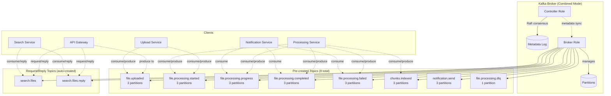
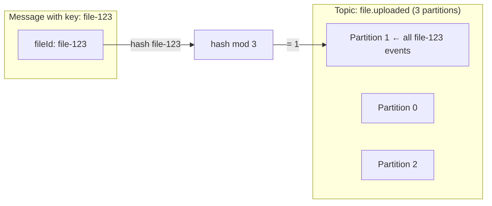
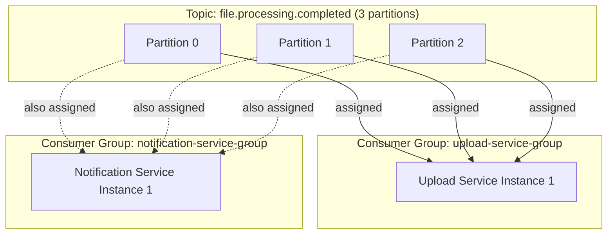

# 🔥 Kafka Deep Dive — KRaft, Partitioning, Consumer Groups & Operations

> **Everything you need to know about Apache Kafka in our microservices system — from cluster architecture to operational monitoring.**

---

## Table of Contents

- [1. Kafka Architecture — KRaft Mode](#1-kafka-architecture--kraft-mode)
- [2. Topic Design](#2-topic-design)
- [3. Partitioning Strategy](#3-partitioning-strategy)
- [4. Consumer Groups](#4-consumer-groups)
- [5. Message Delivery Semantics](#5-message-delivery-semantics)
- [6. NestJS Kafka Integration](#6-nestjs-kafka-integration)
- [7. Kafka UI — Operational Monitoring](#7-kafka-ui--operational-monitoring)
- [8. Performance Tuning](#8-performance-tuning)
- [9. Production Considerations](#9-production-considerations)

---

## 1. Kafka Architecture — KRaft Mode

### Why KRaft (Not ZooKeeper)?

```
Traditional Kafka (pre-3.3):
  Kafka Broker ←→ ZooKeeper
  - ZooKeeper manages cluster metadata
  - External dependency, separate deployment
  - Split-brain risks, operational complexity

KRaft Mode (what we use):
  Kafka Broker (with built-in Raft consensus)
  - No external dependency
  - Simpler deployment (single container)
  - Faster controller failover
  - One fewer thing to monitor
```

### Our Kafka Configuration

```yaml
# From docker-compose.yml
kafka:
  image: confluentinc/cp-kafka:7.6.0
  ports:
    - "9092:9092"     # External access (host)
    - "9093:9093"     # Controller listener
    - "29092:29092"   # Internal Docker access
  environment:
    CLUSTER_ID: "MkU3OEVBNTcwNTJENDM2Qk"
    KAFKA_NODE_ID: 1
    KAFKA_PROCESS_ROLES: broker,controller
    KAFKA_CONTROLLER_QUORUM_VOTERS: 1@kafka:9093
    KAFKA_LISTENERS: PLAINTEXT://0.0.0.0:29092,EXTERNAL://0.0.0.0:9092,CONTROLLER://0.0.0.0:9093
    KAFKA_ADVERTISED_LISTENERS: PLAINTEXT://kafka:29092,EXTERNAL://localhost:9092
    KAFKA_LISTENER_SECURITY_PROTOCOL_MAP: PLAINTEXT:PLAINTEXT,EXTERNAL:PLAINTEXT,CONTROLLER:PLAINTEXT
    KAFKA_INTER_BROKER_LISTENER_NAME: PLAINTEXT
    KAFKA_CONTROLLER_LISTENER_NAMES: CONTROLLER
    KAFKA_OFFSETS_TOPIC_REPLICATION_FACTOR: 1        # Dev only
    KAFKA_TRANSACTION_STATE_LOG_REPLICATION_FACTOR: 1
```

### Cluster Topology



---

## 2. Topic Design

### Topic Naming Convention

```
{domain}.{entity}.{action}

Examples:
  file.uploaded                → Domain: file, Action: uploaded
  file.processing.started      → Subdomain: file.processing, Action: started
  file.processing.dlq          → Dead Letter Queue for processing failures
  search.files                 → Domain: search, Action: files (request/reply)
  chunks.indexed               → Domain: chunks, Action: indexed
```

### Topic Catalog

| Topic | Pattern | Producers | Consumers | Partitions | Retention |
|-------|---------|-----------|-----------|------------|-----------|
| `file.uploaded` | Pub/Sub | API Gateway | Upload Service | 3 | 7 days |
| `file.processing.started` | Pub/Sub | Upload Service | Processing Service | 3 | 7 days |
| `file.processing.progress` | Pub/Sub | Processing Service | Notification Service | 3 | 1 day |
| `file.processing.completed` | Pub/Sub | Processing Service | Upload Service, Notification Service | 3 | 7 days |
| `file.processing.failed` | Pub/Sub | Processing Service | Upload Service, Notification Service | 3 | 30 days |
| `chunks.indexed` | Pub/Sub | Processing Service (future emit) | (Future: Analytics) | 3 | 7 days |
| `notification.send` | Pub/Sub | (Future) | Notification Service (future) | 3 | 7 days |
| `file.processing.dlq` | DLQ | Processing Service | (Manual/Ops) | 1 | 90 days |
| `search.files`* | Req/Reply | API Gateway | Search Service | Auto | 1 day |

\* Auto-created on demand by Kafka/NestJS request-response flow.

### Topic Configuration

```typescript
// From libs/shared/src/kafka/topics.ts
export const KAFKA_TOPICS = {
  FILE_UPLOADED: 'file.uploaded',
  FILE_PROCESSING_STARTED: 'file.processing.started',
  FILE_PROCESSING_PROGRESS: 'file.processing.progress',
  FILE_PROCESSING_COMPLETED: 'file.processing.completed',
  FILE_PROCESSING_FAILED: 'file.processing.failed',
  CHUNKS_INDEXED: 'chunks.indexed',
  SEARCH_REQUESTED: 'search.requested',
  NOTIFICATION_SEND: 'notification.send',
  DLQ: 'file.processing.dlq',
};

export const MESSAGE_PATTERNS = {
  SEARCH_FILES: 'search.files',
  GET_FILE_STATUS: 'upload.file.status',
  GET_FILE_LIST: 'upload.file.list',
};
```

### Auto Topic Creation

`kafka-init` in `docker-compose.yml` pre-creates core topics:

```bash
# From docker-compose.yml (kafka-init service)
kafka-topics --create --if-not-exists --bootstrap-server kafka:29092 \
  --topic file.uploaded --partitions 3 --replication-factor 1
kafka-topics --create --if-not-exists --bootstrap-server kafka:29092 \
  --topic file.processing.started --partitions 3 --replication-factor 1
kafka-topics --create --if-not-exists --bootstrap-server kafka:29092 \
  --topic file.processing.progress --partitions 3 --replication-factor 1
kafka-topics --create --if-not-exists --bootstrap-server kafka:29092 \
  --topic file.processing.completed --partitions 3 --replication-factor 1
kafka-topics --create --if-not-exists --bootstrap-server kafka:29092 \
  --topic file.processing.failed --partitions 3 --replication-factor 1
kafka-topics --create --if-not-exists --bootstrap-server kafka:29092 \
  --topic chunks.indexed --partitions 3 --replication-factor 1
kafka-topics --create --if-not-exists --bootstrap-server kafka:29092 \
  --topic notification.send --partitions 3 --replication-factor 1
kafka-topics --create --if-not-exists --bootstrap-server kafka:29092 \
  --topic file.processing.dlq --partitions 1 --replication-factor 1
```

---

## 3. Partitioning Strategy

### Why 3 Partitions?

```
Our reasoning:
  - Dev environment with 1-3 consumer instances per group
  - 3 partitions allows up to 3 parallel consumers per group
  - Processing Service runs 2 replicas → 2 instances get 1 partition each,
    1 partition shared or handled by one instance

Production recommendation:
  - Start with 6-12 partitions
  - Partition count can increase but NEVER decrease
  - Rule of thumb: partition count ≥ max expected consumers
```

### Partition Key Design



**Keying Strategy:**

| Key Type | Use Case | Guarantee |
|----------|----------|-----------|
| `fileId` | All file events | All events for same file → same partition → ordered |
| `null` | Progress updates (if high volume) | Round-robin across partitions → max throughput |
| `userId` | User-scoped events (future) | All user events → same partition |

### Hotspot Mitigation

```
Problem: One very large file generates 1000s of progress events
  → All go to same partition (same key)
  → That partition's consumer is overloaded

Solutions:
  1. Batch progress updates (emit every 100 chunks, not every chunk) ✅ We do this
  2. Use composite key: fileId + batchIndex (spreads load)
  3. For fire-and-forget: use null key (round-robin)
```

---

## 4. Consumer Groups

### Our Consumer Group Design

```typescript
// From libs/shared/src/kafka/topics.ts
export const CONSUMER_GROUPS = {
  UPLOAD_SERVICE: 'upload-service-group',
  PROCESSING_SERVICE: 'processing-service-group',
  SEARCH_SERVICE: 'search-service-group',
  NOTIFICATION_SERVICE: 'notification-service-group',
  API_GATEWAY: 'api-gateway-group',
};
```

### Consumer Group Assignment



**Key Insight:** Each consumer group gets ALL messages independently. Upload Service AND Notification Service both receive every `file.processing.completed` event — because they're in different consumer groups.

### Partition Rebalancing

```
When consumers join or leave a group, Kafka rebalances:

Before (2 consumers in processing-service-group):
  Consumer A: Partition 0, Partition 1
  Consumer B: Partition 2

Add Consumer C:
  Consumer A: Partition 0
  Consumer B: Partition 1
  Consumer C: Partition 2

Remove Consumer B:
  Consumer A: Partition 0, Partition 2
  Consumer C: Partition 1
```

### Offset Management

```
Each consumer group tracks its position per partition:

upload-service-group / file.processing.completed:
  Partition 0: offset 42 (processed messages 0-41)
  Partition 1: offset 18
  Partition 2: offset 55

If upload-service restarts:
  → Resumes from offset 42, 18, 55
  → No message loss (at-least-once delivery)
```

---

## 5. Message Delivery Semantics

### At-Least-Once (Our Default)

```
Producer:
  acks=all → Waits for all in-sync replicas to acknowledge
  retries=5 → Retries on failure

Consumer:
  auto.commit=true → Offset committed periodically
  
  Risk: Message processed, but offset not yet committed
        → Consumer restarts → processes same message again
        → Solution: Make consumers IDEMPOTENT
```

### Exactly-Once Semantics (Production)

```
Kafka supports exactly-once with:
  - Idempotent producer (enable.idempotence=true)
  - Transactional producer (transactional.id)
  - Read-committed consumers (isolation.level=read_committed)

Trade-off: Higher latency, more complexity
Recommendation: Use at-least-once + idempotent consumers (simpler)
```

---

## 6. NestJS Kafka Integration

### Client Registration

```typescript
// How services register Kafka clients
@Module({
  imports: [
    ClientsModule.register([
      {
        name: 'UPLOAD_SERVICE',
        transport: Transport.KAFKA,
        options: {
          client: {
            clientId: 'api-gateway',
            brokers: (process.env.KAFKA_BROKERS || 'localhost:9092').split(','),
          },
          consumer: {
            groupId: CONSUMER_GROUPS.API_GATEWAY,
          },
        },
      },
    ]),
  ],
})
export class GatewayModule {}
```

### Fire-and-Forget (EventPattern)

```typescript
// Producer
this.client.emit(KAFKA_TOPICS.FILE_UPLOADED, {
  key: fileId,          // Partition key
  value: JSON.stringify(payload),
});

// Consumer
@EventPattern(KAFKA_TOPICS.FILE_UPLOADED)
async handleFileUploaded(
  @Payload() message: FileUploadedEvent,
  @Ctx() context: KafkaContext,
) {
  const { offset } = context.getMessage();
  const partition = context.getPartition();
  const topic = context.getTopic();

  this.logger.log(`Processing ${topic}[${partition}] @ offset ${offset}`);
  await this.processUpload(message);
}
```

### Request/Response (MessagePattern)

```typescript
// Requester (API Gateway)
const result = await firstValueFrom(
  this.searchClient.send(MESSAGE_PATTERNS.SEARCH_FILES, {
    text: 'hello world',
    page: 1,
    limit: 20,
  }).pipe(
    timeout(10000),  // 10 second timeout
    catchError(err => {
      this.logger.error(`Search timeout: ${err.message}`);
      throw new RequestTimeoutException('Search service unavailable');
    }),
  ),
);

// Responder (Search Service)
@MessagePattern(MESSAGE_PATTERNS.SEARCH_FILES)
async searchFiles(@Payload() message: SearchDto) {
  return await this.elasticsearchService.search(message);
  // Return value automatically sent back via reply topic
}
```

### NestJS Reply Topic Magic

```
When API Gateway sends "search.files":
  → NestJS creates a message with headers:
    kafka_replyTopic: "search.files.reply"
    kafka_correlationId: "uuid-123"
  → Search Service processes and sends response to "search.files.reply"
  → NestJS matches correlationId → resolves the firstValueFrom() promise
```

---

## 7. Kafka UI — Operational Monitoring

### Accessing Kafka UI

```yaml
# From docker-compose.yml
kafka-ui:
  image: provectuslabs/kafka-ui:v0.7.2
  ports:
    - "8080:8080"
  environment:
    KAFKA_CLUSTERS_0_NAME: local
    KAFKA_CLUSTERS_0_BOOTSTRAPSERVERS: kafka:29092
```

**Access:** http://localhost:8080

### What to Monitor

| Metric | Where in UI | Warning Threshold |
|--------|------------|-------------------|
| Consumer Lag | Topics → Consumer Groups | > 100 messages |
| Partition Count | Topics → Partitions | Uneven distribution |
| Message Rate | Topics → Messages/sec | Sudden drop to 0 |
| Under-replicated | Brokers → Under-replicated | Any > 0 |
| DLQ Messages | Topics → `file.processing.dlq` | Any > 0 |

### Useful Kafka CLI Commands

```bash
# List all topics
docker exec -it kafka kafka-topics --list --bootstrap-server localhost:9092

# Describe a topic (partitions, replicas, ISR)
docker exec -it kafka kafka-topics --describe \
  --topic file.uploaded --bootstrap-server localhost:9092

# Read messages from a topic (from beginning)
docker exec -it kafka kafka-console-consumer \
  --topic file.uploaded \
  --from-beginning \
  --bootstrap-server localhost:9092

# Check consumer group lag
docker exec -it kafka kafka-consumer-groups \
  --describe --group processing-service-group \
  --bootstrap-server localhost:9092

# Reset consumer group offset
docker exec -it kafka kafka-consumer-groups \
  --reset-offsets --to-earliest \
  --group processing-service-group \
  --topic file.processing.started \
  --bootstrap-server localhost:9092 \
  --execute
```

---

## 8. Performance Tuning

### Producer Tuning

```typescript
const producerConfig = {
  // Batching
  'batch.size': 16384,              // 16KB batch (default)
  'linger.ms': 5,                   // Wait 5ms to batch messages
  // Reliability
  'acks': 'all',                    // Wait for all ISR to confirm
  'retries': 5,                     // Retry on failure
  'retry.backoff.ms': 100,          // Wait between retries
  // Compression
  'compression.type': 'snappy',     // Compress batches (30-50% savings)
};
```

### Consumer Tuning

```typescript
const consumerConfig = {
  // Polling
  'fetch.min.bytes': 1,             // Don't wait for more data
  'fetch.max.wait.ms': 500,         // Max wait time for polling
  'max.poll.records': 500,          // Max records per poll
  // Session
  'session.timeout.ms': 30000,      // 30s before considered dead
  'heartbeat.interval.ms': 10000,   // Heartbeat every 10s
  // Offset
  'enable.auto.commit': true,       // Auto-commit offsets
  'auto.commit.interval.ms': 5000,  // Commit every 5s
  'auto.offset.reset': 'earliest',  // Start from beginning if no offset
};
```

### Throughput vs. Latency Trade-offs

```
High Throughput (batch processing):
  linger.ms = 50        → Larger batches
  batch.size = 65536    → 64KB batches
  compression = snappy  → Compressed
  acks = 1              → Fast ack

Low Latency (real-time):
  linger.ms = 0         → Send immediately
  batch.size = 16384    → Smaller batches
  compression = none    → No compression overhead
  acks = all            → Full reliability

Our system: Balanced (linger.ms=5, acks=all)
  → We prioritize reliability over raw throughput
  → File processing is not time-critical (seconds, not milliseconds)
```

---

## 9. Production Considerations

### Multi-Broker Deployment

```yaml
# Production: 3 brokers for fault tolerance
kafka-1:
  KAFKA_NODE_ID: 1
  KAFKA_CONTROLLER_QUORUM_VOTERS: "1@kafka-1:9093,2@kafka-2:9093,3@kafka-3:9093"
  KAFKA_OFFSETS_TOPIC_REPLICATION_FACTOR: 3
  KAFKA_DEFAULT_REPLICATION_FACTOR: 3
  KAFKA_MIN_INSYNC_REPLICAS: 2

kafka-2:
  KAFKA_NODE_ID: 2
  # ... same voters
kafka-3:
  KAFKA_NODE_ID: 3
  # ... same voters

# This gives us:
# - Any 1 broker can fail without data loss
# - Reads and writes continue during single broker failure
# - Partition leaders automatically failover
```

### Topic Retention Policies

```
Standard Topics (file.uploaded, etc.):
  retention.ms = 604800000 (7 days)
  cleanup.policy = delete

DLQ Topic:
  retention.ms = 7776000000 (90 days)
  cleanup.policy = delete

Progress Topic (high volume, ephemeral):
  retention.ms = 86400000 (1 day)
  cleanup.policy = delete

Compact Topics (future: entity state):
  cleanup.policy = compact
  → Only keeps latest value per key
```

### Monitoring Checklist

```
✅ Consumer Lag per group < threshold
✅ DLQ message count = 0
✅ Under-replicated partitions = 0
✅ Active controller count = 1
✅ ISR shrink rate = 0
✅ Disk usage < 80%
✅ Network I/O within bounds
✅ Request latency p99 < 100ms
```

---

> **Next:** [Data Management Patterns →](./DATA-MANAGEMENT-PATTERNS.md) — Redis caching strategies, Elasticsearch index design, and eventual consistency patterns.
