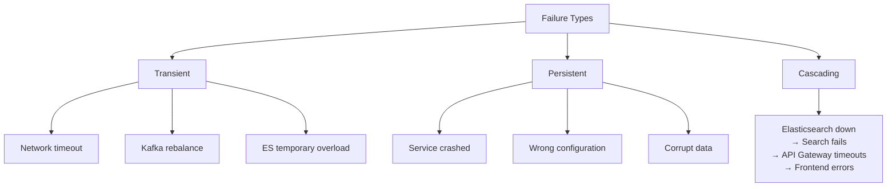
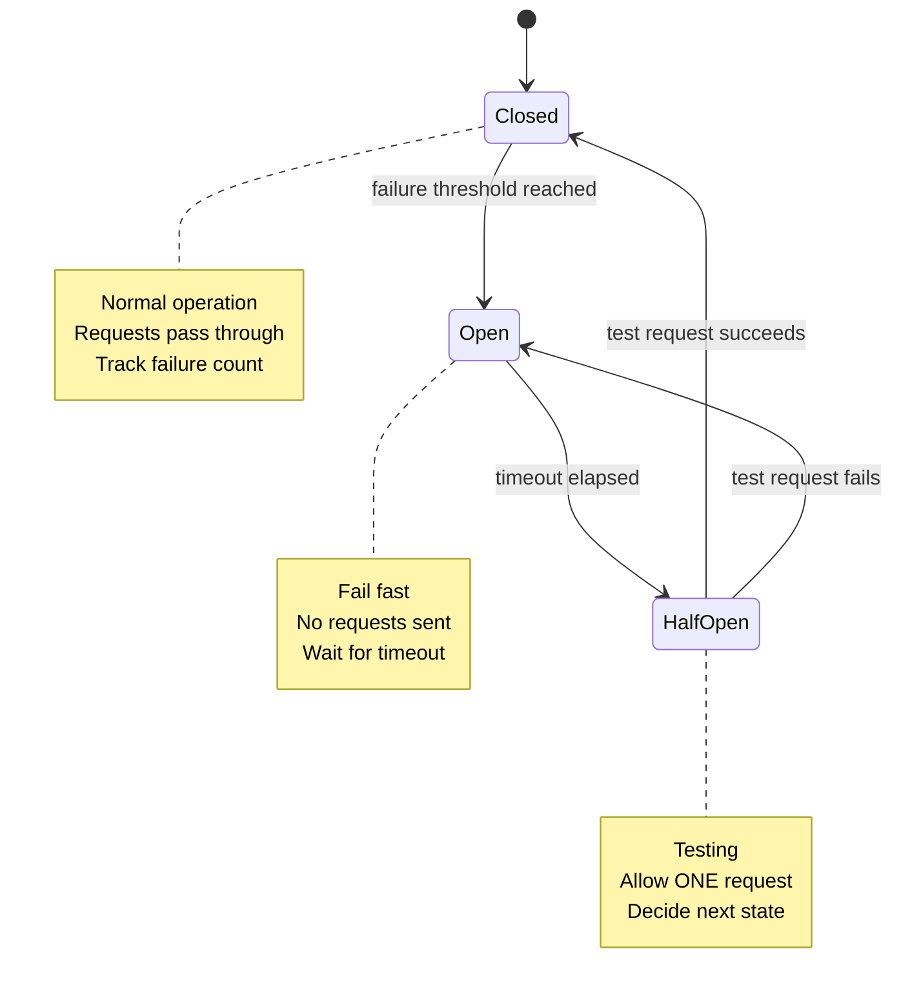
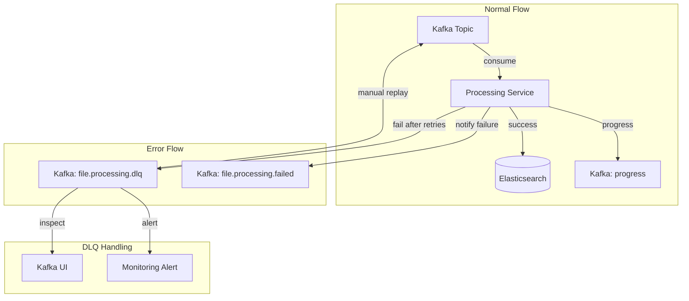

# 🛡️ Resilience Patterns — Building Fault-Tolerant Microservices

> **How to design systems that survive failures gracefully — circuit breakers, retries, timeouts, dead letter queues, and graceful degradation.**

---

## Table of Contents

- [1. Failure Modes in Microservices](#1-failure-modes-in-microservices)
- [2. Timeout Pattern](#2-timeout-pattern)
- [3. Retry with Exponential Backoff](#3-retry-with-exponential-backoff)
- [4. Circuit Breaker Pattern](#4-circuit-breaker-pattern)
- [5. Dead Letter Queue (DLQ)](#5-dead-letter-queue-dlq)
- [6. Bulkhead Pattern](#6-bulkhead-pattern)
- [7. Graceful Degradation](#7-graceful-degradation)
- [8. Health Checks & Liveness](#8-health-checks--liveness)
- [9. Resilience Matrix](#9-resilience-matrix)

---

## 1. Failure Modes in Microservices

### Types of Failures



### Our System's Failure Scenarios

| Failure | Impact | Current Handling | Severity |
|---------|--------|-----------------|----------|
| Kafka broker down | All async communication stops | Services queue messages, retry on reconnect | **Critical** |
| Elasticsearch down | Search fails, indexing fails | Timeout → DLQ for indexing, 503 for search | **High** |
| Redis down | Metadata unavailable, cache fails | Services fail to read/write status | **High** |
| S3 (LocalStack) down | Upload fails, download fails | Upload returns 500, processing retries | **High** |
| Processing Service crash | Files stuck in "processing" | Kafka retains messages, consumer rebalance | **Medium** |
| Notification Service down | No WebSocket updates | Frontend falls back to polling | **Low** |

---

## 2. Timeout Pattern

### The Problem

```
Without timeout:
  API Gateway → send(search) → waiting... → waiting... → waiting...
  (Elasticsearch is frozen, Search Service blocked)
  → Thread hung forever
  → Connection pool exhausted
  → API Gateway becomes unresponsive
  → All users affected
```

### Implementation

```typescript
// API Gateway: Timeout on Kafka request/response
const result = await firstValueFrom(
  this.searchClient.send(MESSAGE_PATTERNS.SEARCH_FILES, payload)
    .pipe(
      timeout(10000),   // 10 second timeout
      catchError(err => {
        if (err instanceof TimeoutError) {
          this.logger.warn(`Search request timed out for: ${payload.text}`);
          throw new RequestTimeoutException(
            'Search service is not responding. Please try again.'
          );
        }
        throw err;
      }),
    ),
);
```

### Timeout Strategy

| Operation | Timeout | Rationale |
|-----------|---------|-----------|
| HTTP request to API Gateway | 30s | Client-side, largest timeout |
| Kafka request/response (search) | 10s | Internal, should be fast |
| Kafka request/response (file status) | 5s | Redis lookup, very fast |
| S3 upload | 60s | Large files, network-bound |
| S3 download | 30s | Large files |
| Elasticsearch query | 5s | Should be sub-second |
| Elasticsearch bulk index | 30s | Batch operation |
| Redis operation | 3s | In-memory, should be < 1ms |

### Timeout Hierarchy

```
Client (Browser) → 30s timeout
  └── API Gateway → 10s timeout
       └── Search Service → 5s timeout
            └── Elasticsearch → 5s timeout

Each layer's timeout < parent layer's timeout
This prevents zombie connections at every level
```

---

## 3. Retry with Exponential Backoff

### Why Exponential Backoff?

```
Fixed retry: 1s, 1s, 1s, 1s, 1s
  Problem: Server just recovered → stampede of retries → overloaded again

Exponential backoff: 1s, 2s, 4s, 8s, 16s
  Solution: Gradually backs off → gives server time to recover

With jitter: 1.1s, 2.3s, 3.7s, 8.9s, 15.2s
  Solution: Adds randomness → prevents synchronized retry storms
```

### Implementation

```typescript
// Reusable retry utility with exponential backoff + jitter
async function retryWithBackoff<T>(
  operation: () => Promise<T>,
  options: {
    maxRetries: number;
    baseDelay: number;      // ms
    maxDelay: number;       // ms
    retryableErrors?: string[];
  },
): Promise<T> {
  const { maxRetries, baseDelay, maxDelay, retryableErrors } = options;

  for (let attempt = 0; attempt <= maxRetries; attempt++) {
    try {
      return await operation();
    } catch (error) {
      // Don't retry non-retryable errors
      if (retryableErrors && !retryableErrors.some(e => error.message.includes(e))) {
        throw error;
      }

      if (attempt === maxRetries) {
        throw error; // Final attempt failed
      }

      // Exponential backoff with jitter
      const delay = Math.min(
        baseDelay * Math.pow(2, attempt) + Math.random() * 1000,
        maxDelay,
      );

      console.log(`Retry ${attempt + 1}/${maxRetries} after ${delay}ms`);
      await new Promise(resolve => setTimeout(resolve, delay));
    }
  }
}

// Usage in Processing Service
await retryWithBackoff(
  () => this.elasticsearchService.bulkIndex(chunks),
  {
    maxRetries: 3,
    baseDelay: 1000,     // 1s, 2s, 4s
    maxDelay: 10000,     // Cap at 10s
    retryableErrors: ['ECONNREFUSED', 'ETIMEDOUT', 'circuit_breaking_exception'],
  },
);
```

### Retry Decision Table

| Error Type | Retry? | Why |
|-----------|--------|-----|
| Network timeout | **Yes** | Transient — might succeed next time |
| Connection refused | **Yes** | Service may be restarting |
| 429 Too Many Requests | **Yes** | Server overloaded, backoff helps |
| 500 Internal Server Error | **Yes** (limited) | Might be transient |
| 400 Bad Request | **No** | Request is malformed, won't succeed |
| 404 Not Found | **No** | Resource doesn't exist |
| 409 Conflict | **No** | Business logic conflict |
| Authentication failure | **No** | Credentials wrong, retrying won't help |

---

## 4. Circuit Breaker Pattern

### The Three States



### Implementation

```typescript
class CircuitBreaker {
  private state: 'CLOSED' | 'OPEN' | 'HALF_OPEN' = 'CLOSED';
  private failureCount = 0;
  private lastFailureTime: number = 0;

  constructor(
    private readonly options: {
      failureThreshold: number;     // Open after N failures
      resetTimeout: number;          // Try again after N ms
      monitorWindow: number;         // Reset counter after N ms
    },
  ) {}

  async execute<T>(operation: () => Promise<T>): Promise<T> {
    switch (this.state) {
      case 'OPEN':
        if (Date.now() - this.lastFailureTime > this.options.resetTimeout) {
          this.state = 'HALF_OPEN';
          return this.tryOperation(operation);
        }
        throw new Error('Circuit breaker is OPEN — failing fast');

      case 'HALF_OPEN':
        return this.tryOperation(operation);

      case 'CLOSED':
        return this.tryOperation(operation);
    }
  }

  private async tryOperation<T>(operation: () => Promise<T>): Promise<T> {
    try {
      const result = await operation();
      this.onSuccess();
      return result;
    } catch (error) {
      this.onFailure();
      throw error;
    }
  }

  private onSuccess(): void {
    this.failureCount = 0;
    this.state = 'CLOSED';
  }

  private onFailure(): void {
    this.failureCount++;
    this.lastFailureTime = Date.now();

    if (this.failureCount >= this.options.failureThreshold) {
      this.state = 'OPEN';
      console.error(
        `Circuit breaker opened after ${this.failureCount} failures`
      );
    }
  }
}
```

### Circuit Breakers in Our System

```typescript
// Elasticsearch circuit breaker
const esCircuitBreaker = new CircuitBreaker({
  failureThreshold: 5,       // Open after 5 consecutive failures
  resetTimeout: 30000,        // Try again after 30 seconds
  monitorWindow: 60000,       // Reset counter after 1 minute
});

// Usage in Search Service
async searchFiles(query: SearchQuery): Promise<SearchResult> {
  try {
    return await esCircuitBreaker.execute(
      () => this.elasticsearch.search(query)
    );
  } catch (error) {
    if (error.message.includes('Circuit breaker is OPEN')) {
      // Graceful degradation: return cached results or empty
      const cached = await this.cacheService.getStale(query);
      if (cached) return { ...cached, stale: true };
      return { results: [], total: 0, message: 'Search temporarily unavailable' };
    }
    throw error;
  }
}
```

---

## 5. Dead Letter Queue (DLQ)

### DLQ Flow



### DLQ Message Structure

```typescript
// When processing fails completely after all retries
interface DLQMessage {
  // Original event context
  originalTopic: string;           // "file.processing.started"
  originalMessage: {
    fileId: string;
    fileName: string;
    s3Key: string;
    fileSize: number;
    mimeType: string;
  };

  // Error context
  error: string;                   // Error message
  stack?: string;                  // Stack trace
  retryCount: number;              // How many retries attempted
  failedAt: string;                // ISO timestamp

  // Tracing
  correlationId: string;
  processingServiceId?: string;    // Which instance failed
}
```

### DLQ Processing Strategy

```
Step 1: Alert (Immediate)
  → Monitor DLQ topic lag
  → Alert if any messages appear
  → PagerDuty / Slack notification

Step 2: Investigate (Manual)
  → Open Kafka UI → Topics → file.processing.dlq
  → Read the error message and stack trace
  → Determine root cause (S3 down? ES mapping conflict? Bad file?)

Step 3: Fix (Root Cause)
  → Fix the underlying issue
  → Deploy fix

Step 4: Replay (Manual)
  → Read DLQ messages
  → Re-emit to original topic (file.processing.started)
  → Messages get reprocessed normally

  # Using kafka-console-consumer + producer to replay
  docker exec -it kafka kafka-console-consumer \
    --topic file.processing.dlq \
    --from-beginning \
    --bootstrap-server localhost:9092 \
    | docker exec -i kafka kafka-console-producer \
    --topic file.processing.started \
    --bootstrap-server localhost:9092
```

---

## 6. Bulkhead Pattern

### The Problem

```
Without bulkhead:
  Processing Service handles:
    - Small files (1KB-100KB) → Fast
    - Large files (100MB+) → Slow, memory-intensive

  One large file → Processing Service overwhelmed → ALL files affected
```

### Resource Isolation

```typescript
// Bulkhead via separate processing pools
class ProcessingService {
  // Limit concurrent file processing
  private readonly processingLimiter = new Semaphore(3); // Max 3 concurrent files

  async processFile(event: FileProcessingStartedEvent): Promise<void> {
    await this.processingLimiter.acquire();

    try {
      await this.doProcess(event);
    } finally {
      this.processingLimiter.release();
    }
  }
}

// Simple semaphore implementation
class Semaphore {
  private permits: number;
  private waiting: (() => void)[] = [];

  constructor(permits: number) {
    this.permits = permits;
  }

  async acquire(): Promise<void> {
    if (this.permits > 0) {
      this.permits--;
      return;
    }
    return new Promise(resolve => {
      this.waiting.push(resolve);
    });
  }

  release(): void {
    if (this.waiting.length > 0) {
      this.waiting.shift()!();
    } else {
      this.permits++;
    }
  }
}
```

### Kafka-Level Bulkhead

```
Our natural bulkhead: Consumer Groups + Partitions

Topic: file.processing.started (3 partitions)
  Partition 0: { file-A, file-D } → Consumer Instance 1
  Partition 1: { file-B, file-E } → Consumer Instance 2
  Partition 2: { file-C, file-F } → Consumer Instance 2

If Instance 2 is overloaded processing large file-B:
  → Only Partition 1 and 2 are affected
  → Partition 0 (Instance 1) continues normally
  → Partial degradation, not total failure
```

---

## 7. Graceful Degradation

### Degradation Strategies

| Component Down | Degradation | User Experience |
|---------------|------------|-----------------|
| Elasticsearch | Return cached results + "Search may show stale results" | Partial functionality |
| Redis | Disable caching, query ES directly + slower response | Full functionality, slower |
| S3 | Queue uploads for retry + "Upload temporarily unavailable" | Partial — upload disabled |
| Kafka | HTTP fallback for critical paths + "Processing delayed" | Degraded but functional |
| Processing Service | Files stay in "processing" + "Processing delayed" | Upload works, search limited |
| Notification Service | Frontend polls instead of WebSocket push | Slightly delayed updates |

### Implementation Examples

```typescript
// Search with graceful degradation
async search(query: SearchQuery): Promise<SearchResult> {
  // Strategy 1: Try cache first
  try {
    const cached = await this.redis.get(cacheKey);
    if (cached) return { ...JSON.parse(cached), source: 'cache' };
  } catch {
    this.logger.warn('Redis unavailable — skipping cache');
  }

  // Strategy 2: Try Elasticsearch
  try {
    const result = await this.elasticsearch.search(query);
    // Try to cache, but don't fail if Redis is down
    this.redis.set(cacheKey, JSON.stringify(result), 'EX', 300).catch(() => {});
    return { ...result, source: 'elasticsearch' };
  } catch (esError) {
    this.logger.error('Elasticsearch unavailable');
  }

  // Strategy 3: Return empty with message
  return {
    results: [],
    total: 0,
    source: 'none',
    message: 'Search is currently unavailable. Please try again later.',
  };
}
```

### Frontend Degradation

```typescript
// React: WebSocket with polling fallback
function useFileStatus(fileId: string) {
  const [status, setStatus] = useState('processing');
  const wsConnected = useRef(false);

  // Primary: WebSocket
  useEffect(() => {
    const ws = new WebSocket(`ws://localhost:3004`);
    ws.onopen = () => { wsConnected.current = true; };
    ws.onclose = () => { wsConnected.current = false; };
    ws.onmessage = (event) => {
      const data = JSON.parse(event.data);
      if (data.fileId === fileId) setStatus(data.status);
    };
    return () => ws.close();
  }, [fileId]);

  // Fallback: Polling (only when WS is down)
  useEffect(() => {
    if (wsConnected.current) return;
    const interval = setInterval(async () => {
      if (!wsConnected.current) {
        const res = await api.getFileStatus(fileId);
        setStatus(res.status);
      }
    }, 5000);
    return () => clearInterval(interval);
  }, [fileId]);

  return status;
}
```

---

## 8. Health Checks & Liveness

### Health Check Endpoints

```typescript
// NestJS health check pattern
@Controller('health')
export class HealthController {
  @Get()
  async check(): Promise<HealthStatus> {
    const checks = await Promise.allSettled([
      this.checkRedis(),
      this.checkElasticsearch(),
      this.checkKafka(),
      this.checkS3(),
    ]);

    const statuses = {
      redis: checks[0].status === 'fulfilled' ? 'up' : 'down',
      elasticsearch: checks[1].status === 'fulfilled' ? 'up' : 'down',
      kafka: checks[2].status === 'fulfilled' ? 'up' : 'down',
      s3: checks[3].status === 'fulfilled' ? 'up' : 'down',
    };

    const allUp = Object.values(statuses).every(s => s === 'up');
    return {
      status: allUp ? 'healthy' : 'degraded',
      checks: statuses,
      timestamp: new Date().toISOString(),
    };
  }
}
```

### Docker Health Checks

```yaml
# docker-compose.yml health check examples
services:
  redis:
    healthcheck:
      test: ["CMD", "redis-cli", "ping"]
      interval: 10s
      timeout: 5s
      retries: 3

  elasticsearch:
    healthcheck:
      test: ["CMD-SHELL", "curl -f http://localhost:9200/_cluster/health || exit 1"]
      interval: 30s
      timeout: 10s
      retries: 3

  kafka:
    healthcheck:
      test: ["CMD-SHELL", "kafka-topics --list --bootstrap-server localhost:9092 || exit 1"]
      interval: 30s
      timeout: 10s
      retries: 5
```

---

## 9. Resilience Matrix

### Complete Resilience Strategy

| Pattern | Where Applied | Configuration | Purpose |
|---------|--------------|---------------|---------|
| **Timeout** | Kafka req/reply, HTTP, ES queries | 3-60s per operation | Prevent hanging |
| **Retry** | ES bulk index, S3 upload | 3 retries, exponential backoff | Handle transient failures |
| **Circuit Breaker** | ES queries, external APIs | 5 failures → 30s cooldown | Prevent cascading failures |
| **DLQ** | Processing pipeline | `file.processing.dlq` topic | Isolate poison messages |
| **Bulkhead** | Processing concurrency, Kafka partitions | 3 partitions, semaphore | Resource isolation |
| **Graceful Degradation** | Search, notifications | Cache fallback, polling fallback | Partial functionality |
| **Health Check** | All services | `/health` endpoint | Monitoring & auto-restart |
| **Idempotency** | All event consumers | Deterministic IDs, upserts | Safe retries |

### Failure Recovery Timeline

```
T=0s:   Elasticsearch goes down
T=0.5s: First search query fails
T=1s:   Circuit breaker records failure #1
T=5s:   5 failures → Circuit breaker OPENS
T=5.1s: All searches return cached results (graceful degradation)
T=5.1s: Processing Service indexing fails → enters retry loop
T=15s:  After 3 retries → DLQ
T=30s:  Alert fired → Ops team notified
T=35s:  Circuit breaker → HALF_OPEN (tests ES)
T=35.1s: ES still down → Circuit breaker re-OPENS
T=120s: ES comes back online
T=150s: Circuit breaker → HALF_OPEN → test succeeds → CLOSED
T=151s: Search returns live results again
T=160s: DLQ messages manually replayed → all files reprocessed
T=300s: Full recovery, all data consistent
```

---

> **Next:** [Scaling Strategies →](./SCALING-STRATEGIES.md) — Horizontal scaling, partition-based parallelism, and load balancing patterns.
