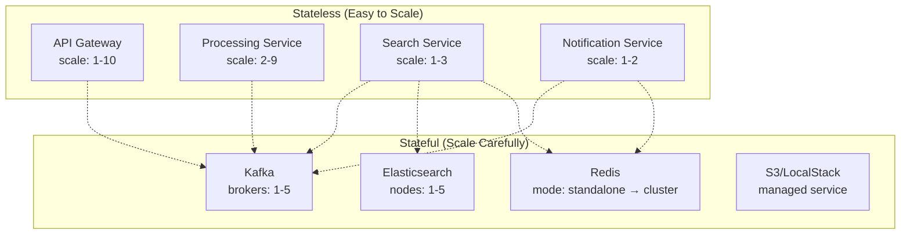
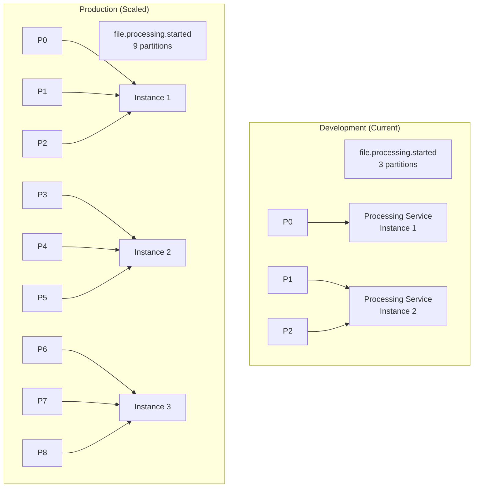
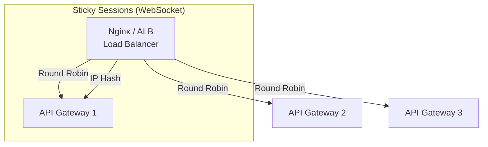

# 📈 Scaling Strategies — From Single Instance to Production Scale

> **How to scale each component of the microservices architecture independently — partition-based parallelism, horizontal scaling, and capacity planning.**

---

## Table of Contents

- [1. Scaling Dimensions](#1-scaling-dimensions)
- [2. Kafka Partition-Based Scaling](#2-kafka-partition-based-scaling)
- [3. Service-Level Scaling](#3-service-level-scaling)
- [4. Data Store Scaling](#4-data-store-scaling)
- [5. Load Balancing Patterns](#5-load-balancing-patterns)
- [6. Auto-Scaling Triggers](#6-auto-scaling-triggers)
- [7. Capacity Planning](#7-capacity-planning)
- [8. Scaling Anti-Patterns](#8-scaling-anti-patterns)

---

## 1. Scaling Dimensions

### Horizontal vs. Vertical Scaling

```
Vertical Scaling (Scale Up):
  Add more CPU/RAM to existing instance
  ✅ Simple — no code changes
  ❌ Limited — hardware ceiling exists
  ❌ Single point of failure

Horizontal Scaling (Scale Out):
  Add more instances of the same service
  ✅ Theoretically unlimited
  ✅ Fault tolerant — one instance dies, others continue
  ❌ Requires stateless design
  ❌ Data partitioning needed
```

### Scaling Map of Our System



---

## 2. Kafka Partition-Based Scaling

### The Golden Rule

```
Max consumers in a group = Number of partitions

Our setup: 3 partitions per topic
→ Max 3 consumers per consumer group
→ Beyond 3 instances, extra consumers are idle
```

### Current Setup vs. Scaled-Up



### Partition Scaling Guide

| Topic | Dev Partitions | Prod Partitions | Reasoning |
|-------|---------------|-----------------|-----------|
| `file.uploaded` | 3 | 6 | Moderate throughput |
| `file.processing.started` | 3 | 9 | Highest load — parallel processing |
| `file.processing.progress` | 3 | 6 | High volume but lightweight |
| `file.processing.completed` | 3 | 6 | Moderate, multiple consumers |
| `file.processing.failed` | 3 | 3 | Low volume (hopefully!) |
| `file.processing.dlq` | 1 | 3 | Low volume (errors only) |
| `search.files` | 3 | 6 | Request/reply, needs low latency |

### How to Add Partitions

```bash
# Increase partitions (cannot decrease!)
kafka-topics --alter \
  --topic file.processing.started \
  --partitions 9 \
  --bootstrap-server kafka:29092

# ⚠️ WARNING: Existing messages with same key may now go to
#    different partitions. This temporarily breaks ordering
#    for in-flight messages. Only increase during low traffic.
```

---

## 3. Service-Level Scaling

### API Gateway Scaling

```yaml
# docker-compose.yml — Scale with replicas
api-gateway:
  image: chunk-files/api-gateway
  deploy:
    replicas: 3
  ports:
    - "3000-3002:3000"    # Port range for multiple instances
  environment:
    KAFKA_BROKERS: kafka:29092

# With Nginx load balancer
nginx:
  image: nginx:alpine
  ports:
    - "80:80"
  volumes:
    - ./nginx.conf:/etc/nginx/nginx.conf
```

```nginx
# nginx.conf — Round-robin load balancing
upstream api_gateway {
    server api-gateway-1:3000;
    server api-gateway-2:3000;
    server api-gateway-3:3000;
}

server {
    listen 80;
    location / {
        proxy_pass http://api_gateway;
    }
    location /ws {
        proxy_pass http://api_gateway;
        proxy_http_version 1.1;
        proxy_set_header Upgrade $http_upgrade;
        proxy_set_header Connection "upgrade";
    }
}
```

### Processing Service Scaling

```
Processing Service is the most CPU/memory intensive:
  - Downloads files from S3
  - Splits into chunks (CPU-bound)
  - Bulk indexes to Elasticsearch (I/O-bound)

Scaling strategy:
  1. Start with 2 instances (covers 2 of 3 partitions)
  2. Scale to 3 for perfect partition balance (1:1)
  3. Scale beyond 3 → increase partitions first
```

```yaml
# Docker Compose scaling
processing-service:
  image: chunk-files/processing-service
  deploy:
    replicas: 2            # Start with 2
    resources:
      limits:
        cpus: '1.0'
        memory: 512M
      reservations:
        cpus: '0.5'
        memory: 256M
```

### Search Service Scaling

```
Search Service is I/O-bound (ES queries):
  - Multiple instances share ES connection pool
  - Redis cache reduces ES load
  - Each instance handles request/reply independently

Scaling strategy:
  1. 1 instance handles ~100 req/s easily
  2. Scale based on request volume, not Kafka partitions
  3. Max useful instances = number of search topic partitions
```

### Notification Service Scaling

```
⚠️ WebSocket scaling is complex:
  Problem: User connects to Instance A
           Event delivered to Instance B
           → User doesn't get notification!

Solution: Redis Pub/Sub for cross-instance messaging
  1. All instances subscribe to Redis channels
  2. When any instance receives a Kafka event:
     → Publish to Redis channel
     → All instances broadcast to their WebSocket clients
  3. Client reconnects to any instance (sticky sessions via nginx)
```

```typescript
// Cross-instance notification via Redis Pub/Sub
class NotificationService {
  private readonly channel = 'file:notifications';

  async onModuleInit() {
    // Subscribe to Redis Pub/Sub
    this.subscriber.subscribe(this.channel);
    this.subscriber.on('message', (channel, message) => {
      const event = JSON.parse(message);
      // Broadcast to all locally connected WebSocket clients
      this.wsGateway.broadcastToAll(event);
    });
  }

  // Called when Kafka event received
  async handleKafkaEvent(event: FileEvent) {
    // Publish to Redis → all instances get it
    await this.publisher.publish(this.channel, JSON.stringify(event));
  }
}
```

---

## 4. Data Store Scaling

### Redis Scaling Path

```
Stage 1: Single Instance (Development)
  redis:7.2-alpine
  - 1 instance, all data
  - ~100,000 ops/sec
  - Sufficient for dev/small prod

Stage 2: Redis Sentinel (High Availability)
  redis-master + redis-replica + redis-sentinel
  - Automatic failover
  - Read replicas for read scaling
  - Master for writes

Stage 3: Redis Cluster (Horizontal)
  6+ nodes (3 masters + 3 replicas)
  - Data sharded across masters
  - Automatic resharding
  - Linear scalability
```

### Elasticsearch Scaling Path

```
Stage 1: Single Node (Development)
  discovery.type=single-node
  - 1 shard, 0 replicas
  - Good for <1M documents

Stage 2: Multi-Node Cluster
  3 nodes (master-eligible + data)
  - Index: 3 shards, 1 replica
  - Survives 1 node failure
  - ~3x query throughput

Stage 3: Dedicated Roles
  3 master nodes (coordination)
  5+ data nodes (storage + compute)
  2 ingest nodes (indexing pipeline)
  - Optimized per role
  - Scales to billions of documents
```

```yaml
# Production ES cluster
elasticsearch-master-1:
  environment:
    - node.roles=master
    - cluster.initial_master_nodes=es-master-1,es-master-2,es-master-3

elasticsearch-data-1:
  environment:
    - node.roles=data,ingest
    - cluster.name=chunk-files
  deploy:
    resources:
      limits:
        memory: 4G
```

### S3 Scaling

```
S3 (AWS managed) — scales automatically:
  - Unlimited storage
  - 5500 GET requests/second/prefix
  - 3500 PUT requests/second/prefix

Optimization for high throughput:
  - Use random prefixes: uploads/{uuid}/file.md
  - NOT: uploads/2024/01/file.md (hot prefix)
  - Multipart upload for files > 100MB
  - Transfer Acceleration for global uploads
```

---

## 5. Load Balancing Patterns

### HTTP Load Balancing



### Kafka-Level Load Balancing

```
Kafka IS the load balancer for microservices:

Producer → Topic (3 partitions) → Consumer Group
  Message with key → deterministic partition → specific consumer

This gives us:
  ✅ Automatic load distribution across consumers
  ✅ Rebalancing when consumers join/leave
  ✅ No separate load balancer needed for service-to-service
  ✅ Ordered processing per partition key
```

---

## 6. Auto-Scaling Triggers

### Kubernetes HPA (Horizontal Pod Autoscaler)

```yaml
# Processing Service auto-scaling
apiVersion: autoscaling/v2
kind: HorizontalPodAutoscaler
metadata:
  name: processing-service-hpa
spec:
  scaleTargetRef:
    apiVersion: apps/v1
    kind: Deployment
    name: processing-service
  minReplicas: 2
  maxReplicas: 9       # Max = partition count
  metrics:
    # Scale on CPU usage
    - type: Resource
      resource:
        name: cpu
        target:
          type: Utilization
          averageUtilization: 70
    # Scale on Kafka consumer lag
    - type: External
      external:
        metric:
          name: kafka_consumer_lag
          selector:
            matchLabels:
              topic: file.processing.started
              group: processing-service-group
        target:
          type: Value
          value: 100    # Scale up if lag > 100 messages
```

### Custom Scaling Metrics

| Metric | Scale Up When | Scale Down When | Service |
|--------|-------------|----------------|---------|
| CPU utilization | > 70% | < 30% | Processing Service |
| Kafka consumer lag | > 100 messages | < 10 messages | Processing Service |
| Request latency p99 | > 2000ms | < 200ms | API Gateway |
| ES query latency | > 500ms | < 50ms | Search Service |
| WebSocket connections | > 1000/instance | < 100/instance | Notification Service |
| Memory usage | > 80% | < 40% | All services |

---

## 7. Capacity Planning

### Back-of-Envelope Calculation

```
Given:
  - 1000 files uploaded per day
  - Average file size: 50KB
  - Average 100 chunks per file
  - Each chunk: ~500 bytes indexed

Storage:
  S3:    1000 files × 50KB = 50MB/day → 18GB/year
  ES:    1000 files × 100 chunks × 500B = 50MB/day → 18GB/year
  Redis: 1000 files × 1KB metadata = 1MB/day → 365MB/year
  Kafka: 1000 files × 8 events × 2KB = 16MB/day (before retention)

Compute:
  API Gateway:     ~0.05 CPU per request → 1 instance sufficient
  Upload Service:  ~0.1 CPU per upload → 1 instance sufficient
  Processing:      ~0.5 CPU per file (chunking) → 1-2 instances
  Search Service:  ~0.01 CPU per search → 1 instance sufficient

Network:
  Kafka:  ~50MB/day internal traffic
  ES:     ~100MB/day indexing + queries
  Total:  ~200MB/day → trivial
```

### Scaling Tiers

| Tier | Files/Day | Processing | API Gateway | Search | Kafka Partitions |
|------|-----------|-----------|-------------|--------|-----------------|
| **Dev** | 1-100 | 1 instance | 1 instance | 1 instance | 3 |
| **Small** | 100-1K | 2 instances | 1 instance | 1 instance | 3 |
| **Medium** | 1K-10K | 3 instances | 2 instances | 2 instances | 6 |
| **Large** | 10K-100K | 6 instances | 3 instances | 3 instances | 9 |
| **Enterprise** | 100K+ | 9+ instances | 5+ instances | 5+ instances | 12+ |

---

## 8. Scaling Anti-Patterns

### 1. Premature Scaling

```
❌ Bad: "Let's start with 10 instances of everything"
   Problem: Waste of resources, operational complexity

✅ Better: Start small, measure, scale when needed
   - Monitor actual load before scaling
   - Use auto-scaling with defined thresholds
   - Kafka partitions can be increased later
```

### 2. Scaling Stateful Services Like Stateless

```
❌ Bad: Scale Redis by adding instances without cluster mode
   Problem: Each instance has different data

✅ Better: Use Redis Cluster or Sentinel for HA
   - Or redesign to use Redis as cache only (expendable)
```

### 3. Ignoring Partition Count Ceiling

```
❌ Bad: 3 partitions + 5 consumer instances
   Problem: 2 consumers are idle (wasted resources)

✅ Better: partitions ≥ max consumers
   - Check partition count before scaling consumers
   - Increase partitions during off-peak hours
```

### 4. Not Accounting for Rebalancing

```
❌ Bad: Scale processing-service from 2 → 6 instantly
   Problem: Kafka consumer group rebalance → ~30s of no processing

✅ Better: Scale gradually (2 → 3 → 4 → ...)
   - Cooperative rebalancing (newer Kafka)
   - Static group membership for fast rejoins
```

### 5. Vertical Scaling Elasticsearch Data Nodes

```
❌ Bad: One huge ES node with 64GB RAM and 16 CPUs
   Problem: Single point of failure, JVM GC pauses at large heap

✅ Better: Multiple smaller nodes (16GB each)
   - ES shards distribute across nodes
   - GC pauses manageable
   - Fault tolerant — lose one node, others continue
```

---

> **Next:** [Testing Strategies →](./TESTING-STRATEGIES.md) — Unit testing, integration testing, contract testing, and end-to-end testing patterns.
