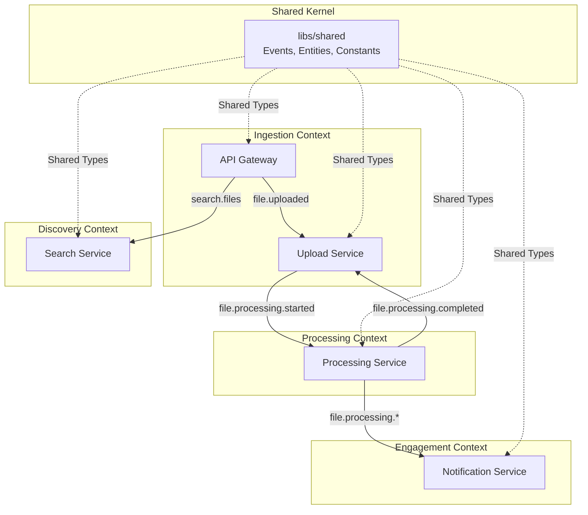
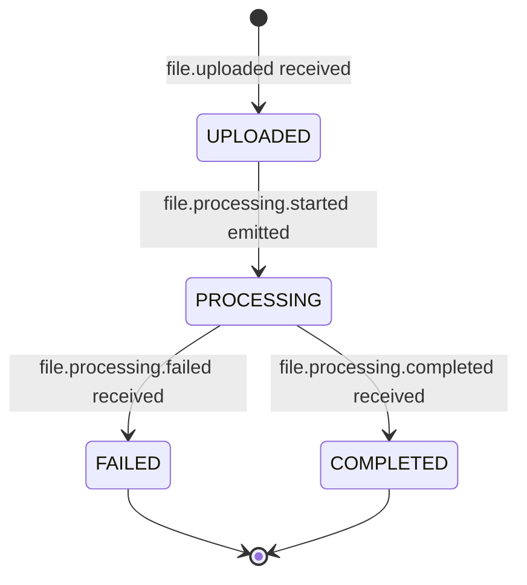
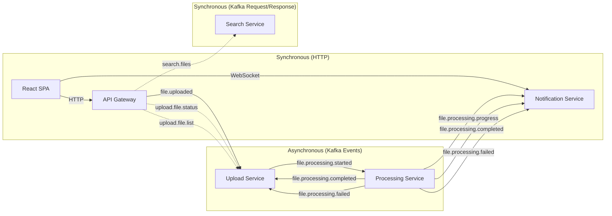
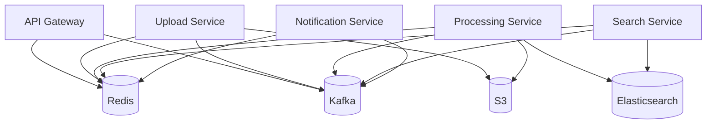

# ✂️ Service Decomposition — From Monolith to Microservices

> **The art of splitting a system into services that are independently deployable, scalable, and maintainable — without creating a distributed monolith.**

---

## Table of Contents

- [1. Decomposition Philosophy](#1-decomposition-philosophy)
- [2. Bounded Context Analysis](#2-bounded-context-analysis)
- [3. Service Boundaries — The Final Map](#3-service-boundaries--the-final-map)
- [4. Service-by-Service Deep Dive](#4-service-by-service-deep-dive)
- [5. Dependency Graph](#5-dependency-graph)
- [6. Shared Library Strategy](#6-shared-library-strategy)
- [7. What NOT to Split](#7-what-not-to-split)
- [8. Evolution Path — Monolith First](#8-evolution-path--monolith-first)
- [9. Anti-Patterns We Avoided](#9-anti-patterns-we-avoided)

---

## 1. Decomposition Philosophy

### The Golden Rules

```
┌─────────────────────────────────────────────────────────┐
│  1. Decompose by BUSINESS CAPABILITY, not by layer      │
│  2. Each service OWNS its data — no shared databases    │
│  3. Services communicate via EVENTS, not direct calls   │
│  4. A service should be REPLACEABLE within 2 weeks      │
│  5. If two services ALWAYS deploy together → merge them │
└─────────────────────────────────────────────────────────┘
```

### Why These 5 Services?

We didn't start with 5 services. We started by asking: **"What are the independent business capabilities?"**

```
User Story: "I want to upload a file and search its content"

Business Capabilities:
1. Accept files from users           → API Gateway
2. Store files safely                 → Upload Service
3. Process files into searchable data → Processing Service
4. Search through processed data      → Search Service
5. Keep users informed in real-time   → Notification Service
```

Each capability has:
- **Different scaling characteristics** (processing is CPU-heavy, search is I/O-heavy)
- **Different failure modes** (upload fails ≠ search fails)
- **Different change frequency** (search algorithm changes weekly, upload rarely changes)

---

## 2. Bounded Context Analysis

### Domain-Driven Design Context Map



### Context Relationships

| Upstream | Downstream | Relationship | Shared Data |
|----------|-----------|-------------|-------------|
| API Gateway | Upload Service | **Customer-Supplier** | `FileUploadedEvent` (file buffer + metadata) |
| Upload Service | Processing Service | **Customer-Supplier** | `FileProcessingStartedEvent` (S3 key, file info) |
| Processing Service | Upload Service | **Published Language** | `FileProcessingCompletedEvent` / `FailedEvent` |
| Processing Service | Notification Service | **Published Language** | Progress, completion, failure events |
| API Gateway | Search Service | **Request-Reply** | Search query → search results |
| All Services | Shared Library | **Shared Kernel** | Event types, constants, entities |

### Ubiquitous Language

| Term | Definition | Owned By |
|------|-----------|----------|
| **FileUpload** | Domain entity representing an uploaded file with status lifecycle | Upload Service |
| **FileChunk** | A segment of a file with content, byte offsets, and metadata | Processing Service |
| **FileStatus** | State machine: `uploaded → processing → completed \| failed` | Upload Service |
| **ChunkIndex** | Sequential number identifying a chunk within a file | Processing Service |
| **CorrelationId** | UUID tracing a request through all services | API Gateway (generates) |

---

## 3. Service Boundaries — The Final Map

### The Decomposition Matrix

| Capability | Service | Data Owned | External Dependencies | Scale Dimension |
|-----------|---------|-----------|----------------------|----------------|
| HTTP Entry Point | API Gateway | None (stateless cache) | Kafka, Redis | Request rate |
| File Ingestion | Upload Service | File metadata (Redis) | S3, Kafka, Redis | Upload volume |
| Content Processing | Processing Service | Chunk data (Elasticsearch) | S3, Elasticsearch, Kafka | CPU (chunking) |
| Content Discovery | Search Service | Search cache (Redis) | Elasticsearch, Redis | Query rate |
| User Engagement | Notification Service | Connection state | Kafka, Redis, WebSocket | Connected clients |

### Data Ownership — NO Shared Databases

```
┌─────────────────┐     ┌──────────────────┐     ┌─────────────────┐
│ Upload Service   │     │ Processing Service│     │ Search Service   │
│                  │     │                   │     │                  │
│ Owns:            │     │ Owns:             │     │ Owns:            │
│ ┌──────────────┐ │     │ ┌───────────────┐ │     │ ┌──────────────┐ │
│ │ Redis        │ │     │ │ Elasticsearch │ │     │ │ Redis        │ │
│ │ file:meta:*  │ │     │ │ file-chunks   │ │     │ │ search:cache │ │
│ │ file:status:*│ │     │ │ index         │ │     │ │ prefix       │ │
│ └──────────────┘ │     │ └───────────────┘ │     │ └──────────────┘ │
└─────────────────┘     └──────────────────┘     └─────────────────┘
         │                        │                        │
         │   All share Redis      │                        │
         │   but use DIFFERENT    │                        │
         │   key prefixes         │                        │
         └────────────────────────┴────────────────────────┘
```

> **Key principle:** Even though Redis is a single instance, each service uses **isolated key prefixes** (`file:meta:`, `search:cache:`, `progress:`, `notifications:`). This mimics database-per-service without managing multiple Redis instances in development.

---

## 4. Service-by-Service Deep Dive

### 4.1 API Gateway

```
Role:     HTTP → Kafka bridge (Edge service)
Pattern:  Ambassador / API Gateway
Transport: HTTP (Express) — the ONLY externally exposed HTTP service
```

**Responsibilities:**
1. Accept multipart file uploads via REST
2. Generate `fileId` (UUID) and `correlationId`
3. Produce `file.uploaded` events to Kafka
4. Proxy search requests via Kafka request/response
5. Cache file status and search results in Redis
6. Serve Swagger/OpenAPI documentation

**What it does NOT do:**
- Store files (delegated to Upload Service → S3)
- Process files (delegated to Processing Service)
- Execute search queries (delegated to Search Service → Elasticsearch)

**Code Architecture:**
```
apps/api-gateway/src/
├── main.ts                    # Bootstrap HTTP + Kafka clients
├── app.module.ts              # Wire controllers, Kafka clients, Redis
├── controllers/
│   ├── file.controller.ts     # POST /files/upload, GET /files/:id/status
│   ├── search.controller.ts   # GET /search
│   └── health.controller.ts   # GET /health
└── modules/
    └── redis.module.ts        # Redis service provider
```

**Kafka Interaction:**
```typescript
// PRODUCES to topics:
KAFKA_TOPICS.FILE_UPLOADED     // → Upload Service consumes

// REQUEST/RESPONSE patterns:
MESSAGE_PATTERNS.GET_FILE_STATUS  // → Upload Service handles
MESSAGE_PATTERNS.GET_FILE_LIST    // → Upload Service handles
MESSAGE_PATTERNS.SEARCH_FILES     // → Search Service handles
```

---

### 4.2 Upload Service

```
Role:     File storage + metadata management
Pattern:  Backend-for-Frontend worker
Transport: Kafka Consumer (no HTTP)
```

**Responsibilities:**
1. Consume `file.uploaded` events — decode base64, upload to S3
2. Save `FileUpload` entity to Redis (metadata store)
3. Produce `file.processing.started` events
4. Handle status queries via Kafka request/response
5. Update status on `file.processing.completed` / `failed`

**Code Architecture:**
```
apps/upload-service/src/
├── main.ts                        # Bootstrap Kafka microservice
├── app.module.ts                  # Wire services, S3, Redis, Kafka
├── controllers/
│   └── upload.controller.ts       # @EventPattern + @MessagePattern handlers
├── services/
│   └── s3.service.ts              # AWS S3 client wrapper
├── repositories/
│   └── redis-file.repository.ts   # FileUpload CRUD in Redis
└── modules/
    └── redis.module.ts            # Redis connection
```

**State Machine (owned by Upload Service):**


---

### 4.3 Processing Service

```
Role:     Heavy computation — chunking + indexing
Pattern:  Worker / Consumer
Transport: Kafka Consumer (no HTTP)
Scaling:  2 replicas by default (docker-compose deploy.replicas)
```

**Responsibilities:**
1. Consume `file.processing.started` events
2. Download file from S3 using `s3Key`
3. Split into chunks (configurable size: 5MB default, 100B overlap)
4. Bulk-index chunks to Elasticsearch in batches (100 per batch)
5. Emit progress events per batch
6. Emit completion/failure + send to DLQ on error

**Code Architecture:**
```
apps/processing-service/src/
├── main.ts                           # Bootstrap Kafka microservice
├── app.module.ts                     # Wire services
├── controllers/
│   └── processing.controller.ts      # @EventPattern handler
└── services/
    ├── chunking.service.ts           # File → Chunk[] splitting logic
    ├── s3.service.ts                 # Download from S3
    ├── elasticsearch.service.ts      # Bulk indexing
    └── progress.service.ts           # Redis progress tracking
```

**Why 2 Replicas?**
```
Processing is CPU-bound (chunking) + I/O-bound (S3 download, ES index).
Kafka with 3 partitions distributes work across 2 consumers.

With 2 replicas and 3 partitions:
- Consumer 1 → Partitions 0, 1
- Consumer 2 → Partition 2

Scaling to 3 replicas → 1 partition per consumer (perfect balance)
```

---

### 4.4 Search Service

```
Role:     Full-text search queries
Pattern:  CQRS Read Model service
Transport: Kafka Consumer (request/response only)
```

**Responsibilities:**
1. Handle `search.files` request/response messages
2. Build Elasticsearch queries (multi_match, bool, filter)
3. Cache results in Redis (MD5 hash of params as key, 600s TTL)
4. Return paginated results with highlights

**Code Architecture:**
```
apps/search-service/src/
├── main.ts                          # Bootstrap Kafka microservice
├── app.module.ts                    # Wire services
├── controllers/
│   └── search.controller.ts         # @MessagePattern handler
└── services/
    ├── elasticsearch.service.ts     # Query builder + execution
    └── redis-cache.service.ts       # Search result caching
```

**Elasticsearch Query Structure:**
```json
{
  "query": {
    "bool": {
      "must": [
        { "match": { "content": "user search text" } }
      ],
      "filter": [
        { "term": { "fileId": "optional-file-id" } },
        { "match": { "metadata.fileName": "optional-file-name" } }
      ]
    }
  },
  "highlight": {
    "fields": { "content": { "fragment_size": 200, "number_of_fragments": 3 } }
  },
  "from": 0,
  "size": 10
}
```

---

### 4.5 Notification Service

```
Role:     Real-time client notifications
Pattern:  Event Translator + WebSocket Gateway
Transport: Kafka Consumer + HTTP + WebSocket (Socket.IO)
Port:     3004
```

**Responsibilities:**
1. Consume `file.processing.progress`, `completed`, `failed` events
2. Broadcast to all connected WebSocket clients
3. Broadcast to file-specific rooms (`file:{fileId}`)
4. Publish events to Redis Pub/Sub channels

**Code Architecture:**
```
apps/notification-service/src/
├── main.ts                             # Bootstrap hybrid (HTTP + Kafka)
├── app.module.ts                       # Wire services
├── controllers/
│   └── notification.controller.ts      # @EventPattern Kafka handlers
├── gateways/
│   └── notification.gateway.ts         # @WebSocketGateway Socket.IO
└── services/
    └── redis-notification.service.ts   # Redis pub/sub
```

**WebSocket Protocol:**
```
Client → Server:
  subscribe:file  { fileId: "abc-123" }     // Join room

Server → Client:
  file:progress   { fileId, percentage, totalChunks, processedChunks }
  file:completed  { fileId, totalChunks, processingTimeMs }
  file:failed     { fileId, error }
```

---

## 5. Dependency Graph

### Service-to-Service Communication



### Service-to-Infrastructure



---

## 6. Shared Library Strategy

### What Goes in `@chunk-files/shared`?

```
✅ DO put in shared:
  - Kafka topic names and consumer groups      → Prevent string typos
  - Event interface definitions                → Type safety across services
  - Redis key prefixes and TTL constants       → Consistent key naming
  - Service injection tokens                   → DI token consistency
  - Domain entities (FileUpload, FileChunk)    → Shared domain model
  - Message pattern names                      → Request/response contracts

❌ DO NOT put in shared:
  - Business logic (chunking algorithm, search queries)
  - Service-specific configuration
  - Infrastructure adapters (S3 client, ES client)
  - Controller or route definitions
```

### Library Structure

```
libs/shared/src/
├── index.ts                     # Re-exports everything
├── kafka/
│   ├── topics.ts                # KAFKA_TOPICS, CONSUMER_GROUPS, KAFKA_CLIENT_IDS
│   └── events.ts                # All event interfaces (FileUploadedEvent, etc.)
├── redis/
│   └── constants.ts             # REDIS_PREFIXES, REDIS_TTL, REDIS_CHANNELS
├── constants/
│   └── services.ts              # MICROSERVICE_CLIENTS, MESSAGE_PATTERNS
├── entities/
│   ├── file-upload.entity.ts    # FileUpload class + FileStatus enum
│   └── file-chunk.entity.ts     # FileChunk + ChunkMetadata
├── interfaces/
│   ├── file-repository.interface.ts
│   ├── storage.interface.ts
│   └── search.interface.ts
└── utils/
    ├── retry.ts                 # Retry with exponential backoff
    ├── redis.ts                 # Redis connection factory
    ├── kafka.ts                 # Kafka config helper
    └── elasticsearch.ts         # ES client factory
```

### Why a Shared Library Instead of API Contracts?

| Approach | Pros | Cons |
|----------|------|------|
| **Shared Library** (our choice) | Type safety at compile time, single source of truth | Couples services at build time |
| **API Contracts (OpenAPI/Protobuf)** | True independence, language-agnostic | More tooling, runtime validation only |
| **Event Schema Registry** | Version management, backward compatibility | Infrastructure overhead |

**Our rationale:** All services are TypeScript/NestJS. The shared library gives us compile-time safety with minimal overhead. If we needed polyglot services, we'd migrate to a schema registry.

---

## 7. What NOT to Split

### Signs You've Over-Decomposed

```
❌ Two services that always deploy together
❌ Service A calls Service B for every request (hidden coupling)
❌ Circular dependencies between services
❌ A "service" with only one function
❌ More services than team members
```

### What We Intentionally Kept Together

| Decision | Rationale |
|----------|-----------|
| S3 upload + Redis metadata in Upload Service | Always happen atomically — splitting would require distributed transactions |
| Chunking + Elasticsearch indexing in Processing Service | Sequential pipeline — splitting would add a Kafka hop with no benefit |
| WebSocket + Kafka consumer in Notification Service | They serve the same purpose — translating events to real-time updates |

---

## 8. Evolution Path — Monolith First

### Our Actual History

```
Phase 1: Monolith (apps/file-processor)
├── Single NestJS app on port 3000
├── Direct S3 + SQS + Elasticsearch calls
├── In-memory file repository
└── Hexagonal Architecture (Ports & Adapters)

Phase 2: Extract Services
├── API Gateway extracted (HTTP layer)
├── Upload Service extracted (S3 + metadata)
├── Processing Service extracted (chunking + indexing)
├── Search Service extracted (queries)
└── Notification Service added (WebSocket)

Phase 3: Event-Driven
├── Kafka replaces direct function calls
├── Redis replaces in-memory repository
├── Each service gets its own data store
└── WebSocket for real-time updates
```

### The Monolith is Still There!

`apps/file-processor` still works as a standalone app — it's useful for:
- **Quick prototyping** — test new features without Kafka overhead
- **Local development** — simpler setup, fewer containers
- **Comparison** — see the same logic in monolith vs microservice style

---

## 9. Anti-Patterns We Avoided

### 1. Distributed Monolith
```
❌ Service A → HTTP → Service B → HTTP → Service C (synchronous chain)
✅ Service A → Kafka event → Services B, C consume independently
```

### 2. Shared Database
```
❌ All services read/write the same PostgreSQL tables
✅ Each service owns its data (Redis prefixes, ES indices)
```

### 3. Smart Pipes, Dumb Endpoints
```
❌ ESB (Enterprise Service Bus) with complex routing logic
✅ Kafka is a dumb pipe — services contain all business logic
```

### 4. Nano-Services
```
❌ S3UploadService, S3DownloadService, MetadataSaveService (too granular)
✅ Upload Service handles all file ingestion concerns
```

### 5. Shared State via Global Cache
```
❌ All services read/write the same Redis keys
✅ Each service has isolated key prefixes and clear ownership
```

---

> **Next:** [API Gateway Pattern →](./API-GATEWAY-PATTERN.md) — Deep dive into the edge service design.
