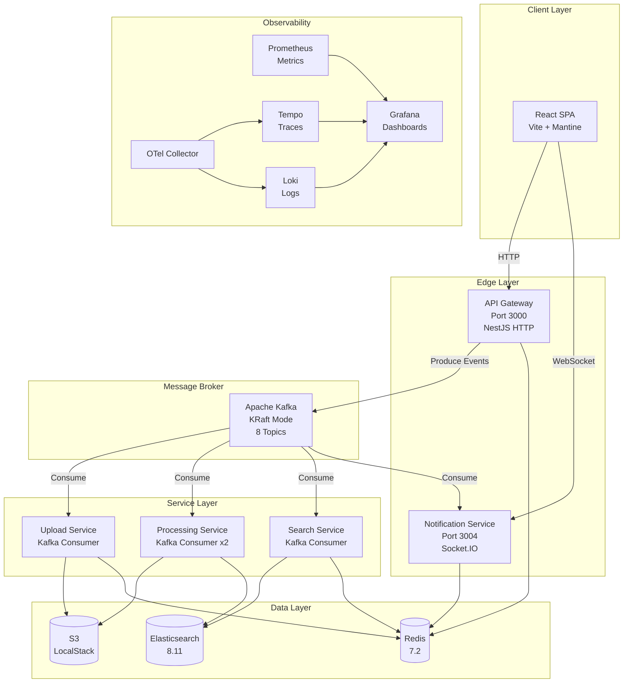
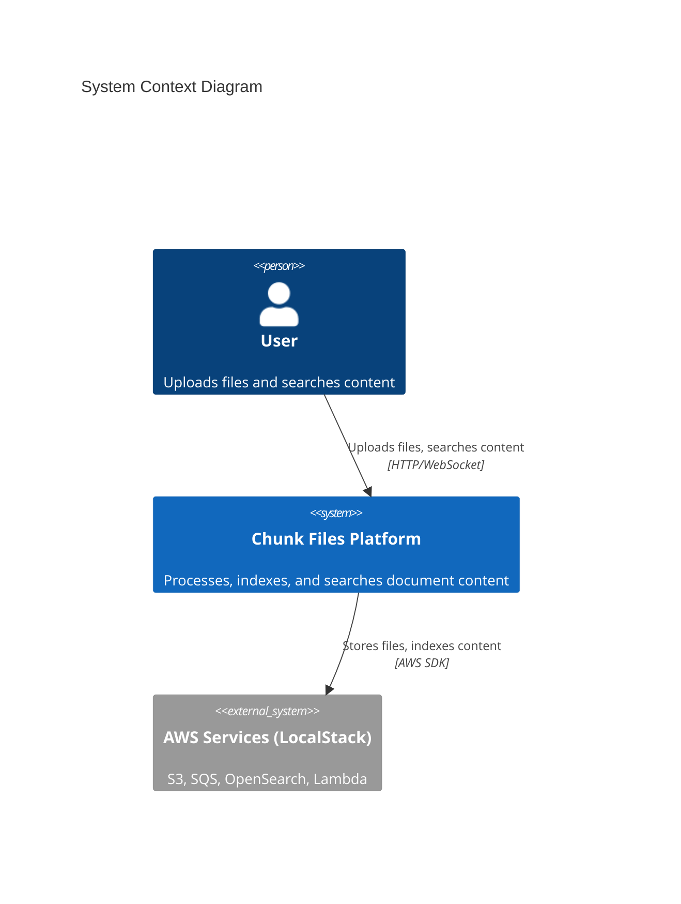
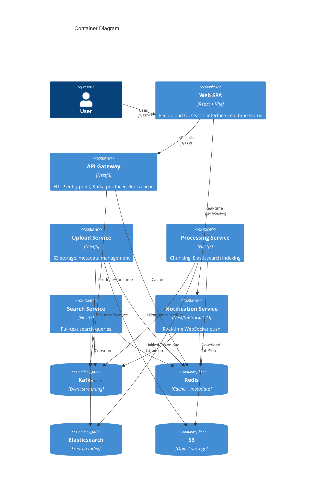
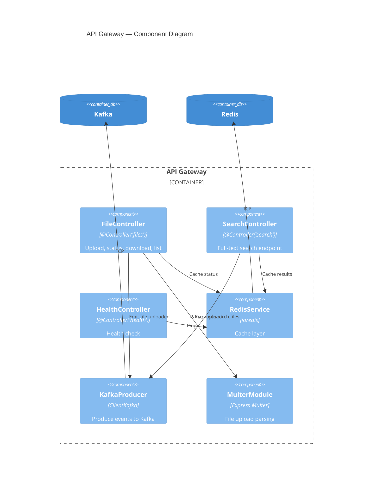

# 🏛️ System Design Overview — From Requirements to Architecture

> **How a Senior Architect approaches designing a distributed file processing platform from a blank whiteboard.**

---

## Table of Contents

- [1. Problem Statement](#1-problem-statement)
- [2. Functional Requirements](#2-functional-requirements)
- [3. Non-Functional Requirements](#3-non-functional-requirements)
- [4. Back-of-the-Envelope Estimation](#4-back-of-the-envelope-estimation)
- [5. High-Level Architecture](#5-high-level-architecture)
- [6. C4 Model — Four Levels of Zoom](#6-c4-model--four-levels-of-zoom)
- [7. Technology Selection & Rationale](#7-technology-selection--rationale)
- [8. Architecture Decision Records](#8-architecture-decision-records)
- [9. Trade-Off Analysis](#9-trade-off-analysis)
- [10. Mapping to Code](#10-mapping-to-code)

---

## 1. Problem Statement

**Build a platform that allows users to:**
1. Upload large documents (up to 500MB)
2. Split documents into searchable chunks automatically
3. Perform full-text search across all indexed content
4. Receive real-time status updates during processing
5. Scale horizontally to handle concurrent uploads and searches

**The twist:** This isn't a simple CRUD app. It involves:
- Large binary file handling (streaming, buffering)
- Long-running background processing (chunking, indexing)
- Real-time notifications (WebSocket)
- Full-text search with relevance scoring
- Multiple storage backends (S3, Elasticsearch, Redis)

---

## 2. Functional Requirements

### Core Features

| ID | Feature | Description |
|----|---------|-------------|
| FR-1 | File Upload | Upload files via REST API with multipart/form-data |
| FR-2 | S3 Storage | Store original files in object storage |
| FR-3 | Chunk Processing | Split files into configurable-size chunks with overlap |
| FR-4 | Full-Text Indexing | Index all chunks into Elasticsearch for search |
| FR-5 | Search API | Query indexed chunks via text, fileId, fileName |
| FR-6 | Status Tracking | Track file processing status (uploaded → processing → completed/failed) |
| FR-7 | Real-Time Updates | Push processing progress to connected clients via WebSocket |
| FR-8 | File Listing | List all uploaded files with their current status |

### API Contract

```yaml
# Upload
POST /files/upload
  Body: multipart/form-data { file }
  Response: { fileId, fileName, fileSize, s3Key, status, uploadedAt }

# Search
GET /search?text=&fileId=&fileName=&page=&size=
  Response: { total, took, page, results: [{ fileId, chunkIndex, content, score }] }

# Status
GET /files/:fileId/status
  Response: { fileId, fileName, status, uploadedAt }

# List
GET /files
  Response: { files: [{ fileId, fileName, status, size, uploadedAt }] }

# Health
GET /health
  Response: { status, redis, kafka, uptime }

# WebSocket
WS /notifications
  Client → subscribe:file { fileId }
  Server → file:progress { fileId, percentage }
  Server → file:completed { fileId, totalChunks }
  Server → file:failed { fileId, error }
```

---

## 3. Non-Functional Requirements

### Performance

| Metric | Target | Rationale |
|--------|--------|-----------|
| Upload Latency (API response) | < 2s for 100MB file | User experience — acknowledge receipt quickly |
| Processing Throughput | > 50MB/min per worker | Background task — acceptable for async flow |
| Search Latency (P99) | < 500ms | User-facing — real-time search experience |
| WebSocket Latency | < 100ms | Real-time — progress updates must feel instant |

### Scalability

| Dimension | Strategy |
|-----------|----------|
| Upload Volume | Kafka partitioning (3 partitions per topic) — scale consumers horizontally |
| Processing Workers | Stateless consumers, scale replicas (default: 2) |
| Search Load | Elasticsearch sharding + Redis cache layer |
| Concurrent Connections | WebSocket via Socket.IO with Redis Pub/Sub adapter for multi-instance |

### Reliability

| Requirement | Implementation |
|-------------|---------------|
| Message Delivery | Kafka guaranteed delivery with consumer group offsets |
| Processing Failures | Dead Letter Queue (`file.processing.dlq`) with retry metadata |
| Data Durability | S3 for originals, Elasticsearch for indexed chunks, Redis AOF for metadata |
| Health Monitoring | Health endpoint per service, Kafka heartbeat, Redis ping |

### Security

| Layer | Mechanism |
|-------|-----------|
| File Validation | Max file size (500MB), MIME type filtering |
| API Gateway | Single entry point — internal services not exposed |
| Network | Docker bridge network — services communicate internally |
| Secrets | Environment variables, never committed (`.env` in `.gitignore`) |

---

## 4. Back-of-the-Envelope Estimation

### Assumptions

```
Daily active users:        1,000
Uploads per user per day:  2
Average file size:         10 MB
Chunk size:                5 MB (with 100 byte overlap)
```

### Storage Calculations

```
Daily uploads:     1,000 × 2 = 2,000 files
Daily storage:     2,000 × 10 MB = 20 GB (S3)
Daily chunks:      2,000 × (10 MB / 5 MB) = 4,000 chunks (Elasticsearch)

Monthly storage:   20 GB × 30 = 600 GB (S3)
Monthly chunks:    4,000 × 30 = 120,000 documents (Elasticsearch)

Yearly:            7.2 TB S3 | 1.44M Elasticsearch documents
```

### Throughput Calculations

```
Peak upload rate:  20 files/minute (10x average)
Peak processing:   20 × 2 chunks = 40 chunks/minute
Peak indexing:     40 Elasticsearch bulk inserts/minute

Kafka throughput needed: ~20 messages/minute per topic (very manageable)
Elasticsearch indexing:  ~40 docs/minute (well within single-node capacity)
```

### Key Insight

> At this scale, a **single Kafka broker**, **one Elasticsearch node**, and **two processing workers** handle the load comfortably. The architecture is designed for **10-100x growth** before needing additional infrastructure.

---

## 5. High-Level Architecture

### Architecture Style: Event-Driven Microservices



### Why Event-Driven?

| Pattern | Alternative | Why We Chose Event-Driven |
|---------|-------------|--------------------------|
| Async Processing | Synchronous API calls | Files are large → processing takes minutes, not milliseconds |
| Loose Coupling | Direct HTTP calls between services | Services can evolve independently, no cascading failures |
| Scalability | Shared database | Each service scales independently based on its workload |
| Resilience | RPC chains | If processing-service is down, messages queue in Kafka (no data loss) |

---

## 6. C4 Model — Four Levels of Zoom

### Level 1: System Context



### Level 2: Container Diagram



### Level 3: Component Diagram (API Gateway)



---

## 7. Technology Selection & Rationale

### Message Broker: Apache Kafka

| Criteria | Kafka | RabbitMQ | AWS SQS |
|----------|-------|----------|---------|
| Throughput | ✅ Millions/sec | ⚠️ Thousands/sec | ⚠️ Thousands/sec |
| Message Replay | ✅ Log-based retention | ❌ Consumed = gone | ❌ Consumed = gone |
| Ordering | ✅ Per-partition | ⚠️ Per-queue | ⚠️ FIFO queues only |
| Consumer Groups | ✅ Built-in | ⚠️ Manual | ❌ No |
| Operational Complexity | ⚠️ High | ✅ Low | ✅ Managed |

**Decision:** Kafka — we need message replay for debugging, strict ordering per file, and consumer group scaling.

### Search Engine: Elasticsearch

| Criteria | Elasticsearch | OpenSearch | PostgreSQL FTS |
|----------|--------------|------------|---------------|
| Full-Text Quality | ✅ BM25 + custom analyzers | ✅ Same engine | ⚠️ Basic tsvector |
| Scalability | ✅ Shard-based | ✅ Same | ⚠️ Single-node |
| Highlight Support | ✅ Built-in | ✅ Built-in | ❌ Manual |
| Aggregations | ✅ Rich | ✅ Rich | ⚠️ Limited |
| Learning + Ecosystem | ✅ Massive | ⚠️ Smaller | ✅ Already know SQL |

**Decision:** Elasticsearch — superior full-text search, highlight support, and production-proven at scale.

### Cache & Metadata: Redis

| Use Case | Why Redis? |
|----------|-----------|
| File metadata store | Sub-millisecond reads, TTL-based expiry, Hash data type perfect for entities |
| Search result cache | MD5-keyed cache with configurable TTL (600s) |
| Pub/Sub for notifications | Native pub/sub support, no additional infrastructure |
| Session/rate-limit (future) | Redis is the de facto standard |

**Decision:** Redis — one technology, four use cases. Reduces operational complexity.

### Framework: NestJS

| Criteria | NestJS | Express.js | Fastify |
|----------|--------|------------|---------|
| Microservice Support | ✅ Built-in Kafka, Redis, gRPC transports | ❌ Manual | ❌ Manual |
| Dependency Injection | ✅ Angular-style IoC | ❌ No | ❌ No |
| TypeScript-First | ✅ Decorators, interfaces | ⚠️ Optional | ⚠️ Optional |
| Module System | ✅ Encapsulated modules | ❌ No | ❌ No |
| Swagger/OpenAPI | ✅ @nestjs/swagger decorators | ⚠️ Manual | ⚠️ Manual |

**Decision:** NestJS — microservice transport abstraction + DI container + decorator-based architecture.

---

## 8. Architecture Decision Records

### ADR-001: Event-Driven over Synchronous Communication

**Status:** Accepted  
**Context:** Services need to communicate about file lifecycle events.  
**Decision:** Use Kafka as the central event bus. All inter-service communication is asynchronous.  
**Consequences:**
- (+) Services are decoupled — can evolve independently
- (+) Natural resilience — if a consumer is down, messages queue
- (+) Processing can scale independently from the API
- (-) Eventual consistency — status updates are not immediate
- (-) More complex debugging — need correlation IDs

### ADR-002: API Gateway as Single Entry Point

**Status:** Accepted  
**Context:** Multiple services need to be accessible from the frontend.  
**Decision:** Only API Gateway (port 3000) and Notification Service (port 3004) are exposed externally.  
**Consequences:**
- (+) Single point for authentication, rate limiting, CORS
- (+) Frontend has one base URL to call
- (+) Internal services don't need HTTP security
- (-) API Gateway is a potential bottleneck
- (-) Additional hop for every request

### ADR-003: Redis as Multi-Purpose Data Store

**Status:** Accepted  
**Context:** Need caching, metadata storage, and real-time pub/sub.  
**Decision:** Use Redis for all three. File metadata stored as Redis Hashes with TTL.  
**Consequences:**
- (+) Single infrastructure component for three use cases
- (+) Sub-millisecond reads for status checks
- (-) Data loss on Redis restart (mitigated by AOF persistence)
- (-) Memory-bound — need monitoring for large datasets

### ADR-004: Kafka KRaft Mode (No Zookeeper)

**Status:** Accepted  
**Context:** Kafka requires coordination for broker metadata.  
**Decision:** Use KRaft mode (Kafka 3.x+) instead of Zookeeper.  
**Consequences:**
- (+) Fewer containers to manage
- (+) Faster startup and recovery
- (+) Simplified deployment
- (-) KRaft is relatively newer — less battle-tested in extreme settings

### ADR-005: Base64 Encoding for File Transfer via Kafka

**Status:** Accepted  
**Context:** Need to transfer file content from API Gateway to Upload Service.  
**Decision:** Encode file buffer as base64 and include in Kafka message value.  
**Consequences:**
- (+) Simple implementation — no shared filesystem needed
- (+) Works with Kafka's message format natively
- (-) ~33% size overhead from base64 encoding
- (-) Large file messages (max `message.max.bytes` must be configured)
- **Future:** For files > 100MB, consider uploading directly to S3 and sending only the S3 key via Kafka

---

## 9. Trade-Off Analysis

### CAP Theorem Position

```
        Consistency
           /\
          /  \
         /    \
        / Our  \
       / System \
      /    ↓     \
     /  AP + EC   \
    /______________\
Availability    Partition
                Tolerance
```

**Our system is AP + Eventually Consistent:**
- Availability: API Gateway always accepts uploads (writes to Kafka, not to a database)
- Partition Tolerance: Kafka handles network partitions natively
- Consistency: File status is eventually consistent — there's a brief window where status in Redis and actual processing state diverge

### Latency vs. Throughput

| Operation | Approach | Trade-off |
|-----------|----------|-----------|
| Upload | Async (accept → queue) | Low latency, high throughput, eventual consistency |
| Search | Sync (request/response via Kafka) | Higher latency (~100-500ms), but real-time results |
| Status | Cache-first (Redis → Kafka fallback) | Low latency for cached, higher for cache miss |

### Simplicity vs. Scalability

| Choice | Simple Approach | Our Approach | Why |
|--------|----------------|--------------|-----|
| Service Comm | HTTP calls | Kafka events | Decoupling > simplicity at this scale |
| File Metadata | PostgreSQL | Redis Hashes | Speed > query flexibility |
| Search | SQL LIKE | Elasticsearch | Quality + relevance > operational simplicity |
| Notifications | Polling | WebSocket + Kafka | UX > server simplicity |

---

## 10. Mapping to Code

### Service → Code Location

| Service | Main Entry | Module | Controllers |
|---------|-----------|--------|-------------|
| API Gateway | `apps/api-gateway/src/main.ts` | `app.module.ts` | `FileController`, `SearchController`, `HealthController` |
| Upload Service | `apps/upload-service/src/main.ts` | `app.module.ts` | `UploadController` |
| Processing Service | `apps/processing-service/src/main.ts` | `app.module.ts` | `ProcessingController` |
| Search Service | `apps/search-service/src/main.ts` | `app.module.ts` | `SearchController` |
| Notification Service | `apps/notification-service/src/main.ts` | `app.module.ts` | `NotificationController`, `NotificationGateway` |

### Shared Library → Code Location

| Module | Path | Exports |
|--------|------|---------|
| Kafka Topics & Groups | `libs/shared/src/kafka/topics.ts` | `KAFKA_TOPICS`, `CONSUMER_GROUPS`, `KAFKA_CLIENT_IDS` |
| Event Interfaces | `libs/shared/src/kafka/events.ts` | `FileUploadedEvent`, `FileProcessingStartedEvent`, etc. |
| Redis Constants | `libs/shared/src/redis/constants.ts` | `REDIS_PREFIXES`, `REDIS_TTL`, `REDIS_CHANNELS` |
| Service Constants | `libs/shared/src/constants/services.ts` | `MICROSERVICE_CLIENTS`, `MESSAGE_PATTERNS` |
| Domain Entities | `libs/shared/src/entities/` | `FileUpload`, `FileStatus`, `FileChunk` |

### Infrastructure → Configuration

| Component | Config File | Key Settings |
|-----------|------------|-------------|
| All Services | `docker-compose.yml` | Ports, env vars, dependencies, networks |
| Kafka Topics | `docker-compose.yml` (kafka-init) | 8 topics pre-created (mostly 3 partitions, DLQ has 1) |
| Elasticsearch | `docker-compose.yml` | Single-node, security disabled, 512MB heap |
| Redis | `docker-compose.yml` | 256MB max, LRU eviction, AOF persistence |
| Observability | `infra/observability/` | OTel Collector, Tempo, Loki, Prometheus, Grafana |

---

> **Next:** [Service Decomposition →](./SERVICE-DECOMPOSITION.md) — Learn how we split the monolith into bounded contexts.
