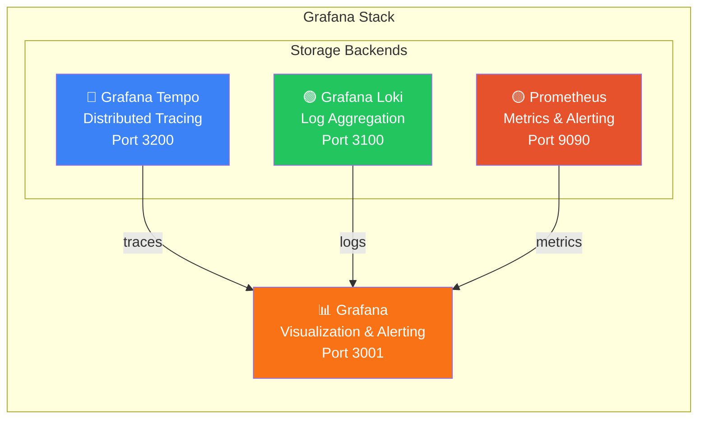
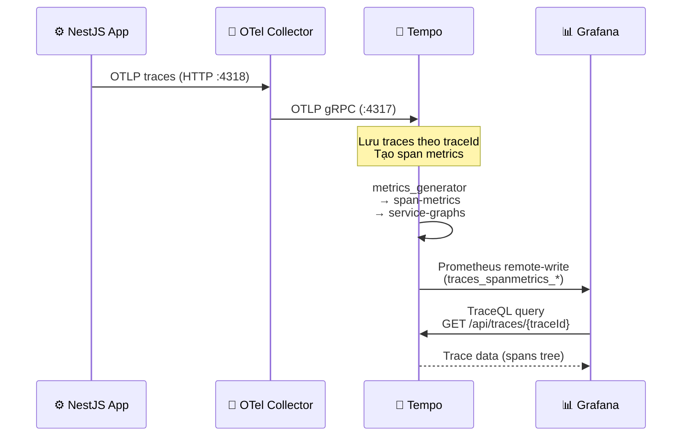
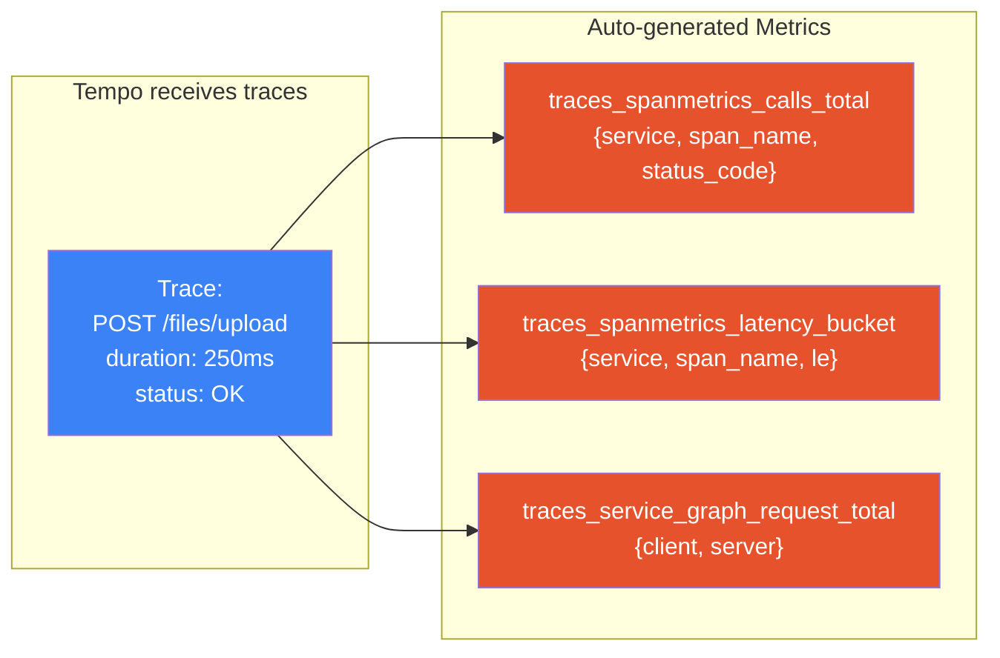
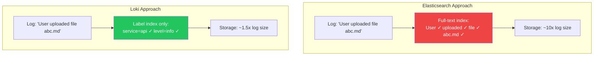
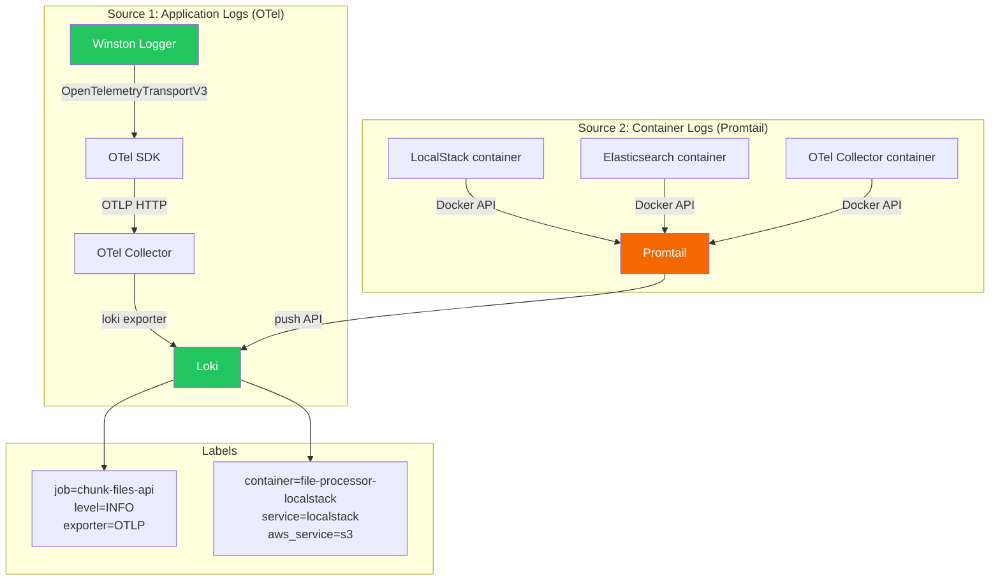
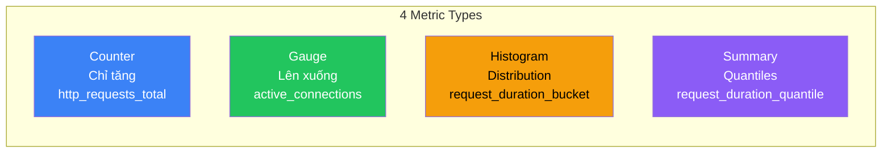
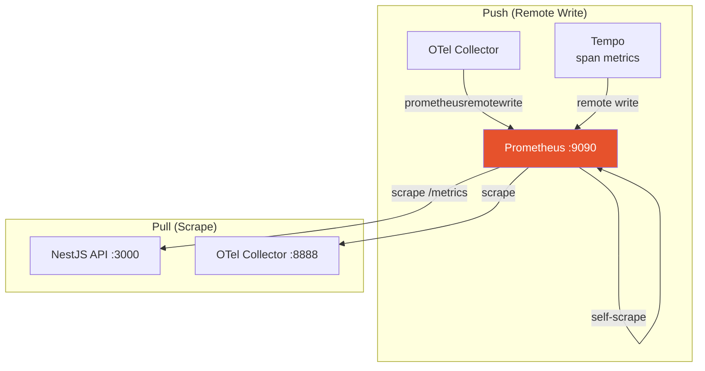
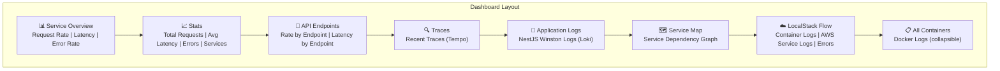
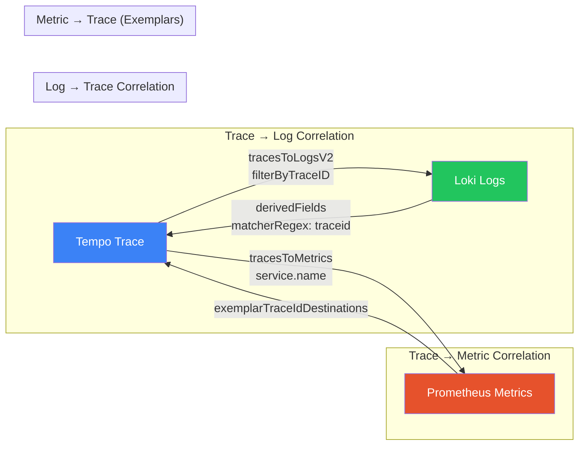
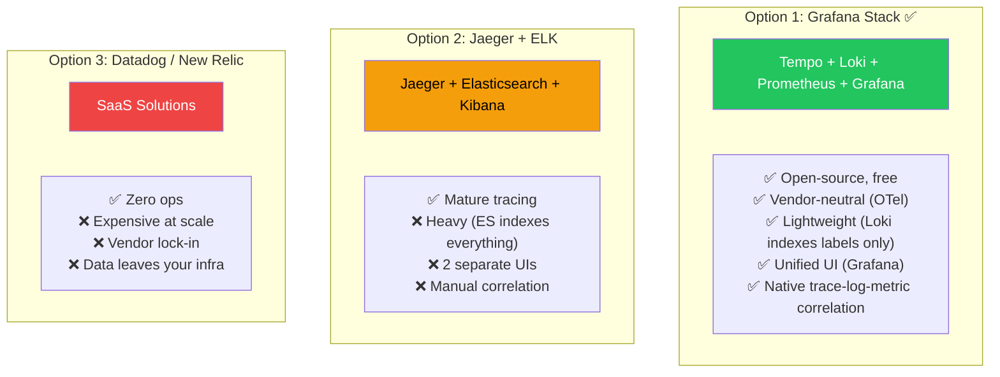

# 📊 Grafana Stack

## Tổng Quan

**Grafana Stack** gồm 4 thành phần chính, mỗi thành phần chịu trách nhiệm một loại telemetry signal:



## 1. Grafana Tempo — Distributed Tracing

### Tempo là gì?

**Tempo** là hệ thống lưu trữ distributed traces, được thiết kế bởi Grafana Labs. Khác với Jaeger hoặc Zipkin, Tempo **chỉ cần object storage** (không cần database riêng) → dễ vận hành và scale.

### Cách hoạt động



### Span Metrics Generator

Tempo tự động tạo **metrics từ traces** — không cần instrument thêm:



| Metric | Mô tả | Sử dụng |
|--------|--------|---------|
| `traces_spanmetrics_calls_total` | Tổng số spans theo service, endpoint, status | Request rate, error rate |
| `traces_spanmetrics_latency_bucket` | Histogram latency theo spans | p50, p95, p99 latency |
| `traces_service_graph_request_total` | Số calls giữa các services | Service map |

### TraceQL — Query Language

TraceQL cho phép tìm traces theo điều kiện:

```
# Tìm traces có lỗi
{ status = error }

# Tìm traces từ service cụ thể
{ resource.service.name = "chunk-files-api" }

# Tìm traces chậm hơn 500ms
{ duration > 500ms }

# Tìm traces có S3 calls
{ span.rpc.service = "S3" }

# Tìm traces liên quan đến upload
{ name =~ ".*upload.*" }
```

### Cấu hình Tempo

```yaml
# tempo-config.yaml - Những phần quan trọng

# Metrics generator - tạo metrics từ traces
metrics_generator:
  registry:
    external_labels:
      source: tempo
      cluster: docker-compose
  storage:
    path: /tmp/tempo/generator/wal
    remote_write:
      - url: http://prometheus:9090/api/v1/write
        send_exemplars: true
  processor:
    service_graphs:        # Service dependency map
    span_metrics:          # RED metrics per span
```

---

## 2. Grafana Loki — Log Aggregation

### Loki là gì?

**Loki** là hệ thống log aggregation — khác Elasticsearch, Loki **chỉ index labels** (metadata) chứ không index nội dung log → tiết kiệm storage gấp nhiều lần.

### So sánh Loki vs Elasticsearch



### LogQL — Query Language

```
# Lấy tất cả logs từ API service
{job="chunk-files-api"}

# Filter theo log level
{job="chunk-files-api", level="ERROR"}

# Full-text search trong log content 
{job="chunk-files-api"} |= "SearchFiles"

# Regex search
{job="chunk-files-api"} |~ "(?i)upload|download"

# JSON parsing
{job="chunk-files-api"} | json | trace_id != ""

# Aggregation - đếm errors/phút
count_over_time({job="chunk-files-api", level="ERROR"}[1m])

# LocalStack logs
{container="file-processor-localstack"}

# LocalStack theo AWS service
{container="file-processor-localstack", aws_service="s3"}

# Tìm LocalStack errors
{container="file-processor-localstack"} |~ "(?i)error|exception"
```

### 2 Nguồn Log trong Loki



---

## 3. Prometheus — Metrics Collection

### Prometheus là gì?

**Prometheus** là hệ thống monitoring và alerting, sử dụng mô hình **pull-based** (Prometheus chủ động scrape metrics) kết hợp **push** (nhận remote write từ OTel Collector và Tempo).

### Metrics Types



| Type | Mô tả | Ví dụ trong Chunk Files |
|------|--------|------------------------|
| **Counter** | Giá trị chỉ tăng, dùng cho tổng số | `traces_spanmetrics_calls_total` |
| **Gauge** | Giá trị lên/xuống, dùng cho trạng thái hiện tại | `http_active_requests` |
| **Histogram** | Phân phối giá trị (buckets), dùng cho latency | `traces_spanmetrics_latency_bucket` |
| **Summary** | Tương tự histogram nhưng tính quantile phía client | `file_upload_size_bytes` |

### Nguồn Metrics



### PromQL — Query Language

```sql
# Request rate (requests per second)
sum(rate(traces_spanmetrics_calls_total[5m])) by (service)

# p95 Latency 
histogram_quantile(0.95, 
  sum(rate(traces_spanmetrics_latency_bucket[5m])) by (le, service)
)

# Error rate
sum(rate(traces_spanmetrics_calls_total{status_code="STATUS_CODE_ERROR"}[5m]))
  / sum(rate(traces_spanmetrics_calls_total[5m]))

# Request rate per endpoint
sum(rate(traces_spanmetrics_calls_total{service="chunk-files-api"}[5m])) 
  by (span_name)
```

---

## 4. Grafana — Visualization

### Dashboard Structure

Dashboard **Chunk Files - Full Stack Observability** gồm các sections:



### Datasource Cross-Linking



| Correlation | Từ | Đến | Cách hoạt động |
|------------|-----|-----|----------------|
| Trace → Log | Tempo | Loki | Click trace → filter logs by `trace_id` |
| Trace → Metric | Tempo | Prometheus | Link span metrics by `service.name` |
| Log → Trace | Loki | Tempo | Regex extract `traceid` → link to Tempo |
| Metric → Trace | Prometheus | Tempo | Exemplar `traceID` → open in Tempo |

### Provisioning (Auto-config)

Grafana được cấu hình hoàn toàn tự động qua provisioning files — khi container khởi động, datasources và dashboards được tạo ngay:

```
grafana/provisioning/
├── datasources/
│   └── datasources.yaml    ← 3 datasources (Prometheus, Tempo, Loki)
└── dashboards/
    └── chunk-files-overview.json  ← Pre-built dashboard
```

---

## So Sánh Với Các Alternatives

### Tại sao chọn Grafana Stack?


