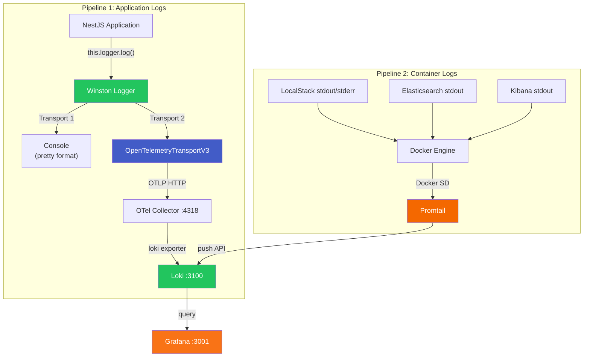
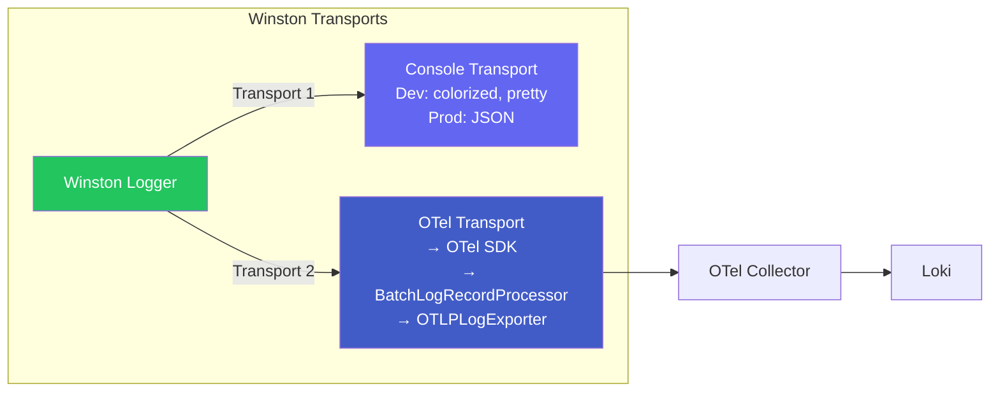
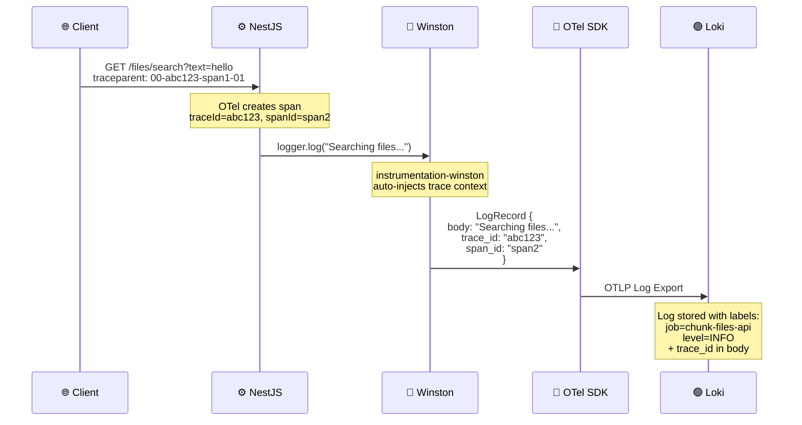
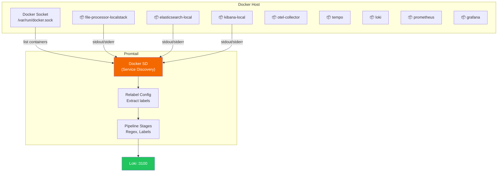
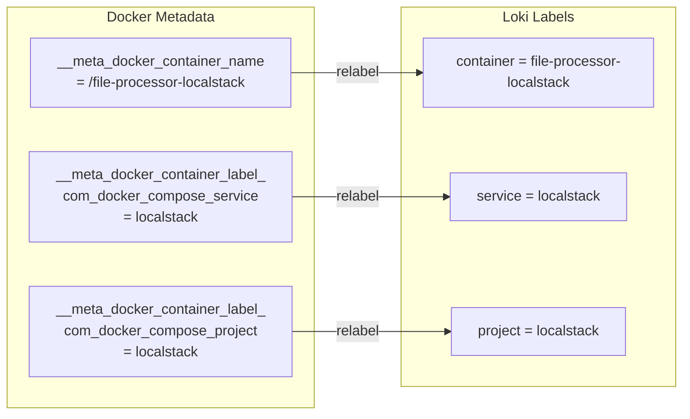
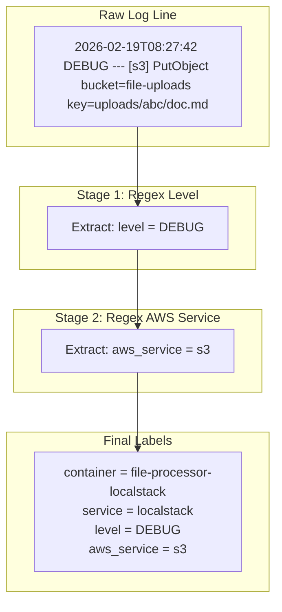
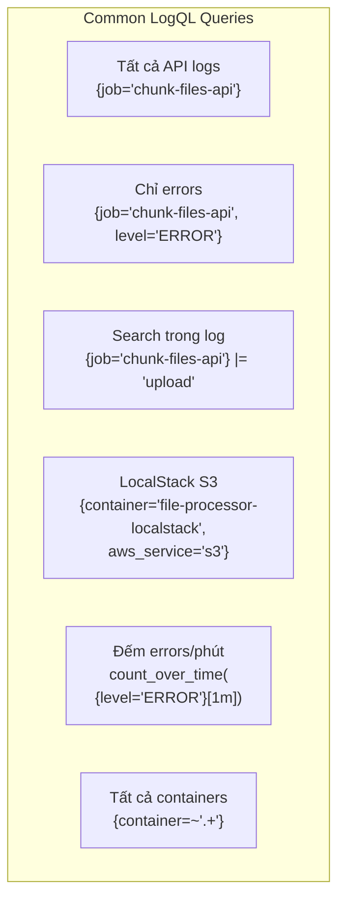
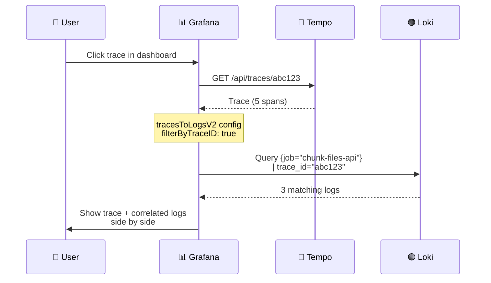

# 📝 Logging Pipeline

## Tổng Quan

Hệ thống logging sử dụng **2 pipelines song song** để thu thập logs từ cả application code (NestJS) lẫn Docker containers (LocalStack, Elasticsearch...).



## Pipeline 1: Winston → OTel → Loki

### Tại sao cần Winston?

NestJS default Logger sử dụng `console.log()` — output **chỉ ra terminal**, không được gửi đến Loki. Winston cung cấp:

1. **Multiple transports** — gửi log đến nhiều đích cùng lúc
2. **Structured logging** — JSON format cho production
3. **OTel integration** — tự động gắn `trace_id`, `span_id` vào mọi log
4. **Log levels** — filter theo severity



### Winston Configuration

```typescript
// apps/file-processor/src/infrastructure/logger/winston.config.ts

import * as winston from 'winston';
import { OpenTelemetryTransportV3 } from '@opentelemetry/winston-transport';
import { WinstonModule } from 'nest-winston';

export function createWinstonLogger() {
  return winston.createLogger({
    level: process.env.LOG_LEVEL || 'info',
    defaultMeta: { service: 'chunk-files-api' },
    transports: [
      // Console — pretty cho dev, JSON cho prod
      new winston.transports.Console({ ... }),
      
      // OTel — gửi logs đến OTel Collector → Loki
      new OpenTelemetryTransportV3({ level: 'info' }),
    ],
  });
}
```

### Trace-Log Correlation

Mỗi log record được **tự động gắn** `trace_id` và `span_id` nhờ `@opentelemetry/instrumentation-winston`:



### Log Format

**Development** (Console):
```
14:04:52.594 info [NestFactory] Starting Nest application... traceId=abc123
14:04:53.324 info [NestApplication] Nest application successfully started
14:04:55.102 info [SearchFilesUseCase] Searching files with query: {"text":"hello"}
```

**In Loki** (JSON):
```json
{
  "body": "Searching files with query: {\"text\":\"hello\"}",
  "traceid": "abc123def456789",
  "spanid": "span12345678",
  "severity": "info",
  "attributes": {
    "context": "SearchFilesUseCase",
    "service": "chunk-files-api",
    "trace_id": "abc123def456789",
    "span_id": "span12345678"
  },
  "resources": {
    "service.name": "chunk-files-api",
    "service.version": "1.0.0",
    "deployment.environment": "development"
  }
}
```

---

## Pipeline 2: Promtail → Loki

### Promtail là gì?

**Promtail** là agent thu thập logs, được thiết kế cho Loki. Nó sử dụng **Docker Service Discovery** để tự động phát hiện tất cả Docker containers đang chạy và scrape logs của chúng.



### Relabel Config — Auto-labeling

Promtail tự động gắn labels từ Docker metadata:



### Pipeline Stages — Log Parsing



### Promtail Configuration

```yaml
# promtail-config.yaml

scrape_configs:
  - job_name: docker
    docker_sd_configs:
      - host: unix:///var/run/docker.sock
        refresh_interval: 5s

    relabel_configs:
      # Container name → label
      - source_labels: ['__meta_docker_container_name']
        regex: '/(.*)'
        target_label: container
      
      # Compose service → label
      - source_labels: ['__meta_docker_container_label_com_docker_compose_service']
        target_label: service

    pipeline_stages:
      # Extract log level
      - regex:
          expression: '(?i)(?P<level>DEBUG|INFO|WARN|ERROR|CRITICAL)'
      - labels:
          level:
      
      # Extract AWS service name from LocalStack
      - regex:
          expression: '\[(?P<aws_service>s3|sqs|lambda|opensearch|kms)\]'
      - labels:
          aws_service:
```

---

## Xem Logs Trong Grafana

### Dashboard Panels

| Panel | LogQL Query | Hiển thị |
|-------|------------|----------|
| **Application Logs** | `{job="chunk-files-api"}` | NestJS Winston logs |
| **LocalStack Logs** | `{container="file-processor-localstack"}` | Toàn bộ LocalStack output |
| **AWS Service Logs** | `{container="file-processor-localstack"} \|~ "s3\|sqs\|lambda"` | Filter theo AWS service |
| **Error Logs** | `{container="file-processor-localstack"} \|~ "error\|exception"` | Chỉ errors |

### Explore Mode — Useful Queries



### Trace → Log Navigation

Khi click vào một trace trong Tempo, Grafana tự động:

1. Lấy `traceId` từ trace
2. Query Loki: `{job="chunk-files-api"} |= "<traceId>"`
3. Hiển thị logs liên quan ngay cạnh trace



---

## Log Levels & Best Practices

### Log Level Guide

| Level | Khi nào dùng | Ví dụ |
|-------|------------|-------|
| `error` | Lỗi cần xử lý ngay | Database connection failed |
| `warn` | Vấn đề tiềm ẩn | Retry attempt 3/5 |
| `info` | Business events | File uploaded, Search completed |
| `debug` | Chi tiết kỹ thuật | Query params, S3 key constructed |
| `verbose` | Rất chi tiết | Full request/response body |

### Structured Logging Pattern

```typescript
// ✅ Good — structured, searchable
this.logger.log('File uploaded successfully', {
  fileId: file.id,
  fileName: file.name,
  sizeBytes: file.size,
  duration: elapsed,
});

// ❌ Bad — unstructured, hard to search
this.logger.log(`File ${file.name} uploaded in ${elapsed}ms`);
```
