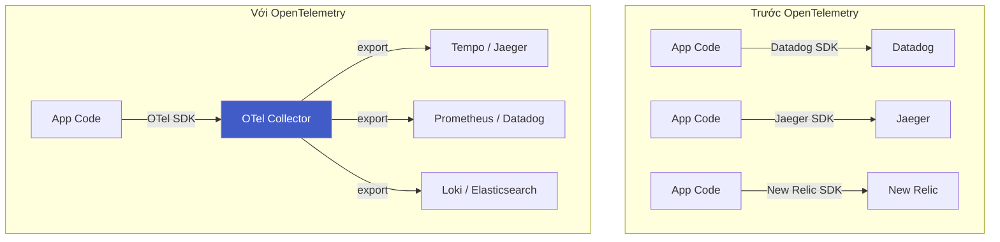
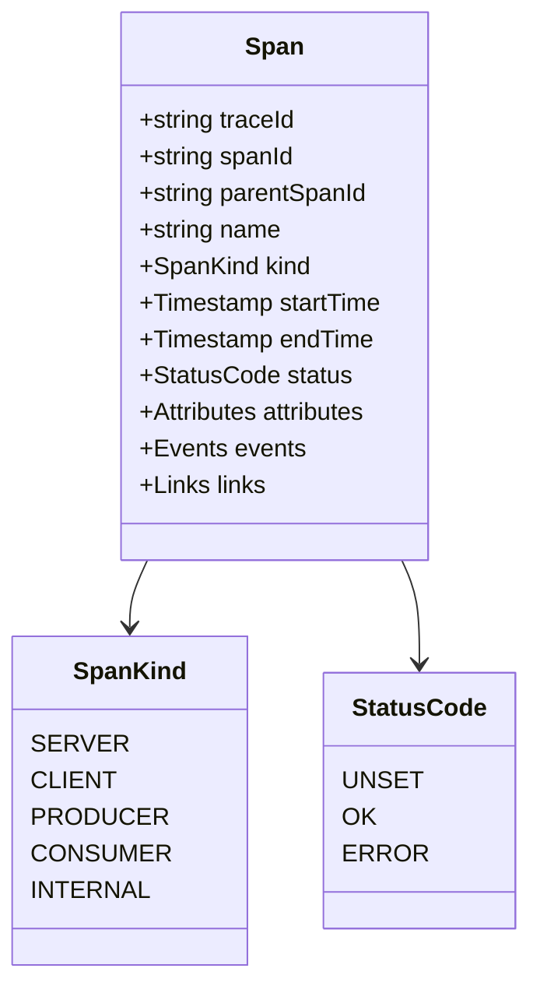
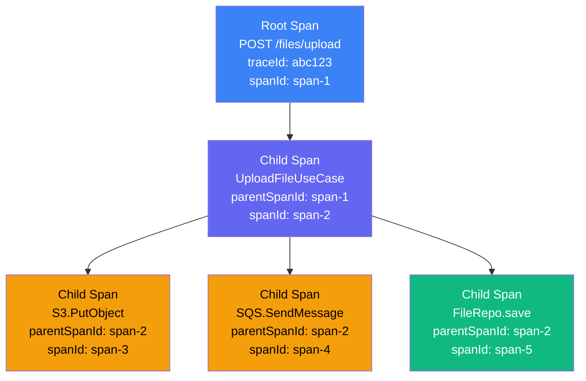
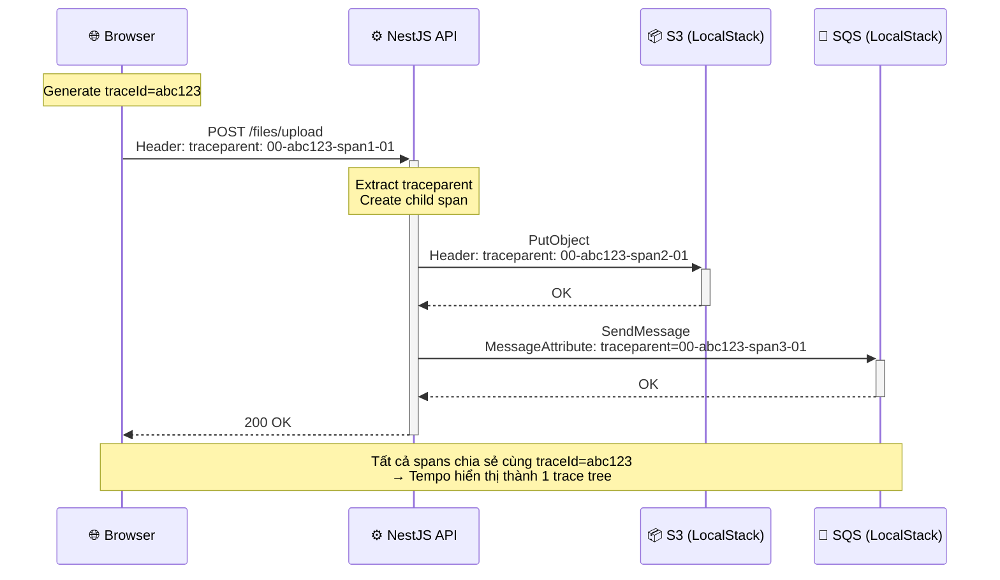
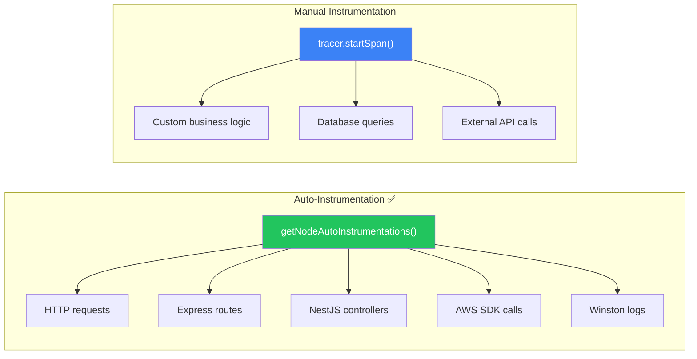
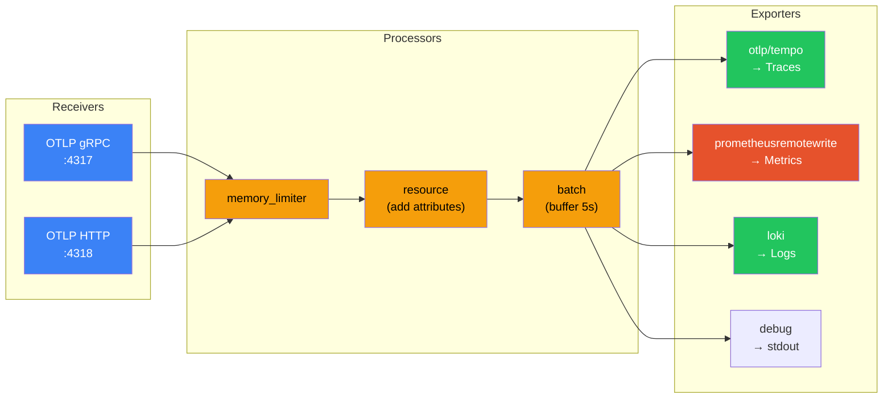
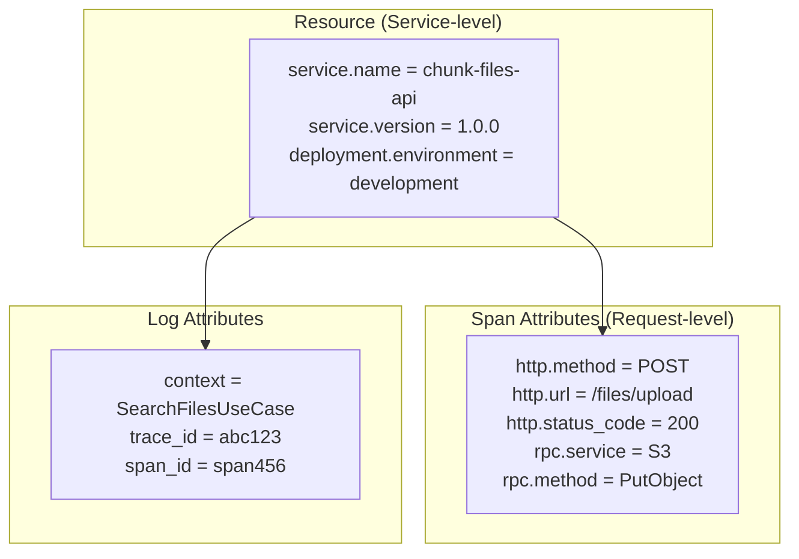
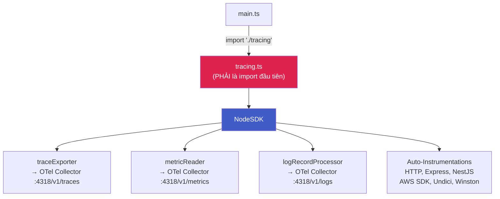
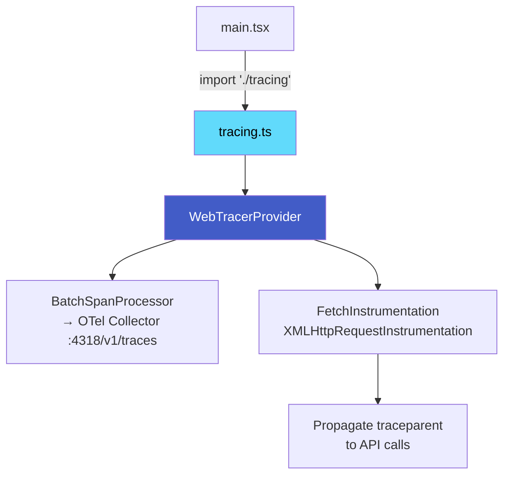

# 🔭 OpenTelemetry Concepts

## OpenTelemetry là gì?

**OpenTelemetry (OTel)** là một framework observability **open-source**, **vendor-neutral** — cung cấp API, SDK, và tools để thu thập telemetry data (traces, metrics, logs) từ ứng dụng.

::: info Tại sao OTel?
Trước OTel, mỗi vendor (Datadog, New Relic, Jaeger...) có SDK riêng → **vendor lock-in**. OTel chuẩn hóa cách thu thập data, cho phép chuyển backend bất kỳ lúc nào mà không đổi code.
:::



## Core Concepts

### 1. Traces & Spans

**Trace** đại diện cho toàn bộ lifecycle của một request khi nó đi qua nhiều services. Mỗi trace bao gồm nhiều **Spans**.

**Span** là một đơn vị công việc (unit of work) — có tên, thời gian bắt đầu/kết thúc, attributes, và status.

```mermaid
gantt
    title Trace: File Upload Request
    dateFormat X
    axisFormat %L ms
    
    section HTTP Handler
    POST /files/upload           :a1, 0, 350
    
    section Application Layer
    UploadFileUseCase.execute    :a2, 10, 330
    
    section S3
    S3.PutObject                 :a3, 20, 120
    
    section SQS
    SQS.SendMessage              :a4, 130, 50
    
    section Repository
    FileRepo.save                :a5, 190, 20
```



#### Span Anatomy



#### Span Relationships



### 2. Context Propagation

**Context Propagation** là cơ chế truyền `trace_id` và `span_id` giữa các services, để tất cả spans thuộc cùng một request được liên kết lại thành một trace hoàn chỉnh.



#### W3C Trace Context Format

```
traceparent: 00-{trace-id}-{span-id}-{trace-flags}
             ├── version (00)
             ├── trace-id (32 hex chars)
             ├── parent-span-id (16 hex chars)
             └── trace-flags (01 = sampled)

Ví dụ: traceparent: 00-abc123def456789-span12345678-01
```

### 3. Instrumentation

**Instrumentation** là quá trình thêm code để tạo spans, metrics, và logs.

#### Auto-Instrumentation vs Manual Instrumentation



### Trong Chunk Files, các instrumentations được bật:

| Instrumentation | Chức năng | Ví dụ Span |
|----------------|-----------|------------|
| `instrumentation-http` | Trace HTTP requests | `GET /files/search` |
| `instrumentation-express` | Trace Express middleware/routes | `middleware - cors` |
| `instrumentation-nestjs-core` | Trace NestJS lifecycle | `FileController.search` |
| `instrumentation-aws-sdk` | Trace AWS SDK calls | `S3.PutObject`, `SQS.SendMessage` |
| `instrumentation-undici` | Trace fetch/undici requests | `GET http://localhost:9200/...` |
| `instrumentation-winston` | Inject trace context vào logs | Log với `trace_id` |

### 4. OTel Collector

**OTel Collector** là một proxy/pipeline trung gian nhận telemetry data rồi xử lý và chuyển tiếp đến các backends.



#### Pipeline Configuration

```yaml
# 3 pipelines riêng biệt cho 3 signal types
service:
  pipelines:
    traces:
      receivers: [otlp]
      processors: [memory_limiter, resource, batch]
      exporters: [otlp/tempo]

    metrics:
      receivers: [otlp]
      processors: [memory_limiter, resource, batch]
      exporters: [prometheusremotewrite]

    logs:
      receivers: [otlp]
      processors: [memory_limiter, resource, batch]
      exporters: [loki]
```

### 5. Resources & Attributes

**Resource** mô tả entity tạo ra telemetry (service name, version, environment...).

**Attributes** là key-value pairs gắn vào spans/metrics/logs để thêm context.



## OTel SDK trong Chunk Files

### Backend (NestJS) — `tracing.ts`



### Frontend (React) — `tracing.ts`



## Semantic Conventions

OTel định nghĩa naming conventions chuẩn để attributes nhất quán:

| Convention | Attribute | Example |
|-----------|-----------|---------|
| HTTP | `http.method`, `http.status_code`, `http.url` | `GET`, `200`, `/files/search` |
| RPC | `rpc.service`, `rpc.method` | `S3`, `PutObject` |
| DB | `db.system`, `db.statement` | `elasticsearch`, `search query` |
| Service | `service.name`, `service.version` | `chunk-files-api`, `1.0.0` |
| Deployment | `deployment.environment` | `development`, `production` |

::: warning Thứ tự Import
`tracing.ts` **PHẢI** được import trước tất cả module khác trong `main.ts`. OTel cần monkey-patch các thư viện (http, express, aws-sdk) trước khi chúng được load.
:::
