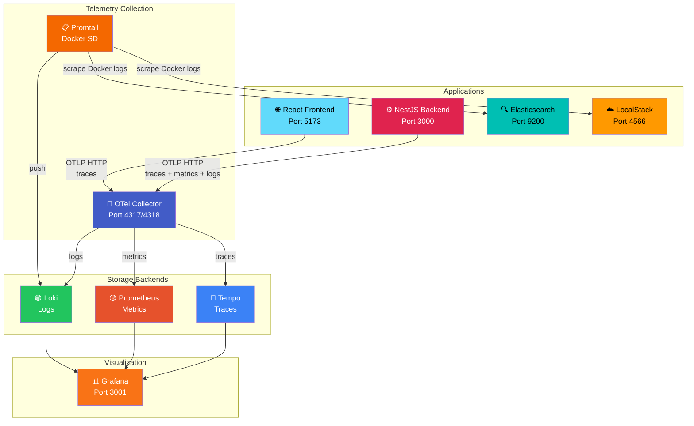
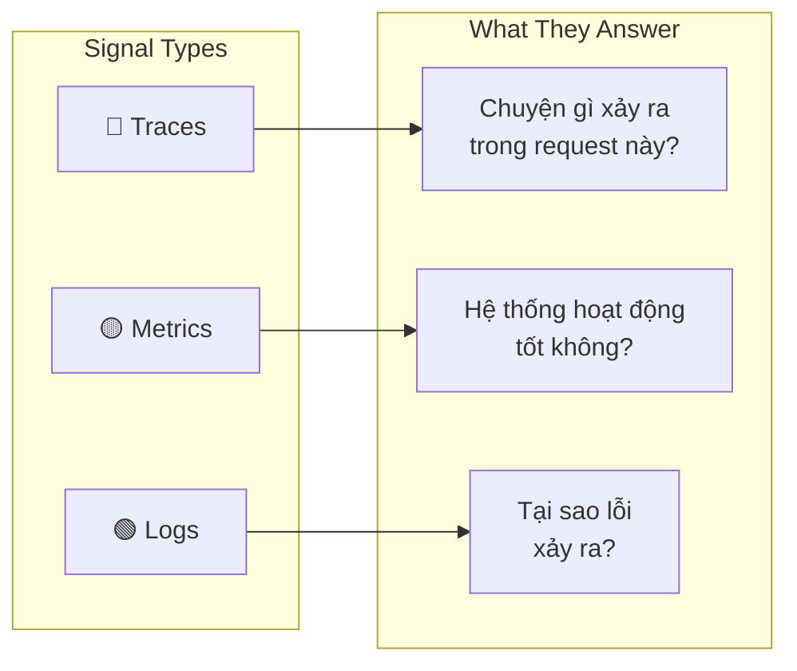
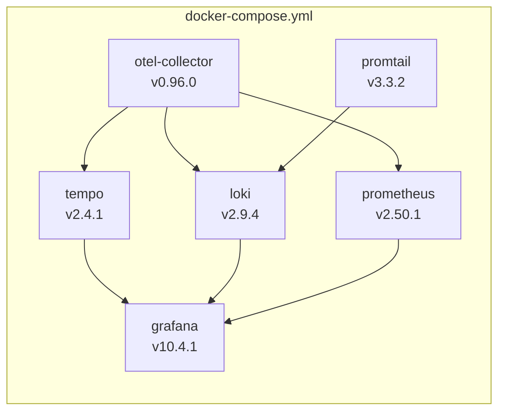

# 📡 Observability Overview

## Tổng Quan

Hệ thống observability của **Chunk Files** được xây dựng trên bộ **Grafana Stack** (Tempo + Loki + Prometheus) kết hợp với **OpenTelemetry** — cung cấp khả năng theo dõi toàn bộ flow từ Frontend → Backend → LocalStack (S3, SQS, Lambda, OpenSearch).

::: tip Ba Trụ Cột Observability
Observability dựa trên 3 tín hiệu chính: **Traces** (luồng xử lý), **Metrics** (số liệu), và **Logs** (nhật ký). Cả 3 được tương quan (correlated) với nhau thông qua `trace_id`.
:::

## Architecture Overview



## Telemetry Signal Flow



## Quick Access

| Service | URL | Credentials |
|---------|-----|-------------|
| **Grafana Dashboard** | [http://localhost:3001/d/chunk-files-observability](http://localhost:3001/d/chunk-files-observability) | admin / admin |
| **Grafana Explore** | [http://localhost:3001/explore](http://localhost:3001/explore) | admin / admin |
| **Prometheus** | [http://localhost:9090](http://localhost:9090) | — |
| **Tempo API** | [http://localhost:3200](http://localhost:3200) | — |
| **Loki API** | [http://localhost:3100](http://localhost:3100) | — |
| **OTel Collector Metrics** | [http://localhost:8888/metrics](http://localhost:8888/metrics) | — |

## Tài Liệu Chi Tiết

| Trang | Nội dung |
|-------|----------|
| [OpenTelemetry Concepts](./OTEL-CONCEPTS) | Traces, Spans, Context Propagation, SDK, Auto-instrumentation |
| [Grafana Stack](./GRAFANA-STACK) | Tempo, Loki, Prometheus, Grafana — cách hoạt động và cấu hình |
| [Logging Pipeline](./LOGGING-PIPELINE) | Winston → OTel → Loki, Promtail → Docker logs, trace correlation |
| [Tracing Workflow](./TRACING-WORKFLOW) | End-to-end trace flow: Upload → S3 → SQS → Lambda → Elasticsearch |

## Docker Services



## File Structure

```
infra/observability/
├── otel-collector/
│   └── otel-collector-config.yaml    # Central pipeline config
├── tempo/
│   └── tempo-config.yaml            # Trace storage config
├── loki/
│   └── loki-config.yaml             # Log storage config
├── prometheus/
│   └── prometheus.yaml              # Metrics scrape config
├── promtail/
│   └── promtail-config.yaml         # Docker log scraper config
└── grafana/
    ├── provisioning/
    │   └── datasources/
    │       └── datasources.yaml      # Auto-provisioned datasources
    └── dashboards/
        └── chunk-files-overview.json # Pre-built dashboard
```
