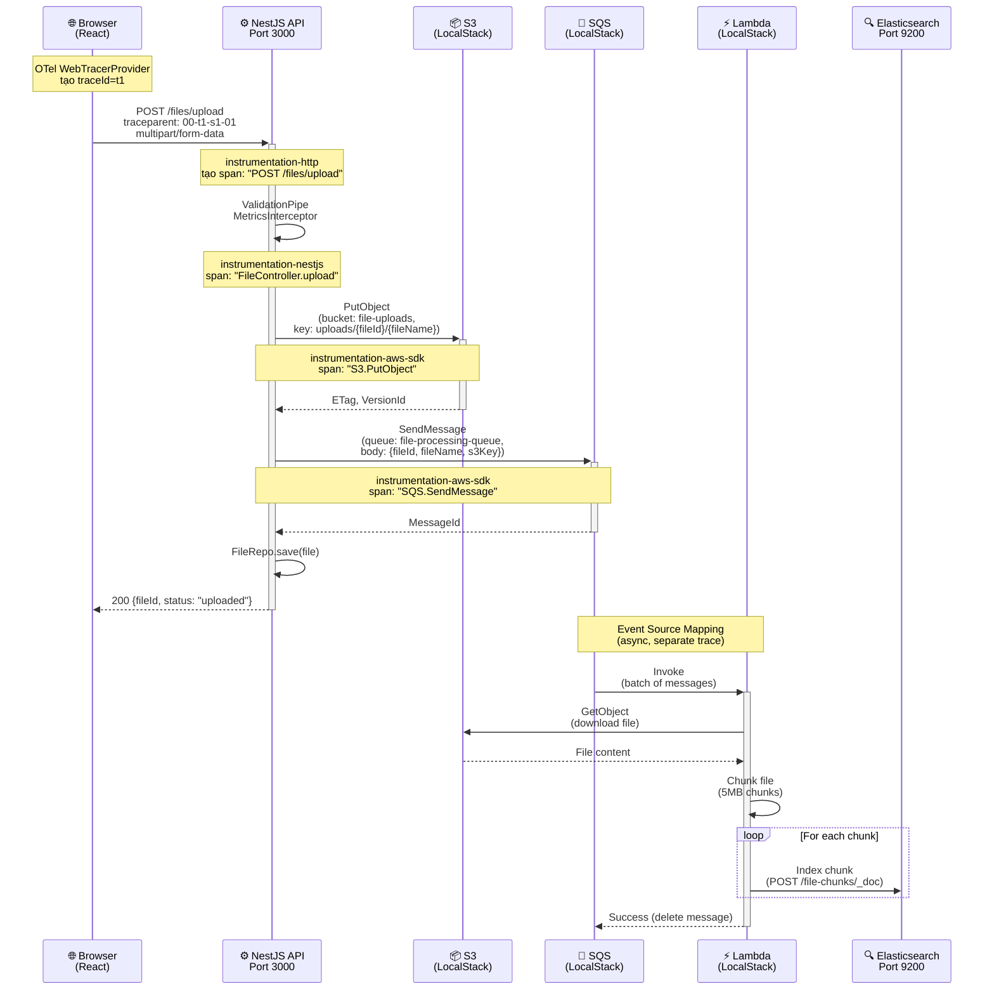
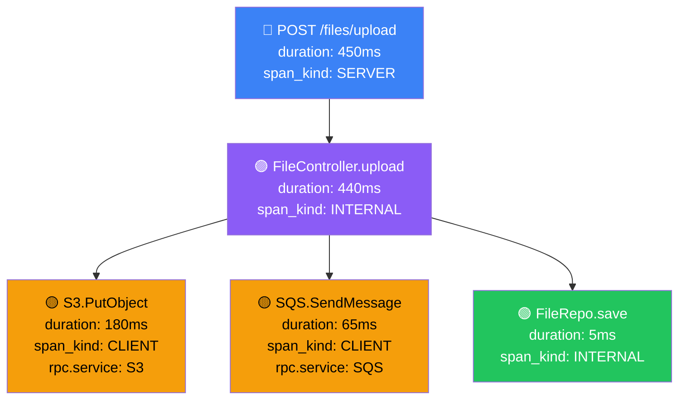
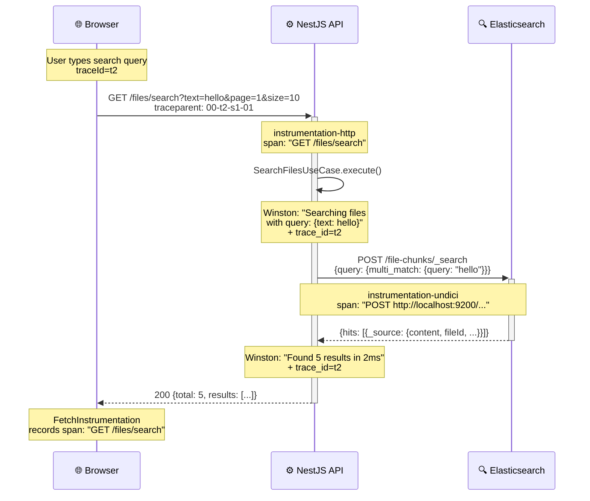
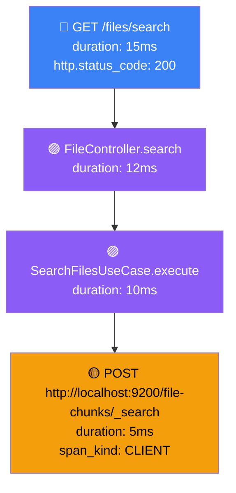
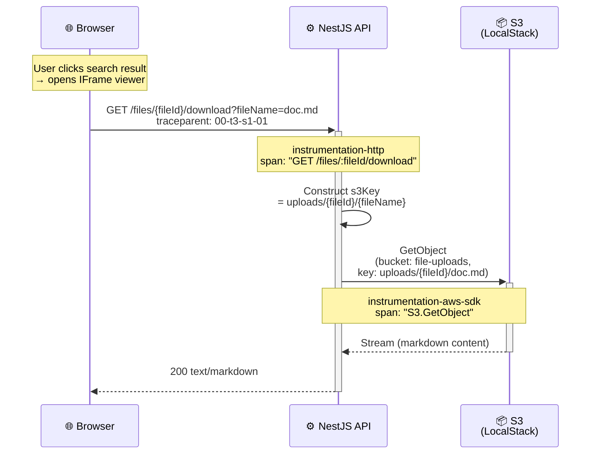
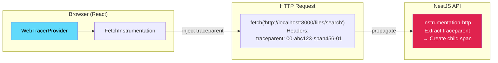
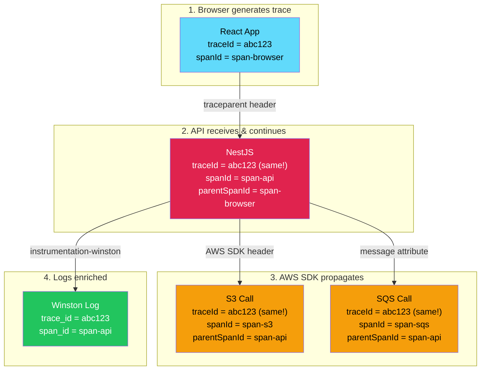
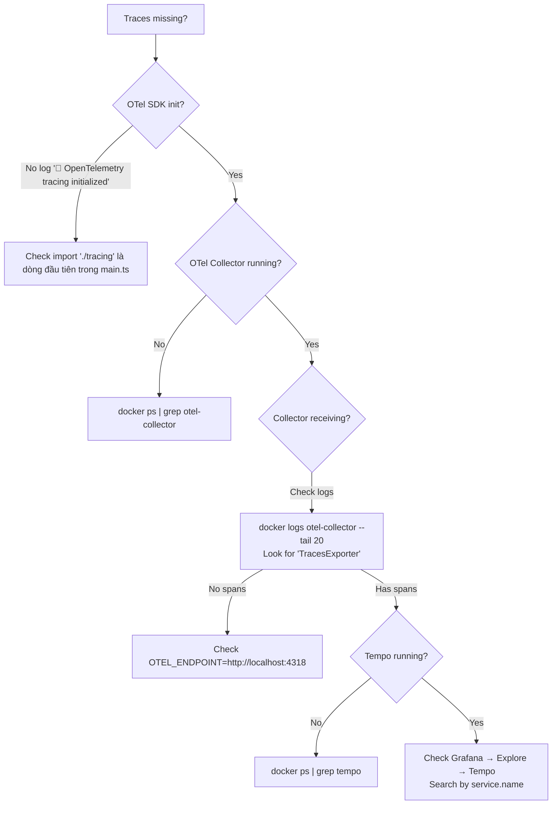

# 🔍 Tracing Workflow

## End-to-End Trace Flow

Trang này mô tả chi tiết cách traces được tạo và truyền qua toàn bộ hệ thống — từ Browser → NestJS → LocalStack (S3, SQS) → Lambda → Elasticsearch.

## Flow 1: File Upload

### Sequence Diagram



### Trace Tree (Tempo View)



### Metrics Generated

Từ trace trên, Tempo tự động tạo các metrics:

| Metric | Labels | Value |
|--------|--------|-------|
| `traces_spanmetrics_calls_total` | `service=chunk-files-api, span_name=POST /files/upload, status_code=STATUS_CODE_UNSET` | +1 |
| `traces_spanmetrics_latency_bucket{le="500"}` | `service=chunk-files-api, span_name=POST /files/upload` | +1 |
| `traces_spanmetrics_calls_total` | `service=chunk-files-api, span_name=S3.PutObject` | +1 |
| `traces_spanmetrics_calls_total` | `service=chunk-files-api, span_name=SQS.SendMessage` | +1 |

---

## Flow 2: File Search

### Sequence Diagram



### Trace Tree



### Correlated Logs (Loki)

Cùng `trace_id=t2`, Loki chứa:

```
14:04:55.102 info [SearchFilesUseCase] Searching files with query: {"text":"hello"} traceId=t2
14:04:55.107 info [SearchFilesUseCase] Found 5 results in 5ms traceId=t2
```

---

## Flow 3: File Download (IFrame Viewer)

### Sequence Diagram



---

## Flow 4: Frontend Tracing

### Browser → API Trace Propagation



### Frontend Instrumentation

```typescript
// apps/web/src/tracing.ts
const provider = new WebTracerProvider({
  resource: resourceFromAttributes({
    [ATTR_SERVICE_NAME]: 'chunk-files-web',
  }),
  spanProcessors: [
    new BatchSpanProcessor(
      new OTLPTraceExporter({
        url: 'http://localhost:4318/v1/traces',
      })
    ),
  ],
});

// Chỉ propagate traceparent đến API (không gửi đến CDN, etc.)
registerInstrumentations({
  instrumentations: [
    new FetchInstrumentation({
      propagateTraceHeaderCorsUrls: [/localhost:3000/],
    }),
  ],
});
```

---

## Trace Context Flow Summary



---

## Troubleshooting Traces

### Traces không xuất hiện trong Tempo?



### Logs không có trace_id?

1. Kiểm tra `instrumentation-winston` enabled trong `tracing.ts`
2. Kiểm tra `tracing.ts` được import **trước** Winston logger creation
3. Kiểm tra `OpenTelemetryTransportV3` có trong Winston transports

### LocalStack logs không xuất hiện?

1. Kiểm tra Promtail: `docker logs promtail --tail 20`
2. Kiểm tra Docker socket mount: `-v /var/run/docker.sock:/var/run/docker.sock:ro`
3. Query Loki: `{container="file-processor-localstack"}`
