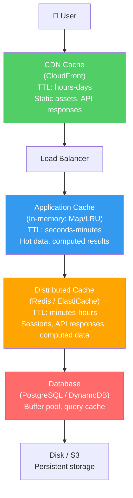
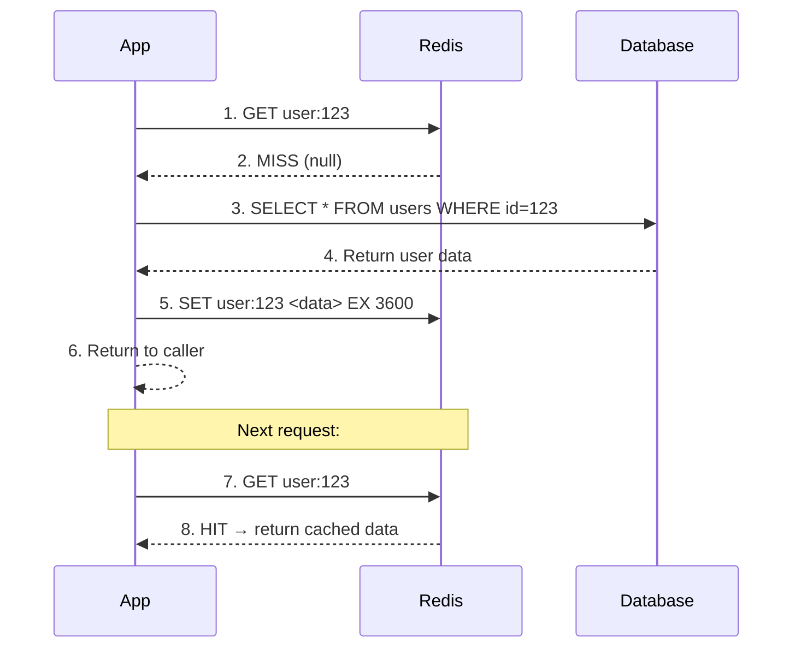
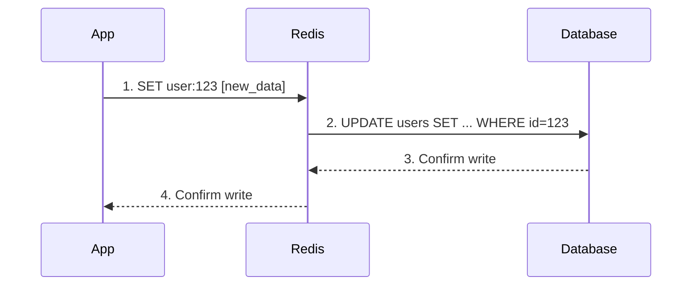
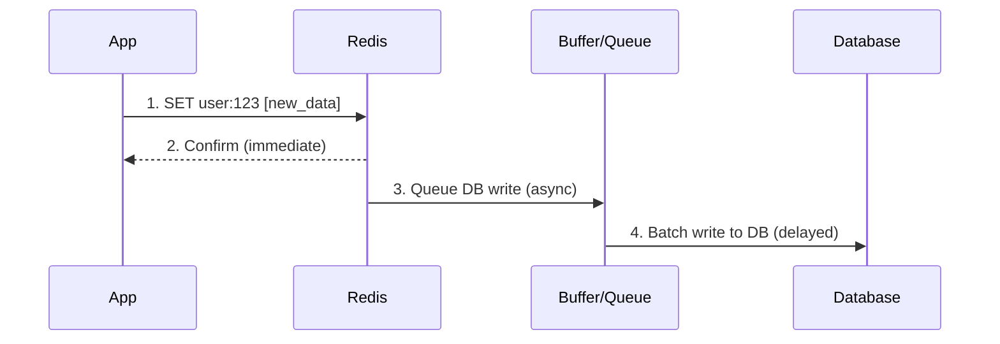
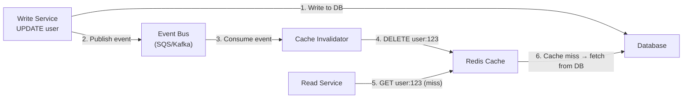
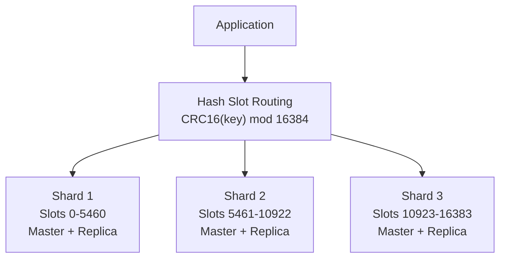
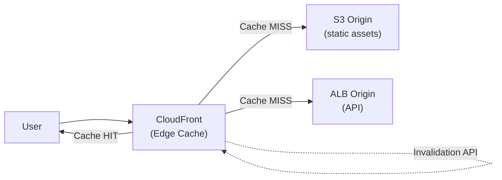

# ⚡ Advanced Caching Strategies

Caching is the **single most effective performance optimization** in distributed systems. It reduces latency, decreases database load, and improves throughput. But it also introduces the **hardest problem in computer science**: cache invalidation.

> "There are only two hard things in Computer Science: cache invalidation and naming things." — Phil Karlton

---

## 1. Caching Layers — Where to Cache



| Layer | Latency | Capacity | Shared | Example |
|-------|---------|----------|--------|---------|
| **Browser/Client** | 0ms | MB | Per user | `Cache-Control`, Service Worker, localStorage |
| **CDN** | 1-50ms | TB | Global | CloudFront, Cloudflare, Fastly |
| **API Gateway** | 1-5ms | GB | Per region | AWS API Gateway caching |
| **Application (in-process)** | 0.001ms | MB | Per instance | Node.js `Map`, Java `ConcurrentHashMap`, LRU cache |
| **Distributed Cache** | 0.5-2ms | GB-TB | All instances | Redis, Memcached, ElastiCache |
| **Database** | 1-10ms | GB | All queries | PostgreSQL shared_buffers, MySQL query cache |

---

## 2. Caching Strategies — Read Patterns

### Cache-Aside (Lazy Loading) — Most Common



```typescript
async function getUser(userId: string): Promise<User> {
  // 1. Check cache first
  const cached = await redis.get(`user:${userId}`);
  if (cached) return JSON.parse(cached); // Cache HIT
  
  // 2. Cache MISS → query database
  const user = await db.query('SELECT * FROM users WHERE id = $1', [userId]);
  
  // 3. Populate cache for next time
  await redis.set(`user:${userId}`, JSON.stringify(user), 'EX', 3600);
  
  return user;
}
```

| Pros | Cons |
|------|------|
| Simple to implement | Cache miss = slower (3 round trips: cache + DB + write cache) |
| Only caches data that's actually requested | Data can be stale until TTL expires |
| Cache failure doesn't break reads (fallback to DB) | Cold start problem (empty cache after deploy) |

**Best for:** General purpose, read-heavy workloads, when you can tolerate some staleness.

### Read-Through

Same as Cache-Aside but the **cache library handles the DB lookup automatically**:

```typescript
// Cache library (e.g., node-cache-manager) handles the miss
const user = await cacheManager.wrap(`user:${userId}`, async () => {
  return db.query('SELECT * FROM users WHERE id = $1', [userId]);
}, { ttl: 3600 });
```

### Write-Through

Every write goes to **cache AND database synchronously**:



| Pros | Cons |
|------|------|
| Cache always has latest data | Higher write latency (2 writes per operation) |
| No stale data | Write amplification (data written even if rarely read) |

**Best for:** Systems where read-after-write consistency is critical.

### Write-Behind (Write-Back)

Write to cache immediately, **asynchronously flush to database**:



| Pros | Cons |
|------|------|
| Extremely fast writes (only write to cache) | Risk of data loss if cache crashes before flush |
| Can batch/coalesce DB writes | Complex to implement correctly |
| Reduces database write load | Inconsistency window between cache and DB |

**Best for:** High write throughput (analytics, counters, real-time metrics). Never for financial data.

---

## 3. Cache Invalidation Strategies

### TTL (Time to Live) — Simplest

```
redis.set("user:123", data, "EX", 3600)  // Expires in 1 hour
```

| TTL | Trade-off |
|-----|-----------|
| **Short (10-60s)** | Fresher data, more DB load, more cache misses |
| **Medium (5-60min)** | Good balance for most use cases |
| **Long (1-24h)** | Lowest DB load, highest staleness risk |
| **No TTL** | Only use with explicit invalidation (event-driven) |

### Event-Driven Invalidation — Most Accurate



**Best for:** Multi-service systems where multiple services cache the same data.

### Cache Stampede Prevention

**Problem:** Cache key expires → 1000 concurrent requests all miss → 1000 identical DB queries → database dies.

**Solutions:**

| Solution | How | Complexity |
|----------|-----|-----------|
| **Lock/Mutex** | First request acquires lock, fetches from DB, populates cache. Other requests wait or return stale | Medium |
| **Probabilistic Early Expiration** | Each request has a small random chance to refresh the cache BEFORE TTL expires | Low |
| **Background Refresh** | Background job refreshes popular cache keys before they expire | Medium |
| **Never expire + event invalidation** | No TTL, only invalidate on write events | High |

```typescript
// Lock-based stampede prevention
async function getWithLock(key: string, fetchFn: () => Promise<any>, ttl: number) {
  const cached = await redis.get(key);
  if (cached) return JSON.parse(cached);
  
  const lockKey = `lock:${key}`;
  const acquired = await redis.set(lockKey, '1', 'NX', 'EX', 5); // 5s lock
  
  if (acquired) {
    // Winner: fetch from DB and populate cache
    const data = await fetchFn();
    await redis.set(key, JSON.stringify(data), 'EX', ttl);
    await redis.del(lockKey);
    return data;
  } else {
    // Loser: wait and retry from cache
    await sleep(50);
    return getWithLock(key, fetchFn, ttl);
  }
}
```

---

## 4. Eviction Policies

When cache is full, which item to remove?

| Policy | How | Best For |
|--------|-----|----------|
| **LRU** (Least Recently Used) | Evict the item not accessed for the longest time | General purpose (Redis default) |
| **LFU** (Least Frequently Used) | Evict the item accessed least often | Items with stable popularity (product catalog) |
| **FIFO** (First In First Out) | Evict oldest item | Simple, no access tracking needed |
| **TTL** | Evict expired items first | Time-sensitive data |
| **Random** | Evict random item | Surprisingly good for uniform access patterns |

**Redis eviction policies:**
```
maxmemory-policy allkeys-lru      # Evict any key using LRU (recommended default)
maxmemory-policy volatile-lru     # Evict only keys with TTL using LRU
maxmemory-policy allkeys-lfu      # Evict any key using LFU
maxmemory-policy noeviction       # Return error when memory full (for critical data)
```

---

## 5. Redis Architecture Patterns

### Single Instance

```
App → Redis (1 node)
```
Simple, fast, but **no fault tolerance**. If Redis dies, cache is gone.

### Master-Replica (Read Replicas)

```
App (writes) → Redis Master → Redis Replica 1 (reads)
                            → Redis Replica 2 (reads)
```
Read scaling + failover. ElastiCache supports automatic failover.

### Redis Cluster (Sharding)



| Aspect | Single | Master-Replica | Cluster |
|--------|--------|---------------|---------|
| **Capacity** | 1 node memory | 1 node memory | N × node memory |
| **Read scaling** | ❌ | ✅ | ✅ |
| **Write scaling** | ❌ | ❌ | ✅ |
| **Fault tolerance** | ❌ | ✅ (auto-failover) | ✅ (per-shard failover) |
| **Multi-key operations** | ✅ | ✅ | ⚠️ Only within same slot (use hash tags) |
| **Complexity** | Low | Low | High |

### ElastiCache vs Self-Managed Redis

| | ElastiCache | Self-Managed |
|---|---|---|
| **Ops overhead** | Minimal (AWS manages patching, failover) | High (you manage everything) |
| **Cost** | Higher (managed service premium) | Lower (EC2 cost only) |
| **Features** | Redis 7.x, auto-failover, backups, encryption | Full Redis control |
| **Best for** | Production workloads | Dev/testing, custom Redis modules |

---

## 6. CDN Caching & HTTP Cache Headers

### Cache-Control Header

```
Cache-Control: public, max-age=31536000, immutable
│              │       │                  │
│              │       │                  └─ Never revalidate (hashed filenames)
│              │       └─ Cache for 1 year
│              └─ Any cache can store (CDN, browser)
└─ Header name

Cache-Control: private, no-cache, must-revalidate
│               │        │         │
│               │        │         └─ Must check server before using cached copy
│               │        └─ Always revalidate with server (ETag/Last-Modified)
│               └─ Only browser cache (not CDN — contains user-specific data)
└─ Header name
```

### Caching Strategy by Resource Type

| Resource | Cache-Control | Why |
|----------|--------------|-----|
| Static assets (JS, CSS with hash) | `public, max-age=31536000, immutable` | Content-hashed filenames → infinite cache |
| Images (unchanging) | `public, max-age=86400` | 24h cache, CDN serves |
| API response (public data) | `public, max-age=60, stale-while-revalidate=300` | 1min fresh, 5min serve stale while refreshing |
| API response (user-specific) | `private, no-cache` | Don't cache in CDN, browser must revalidate |
| HTML pages | `no-cache` | Always check server (but use ETag for 304) |
| Authentication responses | `no-store` | Never cache (contains tokens) |

### CloudFront + S3 Caching (Your Project)



---

## 7. Application-Level Caching Patterns

### Memoization (In-Process Cache)

```typescript
// Simple memoization with TTL
function memoize<T>(fn: (...args: any[]) => Promise<T>, ttlMs: number) {
  const cache = new Map<string, { data: T; expiry: number }>();
  
  return async (...args: any[]): Promise<T> => {
    const key = JSON.stringify(args);
    const cached = cache.get(key);
    
    if (cached && cached.expiry > Date.now()) {
      return cached.data;
    }
    
    const data = await fn(...args);
    cache.set(key, { data, expiry: Date.now() + ttlMs });
    return data;
  };
}

// Usage
const getConfig = memoize(fetchConfigFromDB, 60_000); // Cache 1 minute
```

### Multi-Level Cache (L1 + L2)

```
Request → L1 (in-process Map, 0.001ms) → L2 (Redis, 0.5ms) → Database (5ms)
```

```typescript
async function multiLevelGet(key: string): Promise<any> {
  // L1: In-process cache (fastest, per-instance)
  const l1 = localCache.get(key);
  if (l1) return l1;
  
  // L2: Redis (shared across instances)
  const l2 = await redis.get(key);
  if (l2) {
    const data = JSON.parse(l2);
    localCache.set(key, data, 30_000); // Warm L1
    return data;
  }
  
  // L3: Database (slowest, source of truth)
  const data = await db.get(key);
  await redis.set(key, JSON.stringify(data), 'EX', 3600);
  localCache.set(key, data, 30_000);
  return data;
}
```

**Warning:** Multi-level cache makes invalidation harder. L1 caches on different instances may have different stale data. Use short L1 TTL (10-30 seconds).

---

## 🔥 Real Caching Problems

### Problem 1: Cache Stampede at Midnight
**What happened:** Cache key for "daily prices" expired at midnight. 50,000 users all requested the price page simultaneously. All hit the database at once → DB connection pool exhausted → 5-minute outage.
**Fix:** Background refresh job renews the cache at 23:59 before it expires. Additionally, added lock-based fetch with `SETNX`.

### Problem 2: Stale Cache After Deployment
**What happened:** Deployed new user profile schema. Old cached data had different structure → frontend crashed for cached users. Non-cached users worked fine.
**Fix:** Include schema version in cache key: `user:v2:123`. Deploy reads new keys, old keys expire naturally via TTL.

### Problem 3: Cache Inconsistency in Race Condition
**What happened:** Thread A reads user from DB (version 1). Thread B updates user in DB (version 2) AND invalidates cache. Thread A writes version 1 back to cache. Cache now has stale data.
**Fix:** Use `SET key value NX` (only set if not exists) after writes, or use Redis `WATCH` for optimistic locking. Better: use event-driven invalidation (delete, don't update).

### Problem 4: Redis Memory Full → Silent Cache Eviction
**What happened:** Redis maxmemory reached. Eviction policy `allkeys-lru` started evicting critical session data along with regular cache data.
**Fix:** Separate Redis instances for cache (eviction OK) vs sessions (no eviction). Set `noeviction` policy for session Redis. Monitor memory with alerts at 80% threshold.

### Problem 5: Hot Key Problem
**What happened:** Celebrity product launch → cache key `product:12345` receives 100,000 reads/second → single Redis shard overwhelmed.
**Fix:** Read replicas for hot keys, local application cache (L1) with short TTL, or key replication (`product:12345:shard1`, `product:12345:shard2` → random read distribution).

---

## 📍 Case Study Answer

> **Scenario:** Your Elasticsearch search results are slow (2 seconds per query). How would you design a caching layer?

### Solution: Multi-Level Cache for Search Results

```
User Request → API Gateway Cache (exact URL match, 60s TTL)
            → Application Cache (popular queries, LRU, 5min)
            → Redis Cache (query hash → results, 15min TTL)
            → Elasticsearch (source of truth)
```

**Implementation:**

1. **Cache Key Design:** `search:v1:${sha256(normalizedQuery + filters + page)}`
   - Normalize query (lowercase, trim, sort filters) to maximize cache hits
   - Include pagination in key (`page=1` and `page=2` are different keys)

2. **TTL Strategy:**
   - Popular queries (top 100): 15-minute TTL in Redis + 1-minute L1 cache
   - Long-tail queries: 5-minute TTL, no L1 cache
   - After document indexing: publish event → invalidate affected search cache keys

3. **Cache Warming:**
   - On deploy: pre-populate cache with top 100 search queries
   - Background job: refresh popular query cache every 10 minutes

4. **Invalidation:**
   - When new documents are indexed → publish "index_updated" event
   - Invalidator service: delete all search cache keys (prefix `search:v1:*` with Redis SCAN)
   - Alternatively: accept 5-15 minute staleness and rely on TTL only

**Expected Result:** P50 latency drops from 2s to 5ms (cache hit), P99 drops from 5s to 2s (cache miss + fresh ES query).
