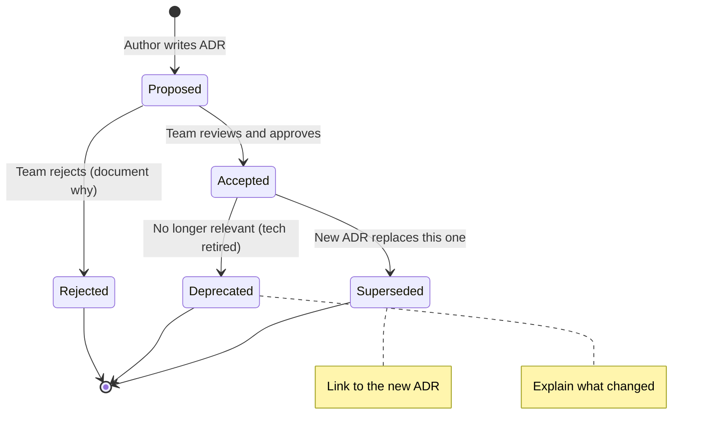
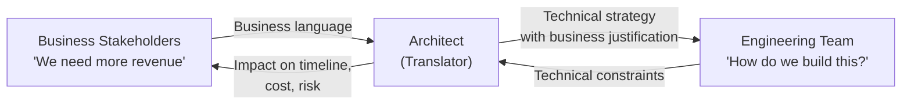
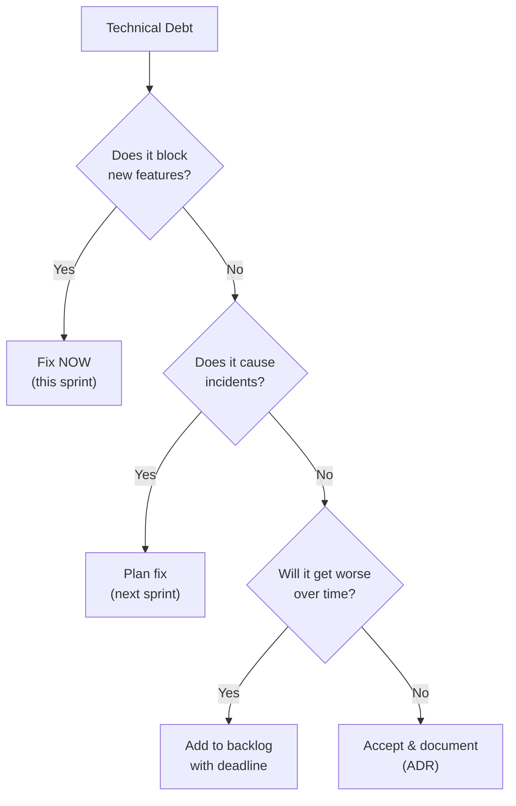

# 📋 Architecture Decision Records (ADRs) & Governance

Architecture decisions are the most **expensive decisions** in software engineering. They're hard to reverse, affect every team, and their rationale is lost within months if not documented. ADRs solve this by creating a permanent, searchable record of WHY decisions were made.

> "The best time to document a decision was when you made it. The second best time is now." — Every architect who's inherited a mystery codebase

---

## 1. What is an ADR?

An **Architecture Decision Record** is a brief document (1-2 pages) that captures:
- **What** decision was made
- **Why** it was made (context, constraints, alternatives considered)
- **What** the consequences are (trade-offs accepted)

### Why Are ADRs Critical?

| Without ADRs | With ADRs |
|-------------|-----------|
| "Why did they choose MongoDB? Was there a reason?" | ADR-007 explains: "Chosen for schema flexibility during rapid prototyping phase. Plan to migrate hot paths to PostgreSQL in Q3." |
| New engineer spends 2 weeks proposing a solution that was already rejected 6 months ago | ADR-012 documents why that approach was rejected and what was chosen instead |
| Same debate reopened every quarter → team frustration | "This was decided in ADR-015. If circumstances changed, propose a new ADR to supersede it." |
| Post-mortem reveals: "We chose X but nobody remembers why" | ADR trail shows the full decision context, even after original team members leave |

---

## 2. ADR Format — Michael Nygard (Classic)

```markdown
# ADR-<number>: <Short descriptive title>

## Status
Proposed | Accepted | Deprecated | Superseded by ADR-XXX

## Context
What is the issue that we're seeing that is motivating this decision or change?
- Technical constraints
- Business requirements  
- Team capabilities
- Timeline pressure
- Budget constraints

## Decision
We will <do X>.
State the decision clearly and definitively. Use "We will..." not "We should consider..."

## Consequences
What becomes easier or harder because of this decision?
- Positive consequences
- Negative consequences (trade-offs accepted)
- Risks and mitigations
```

### MADR Format (Markdown ADR — More Structured)

```markdown
# ADR-<number>: <Title>

## Status: Accepted
## Date: 2025-01-15
## Deciders: @architect, @tech-lead, @product-owner

## Context and Problem Statement
<2-3 sentences describing the problem>

## Decision Drivers
- Driver 1 (e.g., "Must support 10K concurrent users")
- Driver 2 (e.g., "Team has no Go experience")
- Driver 3 (e.g., "Budget: $500/month max for infrastructure")

## Considered Options
1. Option A: <description>
2. Option B: <description>
3. Option C: <description>

## Decision Outcome
Chosen option: "Option B", because <justification>.

### Positive Consequences
- Good thing 1
- Good thing 2

### Negative Consequences
- Drawback 1 → Mitigation: <how we'll handle it>
- Drawback 2 → Accepted risk because <reasoning>

## Pros and Cons of the Options

### Option A: <name>
- ✅ Pro 1
- ✅ Pro 2
- ❌ Con 1
- ❌ Con 2

### Option B: <name> (CHOSEN)
- ✅ Pro 1
- ✅ Pro 2
- ❌ Con 1

### Option C: <name>
- ✅ Pro 1
- ❌ Con 1
- ❌ Con 2
```

---

## 3. Real ADR Examples from This Project

### ADR-001: Use Hexagonal Architecture for File Processor

```
Status: Accepted
Date: 2024-12

Context:
  The file-processor service handles file upload, chunking, and indexing 
  into Elasticsearch. It integrates with multiple external services (S3, SQS, 
  Elasticsearch, Lambda). We need an architecture that:
  - Makes external dependencies swappable (for testing with LocalStack)
  - Keeps business logic independent of frameworks (NestJS)
  - Allows easy migration from LocalStack → real AWS

Considered Options:
  1. Traditional layered architecture (Controller → Service → Repository)
  2. Hexagonal Architecture (Ports & Adapters)
  3. Clean Architecture (Uncle Bob)

Decision:
  We will use Hexagonal Architecture (Ports & Adapters).

  Reasoning:
  - External adapters (S3, SQS, ES) can be swapped by implementing the same Port interface
  - Domain logic has zero dependency on NestJS or AWS SDK
  - LocalStack → AWS migration only changes adapter implementations
  - Clean Architecture is similar but adds unnecessary layers for our scale

Consequences:
  ✅ Business logic is fully testable without any AWS/infra dependencies
  ✅ Swapping from LocalStack to real AWS only requires changing adapter config
  ✅ Clear boundary enforcement (domain never imports from infrastructure)
  ❌ More boilerplate than simple layered architecture
  ❌ New team members need time to understand ports/adapters pattern
  → Mitigation: Created ARCHITECTURE-FLOW.md documentation
```

### ADR-002: Choose Elasticsearch over PostgreSQL Full-Text Search

```
Status: Accepted
Date: 2024-12

Context:
  The system needs to support full-text search across processed document
  chunks with features like:
  - Fuzzy matching, stemming, synonym support
  - Relevance scoring with custom boosting
  - Faceted search and aggregations
  - Horizontal scaling as document volume grows
  
  Current document volume: 10K. Expected: 1M+ within 6 months.

Considered Options:
  1. PostgreSQL with pg_trgm + tsvector (built-in full-text search)
  2. Elasticsearch / OpenSearch (dedicated search engine)
  3. Typesense (lightweight alternative)

Decision:
  We will use Elasticsearch (via OpenSearch on AWS).

  Reasoning:
  - PostgreSQL FTS is good for simple search but lacks advanced relevance 
    tuning, custom analyzers, and horizontal scaling
  - Elasticsearch provides inverted index optimized for search, not CRUD
  - OpenSearch is AWS-managed, compatible API, no licensing concerns
  - Team has Elasticsearch experience

Consequences:
  ✅ Powerful full-text search with relevance tuning out of the box
  ✅ Scales horizontally (add shards/nodes as volume grows)
  ✅ Rich aggregation and analytics capabilities
  ❌ Additional infrastructure to manage (cluster, shards, replicas)
  ❌ Data synchronization needed between primary DB and Elasticsearch
  ❌ Eventual consistency between write DB and search index
  → Mitigation: SQS-based event pipeline ensures eventual consistency
```

### ADR-003: Use SQS over Kafka for Event Processing

```
Status: Accepted
Date: 2024-12

Context:
  File processing pipeline needs an async message queue between:
  - S3 upload notification → processing trigger
  - Chunking completion → Elasticsearch indexing
  
  Requirements:
  - At-least-once delivery
  - Dead letter queue for failed messages
  - Low operational overhead
  - Message ordering not critical (each file processed independently)

Considered Options:
  1. Amazon SQS (managed queue)
  2. Apache Kafka / Amazon MSK (event streaming)
  3. RabbitMQ on ECS (self-managed)

Decision:
  We will use Amazon SQS.

  Reasoning:
  - SQS is fully managed (zero operational overhead)
  - Built-in DLQ, visibility timeout, long polling
  - We don't need Kafka's features: ordering, replay, event sourcing
  - Cost: SQS free tier = 1M requests/month. Kafka MSK = $100+/month minimum
  - LocalStack has full SQS support for local development

Consequences:
  ✅ Zero operational overhead (no brokers to manage)
  ✅ Built-in DLQ for failed message handling
  ✅ Cost-effective at our scale
  ✅ Full LocalStack compatibility for development
  ❌ No message replay (once consumed, gone). If we need event sourcing → revisit
  ❌ No strict ordering guarantee (use FIFO SQS if needed later)
  ❌ Max message size 256KB (workaround: store payload in S3, send reference)
  → If message ordering or replay becomes required, supersede with ADR for Kafka
```

---

## 4. ADR Lifecycle Management



### ADR Storage & Tooling

| Approach | Pros | Cons |
|----------|------|------|
| **Markdown in repo** (`docs/adrs/`) | Version controlled, reviewed in PR, close to code | Must search repo to find them |
| **Wiki (Confluence/Notion)** | Easy to browse, rich formatting | Disconnected from code, no PR review |
| **GitHub Discussions/Issues** | Discussion thread built in, notifications | Not structured, hard to find later |

**Recommendation:** Markdown files in `docs/adrs/` directory, numbered sequentially (`001-hexagonal-architecture.md`). Create a `README.md` index. Review ADRs in PRs like code.

### Tools

| Tool | What | Link |
|------|------|------|
| **adr-tools** | CLI to create/manage ADRs | `npm install -g adr-tools` |
| **log4brains** | ADR management + static site generator | Shows ADR history as a searchable website |
| **MADR template** | GitHub template repo | Structured Markdown ADR format |

---

## 5. Communication & Soft Skills for Architects

### The Architect as Translator



> 90% of an architect's time is NOT in an IDE. It's spent in design docs, meetings, reviews, and persuading others.

### Translating Technical Decisions to Business Value

| Technical Decision | ❌ Engineer Explanation | ✅ Architect Explanation |
|-------------------|----------------------|----------------------|
| "We need to refactor the monolith" | "The code is messy and hard to maintain" | "Deployment takes 45 minutes → we can only release once/week → competitors ship daily. Refactoring reduces deploy time to 5 minutes → 3x more features/quarter." |
| "We need Elasticsearch" | "It's better for search" | "Current search returns irrelevant results (40% bounce rate). Elasticsearch improves relevance → 20% more user engagement → estimated $50K/quarter revenue increase." |
| "We need to add monitoring" | "We should use Prometheus and Grafana" | "Last month's outage took 4 hours to detect and 2 hours to fix. Monitoring detects issues in 2 minutes → reduces downtime from 6 hours to 30 minutes → saves $10K per incident." |

### Managing Technical Debt



### Key Communication Frameworks

**1. RFC (Request for Comments)**
For proposals that need team input. More open-ended than ADRs.
```
Title: RFC: Migrate from REST to gRPC for internal services
Author: @architect
Status: Open for comments (deadline: Jan 30)
Summary: <1 paragraph>
Motivation: <why>
Proposal: <what>
Alternatives: <what else we considered>
Open Questions: <what we're unsure about>
```

**2. Design Doc**
For complex features that need detailed technical planning BEFORE implementation.
```
Title: Design Doc: Real-time notification system
Author: @engineer + @architect
Reviewers: @team
Scope: <what's included, what's NOT>
Background: <context>
Goals / Non-goals: <explicit about what we're NOT doing>
Design: <detailed technical approach with diagrams>
Alternatives: <what we rejected and why>
Timeline: <milestones>
```

**3. DACI Decision Framework**
- **D**river: Person responsible for driving the decision (usually architect)
- **A**pprover: Person who makes the final call (usually VP Eng / CTO)
- **C**ontributors: People who provide input (engineers, PMs)
- **I**nformed: People who need to know the outcome (stakeholders)

### Architect Influence Without Authority

Most architects don't have direct authority over teams. Instead:

| Technique | How |
|-----------|-----|
| **Lead by example** | Write the first ADR, do the first POC, review PRs with educational comments |
| **Build consensus** | 1-on-1s before meetings, address concerns privately, arrive at meetings with pre-aligned supporters |
| **Show, don't tell** | Build a quick prototype instead of a 50-slide deck |
| **Quantify impact** | "This will reduce build time from 20 min to 3 min" beats "this is better engineering" |
| **Create guardrails, not gates** | CI/CD checks, linters, templates instead of manual review bottlenecks |
| **Embrace "Good enough"** | Perfect architecture is the enemy of shipping. 80% aligned > 100% debated forever |

---

## 🔥 Common ADR Mistakes

### Mistake 1: ADRs Too Long
**Problem:** 10-page ADR that nobody reads.
**Fix:** Max 2 pages. If you need more context, link to a separate design doc.

### Mistake 2: ADR Written After the Fact
**Problem:** Decision was made 3 months ago in a Slack thread. ADR written now is revisionist history.
**Fix:** Write the ADR BEFORE implementation, during the decision-making process. Even a draft ADR in a PR focuses discussion.

### Mistake 3: No ADR for "Obvious" Decisions
**Problem:** "Of course we'd use PostgreSQL." 6 months later, new engineer asks "Why not DynamoDB? Our read pattern is key-value."
**Fix:** If a decision affects architecture and someone might question it later, write an ADR. It takes 15 minutes now, saves hours of debate later.

### Mistake 4: ADRs Never Updated
**Problem:** ADR-005 says "We chose Redis 6" but the team migrated to Valkey 3 months ago. No one updated the ADR.
**Fix:** When superseding a decision, create a new ADR that links to the old one. Mark old ADR as "Superseded by ADR-XXX."

### Mistake 5: ADRs Without Consequences
**Problem:** ADR says "We will use Kafka" but doesn't mention the operational burden, learning curve, or cost increase.
**Fix:** Always document negative consequences. If you can't think of any trade-offs, you haven't thought hard enough.

---

## 📍 Challenge Answer

> **Practice:** Write an ADR for a real architectural/process mistake from a previous project, analyzing it as if you were going to supersede it.

### Example: ADR-099: Supersede Shared MongoDB → Database-per-Service

```
Status: Accepted (supersedes implicit decision from 2023)
Date: 2025-01-15

Context:
  When the team migrated from monolith to microservices in 2023, all 8 
  services continued sharing a single MongoDB instance. This was the 
  "path of least resistance" — no decision was formally made (no ADR!).
  
  Problems emerged:
  - Order service's heavy aggregation queries caused Payment service 
    timeouts (shared connection pool exhaustion)
  - Schema changes in one service broke other services reading the 
    same collections
  - Can't scale database independently per service's needs
  - No clear data ownership → 3 services write to "users" collection

Decision:
  We will migrate to database-per-service over 2 quarters:
  - Q1: Extract Order and Payment into their own PostgreSQL instances
  - Q2: Extract remaining services
  - Use Change Data Capture (Debezium) for cross-service data sync

Consequences:
  ✅ Eliminates cross-service database interference
  ✅ Each service can choose optimal database (Orders→PostgreSQL, Search→Elasticsearch)
  ✅ Independent scaling per service
  ❌ 2-quarter migration effort (~3 engineer-months)
  ❌ Must implement eventual consistency patterns (Saga, CDC)
  ❌ Cross-service reporting requires data aggregation pipeline (not just SQL JOINs)
  → Accepted because current shared DB is the #1 source of production incidents

Lessons Learned:
  1. ALWAYS write an ADR, even for "obvious" or "temporary" decisions
  2. "Temporary" shared database became permanent for 18 months
  3. The cost of NOT deciding is higher than the cost of a wrong decision
```
