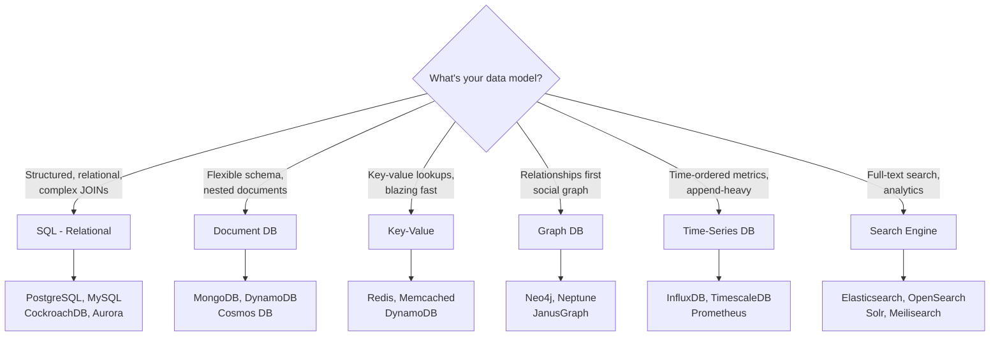
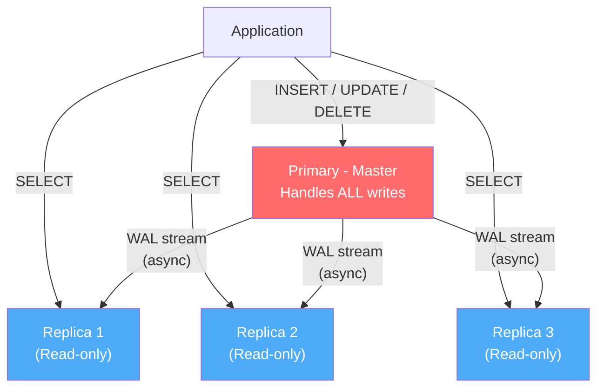
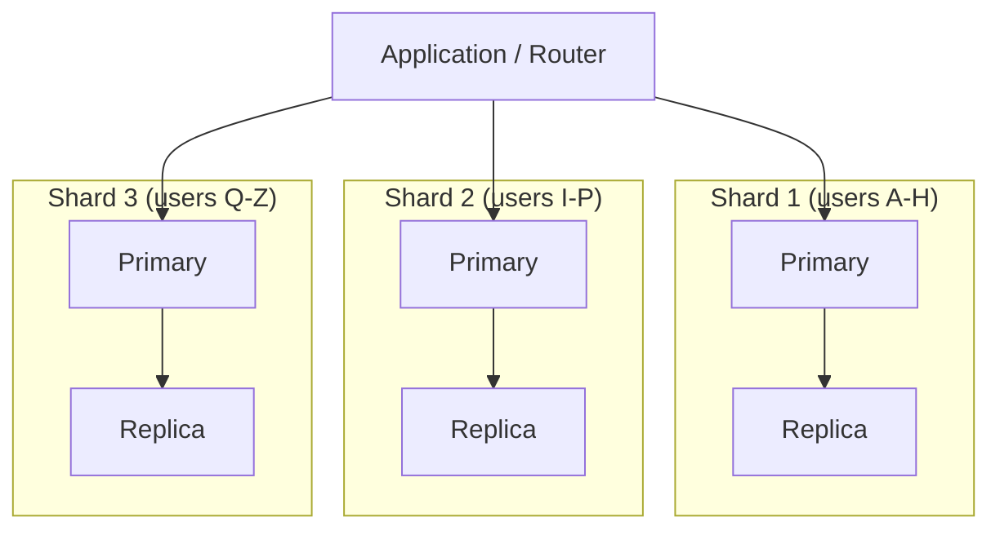
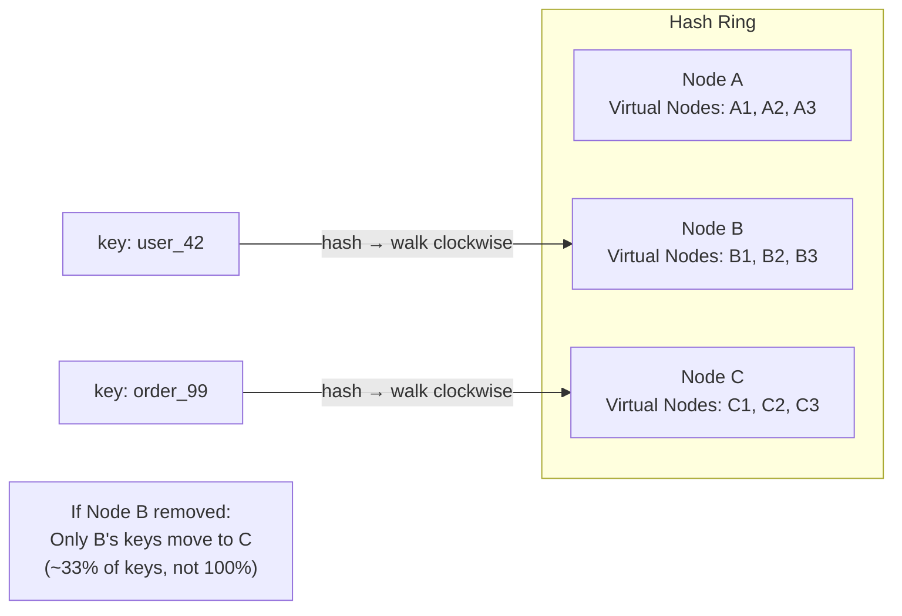

# 🗄️ Distributed Data Management: Database Scaling & Sharding

Database scaling is the **hardest** problem in system design. Compute is stateless and easy to scale horizontally. Data is stateful, requires consistency guarantees, and cannot be simply "copied to more servers" without trade-offs.

This document covers the progression from single-server DB to globally distributed data infrastructure.

---

## 1. SQL vs NoSQL — The First Decision

Before scaling, you must choose the right database type. This is an **architectural decision**, not a technology preference.



### SQL vs NoSQL Decision Matrix

| Criteria | SQL (PostgreSQL/MySQL) | Document (MongoDB/DynamoDB) | Wide-Column (Cassandra) |
|----------|------------------------|---------------------------|----------------------|
| **Schema** | Fixed, enforced | Flexible, schema-on-read | Column families |
| **Query** | Complex JOINs, aggregations | Key-based + secondary indexes | Key-based, limited queries |
| **Consistency** | ACID transactions | Tunable (eventual → strong) | Tunable per query |
| **Scale writes** | Hard (single primary) | Easy (auto-sharding) | Easy (masterless) |
| **Scale reads** | Read replicas | Read replicas + partitions | All nodes serve reads |
| **Best for** | Transactions, complex queries, referential integrity | Rapid prototyping, varied data shapes, high write volume | Massive write throughput, time-series, IoT |
| **Avoid when** | Schema changes frequently, massive write scale needed | Complex JOINs required, strict ACID needed | Ad-hoc queries, complex aggregations needed |

### NewSQL — The Best of Both Worlds?

NewSQL databases offer SQL interface + ACID transactions + horizontal scalability:

| Database | How It Scales | Use Case |
|----------|--------------|----------|
| **CockroachDB** | Raft consensus, automatic sharding, cross-region | Globally distributed SQL |
| **TiDB** | MySQL-compatible, TiKV storage layer | Drop-in MySQL replacement at scale |
| **Google Spanner** | TrueTime + Paxos, globally consistent | Google-scale, $$$expensive |
| **YugabyteDB** | PostgreSQL-compatible, auto-sharding | Distributed PostgreSQL |
| **PlanetScale** | Vitess (MySQL sharding), serverless | Managed sharded MySQL |

**When to consider NewSQL:** You need both complex SQL queries AND horizontal write scaling. Trade-off: Higher latency per query (consensus overhead), higher operational complexity, higher cost.

---

## 2. Replication — Read Scaling

### Master-Slave (Primary-Replica) Replication



**How it works (PostgreSQL):**
1. Primary writes changes to WAL (Write-Ahead Log)
2. WAL records are streamed to replicas (async by default)
3. Replicas apply WAL records → data eventually consistent

**Replication modes:**

| Mode | How | Replication Lag | Data Safety | Performance |
|------|-----|----------------|-------------|-------------|
| **Asynchronous** | Primary doesn't wait for replica ack | 10ms - 2s | May lose recent commits if primary dies | Best |
| **Synchronous** | Primary waits for 1+ replica ack | ~0ms | Zero data loss | Slower writes |
| **Semi-synchronous** | Primary waits for 1 replica, rest async | ~0ms for 1, lag for rest | Good balance | Medium |

### The Replication Lag Problem

```
Timeline:
  T0: User writes "name = John" → Primary
  T1: Primary commits, returns 200 OK
  T2: User refreshes page → read goes to Replica
  T3: Replica hasn't received T0 yet → shows "name = Jane" (stale!)
  T4: (100ms later) Replica receives T0 → now shows "John"
```

**Solutions for Replication Lag:**

1. **Read-your-writes consistency:** After a write, route that user's reads to Primary for N seconds
2. **Monotonic reads:** Pin each user session to a specific replica (sticky sessions)
3. **Causal consistency:** Track write timestamps, only read from replicas caught up to that timestamp
4. **Synchronous replication:** Eliminates lag but increases write latency (use only for critical data)

---

## 3. Partitioning (Vertical + Horizontal)

### Vertical Partitioning
Split a table by **columns** into multiple tables. Move rarely-accessed or large columns to separate tables.

```
users table (1 billion rows, 50 columns, 500GB)
  → users_core (id, name, email, created_at) — 50GB, hot data
  → users_profile (id, bio, avatar_url, settings_json) — 150GB, warm data  
  → users_activity_log (id, last_login, login_history) — 300GB, cold data
```

### Horizontal Partitioning (Table Partitioning)
Split a table by **rows** within a single database server. PostgreSQL native partitioning:

```sql
-- Partition by time range (perfect for logs, events, time-series)
CREATE TABLE events (
    id BIGINT,
    created_at TIMESTAMP,
    data JSONB
) PARTITION BY RANGE (created_at);

CREATE TABLE events_2026_01 PARTITION OF events
    FOR VALUES FROM ('2026-01-01') TO ('2026-02-01');
CREATE TABLE events_2026_02 PARTITION OF events
    FOR VALUES FROM ('2026-02-01') TO ('2026-03-01');
```

**Benefits:** Query pruning (only scan relevant partitions), easy archival (drop old partitions), parallel index builds.

---

## 4. Sharding — Write Scaling (Distributed Fragmentation)

When a single database server can't handle write volume, **sharding** distributes data across multiple independent database clusters.



### Sharding Strategies

#### Hash-Based Sharding
```
shard_id = hash(user_id) % num_shards
```
- **Pros:** Even data distribution, simple implementation
- **Cons:** Adding/removing shards requires rehashing ALL data → **use Consistent Hashing instead**

#### Range-Based Sharding
```
Shard 1: user_id 1 - 1,000,000
Shard 2: user_id 1,000,001 - 2,000,000
Shard 3: user_id 2,000,001 - 3,000,000
```
- **Pros:** Range queries are efficient (find users 500-1000 → single shard)
- **Cons:** Hot spots (new users all go to the last shard), uneven distribution

#### Directory-Based Sharding
A lookup table maps each entity to its shard: `{user_123: shard_2, user_456: shard_1}`
- **Pros:** Flexible, can rebalance by updating the lookup table
- **Cons:** The lookup table itself becomes a SPOF and bottleneck

#### Consistent Hashing (The Standard)



- Each node gets **100-200 virtual positions** on a ring (0 to 2^32)
- Key hashes to a position → assigned to first node clockwise
- Adding/removing a node only redistributes ~K/N keys (not all keys)
- Used by: DynamoDB, Cassandra, Redis Cluster, memcached

### Choosing a Shard Key

The shard key determines **everything**. A bad shard key creates hot spots, cross-shard queries, and operational nightmares.

**Good shard key properties:**
1. **High cardinality** — many distinct values (user_id ✓, country_code ✗)
2. **Even distribution** — no value dominates (user_id ✓, celebrity_id ✗)
3. **Query-aligned** — most queries include the shard key (user_id ✓ if queries are per-user)

**Examples:**

| System | Good Shard Key | Why | Bad Shard Key | Why Bad |
|--------|---------------|-----|---------------|---------|
| E-commerce | `customer_id` | Queries are per-customer | `product_id` | Hot products (iPhone launch) overload 1 shard |
| Chat app | `conversation_id` | Messages grouped by conversation | `timestamp` | All new messages go to the latest shard |
| Analytics | `tenant_id` | Multi-tenant isolation | `event_type` | "page_view" is 90% of events |
| Social media | `user_id` | Profile/feed queries are per-user | `post_id` (sequential) | Hot shard for recent posts |

### Cross-Shard Queries — The Nightmare

Once data is sharded, `JOIN` across shards is **impossible** at the database level. You must:
1. **Denormalize:** Store redundant data in each shard (order contains customer name, not just customer_id)
2. **Application-level joins:** Query both shards, merge in application code (scatter-gather)
3. **Use a search engine:** Replicate data to Elasticsearch for cross-entity queries

---

## 5. Connection Pooling — The Hidden Scaling Killer

Each PostgreSQL connection consumes **5-10MB RAM** on the server. Without pooling:

```
100 app pods × 10 connections each = 1,000 connections
1,000 × 10MB = 10GB RAM just for connections
PostgreSQL default max_connections = 100 → crashes at 101st connection!
```

### Connection Pooler Comparison

| Pooler | Database | Mode | How |
|--------|----------|------|-----|
| **PgBouncer** | PostgreSQL | Transaction/Session/Statement | External process, multiplexes connections |
| **Pgpool-II** | PostgreSQL | Multiple | Also does load balancing, replication |
| **RDS Proxy** | AWS RDS/Aurora | Automatic | Managed, IAM auth, serverless-friendly |
| **ProxySQL** | MySQL | Read/write split | Intelligent routing, caching |
| **HikariCP** | JVM | In-process | Not a proxy, connection pool within app |

**Transaction-level pooling** (PgBouncer default):
- When a transaction ends, the connection is returned to the pool immediately
- 1,000 app connections can share 50 actual DB connections
- Caveat: Cannot use session-level features (LISTEN/NOTIFY, temp tables, SET)

---

## 6. Data Migration Strategies

When you need to change your database schema, sharding strategy, or even the database engine entirely:

### Dual-Write Pattern
1. Write to both old and new databases simultaneously
2. Read from old database (source of truth)
3. Gradually shift reads to new database
4. Once confident, stop writing to old database

**Problems:** Dual-write is NOT atomic—if one write fails, data diverges. Use the Outbox pattern or CDC instead.

### Change Data Capture (CDC)
Use a tool like **Debezium** to stream changes from the old DB's WAL to the new DB:
```
Old PostgreSQL → Debezium → Kafka → Consumer → New DynamoDB
```
- Non-invasive: doesn't modify the application code
- Consistent: captures every committed change
- Replayable: can re-process from the beginning

### Backfill + Shadow Traffic
1. Set up CDC for real-time sync
2. Backfill historical data in batches
3. Run shadow reads: query both DBs, compare results, log differences
4. When difference rate < 0.01%, cutover

---

## 7. Distributed ID Generation

With sharding, auto-increment `id` doesn't work (two shards generate the same ID). Solutions:

| Approach | Format | Pros | Cons |
|----------|--------|------|------|
| **UUID v4** | `550e8400-e29b-41d4-a716-446655440000` | No coordination, globally unique | 128-bit (storage), random (bad for B-tree indexes) |
| **UUID v7** | Timestamp-ordered UUID | Globally unique + sortable | Still 128-bit |
| **Snowflake ID** | `timestamp + worker_id + sequence` (64-bit) | Sortable, compact, fast | Requires worker ID assignment, clock skew issues |
| **ULID** | `timestamp + random` (128-bit, base32) | Sortable, no coordination | Slightly larger than Snowflake |
| **Shard-aware sequence** | `{shard_id}{sequence}` | Simple, sortable per shard | Not globally sortable across shards |

**Recommendation:** Use **Snowflake ID** (Twitter's approach) or **UUID v7** for distributed systems. Both are time-sortable (efficient B-tree inserts) and globally unique.

---

## 🔥 Real Production Issues

### Issue 1: Replication Lag Causing Stale Reads
**Scenario:** User changes password → logs out → logs in again → login service reads old password from replica → login fails!
**Solution:** For authentication-critical reads, ALWAYS read from Primary. Use a "read from primary" flag for security-sensitive operations.

### Issue 2: Hot Partition (The Celebrity Problem)
**Scenario:** Justin Bieber tweets → millions of fans read his profile → the shard holding user `bieber_id` gets 100,000× normal traffic → that shard's CPU at 100%.
**Solutions:**
- Cache hot entities in Redis with aggressive TTL
- Add random suffix to shard key for hot entities (`bieber_id:01`, `bieber_id:02`, ..., `bieber_id:10`) → spread across 10 shards → merge at read time
- Dedicated read replicas for VIP entities

### Issue 3: Cross-Shard JOIN Nightmare
**Scenario:** "Show all orders for user_123 with product details" — but orders are sharded by `order_id` and products by `product_id`.
**Solutions:**
- Denormalize: Store product name/price in the order record
- Application-level join: Query order shard, then query product shard, merge in code
- Replicate product data to Elasticsearch (searchable across all shards)
- ➡️ This is why shard key selection is the most critical decision

### Issue 4: Shard Rebalancing Downtime
**Scenario:** Shard 3 is full (1TB), need to split into Shard 3a and 3b. Moving 500GB of data while serving traffic.
**Solutions:**
- **Consistent Hashing with virtual nodes:** Add new nodes → only ~K/N keys migrate
- **Double-write migration:** New writes go to both old and new shards, backfill historical data, then cutover
- **Online resharding tools:** Vitess (MySQL), Citus (PostgreSQL) handle this automatically

### Issue 5: Sequence/ID Generation Across Shards
**Scenario:** Auto-increment IDs collide (`shard_1.users.id = 1`, `shard_2.users.id = 1`). Or: different shards generate IDs at different rates → IDs are not globally sortable.
**Solution:** Snowflake IDs or UUID v7 (see section 7 above). Never use database auto-increment in a sharded environment.

### Issue 6: Schema Migration Across Shards
**Scenario:** `ALTER TABLE ADD COLUMN` must run on ALL 100 shards. One shard fails → inconsistent schema.
**Solution:**
- Use online schema migration tools (pt-online-schema-change for MySQL, pg_repack for PostgreSQL)
- Apply migrations shard-by-shard with rollback capability
- Schema versioning: application handles both old and new schema during migration window

---

## 📍 Case Study — Answer & Discussion

> **Q:** The system's User Database (RDBMS) can no longer write (max CPU + IOPS). Which Column (Key) would you use to implement Sharding to avoid the "Hotspot" situation?

### Analysis

**Context:** A social platform where users have varying activity levels. Some users have millions of followers (celebrities), others are inactive.

### The Wrong Choice: `country_code`
- Low cardinality (~200 values)
- Massive skew: US/India shards would have 100× more data than Iceland shard
- Cross-country friend lookups become cross-shard queries

### The Wrong Choice: `created_at` (Range-based by signup date)
- All new signups go to the latest shard → write hotspot
- Old shards become cold and waste resources
- Queries for "recently active users" still need to scan all shards

### The Right Choice: `user_id` with Consistent Hashing
- High cardinality (billions of distinct values)
- Even hash distribution across shards
- Most queries are per-user (my profile, my feed, my messages) → single-shard queries
- Celebrity users still cause read hotspots → solve with Redis caching layer

### Architecture
```
Write path: user_id → hash(user_id) → shard_X.primary → write
Read path:  user_id → check Redis cache → miss? → hash(user_id) → shard_X.replica → read
Hot users:  → permanent Redis cache with event-driven invalidation
```

### Handling the Celebrity Problem
For the top 0.01% of users (verified accounts with >1M followers):
1. Cache their profile data in Redis with no TTL (permanent)
2. Use CDC (Debezium) to automatically invalidate cache when their data changes
3. Serve all reads from Redis, never touching the shard
4. For their feed (which millions read): precompute and cache in CDN
