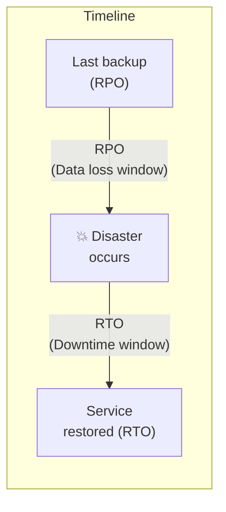
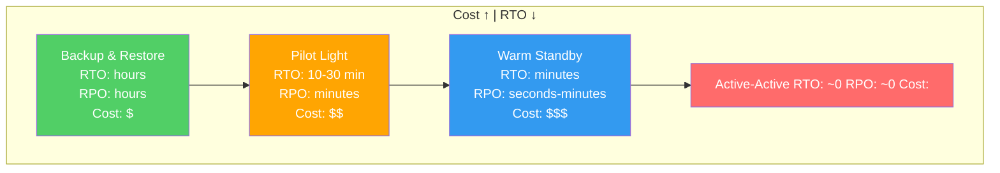
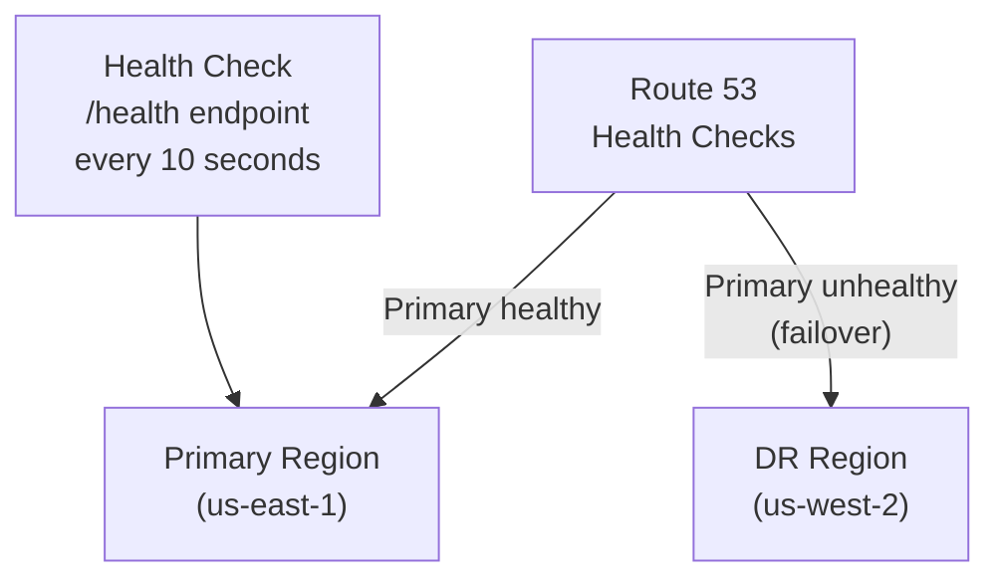

# 🔄 Disaster Recovery & Business Continuity

Disaster Recovery (DR) is not about IF systems fail—it's about WHEN. Every system will experience failures: hardware dies, regions go down, humans make mistakes, ransomware encrypts data. The architect's job is to ensure the business survives.

> "Everything fails, all the time." — Werner Vogels, CTO Amazon

---

## 1. Key Metrics — RTO & RPO



| Metric | Definition | Question it Answers |
|--------|-----------|-------------------|
| **RPO** (Recovery Point Objective) | Maximum acceptable data loss measured in time | "How much data can we afford to lose?" |
| **RTO** (Recovery Time Objective) | Maximum acceptable downtime | "How long can we be offline?" |
| **MTTR** (Mean Time to Recovery) | Average time to restore service after failure | "How fast do we actually recover?" |
| **MTBF** (Mean Time Between Failures) | Average time between system failures | "How reliable is our system?" |

### RPO/RTO by Business Criticality

| System Type | RPO | RTO | Example |
|------------|-----|-----|---------|
| **Tier 1: Mission Critical** | Near 0 (synchronous replication) | < 1 minute | Payment processing, trading platform |
| **Tier 2: Business Critical** | < 1 hour | < 15 minutes | Order management, customer portal |
| **Tier 3: Business Important** | < 4 hours | < 1 hour | Email, internal tools, reporting |
| **Tier 4: Non-Critical** | < 24 hours | < 8 hours | Dev/staging environments, documentation |

**Key Insight:** RPO = 0 is exponentially more expensive than RPO = 1 hour. Always negotiate RPO/RTO with business stakeholders based on **cost of downtime** vs **cost of recovery infrastructure**.

---

## 2. DR Strategies — From Cheapest to Most Available



### Strategy 1: Backup & Restore

```
Primary Region (us-east-1)          DR Region (us-west-2)
┌──────────────────────┐            ┌──────────────────────┐
│  App Servers (running)│            │  (nothing running)   │
│  Database (running)   │            │  S3: DB backups      │
│  S3: Data             │──backup──→│  S3: Data replicated  │
└──────────────────────┘            └──────────────────────┘

On disaster:
1. Launch infrastructure from IaC (Terraform) in DR region
2. Restore database from latest backup
3. Update DNS to point to DR region
4. RTO: 1-4 hours, RPO: last backup interval
```

**Cost:** Only pay for S3 storage of backups in DR region (~$0.023/GB/month)
**Best for:** Tier 3-4 systems, dev/staging environments

### Strategy 2: Pilot Light

```
Primary Region (us-east-1)          DR Region (us-west-2)
┌──────────────────────┐            ┌──────────────────────┐
│  App Servers (running)│            │  App Servers (OFF)    │
│  Database (running)   │──replica─→│  Database (running,   │
│  S3: Data             │──sync───→│   read replica)       │
└──────────────────────┘            └──────────────────────┘

On disaster:
1. Promote DB replica to primary
2. Scale up app servers (AMI/container already prepared)
3. Update DNS
4. RTO: 10-30 minutes, RPO: replication lag (seconds-minutes)
```

**Cost:** Pay for DB replica + minimal storage in DR region
**Best for:** Tier 2-3 systems

### Strategy 3: Warm Standby

```
Primary Region (us-east-1)          DR Region (us-west-2)
┌──────────────────────┐            ┌──────────────────────┐
│  App: 10 instances    │            │  App: 2 instances     │
│  Database (primary)   │──replica─→│  Database (replica)   │
│  Full infrastructure  │            │  Reduced infra        │
└──────────────────────┘            └──────────────────────┘

On disaster:
1. Promote DB replica
2. Scale up app instances (2 → 10)
3. DNS failover (already configured, health-check triggered)
4. RTO: 1-5 minutes, RPO: seconds
```

**Cost:** ~30-50% of primary region cost (running reduced capacity)
**Best for:** Tier 1-2 systems

### Strategy 4: Active-Active (Multi-Region)

```
Region A (us-east-1)                Region B (us-west-2)
┌──────────────────────┐            ┌──────────────────────┐
│  App: 10 instances    │◄──sync──►│  App: 10 instances     │
│  Database (primary)   │◄──sync──►│  Database (primary)   │
│  Full infrastructure  │            │  Full infrastructure  │
└──────────────────────┘            └──────────────────────┘
        ▲                                    ▲
        └──────── Route 53 (latency-based) ──┘
                  Users routed to nearest region

On disaster:
1. Route 53 health check detects failure
2. ALL traffic automatically routed to surviving region
3. RTO: ~0, RPO: ~0 (synchronous replication)
```

**Cost:** 2x primary region cost (full duplicate infrastructure)
**Best for:** Tier 1 only (payment, trading, healthcare)

### Strategy Comparison

| | Backup & Restore | Pilot Light | Warm Standby | Active-Active |
|---|---|---|---|---|
| **RTO** | Hours | 10-30 min | 1-5 min | ~0 |
| **RPO** | Hours | Minutes | Seconds | ~0 |
| **Cost** | $ | $$ | $$$ | $$$$ |
| **Complexity** | Low | Medium | High | Very High |
| **Data sync** | Periodic backup | Async replication | Async replication | Sync replication |
| **Failover** | Manual | Semi-auto | Automatic | Automatic |

---

## 3. AWS DR Services & Tools

### Data Replication

| Service | Replication Method | RPO |
|---------|-------------------|-----|
| **S3 Cross-Region Replication** | Async object replication | Minutes |
| **RDS Multi-AZ** | Synchronous standby in another AZ | 0 (within region) |
| **RDS Cross-Region Read Replica** | Async replication to another region | Seconds-minutes |
| **DynamoDB Global Tables** | Multi-region, multi-active replication | Seconds |
| **Aurora Global Database** | < 1 second cross-region replication | < 1 second |
| **ElastiCache Global Datastore** | Cross-region Redis replication | Seconds |

### DNS Failover



**Route 53 Failover Routing:**
- Active-passive: Primary region gets all traffic. DR only when primary fails.
- Active-active (latency-based): Both regions serve traffic. Failed region removed.
- Weighted: 90% primary, 10% DR (gradual migration or canary).

### Infrastructure as Code for DR

```hcl
# Terraform: Deploy same infrastructure to DR region
module "primary" {
  source = "./modules/app-stack"
  region = "us-east-1"
  instance_count = 10
}

module "dr" {
  source = "./modules/app-stack"  # Same module!
  region = "us-west-2"
  instance_count = 2  # Reduced for warm standby
}
```

**Critical:** Your DR infrastructure MUST be tested regularly. Un-tested DR is the same as no DR.

---

## 4. Backup Strategies

### The 3-2-1 Rule

```
3 copies of data
2 different storage media (e.g., EBS + S3)
1 offsite copy (different region or different cloud)
```

### Backup Types

| Type | What | Speed | Storage |
|------|------|-------|---------|
| **Full backup** | Complete copy of all data | Slow | Large |
| **Incremental** | Only changes since LAST backup | Fast | Small |
| **Differential** | Only changes since last FULL backup | Medium | Medium |
| **Continuous (CDC)** | Real-time change stream | Real-time | Depends |

### Backup Verification

```
❌ "We have backups" (but never tested restore)
✅ "We restore from backup every month and verify data integrity"
```

**Automation:**
```bash
# Monthly DR drill (automated)
1. Restore latest RDS snapshot to a test instance
2. Run data integrity checks (row counts, checksums)
3. Run smoke tests against restored instance
4. Generate report → send to team
5. Destroy test instance
```

---

## 5. Chaos Engineering for DR

### DR Drills — Game Days

| Drill | What to Test | Frequency |
|-------|-------------|-----------|
| **Backup restore** | Can we actually restore from backups? How long does it take? | Monthly |
| **Failover test** | Promote DR database, switch traffic, verify application works | Quarterly |
| **Region evacuation** | Simulate full region failure, failover everything | Annually |
| **Dependency failure** | Kill one external service (Redis, SQS), verify graceful degradation | Monthly |
| **Data corruption** | Restore from point-in-time to recover from bad deployment | Quarterly |

### Chaos Engineering Tools

| Tool | What it Does |
|------|-------------|
| **AWS Fault Injection Simulator** | Inject faults into AWS resources (stop instances, throttle API, disrupt networking) |
| **Gremlin** | Enterprise chaos engineering platform |
| **Litmus** | Kubernetes-native chaos engineering |
| **Chaos Monkey** (Netflix) | Randomly terminates EC2 instances |
| **Toxiproxy** | Simulate network conditions (latency, blackhole, bandwidth) |

---

## 6. Common Disaster Scenarios & Response

### Scenario 1: Database Corruption (Bad Migration)

```
Timeline:
  09:00 - Deploy with DB migration (drops column that's still needed)
  09:05 - Errors spike, alerts fire
  09:10 - Rollback deployment ← BUT migration already ran, column is gone
  
Response:
  1. Point-in-time recovery: Restore DB to 08:59 (before migration)
  2. Replay WAL logs from 08:59 to 09:00 (capture any writes)
  3. Fix migration script
  4. Re-deploy with fixed migration
  
Prevention:
  - Never DROP columns in the same release that stops using them
  - Use expand-and-contract pattern: 
    Deploy 1: Stop writing to column (but keep column)
    Deploy 2: Drop column (after confirming no reads/writes)
  - Always test migrations on production-copy DB first
```

### Scenario 2: Ransomware Attack

```
Response:
  1. ISOLATE: Disconnect affected systems from network immediately
  2. ASSESS: Determine blast radius (which systems encrypted?)
  3. RESTORE: Restore from offline/immutable backups (NOT connected to network)
  4. INVESTIGATE: Find entry point, patch vulnerability
  5. REBUILD: Rebuild from IaC (don't trust any running system)
  
Prevention:
  - Immutable backups (S3 Object Lock, Glacier Vault Lock)
  - Network segmentation (blast radius containment)
  - Principle of least privilege (limit ransomware spread)
  - Regular DR drills including ransomware scenarios
```

### Scenario 3: AWS Region Outage

```
Real example: us-east-1 outage (Dec 2021) — 5+ hours
  - Lambda, SQS, DynamoDB impaired
  - Thousands of services affected
  
Response:
  1. Route 53 health checks detect failure → automatic DNS failover
  2. DR region (us-west-2) receives all traffic
  3. Applications use DR database replicas (promoted to primary)
  4. Monitor and wait for primary region recovery
  5. When primary recovers: re-sync data, fail back
  
Prevention:
  - Multi-region architecture (at least warm standby)
  - Route 53 health checks + failover routing
  - Avoid hard dependencies on region-specific services
  - Test failover quarterly
```

---

## 🔥 Real DR Failures & Lessons

### Failure 1: "We Have Backups" (But Can't Restore)
**What happened:** Company had daily DB backups to S3 for 2 years. Database corrupted. Tried to restore → backup files were corrupted too (never tested). Lost 6 months of data.
**Lesson:** Untested backups are not backups. Schedule monthly automated restore tests.

### Failure 2: DR Region Wasn't Actually Ready
**What happened:** DR region had infrastructure provisioned 6 months ago. During failover, discovered: SSL certificates expired, AMIs outdated, database schema 3 migrations behind, environment variables wrong.
**Lesson:** DR infrastructure must be kept in sync. Use IaC (Terraform), run DR drills quarterly, automate DR environment updates in CI/CD.

### Failure 3: RPO Negotiated Without Understanding Cost
**What happened:** Business said "RPO = 0, we can't lose any data." Architect built synchronous multi-region replication. Monthly cost: $50,000 extra. System serves 100 users generating $5,000/month revenue.
**Lesson:** Always quantify: "RPO = 0 costs $50K/month. RPO = 1 hour costs $200/month. 1 hour of data = ~50 orders = ~$500 to re-process manually. Which do you prefer?"

### Failure 4: Single Point of Failure in DR Plan
**What happened:** DR plan required a specific engineer to run manual scripts. That engineer was on vacation during the incident. Nobody else knew the procedure.
**Lesson:** DR procedures must be automated and documented as runbooks. At least 3 team members should be trained. Run game days with different team members each time.

---

## 📍 Case Study Answer

> **Scenario:** Your file processing system runs entirely in us-east-1. Design a DR strategy.

### Recommended: Pilot Light Strategy

**Justification:** File processing is Tier 2 (business critical but not real-time). RPO < 1 hour, RTO < 30 minutes is acceptable.

```
us-east-1 (Primary)                    us-west-2 (DR - Pilot Light)
┌─────────────────────┐                ┌─────────────────────┐
│ NestJS API (ECS)    │                │ ECS Task Def (ready,│
│ Lambda (chunking)   │                │  0 running tasks)   │
│ S3 (file uploads)   │──CRR──────────│ S3 (replicated)     │
│ SQS (processing)    │                │ SQS (ready)         │
│ OpenSearch (index)  │──snapshot─────→│ OpenSearch snapshot  │
│ PostgreSQL (RDS)    │──read replica─→│ PostgreSQL (replica) │
└─────────────────────┘                └─────────────────────┘

Failover Steps (automated via Route 53 + Lambda):
1. Route 53 detects primary unhealthy (30 seconds)
2. Lambda triggers: promote RDS replica to primary (2-5 minutes)
3. ECS service scales from 0 to desired count (2-5 minutes)
4. Restore OpenSearch from latest snapshot (5-10 minutes)
5. DNS update propagates (< 60 seconds)
Total RTO: ~15-20 minutes

Monthly DR Cost:
- S3 CRR: ~$5 (replication storage)
- RDS read replica: ~$50 (smallest instance)
- OpenSearch snapshots: ~$5 (S3 storage)
- Total: ~$60/month (vs $500+ for warm standby)
```
